# Review of Mathematical Statistics

## Data

Experimental data describes the outcome of the experimental run. For example 10 successive runs in a chemical experiment produce the following data: 


```r
set.seed(100)
# Generate a random sample of 10 observations from a N(60,10^2)
dat <- round(rnorm(10, mean = 60, sd = 10), 1)
dat
```

```
 [1] 55.0 61.3 59.2 68.9 61.2 63.2 54.2 67.1 51.7 56.4
```

## Distributions

Distributions can be displayed graphically or numerically.  

A histogram is a graphical summary of a data set.


```r
summary(dat)
```

```
   Min. 1st Qu.  Median    Mean 3rd Qu.    Max. 
  51.70   55.35   60.20   59.82   62.73   68.90 
```

```r
hist(dat)
```

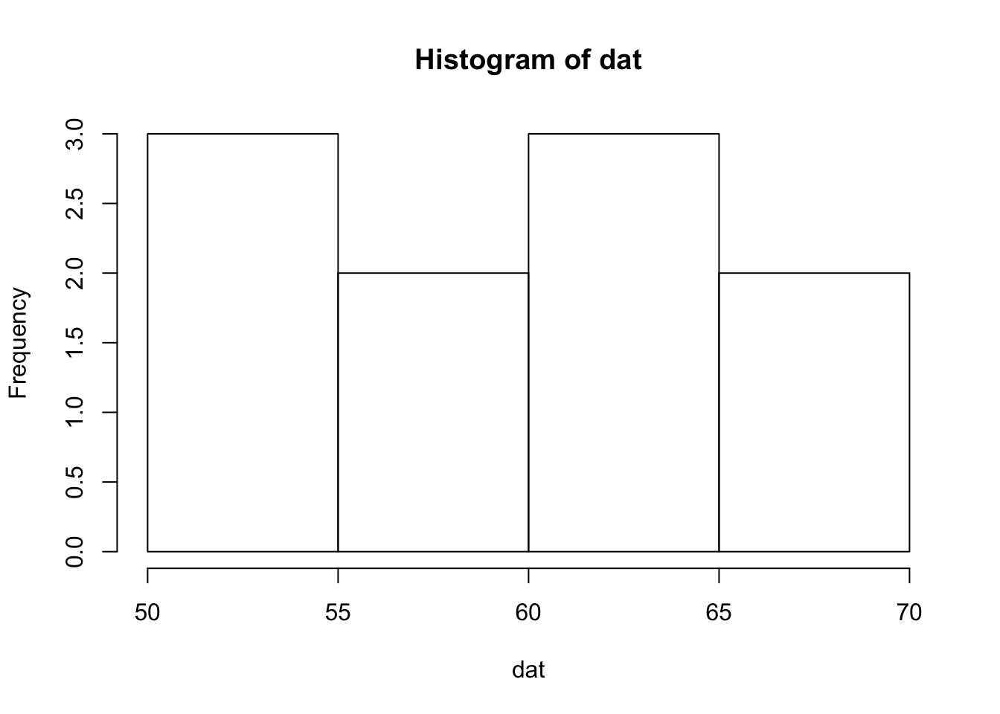

The total aggregate of observations that might occur as a result of repeatedly performing a particular operation is called a population of observations.
The observations that actually occur are some kind of sample from the population.

### Continuous Distributions

A continuous random variable $X$ is fully characterized by its density function $f(x)$, where $f(x) \ge 0$, $\thinspace f$ is piecewise continuous, and $\int_{-\infty}^{\infty}f(x)dx = 1$.  

The cumulative distribution function (CDF) of $X$ is defined as:

$$ F(x)=P(X \le x)=\int_{-\infty}^{x}f(x)dx.$$

If $f$ is continuous at $x$ then $F'(x)=f(x)$ (fundamental theorem of calculus).  The CDF can be used to calculate the probability that $X$ falls in the interval $(a,b)$.  This is the area under the density curve which can also be expressed in terms of the CDF:

$$P\left(a < X < b\right)=\int_{a}^{b}f(x)dx = F(b)-F(a).$$

In R a list of all the common distributions can be obtained by the command `help("distributions")`.

The following R code draws a random sample of 100 observations from a Chi-square distribution on 10 degrees of freedom $\chi^2_{10}$.  The density function of the $\chi^2_{10}$ is superimposed over the histogram of the sample.


```r
x <- rchisq(100, 10) # draw a sample of 100 from chi-square 10
h <- hist(x) # create the histogram
# superimpoise chi-square density over histogram
xfit <- seq(min(x), max(x), length = 40)
yfit <- dchisq(xfit, 10) #chi-square density
yfit <- yfit * diff(h$mids[1:2]) * length(x)
lines(xfit, yfit)
```

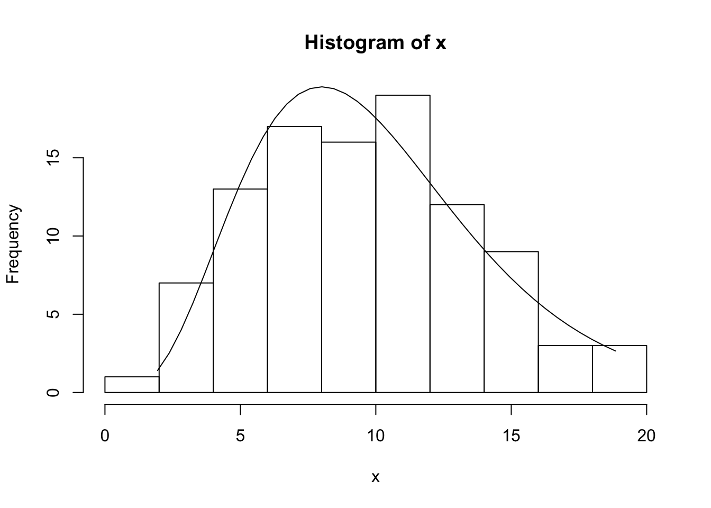


## Randomness

A random drawing is where each member of the population has an equal chance of being selected. The hypothesis of random sampling may not apply to real data.
For example, cold days are usually followed by cold days.   So daily temperature not directly representable by random drawings. In many cases we can’t rely on the random sampling property although design can make this assumption relevant. 

## Parameters and Statistics

What is the difference between a parameter and a statistic?  A parameter is a population quantity and a statistic is a quantity based on a sample drawn from the population.  

Example: The population of all adult (18+ years old) males in Toronto, Canada.  Suppose that there are $N$ adult males.  The quantity of interest, $y$, is age.  A sample of size $n$ is drawn from this population.  The population mean is $\mu=\sum_{i = 1}^N y_i /N$ and the sample mean is ${\bar y}=\sum_{i = 1}^n y_i /n$.

## Residuals and Degress of Freedom

$y_i-{\bar y}$ is called a residual.  Since $\sum (y_i-{\bar y})=0$ any $n-1$ completely determine the the last observation.  This is a constraint on the the residuals.  So $n$ residuals have $n-1$ degrees of freedom since the last residual cannot be freely chosen.  

## The Normal Distribution

The density function of the normal distribution with mean $\mu$ and standard deviation $\sigma$ is:

$$ \phi(x)=\frac{1}{\sigma \sqrt{2\pi}}exp\left( \frac{-1}{2} \left(\frac{x-\mu}{\sigma}\right)^2\right)$$


```r
x <- seq(-4, 4, by = 0.1)
plot(x,
     dnorm(x),
     type = "l",
     main = "The Standard Normal Distribution",
     ylab = expression(paste(phi(x))))
```

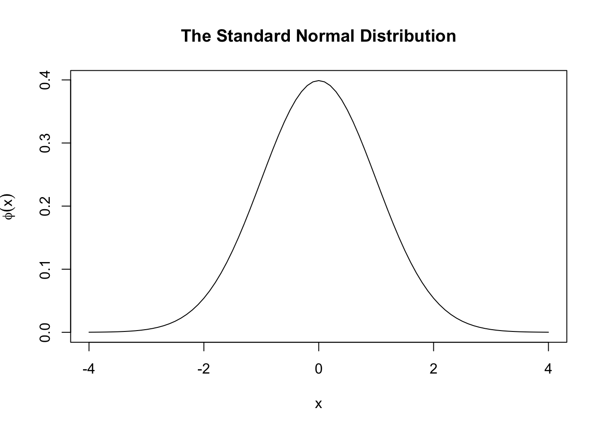

A random variable $X$ that follows a normal distribution with mean $\mu$ and variance $\sigma^2$ will be denoted by $X \sim N\left(\mu, \sigma^2\right)$.

If $Y \sim N\left(\mu, \sigma^2\right)$ then $Z \sim N(0,1)$, where $Z=\frac{Y-\mu}{\sigma}$.  


The cumulative distribution function (CDF) of a $N(0,1)$ distribution,

$$ \Phi(x)= P(X<x)= \int_{-\infty}^x \phi(x)dx$$

is shown in the plot below using the R function for the normal CDF `pnorm()`.


```r
plot(x <- seq(-2, 2, by = 0.1), pnorm(x), 
     type = "l", xlab = "x", ylab = expression(paste(Phi(x))),
     main = "Standard Normal Cumulative Distribution Function")
```


### Exercises

1. Use R to calculate the $P(-1<Z<2)$, where $Z \sim N(0,1)$.
Answer:

```r
pnorm(2) - pnorm(-1)
```

```
[1] 0.8185946
```
2. Use R to calculate the $P(X>5)$, where $X \sim N(6,2)$.
Answer:

```r
1 - pnorm(5, mean = 6, sd = sqrt(2))
```

```
[1] 0.7602499
```


## Quantile-Quantile Plots

Quantile-quantile (Q-Q) plots are useful for comparing distribution functions.  If $X$ is a continuous random variable with strictly increasing distribution function $F(x)$ then the $pth$ quantile of the distribution is the value of $x_p$ such that,

$$ F(x_p)=p$$

or 

$$x_p = F^{-1}(p).$$

In a Q-Q plot, the quantiles of one distribution are plotted against another distribution.  Q-Q plots can be used to investigate if a set of numbers follows a certain distribution.  

Suppose that we have observations independent observations $X_1,X_2, ...,X_n$ from a uniform distribution on $[0,1]$ or Unif[0,1]. The ordered sample values (also called the order statistics) are the values $X_{(j)}$ such that $X_{(1)}<X_{(2)}< \cdots < X_{(n)}$. 

It can be shown that

$$E\left(X_{(j)}\right)=\frac{j}{n+1}.$$

This suggests that if we plot $X_{(j)}$ vs. $\frac{j}{n+1}$ then if the underlying distribution is Unif[0,1] then the plot should be roughly linear.

A continuous random variable with strictly increasing CDF $F_X$ can be transformed to a Unif[0,1] by defining a new random variable $Y = F_X(X)$.  This is also called the probability integral transformation.

This suggests the following procedure.  Suppose that it's hypothesized that $X$ follows a certain distribution function with CDF $F$.  Given a sample $X_1,X_2,...,X_n$ plot

$$F(X_{(k)}) \hspace{0.2cm} {\text{vs. }} \hspace{0.2cm} \frac{k}{n+1}$$

or equivalently

$$X_{(k)} \hspace{0.2cm} {\text{vs. }} \hspace{0.2cm} F^{-1}\left(\frac{k}{n+1}\right)$$

$X_{(k)}$ can be thought of as empirical quantiles and $F^{-1}\left(\frac{k}{n+1}\right)$ as the hypothesized quantiles.

The quantile assigned to $X_{(k)}$ is not unique.  Instead of assigning it $\frac{k}{n+1}$ it is often assigned $\frac{k-0.5}{n}$.  In practice it makes little difference which definition is used.


### Normal Quantile Plots

Normal quantile plots are useful for assessing if data fits a normal distribution.  

Suppose that $X_1,X_2,...,X_n$ are a random sample from the uniform distribution on $[0,1]$.  The sample can be ordered from smallest to largest $X_{(1)}<X_{(2)}< \cdots < X_{(n)}$.  It can be shown that 

$$E\left( X_{(j)} \right)=\frac{j}{n+1}.$$

If the observations are uniform then the plot of the ordered observations $X_{(1)},X_{(2)},...,X_{(n)}$ versus their expected values will be a straight line.

If we want to investigate if a sample $X_1,X_2,...,X_n$ follows a certain distribution with CDF $F_X$ then we can transform the sample to a uniform distribution on $[0,1]$ by calculating $Y_i = F_X(X_i)$.

So, given a sample $X_1,X_2,...,X_n$ plot 

$$F(X_{(k)}) \quad \textrm{vs.} \quad  \frac{k}{n+1}.$$

This is the same as 

$$X_{(k)} \quad \textrm{vs.} \quad  F^{-1}\left(\frac{k}{n+1}\right).$$

This means that the $k/(n+1)$ quantile is assigned to the $k^{th}$ order statistic.  But in some implementations sometimes the $k^{th}$ quantile is assigned to $X_{(k)}$ is $(k-0.5)/n$ (see Rice, pg 352-355).

The following data from @bhh2005 are the weights from 11 tomato plants.


```
 [1] 29.9 11.4 26.6 23.7 25.3 28.5 14.2 17.9 16.5 21.1 24.3
```

Do the weights follow a Normal distribution?

If the tomato weights are normally distributed then a plot of the ordered tomato weights, $y_{(1)}<y_{(2)}< \cdots < y_{(11)}$ versus the cumulative probabilities $p_i=(i-0.5)/N$, where $N$ is the number of observations should be the same shape as the CDF of the Normal distribution.


```r
plot(sort(tomato.data$pounds), 1:11/length(tomato.data$pounds),
     type = "l", xlab = "ith Weight", ylab = "(i-0.5)/11")
```

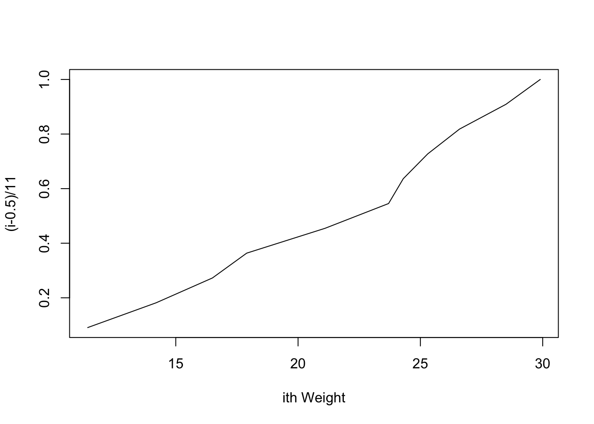

It's difficult to tell if the weights have the same shape as the Normal CDF. But, the curve can be stretched at the extreme ends so that it becomes a straight line.  A method for stretching out the curve is developed below.

Assume that the weights, $y_i \sim N\left (\mu, \sigma^2\right)$.  

Then $\Phi(y_i)$ has a uniform distribution over $[0,1]$.  This means that the expected values of $\Phi(y_i), i = 1,...N$ should be equally spaced over $[0,1]$ or the $N$ points $(p_i,\Phi(y_{(i)})$ should fall on a straight line. Applying the $\Phi^{-1}$ transform to the horizontal and vertical scales, the $N$ points 
$$\left(\Phi^{-1}(p_i),y_i\right), i = 1,...,N,$$

should follow a straight line.  These points form the **normal probability plot** of the tomato plant weights. (Wu and Hamada, pages 77-78)

A normal probability plot in R can be obtained using `qqnorm()` for the normal probability plot and `qqline()` to add  the straight line.


```r
qqnorm(tomato.data$pounds)
qqline(tomato.data$pounds)
```

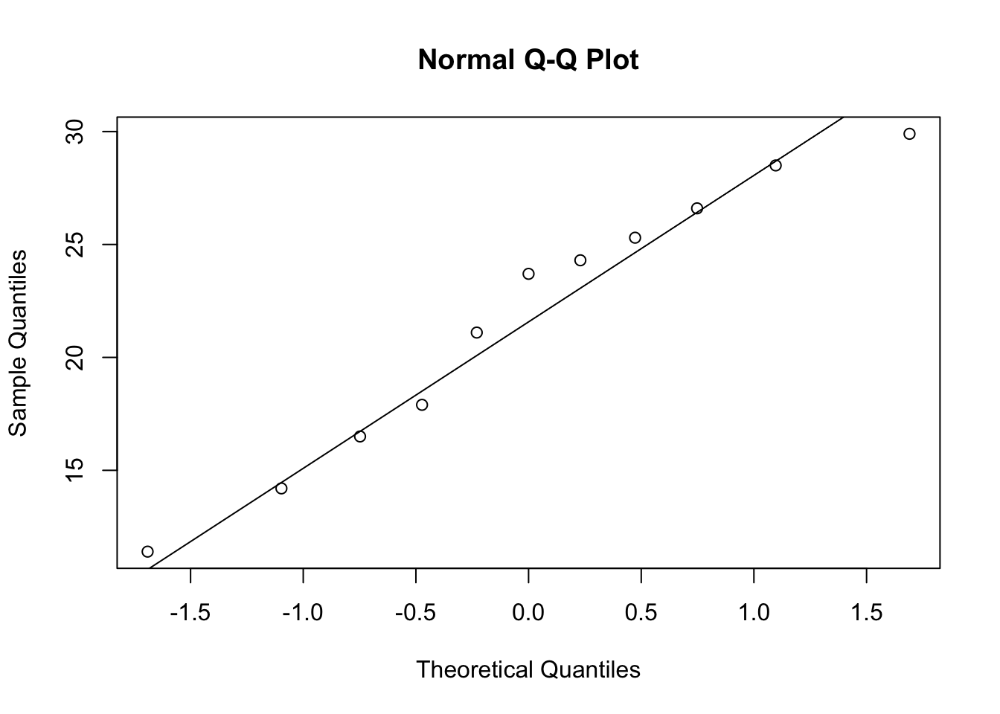

In this case assuming that the data are generated from a normal distribution is a plausible assumption since most of the points are close the straight line.

###Exercises

1. The following 50 data set contains the ages of participants in a study of social media habits.  Is it plausible to assume that the data are normally distributed?


```
 [1] 34.2 35.1 35.5 36.5 47.0 34.7  9.8 36.1 40.6 34.8 38.3 34.7 37.3 33.8
[15] 34.4 28.0 33.7 28.4 73.7 36.2 33.8 36.1 32.8 34.9 35.7 55.0 36.8 35.0
[29] 33.7 33.6 37.9 35.9 38.6 34.8 34.3 39.3 33.1 33.4 30.9 36.2 35.2 36.1
[43] 35.3 35.6 33.7 33.9 34.4 33.7 32.5 38.2
```


```r
summary(round(agedata,1))
```

```
   Min. 1st Qu.  Median    Mean 3rd Qu.    Max. 
   9.80   33.73   34.95   35.86   36.20   73.70 
```

```r
hist(agedata)
```

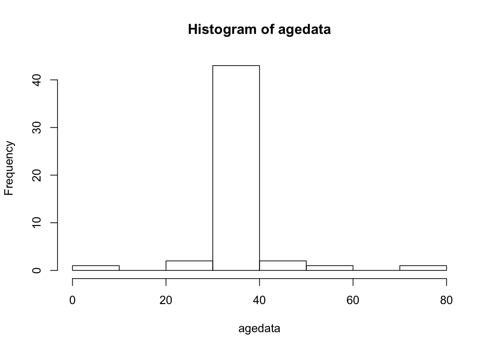

```r
qqnorm(agedata);qqline(agedata)
```

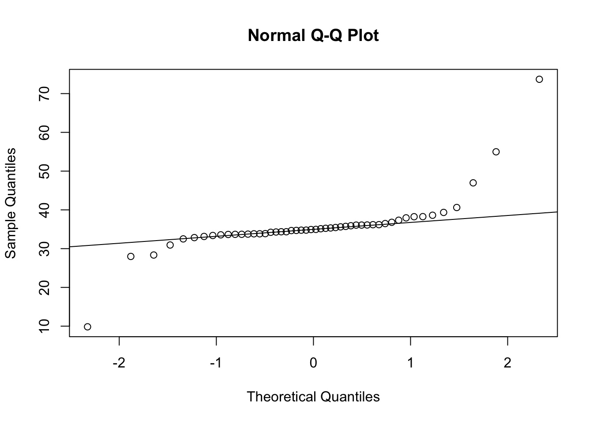

Answer: The histogram and the qqplot indicate the tails of the age distribution are heavier than the normal distribution.  In the qqplot this is indicated by the marked deviations from the straight line for very small and large sample quantiles.  Thus, the qqplot indicates that the data is not normally distributed.

## Central Limit Theorem

The central limit theorem states that if $X_1, X_2, ...$ is an independent sequence of identically distributed random variables with mean $\mu = E(X_i)$ and variance $\sigma^2 = Var(X_i)$ then

$$ \lim_{n\to\infty} P\left(\frac{\bar X - \mu}{\frac {\sigma}{\sqrt n}} \leq x \right) = \Phi(x),$$

where ${\bar X} = \sum_{i = 1}^{n} X_i/n$ and $\Phi(x)$ is the standard normal CDF.  This means that the distribution of ${\bar X}$ is approximately $N\left(\mu,{\frac {\sigma}{\sqrt n}}\right)$.

Example: A fair coin is flipped 50 times.  What is the distribution of the average number of heads?

Let $X_1, ...,X_{50}$ where $X_i = 1$, if the toss is a head and $X_i = 0$ if the toss is a tail.  Since the coin is fair $P(X_i = 1)=0.5, i = 1,...,50$.  The average number of heads is $\sum_{i = 1}^{50} X_i/50$. $E(X_i)=0.5$ and $Var(X_i)=p(1-p)=0.5(1-0.5)=0.25$ so $\sum_{i = 1}^{50} X_i/50 \overset{approx}\sim N(0.5,0.25/\sqrt{50})$


## Chi-Square Distribution

Let $X_1, X_2, ..., X_n$ be independent and identically distributed random variables that have a $N(0,1)$ distribution. The distribution of 

$$ \sum_{i = 1}^{n}X_i^2,$$ 

has a chi-square distribution on $n$ degrees of freedom or $\chi^2_{n}$.

The mean of a $\chi^2_{n}$ is $n$ with variance $2n$.

The chi-square distribution is a right-skewed distribution, but becomes normal as the degrees of freedom increases.  In the plot below the $\chi^2_{50}$ density is very close to the $N(50,100)$ density.


```r
# Compare chi-square densities with normal density
x <- seq(0, 100, length = 100)
hx <- dnorm(x,mean = 50,sd = sqrt(2*50)) #normal density

degf <- c(1, 3, 8, 50)
colors <- c("red", "blue", "darkgreen", "gold", "black")
labels <- c("df = 1", "df = 3", "df = 8", "df = 50", "normal")

plot(x, hx, type = "l", lty = 2, xlab = "x value",
     ylab = "Density", main = "Comparison of Chi-Square Distributions",ylim = c(0,0.25))

for (i in 1:4) {
  lines(x, dchisq(x,degf[i]), lwd = 2, col = colors[i]) # dchisq is the chi-square density
}

legend("topright", inset = .05, title = "Distributions",
       labels, lwd = 2, lty = c(1, 1, 1, 1, 2), col = colors)
```

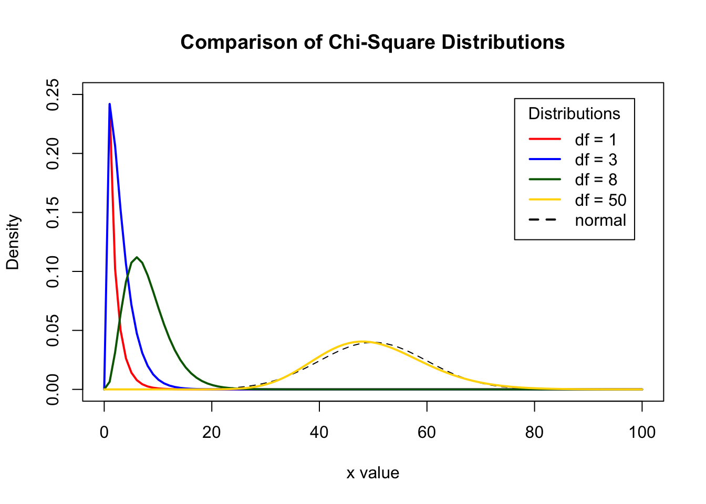

Let $X_1,X_2,...,X_n$ be independent with a $N(\mu, \sigma^2)$ distribution. The distribution of the sample variance $S^2=\sum_{i = 1}^{n}(X_i-{\bar X})^2/(n-1)$ has a $\chi^2_{n-1}$ distribution, namely,

$$ \frac{n-1}{\sigma^2} S^2 \sim \chi^2_{n-1}.$$

###Exercises

1. If $X_1,X_2,...,X_{50}$ are a random sample from  a $N(40,25)$ then calculate $P(S^2>27)$.

Answer:  We know that $\frac{49}{25} S^2 \sim \chi^2_{49}$.  So 

$$\begin{aligned} 
P\left(\frac{49}{25}S^2>\frac{49}{25} \times 27\right) &=P\left(\chi^2_{49}>\frac{49}{25} \times 27\right) \\
                                    &=P\left(\chi^2_{49}>1.96 \times 27\right) \\
                                    &=P\left(\chi^2_{49}>52.92\right). 
\end{aligned}$$  

The CDF of the $\chi^2_{n}$ in R is `pchisq()`.

Therefore,


```r
1 - pchisq(q = 52.92,df = 49)
```

```
[1] 0.325325
```

So, $P(S^2>27)=1-P(S^2<27)=$ 0.325325.

## t Distribution

If $X \sim N(0,1)$ and $W \sim \chi^2_n$ then the distribution of $\frac{X}{\sqrt{W/n}}$ has a t distribution on $n$ degrees of freedom or $\frac{X}{\sqrt{W/{n}}} \sim t_n$.

Let $X_1, X_2, ...$ is an independent sequence of identically distributed random variables that have a $N(0,1)$ distribution. The distribution of 

$$\frac{{\bar X}-\mu }{\frac {S}{\sqrt n}} \sim t_{n-1},$$ 

where $S^2=\sum_{i = 1}^{n}(X_i-{\bar X})^2/(n-1)$.  This follows since $\bar X$ and $S^2$ are independent.

The t distribution for small values of $n$ has "heavier tails" compared to the normal. As the degrees of freedom increases the t-distribution is almost identical to the normal distribution. 


```r
# Compare t densities with normal density
x <- seq(-4, 4, length = 100)
hx <- dnorm(x) #normal density

degf <- c(1, 3, 8, 30)
colors <- c("red", "blue", "darkgreen", "gold", "black")
labels <- c("df = 1", "df = 3", "df = 8", "df = 30", "normal")

plot(x, hx, type = "l", lty = 2, xlab = "x value",
     ylab = "Density", main = "Comparison of t Distributions")

for (i in 1:4) {
  lines(x, dt(x,degf[i]), lwd = 2, col = colors[i]) # dt is the t density
}

legend("topright", inset = .05, title = "Distributions",
       labels, lwd = 2, lty = c(1, 1, 1, 1, 2), col = colors)
```

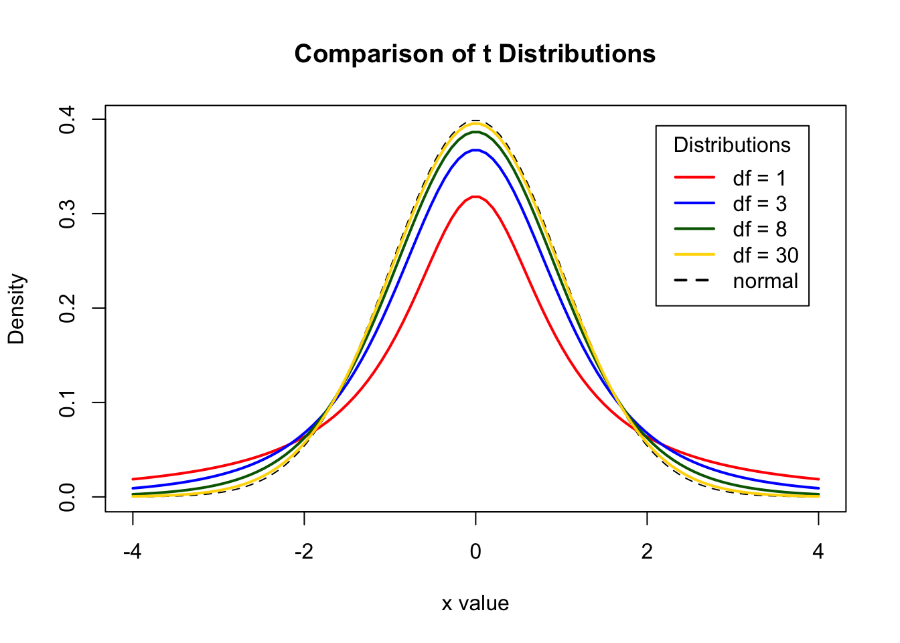


### Exercises

1. Suppose that an experimenter obtained a random sample of body weights (kg) from 10 male subjects 66.9, 70.9, 65.8, 78, 71.6, 65.9, 72.4, 73.7, 72.9, 68.5. The distribution of weight in this population is known to be $N(70,\sigma^2)$.  What is the probability that the average weight is between 68kg and 71kg?

Answer: The distribution of $\frac{{\bar X}-70 }{\frac{S}{\sqrt{10}}}$ is $t_9$, where $S$ is the sample standard deviation.  So

$$P\left(68 < {\bar X} < 71\right) = P\left(\frac{68-70}{5.6/\sqrt{10}} < \frac{{\bar X}-70}{5.6/\sqrt{10}} < \frac{71-70}{5.6/\sqrt{10}}\right)$$

Use R to do the calculations.  First put the data into a vector to calculate the standard deviation then use the $t_9$ CDF:


```r
dat <- c(66.9, 70.9, 65.8, 78.0, 71.6, 65.9, 72.4, 73.7, 72.9, 68.5)
sd(dat) # The SD of the weights
```

```
[1] 3.904186
```

```r
a <- (68 - 70) / (sd(dat) / sqrt(10))
a
```

```
[1] -1.619942
```

```r
b <- (71 - 70) / (sd(dat) / sqrt(10))
b
```

```
[1] 0.8099711
```

```r
pt(b, df = 9) - pt(a, df = 9)
```

```
[1] 0.7107282
```

So,

$$\begin{aligned}
P\left(68 < {\bar X} < 71\right) &= P\left(-1.619942<t_9<0.8099711\right) \\
                                 &= 0.7107282
\end{aligned}$$


## F Distribution

Let $X \sim \chi^2_m$ and $Y\sim \chi^2_n$ be independent. The distribution of 

$$ W= \frac{X/m}{Y/n} \sim F_{m,n},$$

where $F_{m,n}$ denotes the F distribution on $m,n$ degrees of freedom. The F distribution is right skewed (see graph below).  For $n>2, E(W)=n/(n-2)$. It also follows that the square of a $t_n$ random variable follows an $F_{1,n}$. 

The F distribution is right skewed 


```r
# Compare t densities with normal density

colors <- c("red", "blue")
plot(seq(0,5, by = 0.1), df(seq(0, 5,by = 0.1),7,10),type = "l",col = colors[1],
     ylab = "Density",xlab = "x",main = "F Distributions")
lines(seq(0,5,by = 0.1), df(seq(0,5,by = 0.1),7,4),type = "l",lty = 2,col = colors[2])
labels <- c("F(7,10)","F(7,4)")
legend("topright", inset = .05, title = "Distributions",
       labels, lwd = 2, lty = c(1, 2), col = colors)
```


## Significance Testing and Basic Decision Theory in Hypothesis Testing

Suppose that $X_1, X_2,...,X_n$


In hypothesis testing there are two types of errors that can be made.  They are called type I and type II errors.

$$\begin{array}{c|c|c}
 & H_0 \text{ true} & H_1 \text{ true} \\
\hline
  \text {Accept } H_0 & \text {correct decision} & \text {type II error} \\ 
  \hline
  \text {Reject } H_0 & \text {type I error} & \text {correct decision}  
 \end{array}$$

The probabilities of type I and II errors are usually set in advance of running the experiment.

$$ \alpha = P(\text{type I}), \thinspace \beta = P(\text {type II}).$$

If the p-value $\le \alpha$ then the test is statistically significant at level $\alpha$. The power of the test is $1-\beta$: the probability of rejecting $H_0$ when the alternative hypothesis $H_1$ is true. 


###Exercises

1. Let $W \sim F_{7,10}$. Use R to calculate $P(3<W<4)$. 

Answer: The CDF of the $F_{m,n}$ distribution in R is `pf()`.


```r
pf(4, df1 = 7, df2 = 10) - pf(3, df1 = 7, df2 = 10)
```

```
[1] 0.03258576
```

So, $P(3<W<4)=$ 0.0325858.

## Linear Regression

@lea1965new discussed the relationship between mean annual temperature and mortality index for a type of breast cancer in women taken from regions in Europe (example from Wu and Hammada).

The data is shown below.


```r
#Breast Cancer data
M <- c(102.5, 104.5, 100.4, 95.9, 87.0, 95.0, 88.6, 89.2, 78.9, 
       84.6, 81.7, 72.2, 65.1, 68.1, 67.3, 52.5)
T <- c(51.3, 49.9, 50.0,49.2, 48.5, 47.8, 47.3, 45.1, 46.3, 42.1, 
       44.2, 43.5, 42.3, 40.2, 31.8, 34.0)
```

A linear regression model of mortality versus temperature is obtained by estimating the intercept and slope in the equation:

$$ y_i = \beta_0 + \beta_1 x_i + \epsilon_i, i = 1,...,n$$

where $\epsilon_i \sim N(0,\sigma^2)$.  The values of $\beta_0, \beta_1$ that minimize the sum of squares

$$ \sum_{i = 1}^{n} (y_i-(\beta_0+\beta_1 x_i))^2, $$

are called the least squares estimators.  They are given by $\hat{\beta_0}={\bar y}-{\hat{\beta_1}}{\bar{x}}$, ${\hat{\beta_1}}=r\frac{S_y}{S_x}.$ $r$ is the correlation between $y$ and $x$, and $S_x, S_y$ are the sample standard deviations of $x$ and $y$ respectively.

A scatter plot of the data shows a linear relationship between mortality and temperature.  So a regression line is fit to the data.  


```r
plot(T, M, xlab = "temperature", ylab = "mortality index")
reg1 <- lm(M ~ T)
# Parameter estimates and ANOVA table
summary(reg1)
```

```

Call:
lm(formula = M ~ T)

Residuals:
     Min       1Q   Median       3Q      Max 
-12.8358  -5.6319   0.4904   4.3981  14.1200 

Coefficients:
            Estimate Std. Error t value Pr(>|t|)    
(Intercept) -21.7947    15.6719  -1.391    0.186    
T             2.3577     0.3489   6.758  9.2e-06 ***
---
Signif. codes:  0 '***' 0.001 '**' 0.01 '*' 0.05 '.' 0.1 ' ' 1

Residual standard error: 7.545 on 14 degrees of freedom
Multiple R-squared:  0.7654,	Adjusted R-squared:  0.7486 
F-statistic: 45.67 on 1 and 14 DF,  p-value: 9.202e-06
```

```r
# Add regression line to the plot
abline(reg1)
```

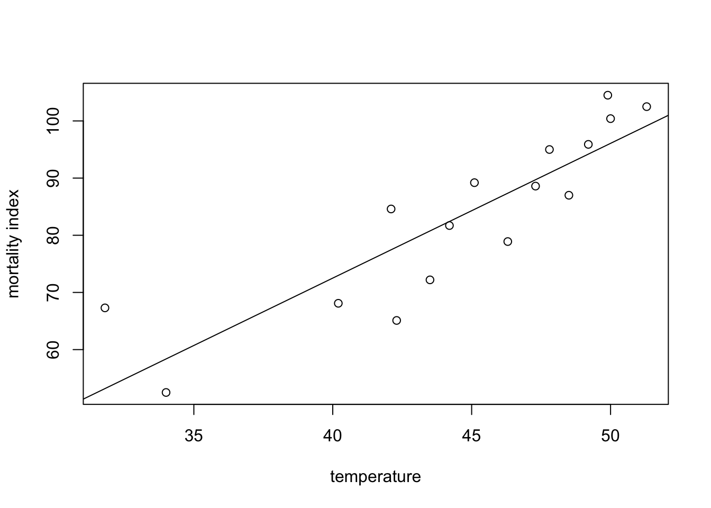

The two main assumptions of constant variance and normality of residuals should always be investigated.

```r
#plot residuals vs. fitted
plot(reg1$fitted,reg1$residuals)
abline(h = 0) # add horizontal line at 0
```

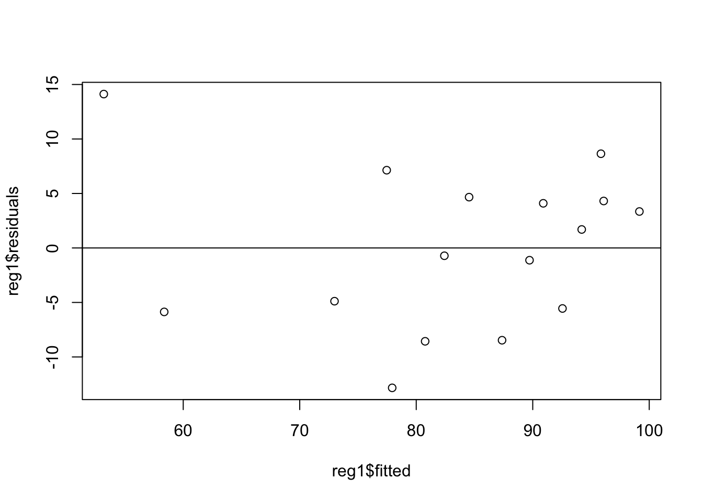

```r
#check normality of residuals
qqnorm(reg1$residuals)
qqline(reg1$residuals)
```

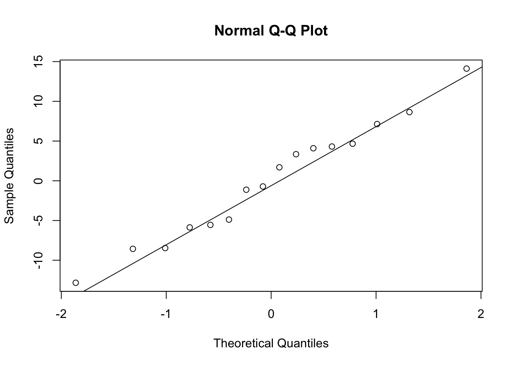

If there is more than one independent variable then the above model is called a multiple linear regression model.

$$ y_i=\beta_0+\beta_1 x_{i1} + \beta_2 x_{i2} + \cdots +  \beta_k x_{ik} + \epsilon_{i}, \thinspace i = 1,...,n, $$

where $\epsilon_{i} \sim N(0,\sigma^2)$.

This can also be expressed in matrix notation as

$$ y = X\beta+\epsilon,$$

where,

$$y = 
 \begin{pmatrix}
  y_{1}  \\
  y_{2}  \\
  \vdots  \\
  y_{n}  
 \end{pmatrix}, \quad X=
 \begin{pmatrix}
  1 & x_{11} & \cdots & x_{1k} \\
  1 & x_{21} & \cdots & a_{2k} \\
  \vdots  & \vdots  & \ddots & \vdots  \\
  1 & x_{n1} & \cdots & a_{nk} 
 \end{pmatrix}, \quad \beta= 
 \begin{pmatrix}
  \beta_0 \\
  \beta_1 \\
  \vdots  \\
  \beta_k 
 \end{pmatrix}, \quad \epsilon=\begin{pmatrix}
  \epsilon_0 \\
  \epsilon_1 \\
  \vdots  \\
  \epsilon_k 
 \end{pmatrix}$$
 
 The least squares estimator is
 
 $${\hat \beta}=\left(X^{T} X\right)^{-1}X^{T}y.$$

The covariance matrix of ${\hat \beta}$ is $\left(X^{T} X\right)^{-1}{\sigma}^2$.  An estimator of $\sigma^2$ is 

$${\hat \sigma^2}=\frac{1}{n-k}\sum_{i = 1}^{n}(y_i-{\hat y_i})^2,$$

where ${\hat y_i}={\hat \beta_0}+{\hat \beta_1} x_{i1} + \cdots +  {\hat \beta_k} x_{ik}$ is the predicted value of $y_i$.

### Covariates in Regression

The covariates in regression $x_{ij}$ can either be continuous or categorical variables. If the nominal independent variable of interest has $k$ categories then $k-1$ indicator variables should be used to index the categories provided the regression model contains a slope.  If the regression model does not contain a slope then exactly $k$ indicator variables are required.  

The $k-1$ dummy variables for indexing $k$ categories can be defined in many ways.   

### Weighing Problem
Harold Hotelling in 1949 wrote a paper on how to obtain more accurate weighings through experimental design.

Suppose that we want to measure the mass of two apples A and B using an old-fashioned two-pan balance scale. 


 

Which of the following two methods produces a more precise estimate of the weights of each apple? 

**Method 1**

Weigh each apple separately. 

**Method 2**

Obtain two weighings by 

1. Weighing two apples in one pan.
2. Weighing one apple in one pan and the other apple in the other pan 


Let $w_1, w_2$ be the weights of apples one and two.  Each weighing has standard error $\sigma$. So the precision of the estimates from method 1 is $\sigma$.

If the objects are weighed together in one pan, resulting in measurement $m_1$, then in opposite pans, resulting in measurement $m_2$, we have two equations for the unknown weights $w_1,w_2$:


$$\begin{aligned} 
w_1+w_2 &=  m_1 \\ 
w_1-w_2 &=  m_2.
\end{aligned}$$

This leads to ${\hat w_1}=(m_1+m_2)/2$ and ${\hat w_2}=(m_1-m_2)/2$. So, $Var\left({\hat w_1}\right)=Var\left({\hat w_2}\right)=\sigma^2/2.$  The same precision with method 1 would require twice as many measurements.  

The moral of the story is that the method used in the design of the experiment has an impact on the precision of the estimates obtained from the experiment.

This can also be viewed as a linear regression problem. 

$$\begin{aligned} 
w_1x_{11}+w_2x_{21} &=  m_1 \\ 
w_1x_{21}-w_2x_{21} &=  m_2,
\end{aligned}$$

where, 

$$ x_{ij} = \left\{
	\begin{array}{ll}
		1  & \mbox{if the } i^{th} \mbox{ measurement of the }  j^{th} \mbox{ object is in the left pan}  \\
		-1 & \mbox{if the } i^{th} \mbox{ measurement of the }  j^{th} \mbox{ object is in right pan.}
	\end{array}
\right.$$

NB: The pan that's coded as 1 or -1 is arbitrary.

In matrix notation we have $y = X{\beta}+\epsilon$:

$$y=(m_1,m_2)^{\prime},\thinspace X=
 \begin{pmatrix}
  1 & 1 \\
  1 & -1 \\
 \end{pmatrix}, \thinspace {\beta}=(w_1,w_2)^{\prime}.$$

The least-squares estimates can be found using R.


```r
#step-by-step matrix mutiplication example for weighing problem

X <- matrix(c(1, 1, 1, -1), nrow = 2, ncol = 2) #define X matrix
Y <- t(X) %*% X # multiply X^T by X (X^T*X) NB: t(X) is the transpose of X
W <- solve(Y) # calculate the inverse
W %*% t(X) # calculate (X^T*X)^(-1)*X^T
```

```
     [,1] [,2]
[1,]  0.5  0.5
[2,]  0.5 -0.5
```

\newpage

## Questions


1. A chemist has seven light objects to weigh on a balance pan scale.  The standard deviation of each weighing is denoted by  $\sigma$.  

In a 1935 paper Frank Yates suggested an improved technique by weighing all seven objects together, and also weighing them in groups of three.  The groups are chosen so that each object is weighed four times altogether, twice with any other object and twice without it.  

Let $y_1,...,y_8$ be the readings from the scale so that the equations for determining the unknown weights, $\beta_1,..., \beta_7$, are

$$\begin{aligned} 
y_1 &= \beta_1 + \beta_2 + \beta_3 + \beta_4 + \beta_5 + \beta_6 + \beta_7 + \epsilon_1 & \\ 
y_2 &= \beta_1 + \beta_2 + \beta_3 + \epsilon_2\\
y_3&= \beta_1 + \beta_4 + \beta_5 + \epsilon_3\\
y_4&= \beta_1 + \beta_6 + \beta_7 + \epsilon_4\\
y_5&= \beta_2 + \beta_4 + \beta_6 + \epsilon_5\\
y_6&= \beta_2 + \beta_5 + \beta_7 + \epsilon_6\\
y_7&= \beta_3 + \beta_4 + \beta_7 + \epsilon_7\\
y_8&= \beta_3 + \beta_5 + \beta_6 + \epsilon_8,\\
\end{aligned}$$

where the $\epsilon_i, i = 1,...,8$ are independent errors.

In a 1949 paper Harold Hotelling suggested modifying Yates' procedure by placing in the other pan of the scale those of the objects not included in one of his weighings.  In other words if the first three objects are to be weighed then the remaining four objects would be placed in the opposite pan.  
 

(a) Write Yates' procedure in matrix form ${\bf y}=X{\bf \beta}+\epsilon$, where ${\bf y'}=(y_1,...,y_8)$, ${\bf \beta'}=(\beta_1,...,\beta_7)$, ${\bf \epsilon'}=(\epsilon_1,...,\epsilon_8)$, and $X$ is an $8\times7$ matrix.  Find the least squares estimate of $\beta$. (HINT: use the R code given above to carry out the matrix multiplication)
(b) Write Hotellings procedure in matrix form ${\bf y}=X{\bf \beta}+\epsilon$, where ${\bf y'}=(y_1,...,y_8)$, ${\bf \beta'}=(\beta_1,...,\beta_7)$, ${\bf \epsilon'}=(\epsilon_1,...,\epsilon_8)$, and $X$ is an $8\times7$ matrix. Find the least squares estimate of $\beta$.
(c) Find the variance of a weight using Yates' and Hotelling's procedures (you may use known results from regression analysis).
(d) If the chemist wanted estimates of the weights with the highest precision then which procedure (Yates or Hotelling) would you recommend that the chemist use to weigh objects?  Explain your reasoning.


2. Show that if $X \sim t_n$ then $X^2 \sim F_{1,n}$. 
