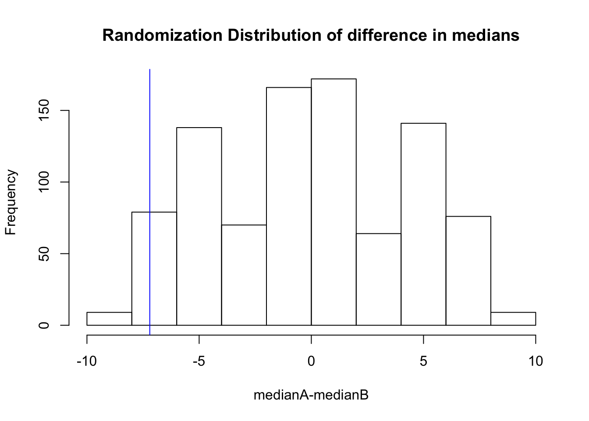
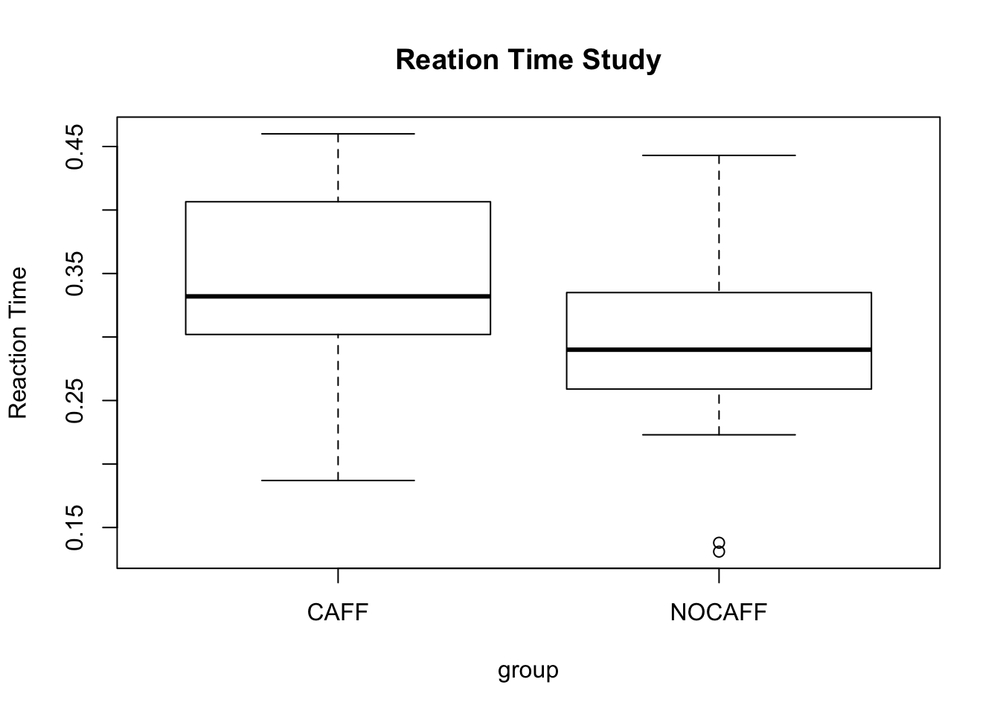
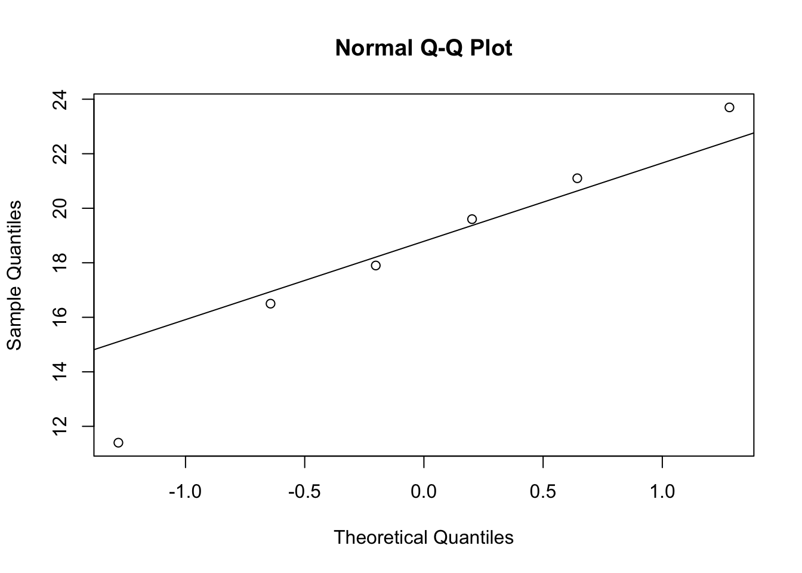
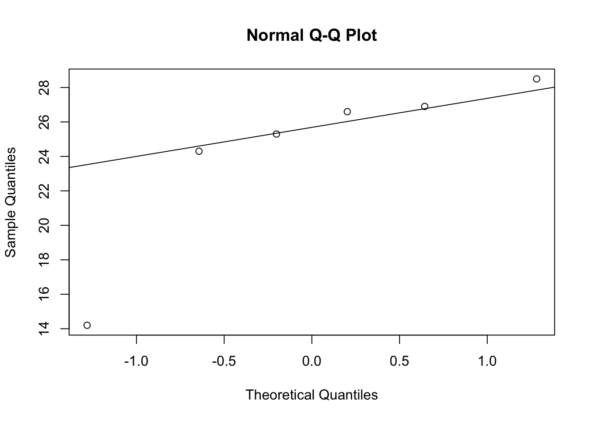
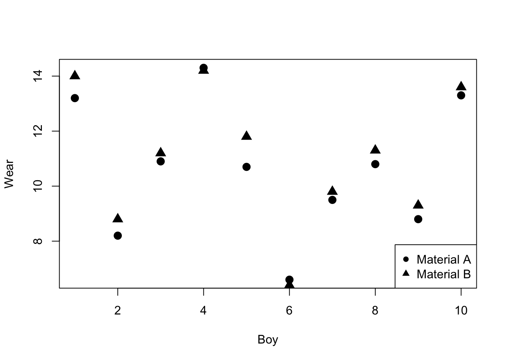
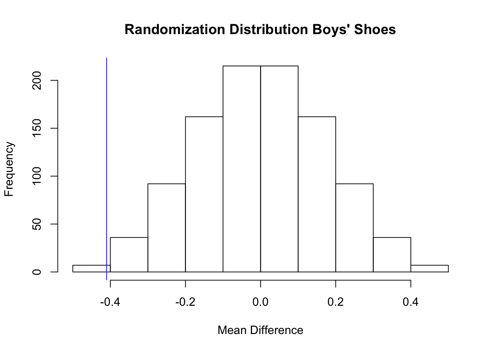
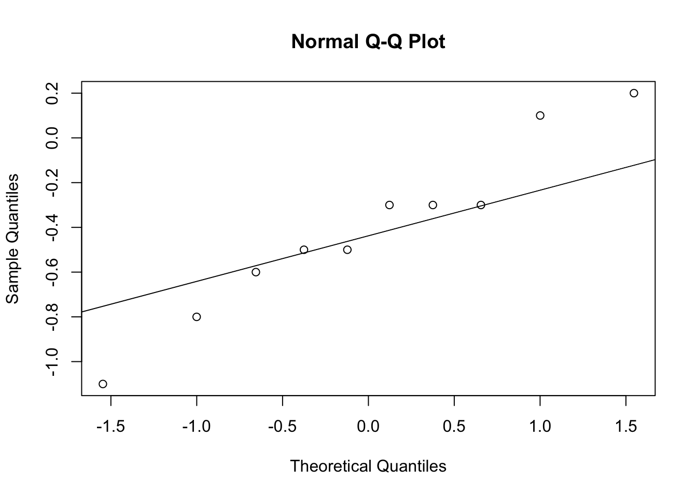

# Completely Randomized Designs: Comparing Two Treatments

Suppose that subjects are randomly assigned to two groups in a medical study to investigate which group has a higher mortality rate.  In one group patients receive the standard treatment for the disease, and in the other group patients receive an experimental treatment.  Since patients were randomly assigned to the two groups then the two groups of patients should be similar *except for the treatment they recieved*. 

If patients in the group receiving the experimental treatment live longer on average and the difference is both clinically meaningful and statistically significant then because of the design we can conclude that the new treatment *caused* patients to live longer.  Randomization is supposed to ensure that the groups will be similar with respect to all the factors *measured* in the study and all the factors that are *not measured*.    

## Comparing Two Treatments

* Is fertilizer A better than fertilizer B for growing wheat?  
* Is drug A better than drug B for treating breast cancer?  
* Is webpage A better than webpage B for selling a certain product?  

These are all examples of comparing two *treatments*.  In experimental design *treatments* are different procedures applied to *experimental units* - the things to which we apply *treatments*. 

In the first example the treatments are two fertilizers and the experimental units might be plots of land.  In the second example the treatments are two different drugs to treat breast cancer and the experimental units are breast cancer patients.  In the third example the treatments are two webpage designs and the experimental units are potential customers (example from [Google experiments](https://support.google.com/analytics/answer/1745147?hl = en)).

## Treatment Assignment Mechanism and Propensity Score

In randomized experiments (@imbens2015causal, pg. 20):

> "... the assignment mechanism is under the control of the experimenter, and the 
> probability of any assignment of treatments across the units in the experiment is 
> entirely knowable before the experiment begins."


Suppose, for example, that we have two breast cancer patients and we want to randomly assign these two patients to two treatments (A and B).  Then how many ways can this be done?  

1. patient 1 receives A and patient 2 receives A
2. patient 1 receives A and patient 2 receives B
3. patient 1 receives B and patient 2 receives A
4. patient 1 receives B and patient 2 receives B


### Propensity Score

The probability that an individual patient (experimental unit) receives treatment is called the **propensity score**. In this case the probability that an individual patient receives treatment A (or B) is 1/2. 

It's important to note that the assignment mechanism and propensity scores are different probabilities, although in some designs they may be equal.

In general, if there are $N$ experimental units then there are $2^N$ possible treatment assignments (provided there are two treatments).

A treatment assignment vector records the treatment that each experimental unit is assigned to receive.  Let $N$ be the number of experimental units.  Let $t_i$ be the treatment indicator for unit $i$

$$t_i =
\left\{
	\begin{array}{ll}
		1  & \mbox{if subject i assigned treatment A} \\
		0 & \mbox{if subject i assigned treatment B. }
	\end{array}
\right.$$

If $N = 2$ then the possible treatment assignment vectors 

$\begin{pmatrix} 
  t_1 \\
  t_2
 \end{pmatrix}$ are:

$$\begin{pmatrix} 
  1 \\
  0
 \end{pmatrix}, \begin{pmatrix}
 0 \\
  1
 \end{pmatrix},\begin{pmatrix}
 1 \\
  1
 \end{pmatrix},\begin{pmatrix}
 0 \\
  0
 \end{pmatrix},$$

For example, the first treatment assignment vector 

$$\begin{pmatrix} 
  1 \\
  0
 \end{pmatrix}$$

means that the first experimental unit receives treatment A, and the second treatment B; and the third treatment assignment vector

$$\begin{pmatrix}
 1 \\
  1
 \end{pmatrix}$$
 
means that the first and second experimental units both receive treatment A.

### Assignment Mechanism

There are 4 possible treatment assignments. The probability of a treatment assignment is 1/4.  This probability is called the **assignment mechanism**. It is the probability that a particular treatment assignment vector will occur. 


## Completely Randomized Experiment

It wouldn't be a very informative experiment if both patients received A or both received B.  Therefore, it makes sense to rule out this scenario.  If we rule out this scenario then we want to assign treatments to patients such that one patient receives A and the other receives B. So, the possible treatment assignments are:

1. patient 1 receives A and patient 2 receives B or (in vector notation)
$\begin{pmatrix} 
  1 \\
  0
 \end{pmatrix}.$

2. patient 1 receives B and patient 2 receives A or (in vector notation)
$\begin{pmatrix}
 0 \\
  1\end{pmatrix}.$

There are are two possible treatment assignments.  The probability of a treatment assignment is 1/2, and the probability that an individual patient receives treatment A (or B) is still 1/2.

Notice that the probability of a treatment assignment is different from the probability that of an individual experimental unit receiving a treatment.  

A completely randomized experiment has the number of units assigned to treatment A, $N_A$ fixed in advance so that the number of units assigned to treatment B $N_B = N-N_A$ are also fixed in advance. In such a design, $N_A$ units are randomly selected, from a population of $N$ units, to receive the treatment A, with the remaining $N_B$ assigned to the other treatment. In this case, each unit has probability $N_A/N$ of being assigned to treatment A. There are $N \choose N_A$ distinct values of the treatment assignment vector with $N_A$ units out of $N$ assigned to treatment A. Therefore, the assignment mechanism or the probability of any particular treatment assignment is:

$$\frac{1}{\binom{N}{N_A}}.$$

### Example 

Is fertilizer A better than fertilizer B for growing wheat? It is decided to take one large plot of land and divide it into twelve smaller plots of land then treat some plots with fertilizer A or B.  How should we assign fertilizers (*treatments*) to plots of land?

$$\begin{array}{|c|c|c|c|c|c|}
\hline
  {\text {plot }} 1 & {\text {plot }}2 & {\text {plot }}3 & {\text {plot }}4 & {\text {plot }}5 & {\text {plot }}6 \\ 
  \hline
  {\text {plot }}7 & {\text {plot }}8 & {\text {plot }}9 & {\text {plot }}10 & {\text {plot }}11 & {\text {plot }}12 \\
  \hline
 \end{array}$$

Some of the plots get more sunlight and not all the plots have the exact same soil composition which may affect wheat yield.  In other words, the plots are not identical. Nevertheless, we want to make sure that we can identify the treatment effect even though the plots are not identical.  Statisticians sometimes state this as being able to identify the treatment effect (*viz.* difference between fertilizers) in the presence of other sources of variation (*viz.* differences between plots).

Ideally we would assign fertilizer A to six plots and fertilizer B to six plots.  How can this be done so that each plot has an equal chance of being assigned fertilizer A or B?  One way to assign the two fertilizers to the plots is to use six playing cards labelled A (for fertilizer A) cards and six playing cards labelled B (for fertilizer B), shuffle the cards then assign the first card to plot 1, the second card to plot 2, etc.

In R we can represent the Red and Black cards as:


```r
cards <- c(rep("A",6),rep("B",6))
cards # print cards
```

```
 [1] "A" "A" "A" "A" "A" "A" "B" "B" "B" "B" "B" "B"
```

Now, to "shuffle" the "cards" we can use `sample()` 


```r
shuffle <- sample(cards,12)
shuffle
```

```
 [1] "A" "A" "B" "B" "A" "B" "B" "B" "A" "B" "A" "A"
```

The first plot will be assigned A, the second plot will be assigned A, etc.

Exercise:

1. How many ways are there to assign six plots to fertilizer A and six plots to fertilizer B? In other words how many different treatment assignments are possible? 

2. What is the probability that an individual plot receives fertilizer A?

3. What is the probability of choosing the treatment assignment A, A, A, A, A, A, B, B, B, B, B, B?

Answers: 

1. ${12 \choose 6}=$ 924.  That is, there are 924 unique subsets of 6 plots that can be chosen from 12 plots. In R we can choose six plots from 12 using the `sample()` command.

```r
sample(1:12,6)
```

```
[1]  8 10  5 11  2 12
```

2. 1/2.

3. $P({\text {treatment assignment}})= {\frac {1}{{12 \choose 6}}}=$ 0.001.


## The Randomization Distribution

Let's consider the fertilizer example from the previous section.  The treatment assignment that the experimenter used was 

```r
shuffle
```

```
 [1] "A" "A" "B" "B" "A" "B" "B" "B" "A" "B" "A" "A"
```

$$\begin{array}{|c|c|c|c|c|c|}
\hline
  {\text A} & {\text B} & {\text B} & {\text B} & {\text B} & {\text A} \\ 
  \hline
  {\text A} & {\text A} & {\text A} & {\text B} & {\text A} & {\text B} \\
  \hline
 \end{array}$$

This is one of the ${12 \choose 6}=$ 924 possible ways of allocating 6 A's and 6 B's to the 12 plots.  The probability of choosing any of these allocations is ${\frac {1}{{12 \choose 6}}}=$ 0.001.


The data from this experiment is:

$$\begin{array}{|c|c|c|c|c|c|}
\hline
  {\text A } (11.4) & {\text B } (26.9) & {\text B } (26.6) & {\text B } (25.3) & {\text B } (28.5) & {\text A } (23.7) \\ 
  \hline
  {\text A } (17.9) & {\text A } (16.5) & {\text A } (21.1) & {\text B } (14.2) & {\text A } (19.6) & {\text B } (24.3) \\
  \hline
 \end{array}$$

This can be stored in R. A summary of the distributions of the two samples is given below.


```r
#Fertilizer data
yA <- c(11.4,23.7,17.9,16.5,21.1,19.6)
summary(yA); sd(yA)
```

```
   Min. 1st Qu.  Median    Mean 3rd Qu.    Max. 
  11.40   16.85   18.75   18.37   20.73   23.70 
```

```
[1] 4.234934
```

```r
yB <- c(26.9,26.6,25.3,28.5,14.2,24.3)
summary(yB); sd(yB)
```

```
   Min. 1st Qu.  Median    Mean 3rd Qu.    Max. 
  14.20   24.55   25.95   24.30   26.82   28.50 
```

```
[1] 5.151699
```

```r
mean(yA) - mean(yB)
```

```
[1] -5.933333
```


The distributions of the two samples can also be described by the empirical cumulative distribution function (CDF):

$${\hat F}(y)=\frac{\sum_{i = 1}^{n}I(y_i \le y)}{n},$$

where $n$ is the number of sample points and $I(\cdot)$ is the indicator function

$$ I(y_i \le y) = \left\{
	\begin{array}{ll}
		1  & \mbox{if } y_i \le y \\
		0 & \mbox{if } y_i > y
	\end{array}
\right.$$

The R function `ecdf()` calculates the empirical CDF.  


```r
#plot empirical cdf for fertilizer B
plot.ecdf(yB,xlab = "yield",xlim = c(11,29),main = "Empirical CDF Fertilizer")
#add empirical cdf for fertilizer A to plot
plot.ecdf(yA,col = "blue",pch = 2,add = T)
# add legend
legend("topleft",legend = c("Fertilizer B","Fertilizer A"),col = c("black","blue"),pch = c(19,2))
```


```r
wheatdat <- stack(data.frame(yA,yB)) #stack the columns
boxplot(values~ind,data = wheatdat) # create side-by-side boxplot
```


Is the difference in wheat yield due to the treatment or due to chance?

- Assume that there is no difference in the average yield between fertilizer A and fertilizer B.

- If there is no difference then the yield would be the same even if a different treatment allocation occurred. 

- Under this assumption of no difference between the treatments, if one of the other 924 treatment allocations occurred such as A, A, B, B, A, B, B, B, A, B, A, A.  Then the data from the experiment would have been:

$$\begin{array}{|c|c|c|c|c|c|}
\hline
  {\text B } (11.4) & {\text A } (26.9) & {\text B } (26.6) & {\text B } (25.3) & {\text B } (28.5) & {\text A } (23.7) \\ 
  \hline
  {\text A } (17.9) & {\text A } (16.5) & {\text A } (21.1) & {\text B } (14.2) & {\text A } (19.6) & {\text B } (24.3) \\
  \hline
 \end{array}$$


```r
#Fertilizer data
yA_1 <- c(26.9,23.7,17.9,16.5,21.1,19.6)
mean(yA_1); sd(yA_1)
```

```
## [1] 20.95
```

```
## [1] 3.844867
```

```r
yB_1 <- c(11.4,26.6,25.3,28.5,14.2,24.3)
mean(yB_1); sd(yB_1)
```

```
## [1] 21.71667
```

```
## [1] 7.103638
```

```r
mean(yA_1) - mean(yB_1)
```

```
## [1] -0.7666667
```

Assume that there is no difference between the two treatments.  The set of all possible differences that might have occurred if a different treatment allocation was chosen is called the randomization distribution.  

The randomization distribution can be obtained in R using the following code.

```r
fert <- c(yA,yB) #pool data
N <- choose(12,6)
res <- numeric(N) # store the results
#install.packages("combinat") # if package not installed then remove comment
library(combinat)
index <- combn(1:12,6) # Generate N treatment assignments
for (i in 1:N)
{
  res[i] <- mean(fert[index[,i]]) - mean(fert[-index[,i]])
}
hist(res,xlab = "ybarA-ybarB", main = "Randomization Distribution of difference in means")
observed <- mean(yA) - mean(yB) #store observed mean difference
abline(v = observed,col = "blue") #add line at observed mean diff
```


The researchers are interested in determining if fertilizer B produces a higher yield compared to fertilizer A.

The null and alternative hypotheses of interest are

$$\begin{aligned}
& H_0: \text {There is no difference between treatments,} \\
& H_1: \text {Fertilizer B increases wheat yield.}
\end{aligned}$$

## The Randomization p-value

The p value of the *randomization test* of $H_0$ can be calculated as the probability of getting a test statistic as extreme of more extreme than the observed value of the test statistic $t^{*}$.  Since all of the $N \choose N_A$ randomizations are equally likely under $H_0$, the p value is

$$P(T \le t^{*}|H_0)= \sum_{i = 1}^{N \choose N_A} \frac{I(t_i \le t^{*})}{{N \choose N_A}},$$

where $t_i$ is the value of the test statistic $T={\bar Y}_A-{\bar Y}_B$ for the $i^{th}$ randomization (@ernst2004perm).

The observed value of the test statistic is -5.93. So, the p-value is 


```r
# of times values from the mean randomization distribution less than observed value
sum(res <= observed) 
```

```
[1] 26
```

```r
N # Number of randomizations
```

```
[1] 924
```

```r
pval <- sum(res <= observed)/N # Randomization p value
round(pval, 2)
```

```
[1] 0.03
```

A p-value of 0.03 can be interpreted as: assume there is no difference in yield between fertilizers A and B then the proportion of randomizations that would produce an observed mean difference between A and B of at most -5.93 is 0.03. In other words, under the assumption that there is no difference between A and B only 3% of randomizations would produce an extreme or more extreme difference than the observed mean difference.  


## Two-Sided Randomization P value


If we are using a two-sided alternative then how do we calculate a p-value?  The randomization distribution may not be symmetric so there is no justification for simply doubling the probability in one tail.

Let

$${\bar t}=\frac{1}{\binom{N} {N_A}}{\sum_{i = 1}^{\binom{N} {N_A}} t_i}$$

be the mean of the randomization distribution then we can define the two-sided p-value as 

$$P(\left|T-{\bar t}\right| \ge \left|t^{*}-{\bar t}\right||H_0) = \sum_{i = 1}^{N \choose N_A} \frac{I(\left|t_i-{\bar t}\right| \ge \left|t^{*}-{\bar t}\right|)}{{N \choose N_A}},$$

this is the probability of obtaining an observed value of the test statistic as far, or farther, from the mean of the randomization distribution.  

In R this can be calculated


```r
yA <- c(11.4,23.7,17.9,16.5,21.1,19.6)
yB <- c(26.9,26.6,25.3,28.5,14.2,24.3)
fert <- c(yA,yB) #pool data
N <- choose(12,6)
res <- numeric(N) # store the results
#install.packages("combinat") # if package not installed then remove comment
library(combinat)
index <- combn(1:12,6)
for (i in 1:N)
{
  res[i] <- mean(fert[index[,i]]) - mean(fert[-index[,i]])
}

tbar <- mean(res)
pval <- sum(abs(res - tbar) >= abs(observed - tbar))/N
round(pval,2)
```

```
[1] 0.06
```

In this case, since the randomization distribution, is roughly symmetric the two-sided p-value is approximately half the one-sided p-value.

## Other Test Statistics

Other test statistics could be used instead of $T={\bar Y}_A-{\bar Y}_B$ to measure the effectiveness of fertilizer A. The difference in group medians or trimmed means are examples of other test statistics.

The randomization distribution of the difference in group medians can be obtained by modifying the R code used for the difference in group means.


```r
fert <- c(yA,yB) #pool data
N <- choose(12,6)
res <- numeric(N) # store the results
#install.packages("combinat") # if package not installed then remove comment
library(combinat)
index <- combn(1:12,6) # Generate N treatment assignments
for (i in 1:N)
{
  res[i] <- median(fert[index[,i]]) - median(fert[-index[,i]])
}
hist(res,xlab = "medianA-medianB", main = "Randomization Distribution of difference in medians")
observed <- median(yA) - median(yB) #store observed median difference
abline(v = observed, col = "blue") #add line at observed median diff
```



The p-value of the randomization test can be calculated 


```r
# of times values from the median randomization distribution less than observed value
sum(res <= observed) 
```

```
[1] 36
```

```r
N # Number of randomizations
```

```
[1] 924
```

```r
pval <- sum(res <= observed)/N # Randomization p value
round(pval, 2)
```

```
[1] 0.04
```


## Calculating the Randomization P-value using Monte Carlo Sampling 

Computation of the randomization distribution involves calculating the difference in means for every possible way to split the data into two samples of size $n_A$ each.  If $N = 30$ and $N_A = 15$ this would result in ${30 \choose 15}=$  155.12 million differences.  These types of calculations are not practical unless the sample size is small.  

Instead we can resort to Monte Carlo sampling from the randomization distribution to estimate the exact p-value.  The p-value is the proportion of test statistics as extreme or more extreme than the observed value.  

The data set can be randomly divided into two groups and the test statistic calculated.  Several thousand test statistics are usually sufficient to get an accurate estimate of the exact p-value and sampling can be done without replacement.  

If $M$ test statistics, $t_i$, $i = 1,...,M$ are randomly sampled from the permutation distribution, a one-sided Monte Carlo p value for a test of $H_0: \mu_T = 0$ versus $H_1: \mu_T > 0$ is

$$ {\hat p} = \frac {1+\sum_{i = 1}^M I(t_i \ge t^{*})}{M+1}.$$

Including the observed value $t^{*}$ there are $M+1$ test statistics.

### Does Caffeine Have an Effect on Reaction Time? 

\begin{wrapfigure}{r}{0.30\textwidth} 
\includegraphics[width = 0.30\textwidth]{rtscreenshot.png}
\end{wrapfigure}


A study of the effects of caffeine on reaction time using the [Census at School Canada reaction timer](http://asp.censusatschool.ca/asp/timer-eng.asp) was conducted on a group of 30 high school students. 

The investigator randomly assigned an equal number to two groups:  one group (CAFF) consumed a caffeinated beverage prior to taking the test and the other group (NOCAFF) consumed the same amount of water.  She wanted to study the effect that caffeine would have on reaction time. In particular she wanted to know if caffeine slows down reaction time.

\newpage

The data she collected are below:


    rt  group  
------  -------
 0.352  CAFF   
 0.332  CAFF   
 0.213  CAFF   
 0.290  CAFF   
 0.379  CAFF   
 0.389  CAFF   
 0.229  CAFF   
 0.314  CAFF   
 0.187  CAFF   
 0.324  CAFF   
 0.460  CAFF   
 0.426  CAFF   
 0.326  CAFF   
 0.449  CAFF   
 0.424  CAFF   
 0.359  NOCAFF 
 0.255  NOCAFF 
 0.330  NOCAFF 
 0.443  NOCAFF 
 0.398  NOCAFF 
 0.290  NOCAFF 
 0.131  NOCAFF 
 0.283  NOCAFF 
 0.138  NOCAFF 
 0.223  NOCAFF 
 0.313  NOCAFF 
 0.281  NOCAFF 
 0.263  NOCAFF 
 0.340  NOCAFF 
 0.325  NOCAFF 

Did the CAFF group have a slower reaction time compared to the NOCAFF group?


```r
summary(rtdat$rt[rtdat$group == "CAFF"])  #Distribution for CAFF group
```

```
   Min. 1st Qu.  Median    Mean 3rd Qu.    Max. 
 0.1870  0.3020  0.3320  0.3396  0.4065  0.4600 
```

```r
summary(rtdat$rt[rtdat$group == "NOCAFF"])  #Distribution for NOCAFF group
```

```
   Min. 1st Qu.  Median    Mean 3rd Qu.    Max. 
 0.1310  0.2590  0.2900  0.2915  0.3350  0.4430 
```

```r
boxplot(rt~group,data = rtdat,ylab = "Reaction Time",main = "Reation Time Study")
```



The data indicate that the median difference between the CAFF and NOCAFF groups is 0.042 seconds.  Is the observed difference due to random chance?  Let's conduct a randomization test to find out, but we will approximate the p-value using Monte Carlo simulation since there are 155.12 million possible differences.


```r
caff <-rtdat$rt[rtdat$group=="CAFF"]
ncaff <- rtdat$rt[rtdat$group=="NOCAFF"]
rt1 <- c(caff,ncaff)
N <- 10000
result <- numeric(N) 
set.seed(1701)
for (i in 1:N) {
index <- sample(length(rt),size = length(caff),replace = FALSE)
result[i] <- median(rt[index]) - median(rt[-index]) 
}
observed <- median(caff) - median(ncaff)

#P-value - results will vary depending on the sample chosen, but set.seed() is fixed so
#same sample will be chosen unless this value changes.
phatval <- (sum(result >= observed)+1)/(N+1)
phatval
```

```
[1] 0.07559244
```

The p-value 0.076 is not unusual under the null hypothesis.  Thus, this study did not find evidence that caffeine slows down reaction time. 


## Properties of the Randomization Test

The P-value of the one-sided randomization test must be a multiple of $\frac{1}{\binom{N} {N_A}}$.  If a significance level of $\alpha=\frac{k}{\binom{N} {N_A}}$, where $k = 1,...,{N \choose N_A}$ is chosen then 

$$P(\text{type I}) = \alpha.$$    

In other words the randomization test is an exact test.  

If $\alpha$ is not chosen as a multiple of $\frac{1}{\binom {N}{N_A}}$, but $\frac{k}{\binom {N}{N_A}}$ is the largest p-value less than $\alpha$, then $P(\text{type I}) = \frac{k}{\binom {N}{N_A}}< \alpha$ and the randomization test is conservative.  Either way, the test is guaranteed to control the probability of a type I error under very minimal conditions: randomization of the experimental units to the treatments (@ernst2004perm).


## The two-sample t-test

If the two wheat yield samples are independent random samples from a normal distribution with means $\mu_A$ and $\mu_B$ but the same variance then the statistic

$$ {\bar y}_A - {\bar y}_b \sim N\left(\mu_A-\mu_B,\sigma^2(1/n_A+1/n_B) \right).$$

So,

$$ \frac {{\bar y}_A - {\bar y}_b- \delta}{\sigma \sqrt{(1/n_A+1/n_B)}} \sim N(0,1),$$

where $\delta=\mu_A-\mu_B$.

If we substitute 

$$S^2=\frac{\sum_{i = 1}^{n_A}(y_{iA}-{\bar y}_A)+\sum_{i = 1}^{n_B}(y_{iB}-{\bar y}_B)}{n_A+n_B-2}$$ 

for $\sigma^2$ then 

$$ \frac {{\bar y}_A - {\bar y}_b - \delta}{s \sqrt{(1/n_A+1/n_B)}} \sim t_{n_A+n_B-2},$$

is called the two sample t-statistic.

In the wheat yield example $H_0:\mu_A=\mu_B$ and suppose that $H_1: \mu_A < \mu_B.$  The p-value of the test is obtained by calculating the observed value of the two sample t-statistic under $H_0$.

$$ t^{*}= \frac {{\bar y}_A - {\bar y}_b}{s \sqrt{(1/n_A+1/n_B)}} = \frac {18.37 - 24.3}{4.72 \sqrt{(1/6+1/6)}}=-2.18$$

The p-value is $P(t_{18}<-2.18)=$ 0.03.

The calculation was done in R.


```r
s <- sqrt((5*var(yA)+5*var(yB))/10)
tstar <- (mean(yA)-mean(yB))/(s*sqrt(1/6+1/6)); round(tstar,2)
```

```
[1] -2.18
```

```r
pval <- pt(tstar,10); round(pval,2)
```

```
[1] 0.03
```

In R the command to run a two-sample t-test is `t.test()`.  


```r
t.test(yA,yB,var.equal = TRUE,alternative = "less")
```

```

	Two Sample t-test

data:  yA and yB
t = -2.1793, df = 10, p-value = 0.02715
alternative hypothesis: true difference in means is less than 0
95 percent confidence interval:
       -Inf -0.9987621
sample estimates:
mean of x mean of y 
 18.36667  24.30000 
```

The assumption of normality can be checked using normal quantile plots, although the t-test is robust against non-normality.


```r
qqnorm(yA);qqline(yA)
```



```r
qqnorm(yB);qqline(yB)
```



Both plots indicate that the normality assumption is satisfied.

Notice that the p-value from the randomization test and the p-value from two-sample t-test are almost identical.  Although the randomization test neither depends on normality nor independence. The randomization test does depend on Fisher’s concept that after randomization, if the null hypothesis is true, the two results obtained from each particular plot will be *exchangeable*. The randomization test tells you what you could say if exchangeability were true.


## Randomized paired comparison 

If a comparison is made within matched pairs of experimental units then randomization is straightforward to carry out within a matched pair.  

This is illustrated with a study on the wear of boys' shoes (@bhh2005).

Measurements on the amount of wear of the soles of shoes worn by 10 boys were obtained by the following design:  

- Each boy wore a special pair of shoes with the soles made of two different synthetic materials, A (a standard material) and B (a cheaper material).

- The decision as to whether the left or right sole was made with A or B was determined by the flip of a fair coin.

- During the test some boys scuffed their shoes more than others, but each boys' shoes were subjected to the same amount of wear. 

- Most of the boy-to-boy variation can be eliminated by working with the differences between A and B.

The data and a plot of the data are shown below .


```r
library(BHH2)
data(shoes.data)
shoes.data
```

```
   boy matA sideA matB sideB
1    1 13.2     L 14.0     R
2    2  8.2     L  8.8     R
3    3 10.9     R 11.2     L
4    4 14.3     L 14.2     R
5    5 10.7     R 11.8     L
6    6  6.6     L  6.4     R
7    7  9.5     L  9.8     R
8    8 10.8     L 11.3     R
9    9  8.8     R  9.3     L
10  10 13.3     L 13.6     R
```

```r
plot(shoes.data$boy,shoes.data$matA,pch = 16,cex = 1.5,xlab = "Boy",ylab = "Wear")
points(shoes.data$boy,shoes.data$matB,pch = 17,cex = 1.5)
legend("bottomright",legend = c("Material A","Material B"),pch = c(16,17))
```



An experimental design of this kind is called a randomized paired comparison design.  Later in the course we will see how this idea can be extended to compare more than two treatments using randomized block designs.


## The Randomization Test for a Randomized Paired Design

The treatments were assigned to the boys left or right shoe by flipping a fair coin. If the coin toss was a tail then the left side received material A and the right side material B; if the coin toss was a head then the right side received material A and the left side received material B.

Exercise: Based on the boys shoe data above write down the treatment allocation for this experiment.  Use "T" for tails and "H" for heads.

Answer: T T H T H T T T H T

The null hypothesis is that there is no difference in wear between A and B.  This means that the treatment assignment (sequence of 10 coin tosses) is one of $2^{10}=1024$ equiprobable treatment assignments. 

In a paired design we can work with the difference between treatment for each experimental unit.


```r
diff <- shoes.data$matA-shoes.data$matB
meandiff <- mean(diff); meandiff
```

```
[1] -0.41
```

```r
shoe.dat2 <- data.frame(shoes.data,diff)
shoe.dat2
```

```
   boy matA sideA matB sideB diff
1    1 13.2     L 14.0     R -0.8
2    2  8.2     L  8.8     R -0.6
3    3 10.9     R 11.2     L -0.3
4    4 14.3     L 14.2     R  0.1
5    5 10.7     R 11.8     L -1.1
6    6  6.6     L  6.4     R  0.2
7    7  9.5     L  9.8     R -0.3
8    8 10.8     L 11.3     R -0.5
9    9  8.8     R  9.3     L -0.5
10  10 13.3     L 13.6     R -0.3
```

Under the null hypothesis the wear of boys left or right shoe is same regardless of what material he had on his sole.  This means that if there was a different treatment assignment, say, H T H T H T T T H T then the difference for the first boy would have been +0.8 since he would have had his right side 
assigned to material A (14.0) and his left side assigned to material B (13.2).

The randomization distribution of the average difference is the distribution of the average differences, for all the different treatment assignments. 


```r
N <- 2^(10) # number of treatment assignments
res <- numeric(N) #vector to store results
LR <- list(c(-1,1)) # difference is multiplied by -1 or 1
trtassign <- expand.grid(rep(LR, 10)) # generate all possible treatment assign

for(i in 1:N){
res[i] <- mean(as.numeric(trtassign[i,])*diff)
}

hist(res, xlab = "Mean Difference",main = "Randomization Distribution Boys' Shoes")
abline(v = meandiff,col = "blue")
```



The p-value for testing if B has more wear than A is:

$$P(D \le d^{*}|H_0)= \sum_{i = 1}^{2^{10}} \frac{I(d_i \le d^{*})}{2^{10}},$$

where $D={\bar A}-{\bar B}$, and $d^{*}$ is the observed mean difference. 

This can be calculated in R


```r
sum(res<=meandiff) # number of differences le observed diff
```

```
[1] 7
```

```r
sum(res<=meandiff)/N # p-value
```

```
[1] 0.006835938
```

The value of $d^{*}=$ -0.41 is unusual under the null hypothesis since only 7 produced by the randomization distribution give $d^{*}$ less than -0.41. Therefore, there is a statistically significant increase in the amount of wear with the cheaper material B. 


## Paired t-test

If we assume that the differences -0.8, -0.6, -0.3, 0.1, -1.1, 0.2, -0.3, -0.5, -0.5, -0.3 are a random sample from a normal distribution then the statistic 

$$t=\frac{{\bar d}}{s_{\bar d}/\sqrt{10}} \sim t_{10-1},$$ 

where, $s_{\bar d}$ is the sample standard deviation of the paired differences.  The p-value for testing if ${\bar D} < 0$ is 

$$ P(t_{9}< t).$$

In general if there are $n$ differences then 

$$t=\frac{{\bar d}}{s_{\bar d}/\sqrt{n}} \sim t_{n-1},$$ 

where, $s_{\bar d}$ is the sample standard deviation of the paired differences.  The p-value for testing if ${\bar D} < 0$ is 

$$ P(t_{n-1}< t).$$

NB: This is the same as a one-sample t-test of the differences.

In R a paired t-test can be obtained by using the command `t.test()`.


```r
t.test(shoes.data$matA,shoes.data$matB,paired = TRUE,alternative = "less")
```

```

	Paired t-test

data:  shoes.data$matA and shoes.data$matB
t = -3.3489, df = 9, p-value = 0.004269
alternative hypothesis: true difference in means is less than 0
95 percent confidence interval:
       -Inf -0.1855736
sample estimates:
mean of the differences 
                  -0.41 
```

```r
t.test(diff,alternative = "less") # same as a one-sample t-test on the diff
```

```

	One Sample t-test

data:  diff
t = -3.3489, df = 9, p-value = 0.004269
alternative hypothesis: true mean is less than 0
95 percent confidence interval:
       -Inf -0.1855736
sample estimates:
mean of x 
    -0.41 
```

```r
qqnorm(diff); qqline(diff)
```



Exercise: Calculate the test statistic and p-value of the paired t test using R

Answer:


```r
tobs <- mean(diff)/(sd(diff)/sqrt(10)); tobs
```

```
## [1] -3.348877
```

```r
pt(tobs,df = 9) # p-value using t-dist CDF
```

```
## [1] 0.00426939
```


## Questions

1. Suppose that two drugs A and B are to be tested on 12 subjects' eyes.  The drugs will be randomly assigned to the left eye or right eye based on the flip of a fair coin.  If the coin toss is heads then a subject will receive drug A in their right eye.  The coin was flipped 12 times and the following sequence of heads and tails was obtained: 

$$\begin{array}
{c c c c c c c c c c c c}
T&T&H&T&H&T&T&T&H&T&T&H
\end{array}$$

(a) Create a table that shows how the treatments will be allocated to the 12 subjects' left and right eyes?
(b) What is the probability of obtaining this treatment allocation?
(c) What type of experimental design has been used to assign treatments to subjects? Explain.

## Solutions to Questions


1. (a)

$$\begin{array} {c|c}
\text {Left} & \text {Right} \\
\hline
A & B \\
A & B   \\
B & A \\
A & B \\ 
B & A \\
A & B \\ 
A & B \\ 
A & B \\
B & A \\
A & B \\ 
A & B \\
B & A \\
\end{array}$$

(b) $\frac{1}{2^{12}}=0.0002441406.$

(c) A randomized paired design. There are 12 subjects, but each subject receives both treatments in a paired fashion.


