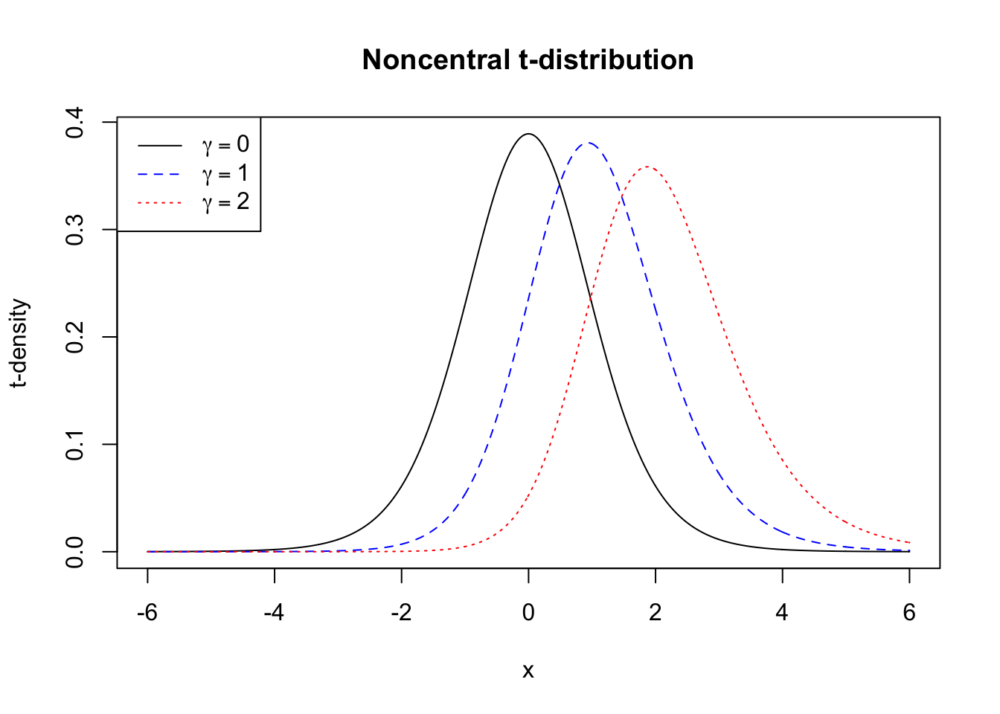
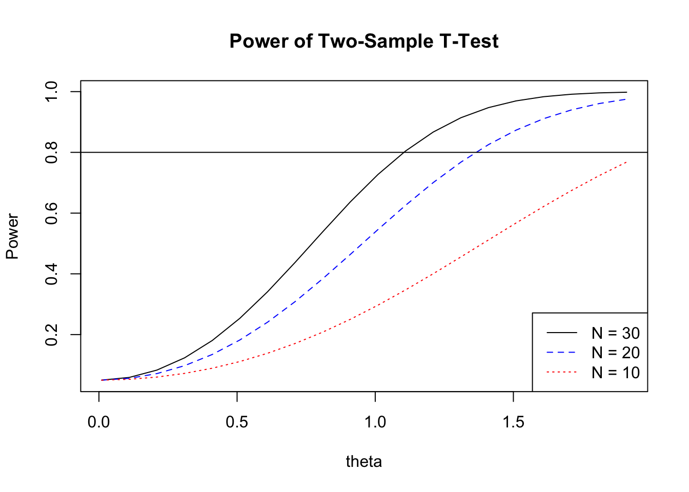
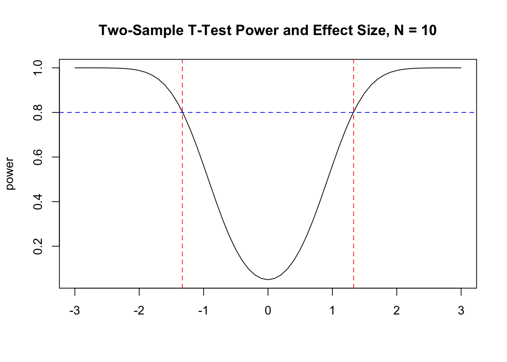
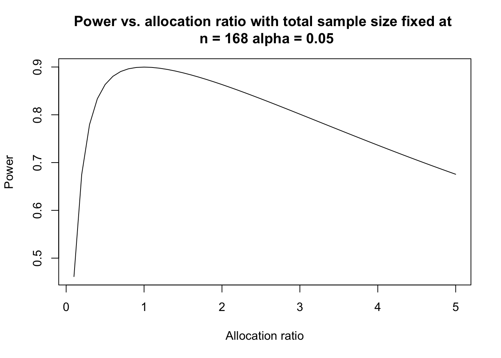

# How Many Experimental Units are Required to Compare Two Treatments? 

Suppose that a company would like to compare two versions of a web page to see if one version leads to higher sales.  How many people should visit the each version of the website?  A pharmaceutical company is required to compare a novel treatment for cancer against the standard treatment to investigate if patient mortality decreases when receiving the novel treatment.  To study how physical expression influences psychological processes such as risk taking subjects were randomized to two groups where one group was instructed to pose in a high-power position and the second group in a low-power position.  

In each of these examples experimental units (e.g., human subjects) were randomly assigned to two groups to investigate the causal effects of a treatment.  How many subjects should be assigned to each group?


## Clinical Trials

Clinical trials are prospective intervention studies with human subjects to investigate experimental drugs, new treatments, medical devices, or clinical procedures (@yin2013clinical).  

There are typically fours phases of clinical trials. 

### Phases of clinical trials

The phases of clinical trials that might be involved in developing a new drug for a certain cancer are described below.

**Preclinical studies:** In vitro (e.g. slides, test tubes) and in vivo (living organism such as rodents) studies on wide range of doses of experimental agents.   This stage of study provides preliminary toxicity and efficacy data including pharmacokinetics (PK) and pharmacodynamics (PD) information.

**Phase I:** Usually first study in humans to investigate the toxicity and side effects of the new agent.  Identify MTD.  

**Phase II:** Assess if drug has sufficient efficacy.  The drug is usually administered around the MTD.  If drug does not show efficacy or is too toxic then further testing is discontinued.

**Phase III:** If drug passes phase II testing then it is compared to the current standard of care or placebo.  These are long-term, large scale randomized studies that may involve hundreds or thousands of patients. 

If the drug is proven to be effective (e.g. two positive phase III trials required for FDA approval) the company will file an application with regulatory agencies to sell the drug.
If approved then the drug will be available to the general population in the country where it was approved.

**Phase IV:** After approval a study might follow a large number of patients over a longer period of time to monitor side effects and drug interactions.  For example, findings from these studies might add a warning label to the drug. 

Some comments:

- The four phases are usually conducted sequentially and separately.
- Each trial requires an independent study design and a study protocol.
- Every aspect of trial design, monitoring, and data analysis call upon statistical methods.
- In randomized clinical trials a treatment group is often referred to as an **arm**.

According to the [ClinicalTrials.gov](https://clinicaltrials.gov/ct2/about-studies/glossary#A) an arm is defined as:

> A group or subgroup of participants in a clinical trial that receives specific interventions, or no intervention, according to the study protocol. This is decided before the trial begins.

**How can causation be assessed using a randomized design?**

- Suppose that patients are randomized in a two arm clinical trial where one of the arms is the standard treatment and the other arm is an experimental treatment and there is a statistically significant difference in the outcome between the two arms showing the experimental treatment is more efficacious. 

- The interpretation is that the experimental treatment *caused* patients to have a better outcome since the only difference between the two arms is the treatment.  Randomization is supposed to ensure that the groups will be similar with respect to all the factors measured in the study and all the factors that are not measured.    


#### How many patients should be enrolled in a Phase III clinical trial?


> If an experimental agent exhibits adequate short-term therapeutic effects in a phase II trial, the drug will be moved forward to a phase III study for confirmative testing of its long-term effectiveness. Phase III clinical trials are randomized and controlled studies that directly compare the investigational drug with the current "gold standard" treatment or a placebo when there is no standard of care. The sample size of a phase III trial is large, usually ranging from hundreds up to thousands of participants ... Due to their enormous sizes, large scales, and long follow-ups, phase III trials are the most costly comparative studies to evaluate the drug's efficacy. (pg. 159, @yin2013clinical)


- In a phase III trial sample size is the most critical component of the study design.  The sample size has implications for how many subjects will be exposed to a drug that has no proven efficacy.
- The investigator needs to specify type I, II error rates, and the effect sizes.
- Standard practice is to compute the smallest sample size required to detect a clinically important/significant treatment difference with sufficient.
- If the sample size is too small then the trial might fail to discover a truly effective drug because the statistical test cannot reach the significance level (5%) due to a lack of power.
- If the sample size is overestimated then resources wasted and drug development delayed since patient enrollment is often the main factor in time to complete a trial.

## Statistical Hypotheses and the Number of Experimental Units

Suppose that subjects are randomized to treatments A or B with equal probability.
Let $\mu_A$ be the mean response in the group receiving drug A and $\mu_B$ be the mean response in the group receiving drug B.
The null hypothesis is that there is no difference between A and B, the alternative claims there is a clinically meaningful difference between them.

$$H_0:\mu_A=\mu_B \thinspace \text{ versus } \thinspace H_1:\mu_A \ne \mu_B $$

The type I error rate is defined as:

$$\begin{aligned}
\alpha &=P\left(\text{type I error}\right) \\
       &=P\left(\text{Reject } H_0|H_0 \text{ is true}\right).\\
\end{aligned}$$

The type II error rate is defined as:

$$\begin{aligned}
\beta&=P\left(\text{type II error}\right) \\
     &=P\left(\text{Accept }H_0|H_1 \text{ is true}\right).   
\end{aligned}$$

Power is defined as:
$$ \begin{aligned}
\text {power} &= 1-\beta \\
              &= 1-P\left(\text{Accept }H_0|H_1 \text{ is true}\right) \\
              &= P\left(\text{Reject } H_0|H_1 \text{ is true}\right).
\end{aligned}$$


## Power of the One Sample z-test

Let $X_1,...,X_n$ be a random sample from a $N(\mu,\sigma^2)$ distribution.  A test of the hypothesis 

$$H_0:\mu=\mu_0 \thinspace \text{ versus } \thinspace H_1:\mu \ne \mu_0 $$

will reject at level $\alpha$ if and only if 

$$ \left|\frac{{\bar X} - \mu_0}{\sigma/{\sqrt{n}}} \right| \ge z_{\alpha/2},$$

or

$$ \left|{\bar X} -\mu_0 \right| \ge \frac{\sigma}{\sqrt{n}} z_{\alpha/2},$$

where $z_{\alpha/2}$ is the $100(1-\alpha/2)^{th}$ percentile of the $N(0,1)$.

The power of the test at $\mu=\mu_1$ is

$$\begin{aligned}
1-\beta &= 1-P\left(\text{type II error}\right) \\
        &= P\left(\text{Reject } H_0|H_1 \text{ is true}\right) \\
        &= P\left(\text{Reject } H_0|\mu=\mu_1\right) \\
        &= P\left(\left|{\bar X} -\mu_0 \right| \ge \frac{\sigma}{\sqrt{n}} z_{\alpha/2}|\mu=\mu_1\right) \\
        &= P\left({\bar X} -\mu_0  \ge \frac{\sigma}{\sqrt{n}} z_{\alpha/2}|\mu=\mu_1\right) + P\left({\bar X} -\mu_0  < \frac{-\sigma}{\sqrt{n}} z_{\alpha/2}|\mu=\mu_1\right) \\
\end{aligned}$$

Subtract the mean $\mu_1$ and divide by $\sigma/\sqrt{n}$ to obtain:

$$ 1-\beta = 1-\Phi\left( z_{\alpha/2}-\left(\frac{\mu_1-\mu_0}{\sigma/\sqrt{n}}\right) \right)+\Phi\left( -z_{\alpha/2}-\left(\frac{\mu_1-\mu_0}{\sigma/\sqrt{n}}\right) \right),$$

where $\Phi(\cdot)$ is the $N(0,1)$ CDF. 

### Exercises

1. What is the limit of the power function as:
(a) $n \rightarrow \infty$
(b) $\mu_1 \rightarrow \mu_0$

Answers:(a) 1; (b) $\alpha$.


### Calculating the Power of the One Sample z-test using R

The power function for a one-sample z-test can be calculated using R.


```r
pow.z.test <- function(alpha,mu1,mu0,sigma,n){
  arg1 <- qnorm(1-alpha/2)-(mu1-mu0)/(sigma/sqrt(n))
  arg2 <- -1*qnorm(1-alpha/2)-(mu1-mu0)/(sigma/sqrt(n))
  1-pnorm(arg1)+pnorm(arg2)
}
```

For example the power of the test

$$H_0:\mu = 0 \thinspace \text{ versus } \thinspace H_1:\mu = 0.2$$ with $n = 30,\sigma = 0.2, \alpha = 0.05$ can be calculated by calling the above function.


```r
pow.z.test(.05,.15,0,.2,30) 
```

```
[1] 0.9841413
```

This means that with $n = 30$ experimental units there is a 0.98 probability that the z-test will detect a mean of 0.2 when $\sigma = 0.2, \alpha = 0.05$.  


## Power of the one-sample t-test

Let $X_1,...,X_n$ be a random sample from a $N(\mu,\sigma^2)$ distribution.  A test of the hypothesis 

$$H_0:\mu=\mu_0 \thinspace \text{ versus } \thinspace H_1:\mu \ne \mu_0 $$

will reject at level $\alpha$ if and only if 

$$ \left|\frac{{\bar X} - \mu_0}{S/{\sqrt{n}}} \right| \ge t_{n-1, \alpha/2},$$

where $t_{n-1, \alpha/2}$ is the $100(1-\alpha/2)^{th}$ percentile of the $t_{n-1}$.

It can be shown that

$$\sqrt{n} \left[\frac{{\bar X}-\mu_0}{S}\right] =  \frac{Z + \gamma}{\sqrt{V/(n-1)}},$$

where,

$$\begin{aligned}
Z &= \frac{\sqrt{n}({\bar X}-\mu_1)}{\sigma} \\
\gamma &=  \frac{\sqrt{n}(\mu_1-\mu_0)}{\sigma} \\
V &= \frac{(n-1)}{\sigma^2} S^2.
\end{aligned}$$

$Z \sim N(0,1)$ and $V \sim \chi^2_{n-1}$ and $Z$ is independent of $V$.

If $\gamma = 0$ then then $\sqrt{n} \left[\frac{{\bar X}-\mu_0}{S}\right] \sim t_{n-1}$.  But, if $\gamma \ne 0$ then $\sqrt{n} \left[\frac{{\bar X}-\mu_0}{S}\right] \sim t_{n-1, \gamma}$, where $t_{n-1, \gamma}$ is the non-central t-distribution with non-centrality parameter $\gamma$.  If $\gamma = 0$ this is sometimes called the central t-distribution.

A plot of the central ($\gamma = 0$) and non-central t are shown in the plot below.


```r
#Plot of noncentral t and central t
x <- seq(-6,6,by = 0.01)
plot(x,dt(x,10,0),type = "l",ylab = "t-density",col = "black",
     xlab = "x",main = "Noncentral t-distribution")
points(x,dt(x,10,1),type = "l",lty = 2,col = "blue")
points(x,dt(x,10,2),type = "l",lty = 3,col = "red")
legend("topleft",
       legend = c(expression(gamma == 0),
                expression(gamma == 1),expression(gamma==2)),
                lty = c(1,2,3),col = c("black","blue","red"))
```



The power of the test at $\mu=\mu_1$ is

$$\begin{aligned}
1-\beta &= 1-P\left(\text{type II error}\right) \\
        &= P\left(\text{Reject } H_0|H_1 \text{ is true}\right) \\
        &= P\left(\text{Reject } H_0|\mu=\mu_1\right) \\
        &= P\left(\left|\frac {{\bar X} -\mu_0} {\frac{S}{\sqrt{n}}} \right| \ge  t_{n-1, \alpha/2}|\mu=\mu_1\right) \\
        &=  P\left(\frac {{\bar X} -\mu_0} {\frac{S}{\sqrt{n}}}  \ge  t_{n-1, \alpha/2}|\mu=\mu_1\right) + P\left(\frac {{\bar X} -\mu_0} {\frac{S}{\sqrt{n}}} < - t_{n-1, \alpha/2}|\mu=\mu_1\right) \\
        &= P(t_{n-1,\gamma}\ge t_{n-1,\alpha/2})+P(t_{n-1,\gamma}< -t_{n-1,\alpha/2})
\end{aligned}$$


### Calculating the Power of the One Sample t-test using R

#### Write a Custom Function to Calculate Power

The following function calculates the power function for the one-sample t-test in R:


```r
onesampttestpow <- function(alpha,n, mu0, mu1,sigma)
{delta <- mu1-mu0
t.crit <-qt(1-alpha/2,n-1)
t.gamma <- sqrt(n)*(delta/sigma)
t.power <- 1-pt(t.crit,n-1,ncp = t.gamma)+pt(-t.crit,n-1,ncp = t.gamma)
return(t.power)
}
```

For example the power of the t-test for testing 

$$H_0:\mu = 0 \thinspace \text{ versus } \thinspace H_1:\mu = 0.15$$ with $n = 10,\sigma = 0.2, \alpha = 0.05$ can be calculated by calling the above function is
  

```r
onesampttestpow(.05,10,0,.15,0.2)
```

```
[1] 0.5619533
```


#### Use `power.t.test()` to Calculate Power


There is built-in function in R that can calculate the power of t-test `power.t.test()`.  Using this function on the previous example we get


```r
power.t.test(n = 10,delta = 0.15,sd = 0.2,sig.level = 0.05,type = "one.sample" )
```

```

     One-sample t test power calculation 

              n = 10
          delta = 0.15
             sd = 0.2
      sig.level = 0.05
          power = 0.5619339
    alternative = two.sided
```

Exactly one of the parameters `n`, `delta`, `power`, `sd`, and `sig.level` must be passed as `NULL`, and that parameter is determined from the others. In this example the function calculates power given the other parameters.  If sample size is required for, say, 80% power then use 


```r
power.t.test(power = 0.8,delta = 0.15,sd = 0.2,sig.level = 0.05,type = "one.sample" )
```

```

     One-sample t test power calculation 

              n = 15.98026
          delta = 0.15
             sd = 0.2
      sig.level = 0.05
          power = 0.8
    alternative = two.sided
```

The calculation shows that the study requires sixteen experimental units to have 80% power.

## Power of two sample t test

Statistical sample size calculations are calculated under the alternative hypothesis based on the type I error rate $\alpha$ and power $1 - \beta$. In other words, we assume that the alternative hypothesis is true!  Specifying the alternative hypothesis is usually tantamount to specifying a difference between the two groups that will be scientifically or practically meaningful.  If two web pages are being tested to see which leads to higher sales is a 2% increase in sales worth the cost of redesigning the web site?  If two drugs are being compared in a phase III clinical trial is a 5% difference in mortality rates clinically meaningful?

Sample size estimation not only depends on the effect size [*the clinically meaningful difference is often called an effect size*], but also on the variance. The larger the variance, the harder it is to detect the difference and thus a larger sample size is needed.

To fix idea let's suppose that a phase III clinical trials is being designed and a continuous outcome $Y$ is the primary outcome. Although, the methods below are valid for experimental contexts beyond clinical trials. 

Consider a two-sample comparison with continuous outcomes. Let $Y_{ik}$ be the observed outcome for the $i^{th}$ subject in the $kth$ treatment group, for $i = 1,...,n_k$, and $k= 1,2$. The outcomes in the two groups are assumed to be independent and normally distributed with different means but an equal variance $\sigma^2$,

$$Y_{ik} \sim N(\mu_k,\sigma^2).$$

Let $\theta=\mu_1-\mu_2$,  the difference in the mean between treatment 1 (the new therapy) and treatment 2 (the standard of care).
To test whether the effects of the two treatments are the same, we formulate the null and alternative hypotheses as $H_0:\theta =0$ versus $H_1:\theta \ne 0.$

The two-sample t-statistic $T_n$ discriminates between $H_0$ and $H_1$.  The p-value is calculated by gauging the observed value of $T_n$ against its distribution under $H_0$. The hypothesis testing procedure assesses the strength of evidence contained in the data against the null hypothesis. If the p-value is adequately small, say, less than 0.05 under a two-sided test, we reject the null hypothesis and claim that there is a significant difference between the two treatments; otherwise there is no significant difference and the study is inconclusive.

The sample mean for each group is given by ${\bar Y}_k = (1/n_k)\sum_{i = 1}^{n_k} Y_{ik}$, $k = 1,2$, and the pooled sample variance is

$$S^2_p= \frac{1}{n_1+n_2-2} \sum_{k = 1}^2 \sum_{i = 1}^{n_k} (Y_{ik}-{\bar Y}_k)^2.$$

Then the two-sample t statistic is given by

$$ T_n=\frac {{\bar Y}_1 - {\bar Y}_2}{S_p \sqrt{(1/n_1+1/n_2)}} \sim t_{n_1+n_2-2}.$$

$T_n \sim t_{n_1+n_2-2}$ under $H_0$ and $t_{n_1+n_2-2,\gamma}$ with non-centrality parameter

$$ \gamma = \frac {\theta}{\sigma\sqrt{1/n_1+1/n_2}},$$

under $H_1$.  
 
$H_0$ is rejected if $\left| T_n \right| \ge t_{n_1+n_2-2,\alpha/2}$ where $t_{df,\alpha/2}$ is the $100(1-\alpha/2)th$ percentile of the central t distribution with $df$ degrees of freedom. 

The sample size can be determined by specifying the type I and type II error rates, the standard deviation, and the difference in treatment means that the clinical trial aims to detect.

The power of the test is

$$1-\beta = P(t_{n_1+n_2-2, \gamma} \ge t_{n_1+n_2-2, \alpha/2})+P(t_{n_1+n_2-2, \gamma} < -t_{n_1+n_2-2, \alpha/2})$$

The sample size can be solved from this equation which does not have a closed form (see @yin2013clinical).


### Calculating the Power of the Two Sample t-test using R


#### Write a Custom Function to Calculate Power

This can be programmed in R.


```r
twosampttestpow <- function(alpha,n1,n2, mu1, mu2,sigma){
delta <- mu1-mu2
t.crit <-qt(1-alpha/2,n1+n2-2)
t.gamma <- delta/(sigma*sqrt(1/n1+1/n2))
t.power <- 1-pt(t.crit,n1+n2-2,ncp = t.gamma)+pt(-t.crit,n1+n2-2,ncp = t.gamma)
return(t.power)
}
```

The power of a clinical trial to detect $\theta = 1$ with $\sigma = 3,n_1 = n_2 = 50$ is


```r
twosampttestpow(.05,50,50,1,2,3)
```

```
[1] 0.3785749
```


#### Use `power.t.test()` to Calculate Power

The built-in function `power.t.test()` can also be used and gives the same results.


```r
power.t.test(n = 50,delta = 1,sd = 3,sig.level = 0.05)
```

```

     Two-sample t test power calculation 

              n = 50
          delta = 1
             sd = 3
      sig.level = 0.05
          power = 0.3784221
    alternative = two.sided

NOTE: n is number in *each* group
```

So the study would require 50 subjects per group to achieve 38% power to detect a difference of $\theta = 1$ at the 5% significance level assuming $\sigma = 3$.  `power.t.test()` can also output the number of subjects required to achieve a certain power.  Suppose the investigators want to know how many subjects per group would have to be enrolled in each group to achieve 80% power under the same conditions?


```r
power.t.test(power = 0.8,delta = 1,sd = 3,sig.level = 0.05)
```

```

     Two-sample t test power calculation 

              n = 142.2466
          delta = 1
             sd = 3
      sig.level = 0.05
          power = 0.8
    alternative = two.sided

NOTE: n is number in *each* group
```

142 subjects would be required in each group to achieve 80% power.

The following plot shows power of the two-sample t-test as a function of the difference $\theta$ to be detected and equal sample size per group.


```r
# Study power as a function of theta and sample size
pow <- power.t.test(n = 30,delta = seq(0.01,2,by = 0.1),sd = 1.5,power = NULL,
                    type = "two.sample",alternative = "two.sided",strict = T)
plot(pow$delta,pow$power,type = "l",main = "Power of Two-Sample T-Test",
     xlab = "theta",ylab = "Power")
pow <- power.t.test(n = 20,delta = seq(0.01,2,by = 0.1),sd = 1.5,power = NULL,
                    type = "two.sample",alternative = "two.sided",strict = T)
points(pow$delta,pow$power,type = "l",lty = 2,col = "blue")
pow <- power.t.test(n = 10,delta = seq(0.01,2,by = 0.1),sd = 1.5,power = NULL,
                    type = "two.sample",alternative = "two.sided",strict = T)
points(pow$delta,pow$power,type = "l",lty = 3,col = "red")
abline(a = 0.8,b = 0)
legend("bottomright",legend = c("N = 30","N = 20","N = 10"),
       lty = c(1,2,3),col = c("black","blue","red"))
```



This next plot shows power as a function of $\sigma$ and sample size per group.


```r
# Power as a funtion of sample size and sd
pow <- power.t.test(n = 30,delta = 1,sd = seq(1,3,by = 0.1),power = NULL,
                    type = "two.sample",alternative = "two.sided",strict = T)
plot(pow$sd,pow$power,type = "l",main = "Power of Two-Sample T-Test",
     xlab = "SD",ylab = "Power")
pow <- power.t.test(n = 20,delta = 1,sd = seq(1,3,by = 0.1),power = NULL,
                    type = "two.sample",alternative = "two.sided",strict = T)
points(pow$sd,pow$power,type = "l",lty = 2,col = "blue")
pow <- power.t.test(n = 10,delta = 1,sd = seq(1,3,by = 0.1),power = NULL,
                    type = "two.sample",alternative = "two.sided",strict = T)
points(pow$sd,pow$power,type = "l",lty = 3,col = "red")
abline(a = 0.8,b = 0)
legend("topright",legend = c("N = 30","N = 20","N = 10"),
       lty = c(1,2,3),col = c("black","blue","red"))
```


## Effect size

In some studies instead of specifying the difference in treatment means and standard deviation separately the ratio

$$\frac{\mu_1-\mu_2}{\sigma}$$

can be specified.  This ratio is called the scaled effect size.  @cohen1992power  suggests that effect sizes of 0.2, 0.5, 0.8 correspond to small, medium , and large effects. Cohen (1992) states that:

> Researchers find specifying the ES the most difficult part of power analysis ... To convey the meaning of any given ES index, it is necessary to have some idea of its scale ... My intent was that medium ES represent an effect likely to be visible to the naked eye of a careful observer, (it has since been noted in effect- size surveys that it approximates the average size of observed effects in various fields.) I set small ES to be noticeably smaller than medium but not so small as to be trivial, and I set large ES to be the same distance above medium as small was below it. Although the definitions were made subjectively ...

Power as a function of effect size can be investigated using R.


```r
pow.t <- function(theta){
  alpha <-0.05
  nA <- 10
  nB <- 10
  t.crit <-qt(1-alpha/2,nA+nB-2)
  t.gamma <- theta/(sqrt(1/nA+1/nB))
  t.power <- 1-pt(t.crit,nA+nB-2,ncp = t.gamma)+pt(-t.crit,nA+nB-2,ncp = t.gamma)
  return(t.power)
}

x <- seq(-3,3,by = 0.1)
plot(x,pow.t(x),type = "l",xlab="",ylab = "power",main = "Two-Sample T-Test Power and Effect Size, N = 10")
abline(v=+1.33,lty = 2,col = "red")  
abline(v=-1.33,lty = 2,col = "red")  
abline(h = 0.8,lty = 2,col = "blue") 
```



The plot shows that for $n_1 = n_2 = 10$ the two-sample t-test has at least 80% power for detecting effect sizes that are at least 1.3.

## Sample size - known variance and equal allocation

Consider a study where experimental units are randomized into two treatment groups and the investigator would like an equal number of experimental units in each group.  

If the variance is known then the test statistic is 

$$ Z=\frac {{\bar Y}_1 - {\bar Y}_2}{\sigma \sqrt{(1/n_1+1/n_2)}} \sim N(0,1).$$

This is the known as the two-sample z-test.

The power at $\theta=\theta_1$ is given by

$$1-\beta= P\left( Z \ge z_{\alpha/2} - \frac{\theta_1}{\sigma \sqrt{1/n_1+1/n_2}}  \right) + P\left( Z < -z_{\alpha/2} - \frac{\theta_1}{\sigma \sqrt{1/n_1+1/n_2}}  \right).$$

Ignoring terms smaller than $\alpha/2$ and combining positive and negative $\theta$

$$\beta \approx \Phi\left( z_{\alpha/2} - \frac{\left|\theta_1\right|}{\sigma \sqrt{1/n_1+1/n_2}} \right).$$

The sample size is obtained by solving 

$$z_{\beta}+z_{\alpha/2} = \left( \frac{\left|\theta_1\right|}{\sigma \sqrt{1/n_1+1/n_2}} \right).$$

If we assume that there will be an equal allocation of subjects to each group then $n_1 = n_2 = n/2$, the total sample size is

$$ n= \frac {4\sigma^2 \left(z_{\beta}+z_{\alpha/2}\right)^2}{\theta^2}.$$

## Sample size - known variance and unequal allocation

In many studies comparing two treatments it is desirable to put more experimental units into the experimental group to learn more about this treatment.  In a phase III clinical trial if the patient allocation between the two groups is $r = n_1/n_2$ then $n_1 = r\cdot n_2$ and 

$$ n_2=\frac {(1+1/r)\sigma^2 \left(z_{\beta}+z_{\alpha/2}\right)^2} {\theta^2}.$$

An R function to compute the sample size in groups 1 and 2 for unequal allocation is


```r
size2z.uneq.test <- function(theta,alpha,beta,sigma,r)
{
  zalpha <- qnorm(1-alpha/2)
  zbeta <- qnorm(1-beta)
  n2 <- (1+1/r)*(sigma*(zalpha+zbeta)/theta)^2
  n1 <- r*n2
  return(c(n1,n2))
}
```

The sample size required for 90% power to detect $\theta = 1$ with $\sigma = 2$ at the 5% level in a trial where two patients will be enrolled in the experimental arm for every patient enrolled in the control arm is 126 in the control group and 63 in the experimental group.  The total sample size is 189.


```r
# sample size for theta =1, alpha = 0.05, beta = 0.1, sigma = 2, r = 2
size2z.uneq.test(1,.05,.1,2,2)[1] # group 1 sample size (experimental group)
```

```
[1] 126.0891
```

```r
size2z.uneq.test(1,.05,.1,2,2)[2] # group 2 sample size (control group)
```

```
[1] 63.04454
```

The power of the two-sample z-test can be studied as a function of the allocation ratio $r$.  


```r
# power of z test as a function of allocation ratio r,
# total sample size n, alpha, theta, and sigma
pow.z.test <- function(r,n,alpha,theta,sigma)
{
  n2 <- n/(r+1)
  x <- qnorm(1-alpha/2)-abs(theta)/(sigma*sqrt(1/(r*n2)+1/n2))
  pow <- 1-pnorm(x)
  return(pow)
}

plot(x = seq(.1,5,by = 0.1),y = pow.z.test(seq(.1,5,by = 0.1),168,.05,1,2),type = "l",
     xlab = "Allocation ratio",ylab = "Power",
     main = "Power vs. allocation ratio with total sample size fixed at \n n = 168 alpha = 0.05") 
```



The plot shows that imbalance typically leads to loss of power.   


## Comparing Proportions for Binary Outcomes

In this section we will consider studies where the primary endpoint is dichotomous.  In a clinical trial the outcome could be whether a patient has responded to the treatment, or whether a patient has experienced toxicity.  More specifically, consider a phase III clinical trial where patients are randomized to two groups and a binary outcome is measured as the outcome. 

Let $p_1$ denote the response rate of the experimental drug, $p_2$ as that of the standard drug, and the difference is $\theta= p_1—p_2$. Let $Y_{ik}$ be the binary outcome for subject $i$ in arm $k$; that is,

$$Y_{ik} = \left\{
	\begin{array}{ll}
		1  & \mbox{with probability } p_k \\
		0 & \mbox{with probability } 1-p_k,
	\end{array}
\right.$$

for $i = 1,...,n_k$ and $k = 1,2$.  The sum of independent and identically distributed Bernoulli random variables has a binomial distribution,

$$ \sum_{i = 1}^{n_k} Y_{ik} \sim Bin(n_k,p_k), \thinspace k = 1,2.$$

(see @yin2013clinical, pg. 173-174)

The sample proportion for group $k$ is

$${\hat p}_k={\bar Y}_k = (1/n_k)\sum_{i = 1}^{n_k} Y_{ik}, \thinspace k = 1,2,$$

and $E\left( {\bar Y}_k\right)=p_k$ and $Var\left({\bar Y}_k \right)=\frac{p_k(1-p_k)}{n_k}$.

The goal of the clinical trial is to determine if there is a difference between the two groups using a binary endpoint.  That is we want to test $H_0: \theta = 0$ versus $H_1: \theta \ne 0.$ 

The test statistic (assuming that $H_0$ is true) is:

$$T = \frac {{\hat p}_1-{\hat p}_2} {\sqrt{p_1(1-p_1)/n_1+p_2(1-p_2)/n_2}} \sim N(0,1),$$


The test rejects at level $\alpha$ if and only if

$$\left|T\right| \ge z_{\alpha/2}.$$


Using the same argument as the case with continuous endpoints and ignoring terms smaller than $\alpha/2$ we can solve for $\beta$


$$\beta \approx \Phi\left( z_{\alpha/2}- \frac{|\theta_1|}{\sqrt{p_1(1-p_1)/n_1+p_2(1-p_2)/n_2}}   \right).$$


Using this formula to solve for sample size. If $n_1 = r \cdot n_2$ then

$$n_2= \frac {\left(z_{\alpha/2}+z_{\beta}\right)^2}{\theta^2} \left(p_1(1-p_1)/r+p_2(1-p_2) \right). $$


The built-in R function `power.prop.test()` can be used to calculate sample size or power.  For example suppose that the standard treatment for a disease has a response rate of 20%, and an experimental treatment is anticipated to have a response rate of 28%.  The researchers want both arms to have an equal number of subjects.  How many patients should be enrolled if the study will conduct a two-sided test at the 5% level with 80% power?


```r
power.prop.test(p1 = 0.2,p2 = 0.25,power = 0.8)
```

```

     Two-sample comparison of proportions power calculation 

              n = 1093.739
             p1 = 0.2
             p2 = 0.25
      sig.level = 0.05
          power = 0.8
    alternative = two.sided

NOTE: n is number in *each* group
```

This means that 1094 should be enrolled in each group.

## Calculating Power by simulation

If the test statistic and distribution of the test statistic are known then the power of the test can be calculated via simulation.

Consider a two-sample t-test with 30 subjects per group and the standard deviation of the clinical outcome is known to be 1.  What is the power of the test $H_0:\mu_1-\mu_2 = 0$ versus $H_1:\mu_1-\mu_2 = 0.5$, at the 5% significance level?

The power is the proportion of times that the test correctly rejects the null hypothesis in repeated sampling.

We can simulate a single study using the `rnorm()` command.  Let's assume that $n_1 = n_2 = 30, \mu_1 = 3.5, \mu_2 = 3, \sigma = 1, \alpha = 0.05$.


```r
set.seed(2301)
# simulate 1 study with two samples with 30 observations: one sample is N(3.5,1) 
# the other is N(3,1) then do a two-sample t-test on each study 
t.test(rnorm(30,mean = 3.5,sd = 1),rnorm(30,mean = 3,sd = 1),var.equal = T)
```

```

	Two Sample t-test

data:  rnorm(30, mean = 3.5, sd = 1) and rnorm(30, mean = 3, sd = 1)
t = 2.1462, df = 58, p-value = 0.03605
alternative hypothesis: true difference in means is not equal to 0
95 percent confidence interval:
 0.03458122 0.99248595
sample estimates:
mean of x mean of y 
 3.339362  2.825828 
```

We would reject the null hypothesis at the 5% level since the p-value is 0.0360489.

Suppose that 10 studies are simulated.  What proportion of these 10 studies will reject the null hypothesis at the 5% level?  To investigate how many times the two-sample t-test will reject at the 5% level the `replicate()` command will be used to generate 10 studies and calculate the p-value in each study.  It will still be assumed that $n_1 = n_2 = 30, \mu_1 = 3.5, \mu_2 = 3, \sigma = 1, \alpha = 0.05$.


```r
set.seed(2301) 
# simulate 10 studies with two samples with 30 observations: one sample is N(3.5,1) 
# the other is N(3,1) then do a two-sample t-test on each study 
pvals <- replicate(10,t.test(rnorm(30,mean = 3.5,sd = 1),rnorm(30,mean = 3,sd = 1),
                             var.equal = T)$p.value)
pvals # print out 10 p-values
```

```
 [1] 0.03604893 0.15477655 0.01777959 0.40851999 0.34580930 0.11131007
 [7] 0.14788381 0.00317709 0.09452230 0.39173723
```

```r
sum(pvals<=0.05)/10 #power is the number of times the test rejects at the 5% level
```

```
[1] 0.3
```

But, since we only simulated 10 studies the estimate of power will have a large standard error.  So let's try simulating 10,000 studies so that we can obtain a more precise estimate of power.  


```r
set.seed(2301)
pvals <- replicate(10000,t.test(rnorm(30,mean = 3.5,sd = 1),rnorm(30,mean = 3,sd = 1),
                             var.equal = T)$p.value)
sum(pvals<=0.05)/10000 
```

```
[1] 0.4881
```


This is much closer to the theoretical power obtained from `power.t.test()`.


```r
power.t.test(n = 30,delta = 0.5,sd = 1,sig.level = 0.05)
```

```

     Two-sample t test power calculation 

              n = 30
          delta = 0.5
             sd = 1
      sig.level = 0.05
          power = 0.477841
    alternative = two.sided

NOTE: n is number in *each* group
```

The built-in R functions `power.t.test()` and `power.prop.test()` don't have an option for calculating power where the there is unequal allocation of subjects between groups.  One option is to simulate power for the scenarios that are of interest. Another option is to write your own function using the formula derived above. 

In the previous example the standard treatment for a disease has a response rate of 20%, and an experimental treatment is anticipated to have a response rate of 28%.  The researchers want both arms to have an equal number of subjects.  The power calculation above revealed that the study will require 1094 patients for 80% power.  What would happen to the power if the researchers put 1500 patients in the experimental arm and 500 patients in the control arm?

The number of subjects in the experimental arm that have a positive response to treatment will be an observation from a $Bin(1500,0.28)$ and the number of subjects that have a positive response to the standard treatment will be an observation from a $Bin(500,0.2)$.  We can obtain simulated responses from these distributions using the `rbinom()` command in R.


```r
set.seed(2301)
rbinom(1,1500,0.28)
```

```
[1] 403
```

```r
rbinom(1,500,0.20)
```

```
[1] 89
```


In this simulated clinical trial 431 of the 1500 patients in the experimental arm had a positive response to the experimental treatment and 101 of the 500 patients in the control arm had a positive response to the standard treatment. The p-value for this simulated study can be obtained using `prop.test()`.


```r
set.seed(2301)
prop.test(x = c(rbinom(1,1500,0.28),rbinom(1,500,0.20)),n = c(1500,500),correct = F)
```

```

	2-sample test for equality of proportions without continuity
	correction

data:  c(rbinom(1, 1500, 0.28), rbinom(1, 500, 0.2)) out of c(1500, 500)
X-squared = 16.62, df = 1, p-value = 4.568e-05
alternative hypothesis: two.sided
95 percent confidence interval:
 0.05032654 0.13100680
sample estimates:
   prop 1    prop 2 
0.2686667 0.1780000 
```

In this study the p-value is 0, which is less than 0.05 so there would be evidence that the new treatment is significantly better than the standard treatment. A power simulation repeats this process a large number of times. The `repeat()` command can be used for the repetition.  In the example below we simulate 10,000 hypothetical studies to calculate power.


```r
set.seed(2301)
pvals <- replicate(10000,prop.test(x = c(rbinom(n = 1,size = 1500,prob = 0.25),rbinom(n = 1,size = 500,prob = 0.20)),n = c(1500,500),correct = F)$p.value)
sum(pvals<=0.05)/10000
```

```
[1] 0.6231
```

If the researchers decide to have a 3:1 allocation ratio of patients in the treatment to control arm then the power will decrease to approximately 62%.   


## Questions

1. The R function

```r
# sample size for two-sample Z test equal allocation
size2z.test <- function(theta,alpha,beta,sigma)
{
  zalpha <- qnorm(1-alpha/2)
  zbeta <- qnorm(1-beta)
  (2*sigma*(zalpha+zbeta)/theta)^2
}
```

implements the sample size formula for calculating the sample size for a test of $H_0:\theta = 0$ versus $H_1:\theta \ne 0$, where $\theta=\mu_1-\mu_2$.   

$$n=\left(\frac{2\sigma\left(z_{\alpha/2}+z_{\beta}\right)}{\theta}\right)^2$$

a) What are the main assumptions behind this sample size formula? (see lecture slides)
b) Does the sample size increase or decrease as (assume that all the other parameters remain fixed): 
+ $\sigma$ decreases; 
+ $\alpha$ decreases; 
+ $\theta$ decreases. 


2.  A statistician is designing a phase III clinical trial comparing a continuous outcome in two groups (experimental versus standard therapy) with a total sample size of 168 patients. The team requires that the study have at least 80% power at the 5% significance level to detect a difference of 1 (the standard deviation of the outcome is 2). The design team would like to investigate if it's possible to have four times as many patients in the experimental group versus the control group with out having to increase the sample size.  

The statistician conducted the following analysis. What is the power if there are four times as many patients in the experimental group?  What should the statistician recommend to the team in order for the study to have at least 80% power?  For example, should the type I error rate be increased? 


```r
# sample size for two-sample z test unequal allocation
# r is the ratio of patients in the experimental arm to control arm
# e.g. r = 2 means that for every 2 patients in the experimental arm
# 1 pateint is in the control arm

size2z.uneq.test <- function(theta,alpha,beta,sigma,r)
{
  zalpha <- qnorm(1-alpha/2)
  zbeta <- qnorm(1-beta)
  (1+1/r)*(sigma*(zalpha+zbeta)/theta)^2
}

# power of z test as a function of allocation ratio r,
# total sample size n, alpha, theta, and sigma
pow.z.test <- function(r,n,alpha,theta,sigma)
{
  n2 <- n/(r+1)
  x <- qnorm(1-alpha/2)-abs(theta)/(sigma*sqrt(1/(r*n2)+1/n2))
  pow <- 1-pnorm(x)
  return(pow)
}

plot(x = seq(.1,5,by = 0.1),y = pow.z.test(seq(.1,5,by = 0.1),168,.05,1,2),type = "l",
     xlab = "Allocation ratio",ylab = "Power",
     main = "Power vs. allocation ratio with total sample size fixed at \n n = 168 alpha = 0.05") 
```


3. Let $X_1, X_2, ..., X_n$ be an ii $N\left(\mu,\sigma^2\right)$.  

a) Show that the power function of the test $H_0:\mu = 0$ versus $H_1:\mu = 1$ is $$1-\Phi\left(z_{\frac{\alpha}{2}}-\frac{\sqrt{n}}{\sigma}\right)$$, where $z_{\frac{\alpha}{2}},$ is the $100\left(1-\frac{\alpha}{2}\right)^{th}$ percentile of the $N\left(0,1\right)$.

b) Use R to calculate the power when $n = 10$, $\alpha = 0.01$, and $\sigma = 1$.


