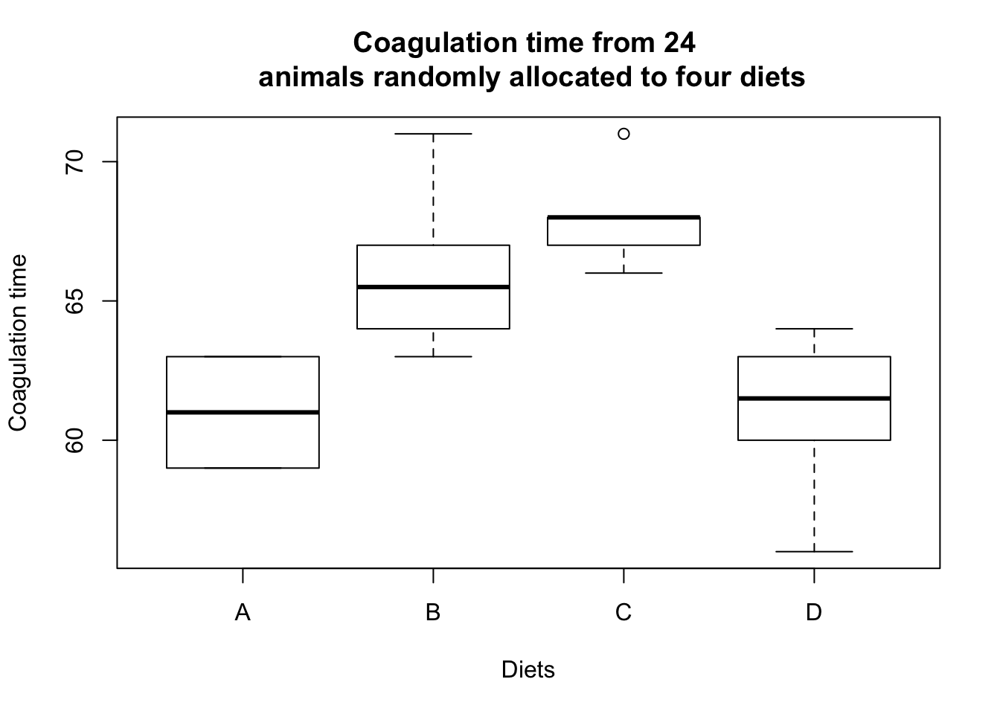
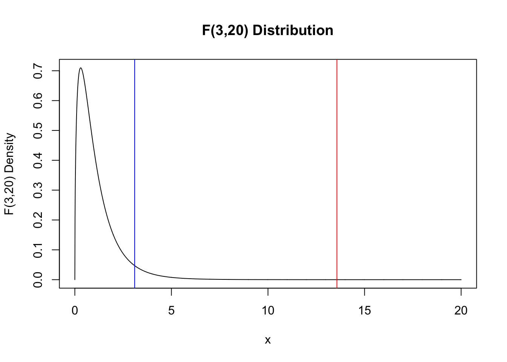
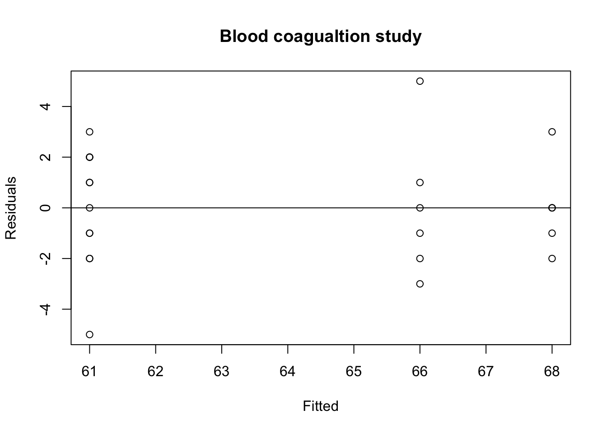
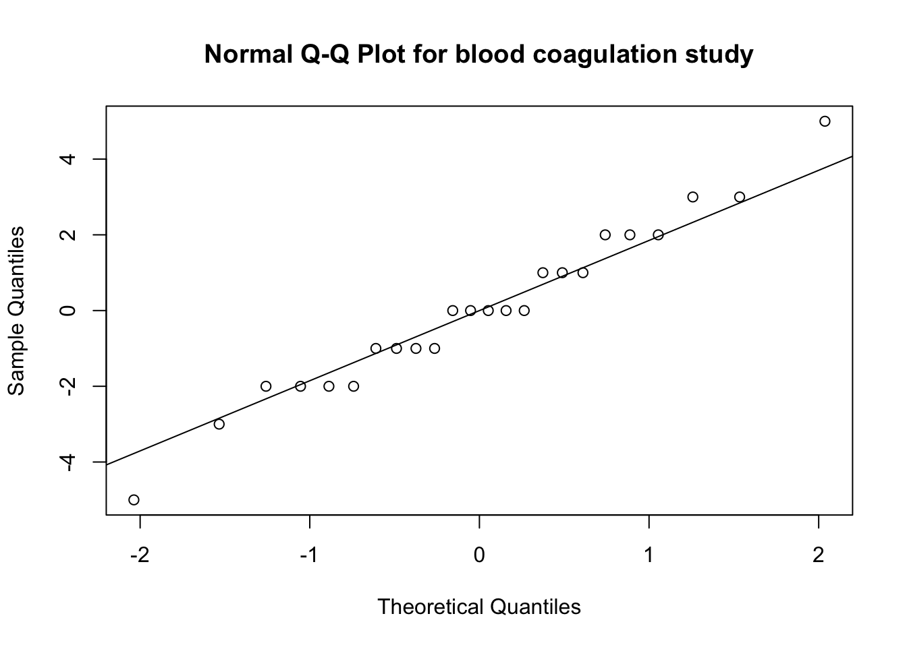
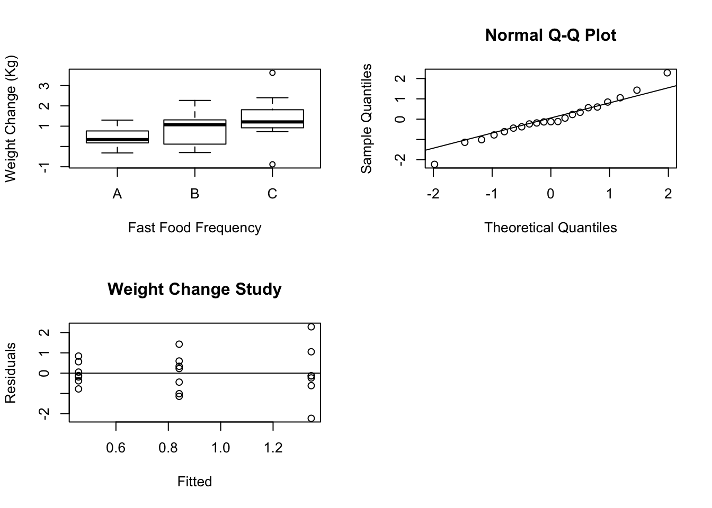
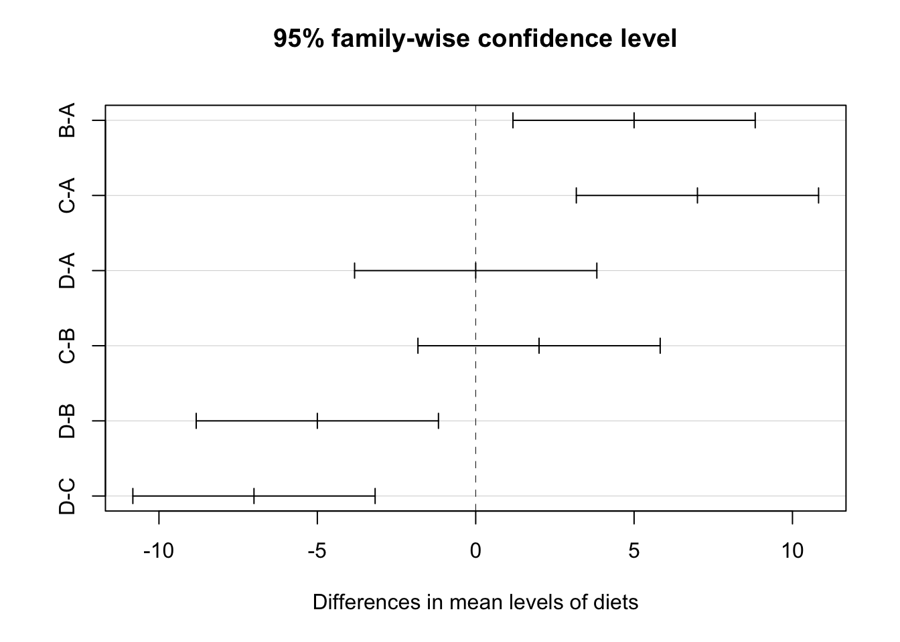
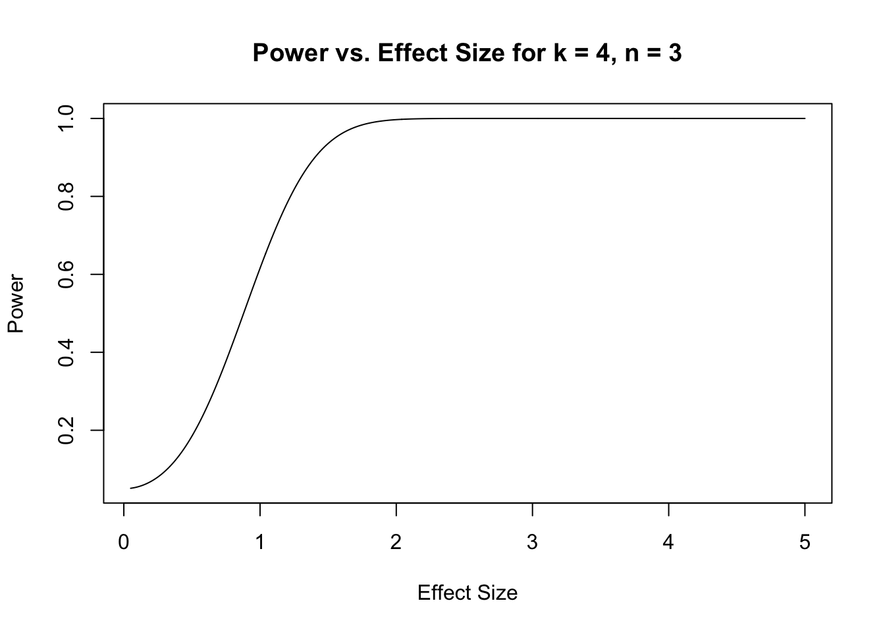
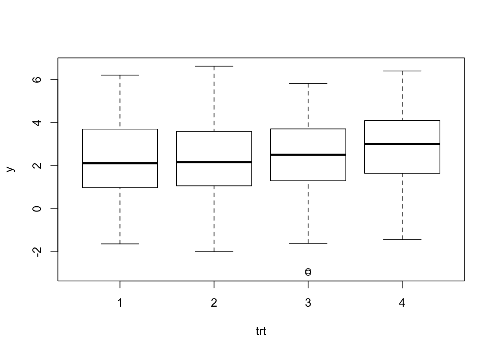

# Completely Randomized Designs: Comparing More Than Two Treatments

## ANOVA - Comparing more than two groups

The following example is taken from Chapter 4 @bhh2005. The table below gives coagulation times for blood samples drawn from 24 animals receiving four different diets A, B, C, and D.


<table>
 <thead>
  <tr>
   <th style="text-align:left;">   </th>
   <th style="text-align:right;"> A </th>
   <th style="text-align:right;"> B </th>
   <th style="text-align:right;"> C </th>
   <th style="text-align:right;"> D </th>
  </tr>
 </thead>
<tbody>
  <tr>
   <td style="text-align:left;">  </td>
   <td style="text-align:right;"> 60 </td>
   <td style="text-align:right;"> 65 </td>
   <td style="text-align:right;"> 71 </td>
   <td style="text-align:right;"> 62 </td>
  </tr>
  <tr>
   <td style="text-align:left;">  </td>
   <td style="text-align:right;"> 63 </td>
   <td style="text-align:right;"> 66 </td>
   <td style="text-align:right;"> 66 </td>
   <td style="text-align:right;"> 60 </td>
  </tr>
  <tr>
   <td style="text-align:left;">  </td>
   <td style="text-align:right;"> 59 </td>
   <td style="text-align:right;"> 67 </td>
   <td style="text-align:right;"> 68 </td>
   <td style="text-align:right;"> 61 </td>
  </tr>
  <tr>
   <td style="text-align:left;">  </td>
   <td style="text-align:right;"> 63 </td>
   <td style="text-align:right;"> 63 </td>
   <td style="text-align:right;"> 68 </td>
   <td style="text-align:right;"> 64 </td>
  </tr>
  <tr>
   <td style="text-align:left;">  </td>
   <td style="text-align:right;"> 62 </td>
   <td style="text-align:right;"> 64 </td>
   <td style="text-align:right;"> 67 </td>
   <td style="text-align:right;"> 63 </td>
  </tr>
  <tr>
   <td style="text-align:left;">  </td>
   <td style="text-align:right;"> 59 </td>
   <td style="text-align:right;"> 71 </td>
   <td style="text-align:right;"> 68 </td>
   <td style="text-align:right;"> 56 </td>
  </tr>
  <tr>
   <td style="text-align:left;"> Treatment Average </td>
   <td style="text-align:right;"> 61 </td>
   <td style="text-align:right;"> 66 </td>
   <td style="text-align:right;"> 68 </td>
   <td style="text-align:right;"> 61 </td>
  </tr>
  <tr>
   <td style="text-align:left;"> Grand Average </td>
   <td style="text-align:right;"> 64 </td>
   <td style="text-align:right;"> 64 </td>
   <td style="text-align:right;"> 64 </td>
   <td style="text-align:right;"> 64 </td>
  </tr>
  <tr>
   <td style="text-align:left;"> Difference </td>
   <td style="text-align:right;"> -3 </td>
   <td style="text-align:right;"> 2 </td>
   <td style="text-align:right;"> 4 </td>
   <td style="text-align:right;"> -3 </td>
  </tr>
</tbody>
</table>


Boxplots of the data are shown below.


```r
boxplot(y~diets,data = tab0401,xlab = "Diets",
        ylab = "Coagulation time",
        main = "Coagulation time from 24 \n animals randomly allocated to four diets")
```




**Question:** Is there evidence to indicate a difference in mean coagulation times for the four different diets?

An idea due to Fisher is to compare the variation in mean coagulation times *between* the diets to the variation of coagulation times *within* a diet. These two measures of variation are often summarized in an analysis of variance (ANOVA) table.   


## Analysis of Variance (ANOVA) table

The between treatments variation and within treatment variation are two components of the total variation in the response.

In the coagulation study data we can break up each observation's deviation from the grand mean into two components: treatment deviations; and residuals within treatment deviations.

$$y_{ij}-{\bar y}_{\cdot \cdot}=\left(y_{i \cdot}-{\bar y}_{\cdot \cdot}\right)+\left(y_{ij}-{\bar y}_{i \cdot}\right)$$

Let $y_{ij}$ be the $jth$ observation taken under treatment $i = 1,...,a$. $$E(y_{ij})=\mu_i=\mu+\tau_i,$$ and $Var(y_{ij})=\sigma^2$ and the observations are mutually independent.  The parameter $\tau_i$ is the $ith$ treatment effect. 

We are interested in testing if the $a$ treatment means are equal.

$$H_0: \mu_1=\cdots=\mu_a \hspace{0.5cm}\text{vs.}\hspace{0.5cm}  H_1: \mu_i \ne \mu_j, \thinspace i \ne j.$$ 

There will be $n$ observations under the $ith$ treatment.

$$ y_{i\cdot}=\sum_{j = 1}^n y_{ij}, \hspace{1cm} {\bar y}_{i\cdot}=y_{i\cdot}/n,$$

$$ y_{\cdot \cdot}=\sum_{i = 1}^a \sum_{j = 1}^n y_{ij}, \hspace{1cm} {\bar y}_{\cdot \cdot}=y_{\cdot \cdot}/N,$$

where $N = an$ is the total number of observations.  The "dot"  subscript notation means sum over the subscript that it replaces.
 
## The ANOVA identity

The total sum of squares $SS_{T}= \sum_{i = 1}^a \sum_{j = 1}^n \left(y_{ij}- {\bar y}_{\cdot \cdot}\right)^2$ can be written as

$$ \sum_{i = 1}^a \sum_{j = 1}^n \left[({\bar y}_{i\cdot} - {\bar y}_{\cdot \cdot}) + (y_{ij}- {\bar y}_{i \cdot})\right]^2$$
 
by adding and subtracting ${\bar y}_{i\cdot}$ to $SS_T$.  


It can be shown that 

$$ \begin{aligned}
SS_T = \sum_{i = 1}^a \sum_{j = 1}^n \left(y_{ij}-{\bar y}_{\cdot \cdot}\right)^2 &= \underbrace{n\sum_{i = 1}^a \left(\bar{y_{i \cdot}}-{\bar y}_{\cdot \cdot}\right)^2}_{\text{Sum of Squares Due to Treatment}} + \underbrace{\sum_{i = 1}^a \sum_{j = 1}^n \left(y_{ij}-{\bar y}_{i \cdot} \right)^2}_{\text{Sum of Squares Due to Error}} \label{eq1} \\
   &= SS_{Treat} + SS_E.
\end{aligned}$$

This is sometimes called the analysis of variance identity.  It shows how the total sum of squares can be split into two sum of squares: one part that is due to differences between treatments; and one part due to differences within treatments.

For example, the decomposition of the first observation $y_{11}=60$ in diet A is 

$$\begin{aligned}
y_{11}-{\bar y}_{\cdot \cdot}&=\left(y_{1 \cdot}-{\bar y}_{\cdot \cdot}\right)+\left(y_{11}-{\bar y}_{1 \cdot}\right) \\
60-64&=(61-64)+(60-61)\\
-4 &=-3+-1
\end{aligned}$$


### Example - Blood coagulation study

The deviations from the grand average $\left(y_{ij}-{\bar y}_{\cdot \cdot}\right)$  are in the table below:


```
  A  B C  D
 -4  1 7 -2
 -1  2 2 -4
 -5  3 4 -3
 -1 -1 4  0
 -2  0 3 -1
 -5  7 4 -8
```

The total sum of squares is obtained by squaring all the entries in this table and summing:  $SS_T=(-4)^2+(-1)^2 + \cdots + (-8)^2=$ 340.

The between treatment deviations $\left(y_{i \cdot}-{\bar y}_{\cdot \cdot}\right)$ are in the table below:


```
  A B C  D
 -3 2 4 -3
 -3 2 4 -3
 -3 2 4 -3
 -3 2 4 -3
 -3 2 4 -3
 -3 2 4 -3
```

The sum of squares due to treatment is obtained by squaring all the entries in this table and summing: $SS_{Treat} = (-3)^2 + (2)^2 + \cdots +(-3)^2=$ 228.

The within treatment deviations $\left(y_{ij}-{\bar y}_{i \cdot} \right)$ are in the table below:


```
  A  B  C  D
 -1 -1  3  1
  2  0 -2 -1
 -2  1  0  0
  2 -3  0  3
  1 -2 -1  2
 -2  5  0 -5
```

The sum of squares due to error $\left(y_{ij}-{\bar y}_{i \cdot} \right)$ is obtained by squaring the entries in this table and summing:  $SS_E=(-1)^2+(2)^2+\cdots+(-5)^2=$ 112. 

$$\underbrace{340}_{SS_T} =\underbrace{228}_{SS_{Treat}}+\underbrace{112}_{SS_E}.$$

Which illustrates the ANOVA identity for the blood coagulation study.

The deviations 

- $SS_{Treat}$ is called the sum of squares due to treatments (i.e., between treatments), and $SS_E$ is called the sum of squares due to error (i.e., within treatments).
- There are $an = N$ total observations.  So $SS_T$ has $N-1$ degrees of freedom.
- There are $a$ treatment levels so $SS_{Treat}$ has $a-1$ degrees of freedom.
- Within each treatment there are $n$ replicates with $n-1$ degrees of freedom.  There are $a$ treatments.  So, there are $a(n-1)=an-a = N-a$ degrees of freedom for error. 
 
$$SS_E= \sum_{i = 1}^a \left[\sum_{j = 1}^n \left(y_{ij}-{\bar y}_{i \cdot} \right)^2\right]$$

If the term inside the brackets is divided by $n-1$ then it is the sample variance for the $ith$ treatment

$$S_i^2=\frac{\sum_{j = 1}^n \left(y_{ij}-{\bar y}_{i \cdot} \right)^2}{n-1}, \hspace{1cm} 1 = 1,...,a.$$

Combining these $a$ variances to give a single estimate of the common population variance

$$\frac{(n-1)S_1^2+ \cdots + (n-1)S_a^2}{(n-1)+ \cdots + (n-1)}=\frac{SS_E}{N-a}.$$

Thus, $SS_E$ is a pooled estimate of the common variance $\sigma^2$ within each of the $a$ treatments.

If there were no differences between the $a$ treatment means ${\bar y}_{i \cdot}$ we could use the variation of the treatment averages from the grand average to estimate $\sigma^2$.

$$\frac{SS_{Treat}}{a-1}$$

is an estimate of $\sigma^2$ when the treatment means are all equal.
 
The analysis of variance identity gives two estimates of $\sigma^2$.  One is based on the variability within treatments and one based on the variability between treatments.  If there are no differences in the treatment means then these two estimates should be similar.  If these estimates are different then this could be evidence that the difference is due to differences in the treatment means. 

The mean square for treatment is defined as

$$MS_{Treat}=\frac{SS_{Treat}}{a-1}$$

and the mean square for error is defined as

$$MS_E=\frac{SS_E}{N-a}.$$

$SS_{Treat}$ and $SS_E$ are independent and it can be shown that $SS_{Treat}/\sigma^2 \sim \chi^2_{a-1}$ and $SS_E/\sigma^2 \sim \chi^2_{N-a}$.  Thus, if $H_0:  \mu_1=\cdots=\mu_a$ is true then the ratio

$$ F= \frac{MS_{Treat}}{MS_E} \sim F_{a-1,N-a}.$$


The ANOVA table for the coagulation data can be calculated in R.


```r
aov.diets <- aov(y~diets,data = tab0401)
summary(aov.diets)
```

```
            Df Sum Sq Mean Sq F value   Pr(>F)    
diets        3    228    76.0   13.57 4.66e-05 ***
Residuals   20    112     5.6                     
---
Signif. codes:  0 '***' 0.001 '**' 0.01 '*' 0.05 '.' 0.1 ' ' 1
```

In this example $a-1 = 3, N-a = 20, SS_{Treat}=228, SS_E = 112, MS_{Treat}=228/3 = 76.0,MS_E112/20 = 5.6, F = 76/5.6 = 13.57.$

The observed $F$ value of 13.57 is shown on the $F_{3,20}$ distribution.  The p-value of the test is the area under the density to the right of 13.57 (red line).  The 95% critical value of the $F_{3,20}$ is 3.10 (blue line).  In other words, $P(F_{3,20}>3.10)=0.05$.


```r
x <-seq(0,20,by = 0.01)
plot(x,df(x = x,df1 = 3,df2 = 20),type = "l",ylab = "F(3,20) Density",main = "F(3,20) Distribution")
abline(v = 13.57,col = "red")
abline(v = qf(p = 0.95,3,20),col = "blue")
```




The p-value could also be calculated directly using the cdf of the $F_{3,20}$ distribution.


```r
1-pf(q = 13.57,df1 = 3,df2 = 20)
```

```
[1] 4.66169e-05
```

The small p-value indicates that the difference between at least one pair of the treatment means is significantly different from 0.


## General ANOVA

The general form of the ANOVA table is

Source of variation | Degrees of freedom | Sum of squares | Mean square | F
--------------------|--------------------|----------------|-------------|--
Between treatments  | $a-1$              | $SS_{Treat}$   | $MS_{Treat}$|
Within treatments   | $N-a$              | $SS_E$         | $MS_E$      | $F=\frac{MS_{Treat}}{MS_E}$

## ANOVA Assumptions

The calculations that make up an ANOVA table require no assumptions. You could write 24 numbers in the ANOVA table and complete the table using the ANOVA identity and definitions of mean square and F statistic. However, using these numbers to make inferences about differences in treatment means will require certain assumptions.


1. Additive model.

$$y_{ij}=\mu+\tau_i+\epsilon_{ij}.$$

The parameters $\tau_i$ are interpreted as the treatment effect of the $i^{th}$ mean.  That is, if $\mu_i$ is the mean of $i^{th}$ group and $\mu$ is the overall mean then $\tau_i=\mu_i-\mu$.


2.  Under the assumption that the errors $\epsilon_{ij}$ are independent and identically distributed (iid) with common variance $Var(\epsilon_{ij})=\sigma^2$, for all $i,j$ then

$$E(MS_{Treat})=\sum_{i = 1}^a \tau_i^2 + \sigma^2, \hspace{1cm} E(MS_E)=\sigma^2.$$

If there are no differences between the treatment means then $\tau_1=\cdots=\tau_4 = 0$ and $\sum_{i = 1}^a \tau_i^2 = 0$ then both $MS_{treat}$ and $MS_E$ would be estimates $\sigma^2$.


3. If $\epsilon_{ij} \sim N(0,\sigma^2)$ then $MS_{Treat}$ and $MS_E$ are independent.  Under the null hypothesis that $\sum_{i = 1}^a \tau_i^2 = 0$ the ratio $F=\frac{MS_{Treat}}{MS_E}$ is the ratio of two independent estimates of $\sigma^2$.  Therefore, $\frac{MS_{Treat}}{MS_E} \sim F_{a-1,N-a}.$

### Example - checking the assumptions in the blood coagualtion study

1. The additive model assumption seems plausible since the observations from each diet can be viewed as the sum of a common mean plus a random error term.

2. The common variance assumption can be investigated by plotting the residuals versus the fitted values of the ANOVA model.  A plot of the residuals versus fitted values can be used to investigate the assumption that the residuals are randomly distributed and have constant variance. Ideally, the points should fall randomly on both sides of 0, with no recognizable patterns in the points.In the R this can be done using the following commands.


```r
plot(aov.diets$fitted.values,aov.diets$residuals,ylab = "Residuals",
     xlab = "Fitted",main = "Blood coagualtion study")
abline(h = 0)
```



The assumption of constant variance is satisfied for the blood coagulation study.

3. The normality of the residuals can be investigated using a normal quantile-quantile plot.


```r
qqnorm(aov.diets$residuals, main = "Normal Q-Q Plot for blood coagulation study")
qqline(aov.diets$residuals)
```



The normality assumptions is satisfied.


## Coding Qualitative Predictors in Regression Models

A dummy or indicator variable in a regression takes on a finite number of values so that different categories of a nominal variable can be identified. The term dummy reflects the fact that the values taken on by such variables (e.g., 0, 1, -1) do not indicate meaningful measurements but rather categories of interest. (Kleinbaum et al., 1998)

Examples of dummy variables are:

$$X =
\left\{
	\begin{array}{ll}
		1  & \mbox{if treatment A } \\
		0 & \mbox{otherwise}
	\end{array}
\right.$$

$$Y =
\left\{
	\begin{array}{ll}
		1  & \mbox{if subject is male } \\
	 -1 & \mbox{if subject is female}
	\end{array}
\right.$$

The variables $X$ and $Y$ are nominal variables describing treatment group and sex respectively.  

The following rule should be applied to avoid collinearity in defining a dummy variable for regression analysis: if the nominal independent variable of interest has $k$ categories then exactly $k-1$ dummy variables should be defined to index the categories if the regression model contains an intercept term.

### Dummy Coding

Dummy coding compares each level to the reference level.  The intercept is the mean of the reference group.

Smarties is a candy that comes in several different colours such as yellow, purple, green, and pink. Suppose that we would like to compare the mean number of candy colours in each box.  The data from 3 smarties boxes are below.


```r
count <- c(4,3,4,3,1,4,2,5,1,1,2,4)
colour <- as.factor(c(rep("Yellow",3),rep("Purple",3),
                      rep("Green",3),rep("Pink",3)))
```


colour    count
-------  ------
Yellow        4
Yellow        3
Yellow        4
Purple        3
Purple        1
Purple        4
Green         2
Green         5
Green         1
Pink          1
Pink          2
Pink          4

The average number of candies in each colour is:


```r
#Get means for each flavour
sapply(split(count,colour),mean)
```

```
   Green     Pink   Purple   Yellow 
2.666667 2.333333 2.666667 3.666667 
```

Dummy coding is the default in R and the most common coding scheme.  It compares each level of the categorical variable to a fixed reference level. 


```r
contrasts(colour) <- contr.treatment(4)
contrasts(colour)  # print dummy coding - base is Green
```

```
       2 3 4
Green  0 0 0
Pink   1 0 0
Purple 0 1 0
Yellow 0 0 1
```

Green is the reference category.  The first column compares Pink to Green, the second column compares Purple to Green, and the third column compares Yellow to Green.  The the three columns define three dummy variables:

$$X_1 =
\left\{
	\begin{array}{ll}
		1  & \mbox{if smartie is pink } \\
		0 & \mbox{otherwise}
	\end{array}
\right.$$

$$X_2 =
\left\{
	\begin{array}{ll}
		1  & \mbox{if smartie is purple } \\
		0 & \mbox{otherwise}
	\end{array}
\right.$$

$$X_3 =
\left\{
	\begin{array}{ll}
		1  & \mbox{if smartie is yellow } \\
		0 & \mbox{otherwise}
	\end{array}
\right.$$

If $X_1 = X_2 = X_3 = 0$ then the colour of the smartie is green - the reference category.  This shows that we only require 3 dummy variables to define a nominal variable with 4 categories.

To change the reference level change the value of base in `contr.treatment()`.


```r
contrasts(colour) <- contr.treatment(4,base = 2) # Now reference is pink
contrasts(colour)  
```

```
       1 3 4
Green  1 0 0
Pink   0 0 0
Purple 0 1 0
Yellow 0 0 1
```

```r
contrasts(colour) <- contr.treatment(4,base = 3) # Now reference is purple
contrasts(colour)  
```

```
       1 2 4
Green  1 0 0
Pink   0 1 0
Purple 0 0 0
Yellow 0 0 1
```

```r
contrasts(colour) <- contr.treatment(4,base = 4) # Now reference is yellow
contrasts(colour)  
```

```
       1 2 3
Green  1 0 0
Pink   0 1 0
Purple 0 0 1
Yellow 0 0 0
```


### Deviation Coding

This coding system compares the mean of the dependent variable for a given level to the overall mean of the dependent variable.  Consider the dummy variables

The the three columns define three dummy variables:

$$X_1 =
\left\{
	\begin{array}{ll}
		1  & \mbox{if smartie is green } \\
		-1 & \mbox{if smartie is yellow} \\
		0 & \mbox{otherwise}
	\end{array}
\right.$$

$$X_2 =
\left\{
	\begin{array}{ll}
		1  & \mbox{if smartie is pink } \\
		-1 & \mbox{if smartie is yellow} \\
		0 & \mbox{otherwise}
	\end{array}
\right.$$

$$X_3 =
\left\{
	\begin{array}{ll}
		1  & \mbox{if smartie is purple } \\
		-1 & \mbox{if smartie is yellow} \\
		0 & \mbox{otherwise}
	\end{array}
\right.$$

1 is used to compare a level to all other levels and -1 is assigned to yellow because it's the level that will never be compared to the other levels.

In R the variables can be created using the `contr.sum()` function.  The argument of 4 in `contr.sum(4)` indicates the number of levels of the factor.


```r
contrasts(colour) <- contr.sum(4)
contrasts(colour)  
```

```
       [,1] [,2] [,3]
Green     1    0    0
Pink      0    1    0
Purple    0    0    1
Yellow   -1   -1   -1
```

## Estimating Treatment Effects using Least Squares 

Let $y_{ij}$ be the $j^{th}$ observation under the $i^{th}$ treatment, and $\mu$ be the overall mean.  The model for diet $$y_{ij}=\mu+\tau_i+\epsilon_{ij}$$, $\epsilon_{ij} \sim N(0,\sigma^2)$$ can be written in terms of the dummy variables $X_1, X_2, X_3$ as:

$$ y_{ij}=\mu+\tau_1X_{i1}+\tau_2X_{i2}+\tau_3X_{i3}+\epsilon_{ij},$$

where,  

$$X_{1j} =
\left\{
	\begin{array}{ll}
		1  & \mbox{if jth unit recieves diet 2 } \\
		0 & \mbox{otherwise}
	\end{array}
\right.$$

$$X_{2j} =
\left\{
	\begin{array}{ll}
		1  & \mbox{if jth unit recieves diet 3 } \\
		0 & \mbox{otherwise}
	\end{array}
\right.$$

$$X_{3j} =
\left\{
	\begin{array}{ll}
		1  & \mbox{if jth unit recieves diet 4 } \\
		0 & \mbox{otherwise}
	\end{array}
\right.$$

It follows that $E(y_{Aj})=\mu_A=\mu$ is the mean of diet A so 

$$\begin{aligned}
E(y_{Bj})=\mu_B=\mu_A+\tau_1 &\Rightarrow \tau_1=\mu_B-\mu_A \\ 
E(y_{Cj})=\mu_C=\mu_A+\tau_2 &\Rightarrow \tau_2=\mu_C-\mu_A \\ 
E(y_{Dj})=\mu_D=\mu_A+\tau_3 &\Rightarrow \tau_3=\mu_D-\mu_A   
\end{aligned}$$


The least squares estimates are: 

$$\begin{aligned}
{\hat \mu}&={\bar y}_{1 \cdot}, \\
{\hat \tau_1}&={\bar y}_{2 \cdot}-{\bar y}_{1 \cdot}, \\
{\hat \tau_2}&={\bar y}_{3 \cdot }-{\bar y}_{1 \cdot}, \\
{\hat \tau_3}&={\bar y}_{3 \cdot }-{\bar y}_{1 \cdot}.
\end{aligned}$$

This model can also be written in matrix notation $y = X\beta+\epsilon$, where $\beta=\left(\mu,\tau_1,\tau_2,\tau3 \right), X=({\bf 1},X_{i1},X_{i2},X_{i3})$, and $\epsilon=(\epsilon_{ij})$. $X$ is an $30 \times 4$ design matrix with ${\bf 1}$ is a $30\times 1$ column vector of 1s, and $\epsilon$ is an $30 \times 1$ column vector.  Note that $\tau_4$ corresponding to the 4th treatment is implicitly set to 0.  It is used as a constraint so that that $(X'X)^{-1}$ exists.


## Using the `lm()` Function in R to Estimate Treatment Effects 

Let's return to the blood coagulation study. The table below gives coagulation times for blood samples drawn from 24 animals receiving four different diets A, B, C, and D.


<table>
 <thead>
  <tr>
   <th style="text-align:left;">   </th>
   <th style="text-align:right;"> A </th>
   <th style="text-align:right;"> B </th>
   <th style="text-align:right;"> C </th>
   <th style="text-align:right;"> D </th>
  </tr>
 </thead>
<tbody>
  <tr>
   <td style="text-align:left;">  </td>
   <td style="text-align:right;"> 60 </td>
   <td style="text-align:right;"> 65 </td>
   <td style="text-align:right;"> 71 </td>
   <td style="text-align:right;"> 62 </td>
  </tr>
  <tr>
   <td style="text-align:left;">  </td>
   <td style="text-align:right;"> 63 </td>
   <td style="text-align:right;"> 66 </td>
   <td style="text-align:right;"> 66 </td>
   <td style="text-align:right;"> 60 </td>
  </tr>
  <tr>
   <td style="text-align:left;">  </td>
   <td style="text-align:right;"> 59 </td>
   <td style="text-align:right;"> 67 </td>
   <td style="text-align:right;"> 68 </td>
   <td style="text-align:right;"> 61 </td>
  </tr>
  <tr>
   <td style="text-align:left;">  </td>
   <td style="text-align:right;"> 63 </td>
   <td style="text-align:right;"> 63 </td>
   <td style="text-align:right;"> 68 </td>
   <td style="text-align:right;"> 64 </td>
  </tr>
  <tr>
   <td style="text-align:left;">  </td>
   <td style="text-align:right;"> 62 </td>
   <td style="text-align:right;"> 64 </td>
   <td style="text-align:right;"> 67 </td>
   <td style="text-align:right;"> 63 </td>
  </tr>
  <tr>
   <td style="text-align:left;">  </td>
   <td style="text-align:right;"> 59 </td>
   <td style="text-align:right;"> 71 </td>
   <td style="text-align:right;"> 68 </td>
   <td style="text-align:right;"> 56 </td>
  </tr>
  <tr>
   <td style="text-align:left;"> Treatment Average </td>
   <td style="text-align:right;"> 61 </td>
   <td style="text-align:right;"> 66 </td>
   <td style="text-align:right;"> 68 </td>
   <td style="text-align:right;"> 61 </td>
  </tr>
  <tr>
   <td style="text-align:left;"> Grand Average </td>
   <td style="text-align:right;"> 64 </td>
   <td style="text-align:right;"> 64 </td>
   <td style="text-align:right;"> 64 </td>
   <td style="text-align:right;"> 64 </td>
  </tr>
  <tr>
   <td style="text-align:left;"> Difference </td>
   <td style="text-align:right;"> -3 </td>
   <td style="text-align:right;"> 2 </td>
   <td style="text-align:right;"> 4 </td>
   <td style="text-align:right;"> -3 </td>
  </tr>
</tbody>
</table>


```r
attach(tab0401)
contrasts(diets)
```

```
  B C D
A 0 0 0
B 1 0 0
C 0 1 0
D 0 0 1
```

```r
lm.diets <- lm(y~diets,data = tab0401)
summary(lm.diets)
```

```

Call:
lm(formula = y ~ diets, data = tab0401)

Residuals:
   Min     1Q Median     3Q    Max 
 -5.00  -1.25   0.00   1.25   5.00 

Coefficients:
              Estimate Std. Error t value Pr(>|t|)    
(Intercept)  6.100e+01  9.661e-01  63.141  < 2e-16 ***
dietsB       5.000e+00  1.366e+00   3.660  0.00156 ** 
dietsC       7.000e+00  1.366e+00   5.123 5.18e-05 ***
dietsD      -9.999e-15  1.366e+00   0.000  1.00000    
---
Signif. codes:  0 '***' 0.001 '**' 0.01 '*' 0.05 '.' 0.1 ' ' 1

Residual standard error: 2.366 on 20 degrees of freedom
Multiple R-squared:  0.6706,	Adjusted R-squared:  0.6212 
F-statistic: 13.57 on 3 and 20 DF,  p-value: 4.658e-05
```

The design matrix is


```r
model.matrix(lm.diets)
```

```
   (Intercept) dietsB dietsC dietsD
1            1      0      0      0
2            1      0      0      0
3            1      0      0      0
4            1      0      0      0
5            1      0      0      0
6            1      0      0      0
7            1      1      0      0
8            1      1      0      0
9            1      1      0      0
10           1      1      0      0
11           1      1      0      0
12           1      1      0      0
13           1      0      1      0
14           1      0      1      0
15           1      0      1      0
16           1      0      1      0
17           1      0      1      0
18           1      0      1      0
19           1      0      0      1
20           1      0      0      1
21           1      0      0      1
22           1      0      0      1
23           1      0      0      1
24           1      0      0      1
attr(,"assign")
[1] 0 1 1 1
attr(,"contrasts")
attr(,"contrasts")$diets
[1] "contr.treatment"
```

The default dummy coding was used.

The averages for each of the four diets are in the table below.

Diet | A ($j = 1$) | B ($j = 2$) | C ($j = 3$) | D ($j = 4$)
-----|---|---|---|---
Average (${\bar y}_{j \cdot})$| 61 | 66 | 68| 61|


So we can verify that the least-squares estimates are differences of the treatment averages.

$$\begin{aligned}
{\bar y}_{1 \cdot}&=61, \\ 
{\hat \tau_1}&={\bar y}_{2 \cdot}-{\bar y}_{1 \cdot}=5 \\ 
{\hat \tau_2}&={\bar y}_{3 \cdot }-{\bar y}_{1 \cdot}=7 \\ 
{\hat \tau_3}&={\bar y}_{3 \cdot }-{\bar y}_{1 \cdot}=-9.9 \times 10^{-15}.
\end{aligned}$$

If deviation coding was used then the parameter estimates would represent different treatment effects.  In the regression model the dummy variables would be defined as 

$$X_1 =
\left\{
	\begin{array}{ll}
		1  & \mbox{if diet is A } \\
		-1 & \mbox{if diet is D} \\
		0 & \mbox{otherwise}
	\end{array}
\right.$$

$$X_2 =
\left\{
	\begin{array}{ll}
		1  & \mbox{if diet is B } \\
		-1 & \mbox{if diet is D} \\
		0 & \mbox{otherwise}
	\end{array}
\right.$$

$$X_3 =
\left\{
	\begin{array}{ll}
		1  & \mbox{if diet is C } \\
		-1 & \mbox{if diet is D} \\
		0 & \mbox{otherwise}
	\end{array}
\right.$$


It follows that 

$$\begin{aligned}
E(y_{Aj})&=\mu_A=\tau_0+\tau_1 \\
E(y_{Bj})&=\mu_B=\tau_0+\tau_2 \\
E(y_{Cj})&=\mu_C=\tau_0+\tau_3 \\
E(y_{Dj})&=\mu_D=\tau_0-\tau_1-\tau_2-\tau_3
\end{aligned}$$

So,

$$\begin{aligned}
\tau_0 &= \frac{\mu_A+\mu_B+\mu_C+\mu_D}{4} \\
\tau_1 &= \mu_A - \frac{\mu_A+\mu_B+\mu_C+\mu_D}{4} \\
\tau_2 &= \mu_B - \frac{\mu_A+\mu_B+\mu_C+\mu_D}{4} \\
\tau_3 &= \mu_C - \frac{\mu_A+\mu_B+\mu_C+\mu_D}{4} \\
\end{aligned}$$


```r
contrasts(tab0401$diets) <- contr.sum(4)
lm.diets <- lm(y~diets,data = tab0401)
summary(lm.diets)
```

```

Call:
lm(formula = y ~ diets, data = tab0401)

Residuals:
   Min     1Q Median     3Q    Max 
 -5.00  -1.25   0.00   1.25   5.00 

Coefficients:
            Estimate Std. Error t value Pr(>|t|)    
(Intercept)  64.0000     0.4830 132.493  < 2e-16 ***
diets1       -3.0000     0.8367  -3.586 0.001849 ** 
diets2        2.0000     0.8367   2.390 0.026781 *  
diets3        4.0000     0.8367   4.781 0.000114 ***
---
Signif. codes:  0 '***' 0.001 '**' 0.01 '*' 0.05 '.' 0.1 ' ' 1

Residual standard error: 2.366 on 20 degrees of freedom
Multiple R-squared:  0.6706,	Adjusted R-squared:  0.6212 
F-statistic: 13.57 on 3 and 20 DF,  p-value: 4.658e-05
```

The estimate of the intercept $\hat \tau_0$ is the grand average, and the slope estimates $\hat{\tau_1}, \hat{\tau_2}, \hat{\tau_3}$ are the differences between the treatment averages and grand average for diets A, B, C, D.

## Questions-1

1. Let $\mu_{A}, \mu_{B},\mu_{C},\mu_{D}$ be the mean coagulation times of diets A, B, C, and D respectively. 

(i)  Formulate a null and alternative hypotheses to compare the mean coagulation times between the four diets.

(ii)  What is the test statistic and P-value of the test in part (a)?

(iii)  Is there a significant difference (at the 1% significance level) between at least two of the diets?

(iv)  What are the statistical assumptions behind:

* The ANOVA table calculations.
* The P-value in the ANOVA table.


2. A clinical trial was conducted where patients were randomized to four different treatments.  The data is available in the file [`q2data.csv`](q2data.csv).  The outcome is a continuous response $y_{ij}$ the response for the $ith$ subject in the $jth$ treatment group.  There are three new treatments in this study and one control treatment.  The control treatment is the third treatment ($j=3$).  The main objective of the study is to compare the three new treatments to the control treatment. 

NB: The file can be read into R and put into a data.frame using the command 


```r
q2data <- read.csv("q2data.csv").
```


In this question use the 5% significance level.

(a)  What are the averages and standard deviations of each treatment?  Plot the distributions of the four treatment groups.  Do the distributions look similar or different? (Hand in your R code and output)


(b)  Use linear regression to calculate the ANOVA table.  What do you conclude from the ANOVA table? (NB: when using linear regresssion to calculate the effects the treatment variable should be specified as a factor `as.factor(trt)`.) (Hand in your R code and output)


(c)  Use the model you obtained in part (b) to obtain the appropriate parameter estimates using the treatment contrast (dummy coding) to answer the main objective.  In R this can be done using the `contr.treatment()` function.  Define the underlying statistical model in terms of dummy variables.  Explictly state the dummy variables.  Interpret the parameter estimates.  Verify the paratemer estimates using the table of means that you obtained in part (a). 


(d)  Obtain the parameter estimates using the Helmert contrast.  In R this can be done using the `contr.helmert(4)` function. Explictly state the dummy variables. Define the underlying statistical model in terms of dummy variables.  Interpret the parameter estimates.  Verify the parameter estimates using the table of means that you obtained in part (a). (Hand in your R code and output)


(e)  Which coding scheme do you think makes more sense for evaluating if there is a significant difference between any of the new treatments and placebo.


3. A study at UofT recruited twenty-one students to complete a thirty minute survey on their diet and eating habits at the end of an academic year.  Students were paid $10 to complete the survey and answer a few questions.  The data below shows their weight gain from September to April classified by the frequency that students ate fast food.  In group A students reported eating fast food once per month; the students in group B reported eating fast food twice per month; and the students in group C reported eating fast food four times per month.

<table class="table" style="width: auto !important; margin-left: auto; margin-right: auto;">
 <thead>
  <tr>
   <th style="text-align:left;">   </th>
   <th style="text-align:right;"> A </th>
   <th style="text-align:right;"> B </th>
   <th style="text-align:right;"> C </th>
  </tr>
 </thead>
<tbody>
  <tr>
   <td style="text-align:left;width: 10em; ">  </td>
   <td style="text-align:right;"> 1.02 </td>
   <td style="text-align:right;"> 1.44 </td>
   <td style="text-align:right;"> 0.73 </td>
  </tr>
  <tr>
   <td style="text-align:left;width: 10em; ">  </td>
   <td style="text-align:right;"> -0.32 </td>
   <td style="text-align:right;"> 0.40 </td>
   <td style="text-align:right;"> 1.11 </td>
  </tr>
  <tr>
   <td style="text-align:left;width: 10em; ">  </td>
   <td style="text-align:right;"> 0.27 </td>
   <td style="text-align:right;"> -0.30 </td>
   <td style="text-align:right;"> 3.63 </td>
  </tr>
  <tr>
   <td style="text-align:left;width: 10em; ">  </td>
   <td style="text-align:right;"> 0.08 </td>
   <td style="text-align:right;"> 2.27 </td>
   <td style="text-align:right;"> -0.88 </td>
  </tr>
  <tr>
   <td style="text-align:left;width: 10em; ">  </td>
   <td style="text-align:right;"> 0.51 </td>
   <td style="text-align:right;"> -0.17 </td>
   <td style="text-align:right;"> 1.21 </td>
  </tr>
  <tr>
   <td style="text-align:left;width: 10em; ">  </td>
   <td style="text-align:right;"> 0.34 </td>
   <td style="text-align:right;"> 1.07 </td>
   <td style="text-align:right;"> 1.22 </td>
  </tr>
  <tr>
   <td style="text-align:left;width: 10em; ">  </td>
   <td style="text-align:right;"> 1.30 </td>
   <td style="text-align:right;"> 1.18 </td>
   <td style="text-align:right;"> 2.40 </td>
  </tr>
  <tr>
   <td style="text-align:left;width: 10em; "> ave </td>
   <td style="text-align:right;"> 0.46 </td>
   <td style="text-align:right;"> 0.84 </td>
   <td style="text-align:right;"> 1.35 </td>
  </tr>
  <tr>
   <td style="text-align:left;width: 10em; "> sd </td>
   <td style="text-align:right;"> 0.55 </td>
   <td style="text-align:right;"> 0.92 </td>
   <td style="text-align:right;"> 1.40 </td>
  </tr>
</tbody>
</table>


The researchers analyzed the data using R.


```r
surveydat <- read.csv("surveydat.csv")
aovsurvey <- aov(wtchange~grp,data=surveydat)
summary(aovsurvey)
```

```
##             Df Sum Sq Mean Sq F value Pr(>F)
## grp          2   2.78   1.390   1.341  0.287
## Residuals   18  18.66   1.037
```

```r
mod1 <- lm(wtchange~grp,data=surveydat)
summary(mod1)$coefficients
```

```
##              Estimate Std. Error   t value  Pr(>|t|)
## (Intercept) 0.4571429  0.3848706 1.1877832 0.2503565
## grpB        0.3842857  0.5442893 0.7060322 0.4892064
## grpC        0.8885714  0.5442893 1.6325353 0.1199371
```

\newpage


```r
par(mfrow = c(2, 2)) # arrange plots in two columns
boxplot(wtchange~grp,data = surveydat,ylab="Weight Change (Kg)", xlab="Fast Food Frequency")
qqnorm(aovsurvey$residuals);qqline(aovsurvey$residuals)
plot(aovsurvey$fitted.values, aovsurvey$residuals,ylab="Residuals", xlab="Fitted",
     main="Weight Change Study"); abline(h=0)
```




(a) Is this study and experiment or observational study?  What are the treatments?  

(b)  Would it have been feasible for the researcher to randomized students to the treatments?  What randomization scheme (assigning the subjects to the treatments) could the researcher use to accomplish the randomization?    

(c) What are the null and alternative hypotheses that the researchers are testing in the ANOVA table?  Is there evidence to reject the null hypothesis?  Explain.

(d) Are the statistical assumptions used to calculate the P-value in the ANOVA table satisfied?  Explain.

(e) Interpret the least squares estimates in `mod1`.  Are you surprised that the P-values for the parameters are not small?  Briefly explain.

(f) The researcher is convinced that the results of the study would have provided strong evidence that eating fast food four times per month causes students to gain weight, if the sample size in each group was larger. Is this a valid statement? Explain.


## Multiple Comparisons

Suppose that experimental units were randomly assigned to three treatment groups.  The hypothesis of interest is:

$$H_0: \mu_1=\mu_2 =\mu_3 \thinspace {\text  vs. } \thinspace H_1: \mu_i \ne\mu_j.$$ 

Now, suppose that we reject $H_0$ at level $\alpha$.  Which pairs of means are significantly different from each other at level $\alpha$?  There are ${3 \choose 2}=3$ possibilities. 

1. $\mu_1 \ne \mu_2$
2. $\mu_1 \ne \mu_3$
3. $\mu_2 \ne \mu_3$

Suppose that $k = 3$ separate (independent) hypothesis level $\alpha$ tests are conducted

$$H_{0_k}: \mu_i=\mu_j  \thinspace {\text  vs. } \thinspace H_{1_k}: \mu_i \ne\mu_j,$$ 

When $H_0$ is true, $P\left(\text{reject } H_0 \right)=\alpha \Rightarrow 1- P\left(\text{do not reject } H_0 \right)=1-\alpha$.  So, if $H_0$ is true then

$$\begin{aligned}
P\left(\text{reject at least one } H_{0_k} \right) &= 1- P\left(\text{do not reject any } H_{0_k} \right) \\
                                               &= 1- P\left(\text{do not reject } H_{0_1} \text{and } \text{do not reject } H_{0_2} \text{and } \text{do not reject } H_{0_3}  \right) \\
                                               &= 1- P\left(\text{do not reject } H_{0_1}\right)P\left(\text{do not reject } H_{0_2}\right)P\left(\text{do not reject } H_{0_3}\right) \hspace{0.3cm} \\
                                               &= 1-(1-\alpha)^{3}
\end{aligned}$$

If $\alpha = 0.05$ then the probability that at least one $H_0$ will be falsely rejected is $1-(1-.05)^3 = 0.14$, which is almost three times the type I error rate.

In general if $$H_0: \mu_1=\mu_2 = \cdots =\mu_k \thinspace {\text  vs. } \thinspace H_1: \mu_i \ne\mu_j.$$ 

If $c$ independent hypotheses are conducted then the probability 

$$P\left(\text{reject at least one } H_{0_k} \right) = 1-(1-\alpha)^c$$

is called the **family-wise error rate**.

The **pairwise error rate** is $P\left(\text{reject } H_{0_k} \right)=\alpha$ for any $c$. 

The multiple comparison problem is that multiple hypotheses are tested level $\alpha$ which increases the probability that at least one of the hypotheses will be falsely rejected (family-wise error rate).  

When groups are significantly different from ANOVA researchers often wish to explore where the differences lie.  Is it appropriate to test for differences looking at all pairwise comparisons?

- Testing all possible pairs increases the type I error rate.
- This means the chance that there is a higher probability,  beyond the pre-stated type I error rate (e.g. 0.05), that that a significant difference is detected when the truth is that no difference exists.


### The Bonferroni Method

To test for the difference between the $ith$ and $jth$ treatments, it is common to use the two-sample $t$ test. The two-sample $t$ statistic is

$$ t_{ij}= \frac{\bar{y_{j \cdot}}-\bar{y_{i \cdot}} } {\hat{\sigma}\sqrt{1/n_j+1/n_i}},$$

where $\bar{y_{j \cdot}}$ is the average of the $n_i$ observations for treatment $j$ and $\hat{\sigma}$ is $\sqrt{MS_E}$ from the ANOVA table.

Treatments $i$ and $j$ are declared significantly different at level $\alpha$ if

$$|t_{ij}|>t_{N-k,\alpha/2},$$

where $t_{N-k,\alpha/2}$ is the upper $\alpha/2$ percentile of a $t_{N-k}$.

The total number of pairs of treatment means that can be tested is $$c={k \choose 2}=\frac{k(k-1)}{2}.$$

The Bonferroni method for testing $H_0:\mu_i=\mu_j$ vs. $H_0:\mu_i \ne \mu_j$ rejects $H_0$ at level $\alpha$ if 

$$|t_{ij}|>t_{N-k,\alpha/2c},$$

where $c$ denotes the number of pairs being tested.

In R the function `pairwise.t.test()` can be used to compute Bonferroni adjusted p-values.  

This is illustrated below for the blood coagulation study.


```r
pairwise.t.test(tab0401$y,tab0401$diets,p.adjust.method = "bonferroni")
```

```

	Pairwise comparisons using t tests with pooled SD 

data:  tab0401$y and tab0401$diets 

  A       B       C      
B 0.00934 -       -      
C 0.00031 0.95266 -      
D 1.00000 0.00934 0.00031

P value adjustment method: bonferroni 
```

There are significant differences at the 5% level between diets A and B, A and C, B and D, and C and D using the Bonferroni method.

For comparison the unadjusted p-values are also calculated.


```r
pairwise.t.test(tab0401$y,tab0401$diets,p.adjust.method = "none")
```

```

	Pairwise comparisons using t tests with pooled SD 

data:  tab0401$y and tab0401$diets 

  A       B      C      
B 0.0016  -      -      
C 5.2e-05 0.1588 -      
D 1.0000  0.0016 5.2e-05

P value adjustment method: none 
```

The significant differences are the same using the unadjusted p-values but the p-values are larger then the p-values adjusted using the Bonferroni method.

A 100$(1-\alpha)$% simultaneous confidence interval for $c$ pairs $\mu_i-\mu_j$ is

$$\bar{y_{j \cdot}}-\bar{y_{i \cdot}} \pm t_{N-k,\alpha/2c}\hat{\sigma}\sqrt{1/n_j+1/n_i}.$$

After identifying which pairs are different, the confidence interval quantifies the range of plausible values for the differences.

The treatment means can be obtained from the table below.

<table>
 <thead>
  <tr>
   <th style="text-align:left;">   </th>
   <th style="text-align:right;"> A </th>
   <th style="text-align:right;"> B </th>
   <th style="text-align:right;"> C </th>
   <th style="text-align:right;"> D </th>
  </tr>
 </thead>
<tbody>
  <tr>
   <td style="text-align:left;">  </td>
   <td style="text-align:right;"> 60 </td>
   <td style="text-align:right;"> 65 </td>
   <td style="text-align:right;"> 71 </td>
   <td style="text-align:right;"> 62 </td>
  </tr>
  <tr>
   <td style="text-align:left;">  </td>
   <td style="text-align:right;"> 63 </td>
   <td style="text-align:right;"> 66 </td>
   <td style="text-align:right;"> 66 </td>
   <td style="text-align:right;"> 60 </td>
  </tr>
  <tr>
   <td style="text-align:left;">  </td>
   <td style="text-align:right;"> 59 </td>
   <td style="text-align:right;"> 67 </td>
   <td style="text-align:right;"> 68 </td>
   <td style="text-align:right;"> 61 </td>
  </tr>
  <tr>
   <td style="text-align:left;">  </td>
   <td style="text-align:right;"> 63 </td>
   <td style="text-align:right;"> 63 </td>
   <td style="text-align:right;"> 68 </td>
   <td style="text-align:right;"> 64 </td>
  </tr>
  <tr>
   <td style="text-align:left;">  </td>
   <td style="text-align:right;"> 62 </td>
   <td style="text-align:right;"> 64 </td>
   <td style="text-align:right;"> 67 </td>
   <td style="text-align:right;"> 63 </td>
  </tr>
  <tr>
   <td style="text-align:left;">  </td>
   <td style="text-align:right;"> 59 </td>
   <td style="text-align:right;"> 71 </td>
   <td style="text-align:right;"> 68 </td>
   <td style="text-align:right;"> 56 </td>
  </tr>
  <tr>
   <td style="text-align:left;"> Treatment Average </td>
   <td style="text-align:right;"> 61 </td>
   <td style="text-align:right;"> 66 </td>
   <td style="text-align:right;"> 68 </td>
   <td style="text-align:right;"> 61 </td>
  </tr>
  <tr>
   <td style="text-align:left;"> Grand Average </td>
   <td style="text-align:right;"> 64 </td>
   <td style="text-align:right;"> 64 </td>
   <td style="text-align:right;"> 64 </td>
   <td style="text-align:right;"> 64 </td>
  </tr>
  <tr>
   <td style="text-align:left;"> Difference </td>
   <td style="text-align:right;"> -3 </td>
   <td style="text-align:right;"> 2 </td>
   <td style="text-align:right;"> 4 </td>
   <td style="text-align:right;"> -3 </td>
  </tr>
</tbody>
</table>

${\hat \sigma}=\sqrt{MS_E}$ can be obtained from the ANOVA table.  


```r
anova(lm(y~diets,data = tab0401))
```

```
Analysis of Variance Table

Response: y
          Df Sum Sq Mean Sq F value    Pr(>F)    
diets      3    228    76.0  13.571 4.658e-05 ***
Residuals 20    112     5.6                      
---
Signif. codes:  0 '***' 0.001 '**' 0.01 '*' 0.05 '.' 0.1 ' ' 1
```

The upper $.05/(2\cdot 6)=0.004$ percentile of the $t_{24-4}$ can be obtained with the t quantile function in R `qt()`.


```r
qt(p = 1-0.004,df = 20)
```

```
[1] 2.945349
```

Plugging in these values to the confidence interval formula we can obtain a Bonferroni adjusted 95% confidence interval for $\mu_B-\mu_A$:

$$ 66-61 \pm 2.95 \sqrt{5.6} \sqrt{1/6+1/6}$$

The lower and upper limits can be calculated in R.


```r
66-61 - qt(p = 1-0.004,df = 20)*sqrt(5.6)*sqrt(1/6+1/6) # lower limit
```

```
[1] 0.9758869
```

```r
66-61 + qt(p = 1-0.004,df = 20)*sqrt(5.6)*sqrt(1/6+1/6) # upper limit
```

```
[1] 9.024113
```

The 95% confidence interval for $\mu_B-\mu_A$ is ( 0.98, 9.02 ).


### The Tukey Method

The only difference between the Tukey and Bonferroni methods is in the choice of the critical value.  

Treatments $i$ and $j$ are declared significantly different at level $\alpha$ if

$$|t_{ij}|>\frac{1}{\sqrt 2} q_{k,N-k,\alpha},$$

where $t_{ij}$ is the observed value of the two-sample t-statistic and $q_{k,N-k,\alpha}$ is the upper $\alpha$ percentile of the Studentized range distribution with parameters $k$ and $N-k$ degrees of freedom.  The CDF and inverse CDF of the Studentized Range Distribution is available in R via the functions `ptukey()` and `qtukey()` respectively.

A 100$(1-\alpha)$% simultaneous confidence interval for $c$ pairs $\mu_i-\mu_j$ is

$$\bar{y_{j \cdot}}-\bar{y_{i \cdot}} \pm \frac{1}{\sqrt 2} q_{k,N-k,\alpha} \hat{\sigma}\sqrt{1/n_j+1/n_i}.$$

The Bonferroni method is more conservative than Tukey's method. In other words, the simultaneous confidence intervals based on the Tukey method are shorter.

In the coagulation study $N = 24, k = 4$ so the 5% critical value of the Studentize range distribution is obtained using the the inverse CDF function `qtukey()` for this distribution. The argument `lower.tail = FALSE` is used so we obtain the upper percentile of the distribution (i.e., the value of $x$ such that $P\left(X>x\right)=0.05$). 


```r
qtukey(.05,4,16,lower.tail = FALSE)
```

```
[1] 4.046093
```

Let's obtain the Tukey p-value and confidence interval for $\mu_B-\mu_A$.  The observed value of the test statistic is 

$$q^{obs}=\sqrt{2}|t_{AB}|,$$

where $$t_{AB}=\frac{\bar{y_{A \cdot}}-\bar{y_{B \cdot}} } {\hat{\sigma}\sqrt{1/n_A+1/n_B}}.$$


```r
(sqrt(2)*(66-61))/(sqrt(5.6)*sqrt(1/6+1/6))
```

```
[1] 5.175492
```

The p-value 

$$P\left(q_{4,20}>q^{obs}\right)$$

is then obtained using the CDF of the Studentized range distribution


```r
1-ptukey(q = sqrt(2)*5/sqrt(2*5.6/6),nmeans = 4,df = 20)
```

```
[1] 0.007797788
```

The 95% limits of the Tukey confidence interval for $\mu_B-\mu_A$ is


```r
5-(1/sqrt(2))*qtukey(p = .05,nmeans = 4,df = 20,lower.tail = FALSE)*sqrt(5.6)*sqrt(1/6+1/6) #lower limit
```

```
[1] 1.175925
```

```r
5+(1/sqrt(2))*qtukey(p = .05,nmeans = 4,df = 20,lower.tail = FALSE)*sqrt(5.6)*sqrt(1/6+1/6) #upper limit
```

```
[1] 8.824075
```

The width of the Tukey confidence interval for $\mu_B-\mu_A$ is


```r
(1/sqrt(2))*qtukey(p = .05,nmeans = 4,df = 20,lower.tail = FALSE)*sqrt(5.6)*sqrt(1/6+1/6)
```

```
[1] 3.824075
```

The width of Bonferroni $\mu_B-\mu_A$ is


```r
qt(p = 1-0.004,df = 20)*sqrt(5.6)*sqrt(1/6+1/6)
```

```
[1] 4.024113
```


This shows that the Tukey confidence interval is shorter than Bonferroni confidence intervals.

The command `TukeyHSD()` can be used to obtain all the Tukey confidence intervals and p-values for an ANOVA.  

Continuing with the blood coagulation study all of the 95% Tukey confidence intervals for the diets are


```r
TukeyHSD(aov(y~diets,data = tab0401))
```

```
  Tukey multiple comparisons of means
    95% family-wise confidence level

Fit: aov(formula = y ~ diets, data = tab0401)

$diets
             diff        lwr       upr     p adj
B-A  5.000000e+00   1.175925  8.824075 0.0077978
C-A  7.000000e+00   3.175925 10.824075 0.0002804
D-A -1.421085e-14  -3.824075  3.824075 1.0000000
C-B  2.000000e+00  -1.824075  5.824075 0.4766005
D-B -5.000000e+00  -8.824075 -1.175925 0.0077978
D-C -7.000000e+00 -10.824075 -3.175925 0.0002804
```

A plot of the 95% confidence intervals can be obtained by using the `plot()` function.


```r
plot(TukeyHSD(aov(y~diets,data = tab0401)))
```




## Sample size for ANOVA - Designing a study to compare more than two treatments 

Consider the hypothesis that k means are equal vs. the alternative that at least two differ. What is the probability that the test rejects if at least two means differ? Power = $1-P({\text{Type II error}})$ is this probability.

The null and alternative hypotheses are:

$$H_0: \mu_1=\mu_2 = \cdots = \mu_k \thinspace {\text  vs. } \thinspace H_1: \mu_i \ne\mu_j.$$ 

The test rejects at level $\alpha$ if

$$MS_{Treat}/MS_E \ge F_{k-1,N-K,\alpha}.$$

The power of the test is

$$ 1- \beta= P\left(MS_{Treat}/MS_E \ge F_{k-1,N-K,\alpha} \right),$$

when $H_0$ is false.  

When $H_0$ is false it can be shown that:

- $MS_{Treat}/\sigma^2$ has a non-central Chi-square distribution with $k-1$ degrees of freedom and non-centrality parameter $\delta$.

- $MS_{Treat}/MS_E$ has a non-central $F$ distribution with the numerator and denominator degrees of freedom $k-1$ and $N-k$ respectively, and non-centrality parameter 

$$\delta = \frac{\sum_{i = 1}^kn_i\left(\mu_i-{\bar \mu} \right)^2}{\sigma^2},$$

where $n_i$ is the number of observations in group $i$, ${\bar \mu}=\sum_{i = 1}^k \mu_i/k$, and $\sigma^2$ is the within group error variance .

This is denoted by $F_{k-1,N-k}(\delta)$.

### Direct calculation of Power using R

- The power of the test is 

$$P\left(F_{k-1,N-k}(\delta) > F_{k-1,N-K,\alpha} \right).$$

- The power is an increasing function $\delta$ 
- The power depends on the true values of the treatment means $\mu_i$, the error variance $\sigma^2$, and sample size $n_i$.
- If the experimenter has some prior idea about the treatment means and error variance the sample size (number of replications) that will guarantee a pre-assigned power of the test.
- The degrees of freedom used in the power function are $k-1$ for the numerator degrees of freedom ($k$ is the number of groups) and $N-k$ for the denominator degrees of freedom, where $N = n_ik$ ($n_i$ is the total number of observations in group $i$) the total number of observations in all the groups.  

#### Example

Suppose that an investigator would like to replicate the blood coagulation study with only 3 animals per diet.  In this case $k = 4, n_i = 3.$  The treatment means from the initial study are:

Diet | A | B  | C | D 
-----|---|---|---|---
Average | 61 | 66 | 68| 61|


```r
anova(lm.diets)
```

```
Analysis of Variance Table

Response: y
          Df Sum Sq Mean Sq F value    Pr(>F)    
diets      3    228    76.0  13.571 4.658e-05 ***
Residuals 20    112     5.6                      
---
Signif. codes:  0 '***' 0.001 '**' 0.01 '*' 0.05 '.' 0.1 ' ' 1
```

So, we will use $\mu_1=$ 61, $\mu_2=$ 66, $\mu_3=$ 68, $\mu_4=$ 61.  The error variance $\sigma^2$ was estimated as $MS_E = 5.6$.  Assuming that the estimated values are the true values of the parameters, the non-centrality parameter of the $F$ distribution is

$$\delta = 3 \times \left((61-64)^2+(66-64)^2+(68-64)^2+(61-64)^2\right)/5.6 = 20.35714$$

This was calculated using R


```r
(3*((61-64)^2+(66-64)^2+(68-64)^2+(61-64)^2))/5.6
```

```
[1] 20.35714
```

If we choose $\alpha = 0.05$ as the significance level then $F_{3,8,0.05}=$ 4.0661806. The power of the test is then 

$$P\left(F_{3,8}(20.36) > 4.07 \right)=0.85.$$

This was calculated using the CDF for the $F$ distribution in R `pf()`.


```r
1-pf(q = 4.07,df1 = 3,df2 = 8,ncp = 20.36)
```

```
[1] 0.8496248
```


### Calculating Power and Sample Size using the `pwr` library in R

There are several libraries in R which can calculate power and sample size for statistical tests.  The library `pwr()` has a function 

`pwr.anova.test(k = NULL, n = NULL, f = NULL, sig.level = 0.05, power = NULL)` 

for computing power and sample size.

- `k`	Number of groups
- `n`	Number of observations (per group)
- `f` Effect size

The effect size is the standard deviation of the population means divided by the common within-population standard deviation. 

$$f = \sqrt{\frac{\sum_{i = 1}^k\left(\mu_i-{\bar \mu} \right)^2/k}{\sigma^2}}.$$

${\bar \mu}=\sum_{i = 1}^k \mu_i/k$, and $\sigma^2$ is the within group error variance.

The relationship between effect size $f$ for ANOVA and the non-centrality parameter $\delta$ is

$$\delta = kn_if^2,$$

where $n_i$ is the number of observations in group $i = 1,...,k$.


```r
eff.size <- sqrt(((61-64)^2+(66-64)^2+(68-64)^2+(61-64)^2)/4/5.6)
library(pwr)
pwr.anova.test(k = 4,n = 3,f = eff.size)
```

```

     Balanced one-way analysis of variance power calculation 

              k = 4
              n = 3
              f = 1.30247
      sig.level = 0.05
          power = 0.8499001

NOTE: n is number in each group
```

Recall that 1.3 is a very large effect size. A plot of effect size versus power when $k = 4,n = 3$ is shown below.


```r
library(pwr)
x <- seq(.05,5,by = 0.01)
plot(x,pwr.anova.test(k = 4,n = 3,f = x)$power,type = "l",xlab = "Effect Size",ylab = "Power",main = "Power vs. Effect Size for k = 4, n = 3")
```



The plot shows that power is an increasing function of effect size.  The power is 1 for effect sizes at least 1.9. 

### Calculating Power using using Simulation

The power of an ANOVA design can be simulated using R.  

The general procedure for simulating power is:

1. Use the underlying model to generate random data with (a) specified sample sizes, (b) parameter values that one is trying to detect with the hypothesis test, and (c) nuisance parameters such as variances.

2. Run the estimation program (e.g., `t.test()`,`lm()` ) on these randomly generated data.

3. Calculate the test statistic and p-value. 

4. Do Steps 1–3 many times, say, N, and save the p-values.  The estimated power for a level alpha test is the proportion of observations (out of N) for which the p-value is less than alpha.

One of the advantages of calculating power via simulation is that we can investigate what happens to power if, say, some of the assumptions behind one-way ANOVA are violated.

A simple R program that implements 1-4 above, for three treatment groups, is given below.


```r
#Simulate power of ANOVA for three groups

NSIM <- 10000 # number of simulations
res <- numeric(NSIM) # store p-values in res

mu1 <- 2; mu2 <- 2.5;mu3 <- 2  # true mean values of treatment groups
sigma1 <- 1; sigma2 <- 1; sigma3 <- 1 #variances in each group
n1 <- 40; n2 <- 40; n3 <- 40 #sample size in each group

for (i in 1:NSIM) # do the calculations below N times
  { 
y1 <- rnorm(n = n1,mean = mu1,sd = sigma1) # generate a random sample of size n1 from N(mu1,sigma1^2)
y2 <- rnorm(n = n2,mean = mu2,sd = sigma2) # generate a random sample of size n2 from N(mu2,sigma2^2)
y3 <- rnorm(n = n3,mean = mu3,sd = sigma3) # generate a random sample of size n3 from N(mu3,sigma3^2)
y <- c(y1,y2,y3) # store all the values from the groups
trt <- as.factor(c(rep(1,n1),rep(2,n2),rep(3,n3))) # generate the treatment assignment for each group
m <- lm(y~trt) # calculate the ANOVA
res[i] <- anova(m)[1,5] # p-value of F test
}
sum(res<=0.05)/NSIM # calculate p-value
```

```
[1] 0.6291
```


We can check to make sure that our program works by verifying two scenarios where we know the answers. 

(1) Calculate the power of the test when $\mu_1 = 2,\mu_2 = 2.5,\mu_3 = 2, \sigma = 1, n_1 = n_2 = n_3 = 40$, and 

$$f = \sqrt{\frac{\sum_{i = 1}^3\left(\mu_i-{2.17} \right)^2/3}{1^2}}=0.2357023,$$

using `pwr.anova.test()`


```r
mug <- sum(mu1,mu2,mu3)/3
mui <- c(mu1,mu2,mu3)
f1 <- sqrt(((1/3)*sum((mui-mug)^2))/sigma1)
pwr.anova.test(k = 3,f = f1,n = 40,sig.level = 0.05)
```

```

     Balanced one-way analysis of variance power calculation 

              k = 3
              n = 40
              f = 0.2357023
      sig.level = 0.05
          power = 0.6207319

NOTE: n is number in each group
```

The simulation program and `pwr.anova.test()` both calculate power equal to 62%.

(2) Calculate the power directly.


```r
k <- 3
n <- 40
delta <- n*sum((mui-mug)^2)/sigma1
qf(p = .95,df1 = 3,df2 = 117)
```

```
[1] 2.682132
```

```r
1-pf(q = qf(p = .95,df1 = k-1,df2 = n*k-k), df1 = k-1,df2 = n*k-k,ncp = delta,lower.tail = T)
```

```
[1] 0.6207319
```

(3) When $\mu_1=\mu_2=\mu3$ (i.e., when $H_0$ is true) the power of the test is $\alpha$.

When $\delta = 0$ 

$$P\left(F_{k-1,N-k}(0) > F_{k-1,N-K,\alpha} \right)=\alpha.$$


```r
#Simulate power of ANOVA for three groups

NSIM <- 10000 # number of simulations
res <- numeric(NSIM) # store p-values in res

mu1 <- 2; mu2 <- 2;mu3 <- 2  # true mean values of treatment groups
sigma1 <- 1; sigma2 <- 1; sigma3 <- 1 #variances in each group
n1 <- 10; n2 <- 10; n3 <- 10 #sample size in each group

for (i in 1:NSIM) # do the calculations below N times
  { 
y1 <- rnorm(n = n1,mean = mu1,sd = sigma1) # generate a random sample of size n1 from N(mu1,sigma1^2)
y2 <- rnorm(n = n2,mean = mu2,sd = sigma2) # generate a random sample of size n2 from N(mu2,sigma2^2)
y3 <- rnorm(n = n3,mean = mu3,sd = sigma3) # generate a random sample of size n3 from N(mu3,sigma3^2)
y <- c(y1,y2,y3) # store all the values from the groups
trt <- as.factor(c(rep(1,n1),rep(2,n2),rep(3,n3))) # generate the treatment assignment for each group
m <- lm(y~trt) # calculate the ANOVA
res[i] <- anova(m)[1,5] # p-value of F test
}
sum(res<=0.05)/NSIM # calculate p-value
```

```
[1] 0.0431
```

## Questions-2

1. A psychologist is designing an experiment to investigate the effects of four different learning methods on short term memory. Subjects will be shown a series of 20 words after undergoing some training in the learning method that they were assigned.  The outcome of the experiment is the total number of words that a subject is able to recall after being trained in one of the learning methods.  An equal number of subjects will be randomly assiged to each learning method. 

Based on previous research the psychologist estimates that the mean and standard deviation for each method are:

Learning Method | Mean | Standard deviation
----------------|------|-------------------
1               | 15   | 6
2               | 14.5 | 4
3               | 12.5 | 3.5
4               | 15.3 | 3

The psychologist would like to know how many subjects she will require so that her study has 80% power at the 5% significance level. 

(a) Use R to calculate the effect sizes that the psychologist can detect if she uses the different variances of the different learning methods.  The formula for effect size is

$$f = \sqrt{\frac{\sum_{i=1}^k\left(\mu_i-{\bar \mu} \right)^2/k}{\sigma^2}}.$$

${\bar \mu}=\sum_{i=1}^k \mu_i/k$, and $\sigma^2$ is the within group error variance.

For example, for the first effect size assume that the within group variance is 36, for the second effect size assume that the within group variance is 16, and so on.  Now, assuming that she can enrol 15 subjects per group, what is the power to detect each effect size at the 5% level? Use `pwr.anova.test()` to calculate power. (Hand in your R code and output)


(b)  Use simulation to calculate the power of the study using 15 subjects per group assuming that the standard deviations for the four methods are not equal, but are as shown in the table above, and that the distribution of observations in each group is normal. A random sample of size $n$ from a $N(\mu,\sigma^2)$ can be generated in R using the function `rnorm(n,mu,sigma)`. 


(c) What does part (b) tell you about the assumption of a common within group variance in calculating power for an ANOVA experiment? Explain.


2. [Question 2 continued from Questions-1 continued][Questions-1]
Which pairs of treatments have a statistically significant difference? Do your results change if you adjust for multiple comparisons using either the Bonferroni or Tukey method? Compare all pairs of treatment means using no adjustement, Bonferroni, and Tukey.  If the unadjusted, Bonferroni, and Tukey lead to different conclusions then explain why these methods give different results. Does it make sense to consider all pairs of treatment means given the main objective of this study?  


## Answers to Questions-1


1. Let $\mu_{1}, \mu_{2},\mu_{3},\mu_{4}$ be the mean coagulation times of diets A, B, C, and D respectively. 

(i)  Formulate a null and alternative hypotheses to compare the mean coagulation times between the four diets.

$$H_0:\mu_1=\mu_2=\mu_3=\mu_4$$ versus $$H_1:\mu_i \ne \mu_j, i \ne j.$$ 

(ii)  What is the test statistic and P-value of the test in part (a)?

> The F statistic is 13.571 and the p-value is 4.658e-05.

(iii)  Is there a significant difference (at the 1% significance level) between at least two of the diets?

> Yes, since the p-value is less than or equal to 0.01.

(iv)  What are the statistical assumptions behind:

* The ANOVA table calculations.

> There are no statistical assumptions required to carry out the calcualtions for the sums of squares
> , degrees of freedom, or mean squares. 

* The P-value in the ANOVA table.

>  Additive model, errors are independent, errors are normally distributed with constant variance.   
>
>
> Based on plots below residuals versus fitted values and the normal Q-Q of residuals the normal distribution and constant variance assumptions are fullfilled.  
>
>
> The additive model seems plausible in this case since effects should be additive for
coagualtion times.  Coagulation times of rats are independent since the time for one rat
does not depend on another rat.  


2. A clinical trial was conducted where patients were randomized to four different treatments.  The data is available in the file `q2data.csv`.  The outcome is a continuous response $y_{ij}$ the response for the $ith$ subject in the $jth$ treatment group.  There are three new treatments in this study and one control treatment.  The control treatment is the third treatment ($j=3$).  The main objective of the study is to compare the three new treatments to the control treatment. 

NB: The file can be read into R and put into a data.frame using the command 


```r
q2data <- read.csv("q2data.csv")
```


In this question use the 5% significance level.

(a)  What are the averages and standard deviations of each treatment?  Plot the distributions of the four treatment groups.  Do the distributions look similar or different? (Hand in your R code and output)


```r
q2data <- read.csv("q2data.csv")
sapply(split(q2data$y,q2data$trt),mean) # treatment averages
```

```
##        1        2        3        4 
## 2.206182 2.290470 2.320007 2.855205
```

```r
sapply(split(q2data$y,q2data$trt),sd) # treatment SDs
```

```
##        1        2        3        4 
## 1.799560 1.774576 1.812561 1.763111
```

```r
boxplot(y~trt,data=q2data) # plot of distributions - other plots could also be used
```



(b)  Use linear regression to calculate the ANOVA table.  What do you conclude from the ANOVA table? (NB: when using linear regresssion to calculate the effects the treatment variable should be specified as a factor `as.factor(trt)`.) (Hand in your R code and output)

The ANOVA table indicates that we would reject $H_0: \mu_1=\mu_2=\mu_3=\mu_4$ at the 5% level.


```r
anova(lm(y~as.factor(trt),data = q2data))
```

```
## Analysis of Variance Table
## 
## Response: y
##                 Df  Sum Sq Mean Sq F value  Pr(>F)  
## as.factor(trt)   3   26.29  8.7639  2.7429 0.04294 *
## Residuals      391 1249.31  3.1952                  
## ---
## Signif. codes:  0 '***' 0.001 '**' 0.01 '*' 0.05 '.' 0.1 ' ' 1
```


(c)  Use the model you obtained in part (b) to obtain the appropriate parameter estimates using the treatment contrast (dummy coding) to answer the main objective.  In R this can be done using the `contr.treatment()` function.  Define the underlying statistical model in terms of dummy variables.  Explictly state the dummy variables.  Interpret the parameter estimates.  Verify the paratemer estimates using the table of means that you obtained in part (a). (Hand in your R code and output)

The statistical model is 

$y_{ij}$ is the $j^{th}$ observation under the $i^{th}$ treatment. Let $\mu$ be the overall mean.  The one-way model  $y_{ij}=\mu+\tau_i+\epsilon_{ij}$, $\epsilon_{ij} \sim N(0,\sigma^2)$ can be written in terms of the dummy variables $X_1, X_2, X_3$ as:

$$ y_{ij}=\mu+\tau_1X_{i1}+\tau_2X_{i2}+\tau_3X_{i3}+\epsilon_{ij},$$

where,  

$$X_{1j} =
\left\{
	\begin{array}{ll}
		1  & \mbox{if jth unit recieves treatment 1 } \\
		0 & \mbox{otherwise}
	\end{array}
\right.$$

$$X_{2j} =
\left\{
	\begin{array}{ll}
		1  & \mbox{if jth unit recieves treatment 2 } \\
		0 & \mbox{otherwise}
	\end{array}
\right.$$

$$X_{3j} =
\left\{
	\begin{array}{ll}
		1  & \mbox{if jth unit recieves treatment 4 } \\
		0 & \mbox{otherwise}
	\end{array}
\right.$$


Let $\mu_1,\mu_2,\mu_3,\mu_3$ be the treatment means.  It follows that $E(y_{3j})=\mu_3$ is the mean of the control treatment (treatment 3) so 

$$\begin{aligned}
E(y_{1j})=\mu_1=\mu_3+\tau_1 \\
E(y_{2j})=\mu_2=\mu_3+\tau_2 \\
E(y_{4j})=\mu_4=\mu_3+\tau_3 
\end{aligned}$$


The least squares estimates are: 

$$\begin{aligned}
{\hat \mu}&={\bar y}_{3 \cdot}, \\
{\hat \tau_1}&={\bar y}_{1 \cdot}-{\bar y}_{3 \cdot}, \\
{\hat \tau_2}&={\bar y}_{2 \cdot }-{\bar y}_{3 \cdot}, \\
{\hat \tau_3}&={\bar y}_{4 \cdot }-{\bar y}_{3 \cdot}.
\end{aligned}$$ 


```r
q2data$trt <- as.factor(q2data$trt)
contrasts(q2data$trt) <- contr.treatment(n = 4,base = 3)
summary(lm(y~trt,  data = q2data))
```

```
## 
## Call:
## lm(formula = y ~ trt, data = q2data)
## 
## Residuals:
##    Min     1Q Median     3Q    Max 
## -5.295 -1.180 -0.048  1.391  4.336 
## 
## Coefficients:
##             Estimate Std. Error t value Pr(>|t|)    
## (Intercept)  2.32001    0.18056  12.849   <2e-16 ***
## trt1        -0.11382    0.25408  -0.448   0.6544    
## trt2        -0.02954    0.25668  -0.115   0.9084    
## trt4         0.53520    0.25345   2.112   0.0354 *  
## ---
## Signif. codes:  0 '***' 0.001 '**' 0.01 '*' 0.05 '.' 0.1 ' ' 1
## 
## Residual standard error: 1.788 on 391 degrees of freedom
## Multiple R-squared:  0.02061,	Adjusted R-squared:  0.0131 
## F-statistic: 2.743 on 3 and 391 DF,  p-value: 0.04294
```

(d)  Obtain the parameter estimates using the Helmert contrast.  In R this can be done using the `contr.helmert(4)` function. Explictly state the dummy variables. Define the underlying statistical model in terms of dummy variables.  Interpret the parameter estimates.  Verify the parameter estimates using the table of means that you obtained in part (a). 

The Helmert contrast is:


```r
contr.helmert(4)
```

```
##   [,1] [,2] [,3]
## 1   -1   -1   -1
## 2    1   -1   -1
## 3    0    2   -1
## 4    0    0    3
```

$$X_{1j} =
\left\{
	\begin{array}{ll}
		-1  & \mbox{if jth unit recieves treatment 1 } \\
		1 & \mbox{if jth unit recieves treatment 2 } \\
		0 & \mbox{if jth unit recieves treatment 3 or 4 }
	\end{array}
\right.$$

$$X_{2j} =
\left\{
	\begin{array}{ll}
		-1  & \mbox{if jth unit recieves treatment 1 } \\
		-1  & \mbox{if jth unit recieves treatment 2 } \\
		2 & \mbox{if jth unit recieves treatment 3 } \\
		0 & \mbox{if jth unit recieves treatment 4 }
	\end{array}
\right.$$

$$X_{3j} =
\left\{
	\begin{array}{ll}
		-1  & \mbox{if jth unit recieves treatment 1 } \\
		-1 & \mbox{if jth unit recieves treatment 2 } \\
		-1 & \mbox{if jth unit recieves treatment 3 } \\
		3 & \mbox{if jth unit recieves treatment 4}
	\end{array}
\right.$$

Let $\mu_1,\mu_2,\mu_3,\mu_4$ be the treatment means.  

$$\begin{aligned}
E(y_{1j})&=\mu_1=\mu-\tau_1-\tau_2-\tau_3 \\
E(y_{2j})&=\mu_2=\mu+\tau_1-\tau_2-\tau_3 \\
E(y_{3j})&=\mu_3=\mu+2\tau_2-\tau_3 \\
E(y_{4j})&=\mu_4=3\tau_3
\end{aligned}$$

Use all four equations to solve for $\mu$.

$$\mu=(\mu_1+\mu_2+\mu_3+\mu_4)/4.$$

Use the first two equations to solve for $\tau_1$.

$$\mu_2-\mu_1=2\tau_1 \Rightarrow \tau_1=(1/2)(\mu_2-\mu_1).$$

Use the first three equations to solve for $\tau_2$.

$$\mu_3-(\mu_1+\mu_2)/2 = 3\tau_2 \Rightarrow \tau_2=(1/3)(\mu_3-(\mu_1+\mu_2)/2).$$

Use the all four equations to solve for $\tau_3$.

$$\mu_4-(\mu_1+\mu_2+\mu_3)/3=4\tau_3 \Rightarrow  \tau_3=(1/4)(\mu_4-(\mu_1+\mu_2+\mu_3)/3).$$

The interpretation of the parameter estimates: the intercept $\mu$ is the grand average; $\tau_i,i=1,2,3$ is the average difference of the $(i+1)th$ mean and the average of the subsequent means.  


```r
q2data$trt <- as.factor(q2data$trt)
contrasts(q2data$trt) <- contr.helmert(4)
summary(lm(y~as.factor(trt),data = q2data))
```

```
## 
## Call:
## lm(formula = y ~ as.factor(trt), data = q2data)
## 
## Residuals:
##    Min     1Q Median     3Q    Max 
## -5.295 -1.180 -0.048  1.391  4.336 
## 
## Coefficients:
##                 Estimate Std. Error t value Pr(>|t|)    
## (Intercept)      2.41797    0.08996  26.879  < 2e-16 ***
## as.factor(trt)1  0.04214    0.12771   0.330  0.74157    
## as.factor(trt)2  0.02389    0.07372   0.324  0.74603    
## as.factor(trt)3  0.14575    0.05154   2.828  0.00493 ** 
## ---
## Signif. codes:  0 '***' 0.001 '**' 0.01 '*' 0.05 '.' 0.1 ' ' 1
## 
## Residual standard error: 1.788 on 391 degrees of freedom
## Multiple R-squared:  0.02061,	Adjusted R-squared:  0.0131 
## F-statistic: 2.743 on 3 and 391 DF,  p-value: 0.04294
```

Verify the parameter estimates using the table of means.


```r
xbar <- sapply(split(q2data$y,q2data$trt),mean) # treatment averages
sum(xbar)/4 # intercept mu
```

```
## [1] 2.417966
```

```r
(xbar[2]-xbar[1])/2  #beta_1_hat
```

```
##          2 
## 0.04214389
```

```r
(xbar[3]-(xbar[1]+xbar[2])/2)/3 #beta_2_hat
```

```
##          3 
## 0.02389354
```

```r
(xbar[4]-(xbar[1]+xbar[2]+xbar[3])/3)/4 #beta_3_hat
```

```
##         4 
## 0.1457464
```


(e)  Which coding scheme do you think makes more sense for evaluating if there is a significant difference between any of the new treatments and placebo.

The coding scheme in part (b) is more appropriate since the Helmert coding scheme does not compare any of the new treatments to the placebo. 


3. (a) Is this study and experiment or observational study?  What are the treatments?  

This is an observational study.  The treatment has three levels: eating fast food once per month; eating fast food twice per month; and eating fast food four times per month.   Treatment assignment is non-ignorable since students choice to eat fast food may (the treatment group) be related to weight gain (the dependent variable).  In other words, the number of times students eat fast in a month may depend on weight gain (given the students' covariates).   

(b)  Would it have been feasible for the researcher to randomized students to the treatments?  What randomization scheme (assigning the subjects to the treatments) could the researcher use to accomplish the randomization?    

A randomized study is not feasible since the treatment is the frequency of eating fast food.  Nevertheless, a hypothetical randomization scheme could be constructed by labeling all the students using the numbers 1 to 21 then obtaining a random permutation of these numbers. Assign the first 7 students to diet A, the next 7 to diet B, etc.


(c)  What are the null and alternative hypotheses that the researchers are testing in the ANOVA table?  Is there evidence to reject the null hypothesis?  Explain.

The researcher is testing if the mean weight loss for diets A, B, C: $\mu_A; \mu_B; \mu_C$, are different.  This corresponds to null and alternative hypotheses:

$$H_0:\mu_1=\mu_2=\mu_3 \text{ vs. } H_1: \mu_i \ne \mu_j, i \ne j.$$ 

The p-value of this test is 0.287, so there is no evidence that the mean weight loss is different.

(d) Are the statistical assumptions used to calculate the P-value in the ANOVA table satisfied?  Explain.

The three assumptions are outlined below.

1. Additive model.

$$y_{ij}=\mu+\tau_i+\epsilon_{ij}.$$

This seems plausible since weight can be viewed as the sum of a common population mean $\mu$ plus the $i^{th}$ treatment effect - $\tau_i$ which represents deviations from $\mu$ for the $i^{th}$ diet, and a random error term that incorporates other sources of variability such as weight measurement due to the scale, variability arising from other uncontrolled factors, and differences between people eating different fast food diets.


2. The errors $\epsilon_{ij}$ are independent and identically distributed (iid) with common variance $Var(\epsilon_{ij})=\sigma^2$, for all $i,j$ 

- The common variance assumption can be investigated by plotting the residuals versus the fitted values of the ANOVA model.  
- A plot of the residuals versus fitted values can be used to investigate the assumption that the residuals are randomly distributed and have constant variance. 
- In this case the points don't fall randomly on both sides of 0.  The residuals are increasing as the fitted values increase. This is an indication that the common variance assumption is not satisfied.  This can also be seen from the standard deviations in each treatment group: the largest (1.4) is approximately three times as large as the smallest (0.55).
- We are not given any information to confirm that that observations are independent.  For example, if some of the students in the sample roommates then their weight gains and fast food consumption may not be independent. 


3. $\epsilon_{ij} \sim N(0,\sigma^2)$. 

- The normal quantile plots indicates that this assumption is satisfied since the points fall along the straight line.


It is not the case that all the assumptions are satisfied since the non-constant variance asssumption may not be true.  In addition, it's difficult to confirm if the data are independent.  Therefore, it might be the case that the p-value is not accurate (e.g., the p-value might actually be smaller.)

(e) Interpret the least squares estimates in `mod1`.  Are you surprised that the P-values for the parameters are not small?  Briefly explain.


```r
mod1 <- lm(wtchange~grp,data=surveydat)
summary(mod1)$coefficients
```

```
##              Estimate Std. Error   t value  Pr(>|t|)
## (Intercept) 0.4571429  0.3848706 1.1877832 0.2503565
## grpB        0.3842857  0.5442893 0.7060322 0.4892064
## grpC        0.8885714  0.5442893 1.6325353 0.1199371
```

Treatment coding is the default coding used for categorical variables.  This means that the linear regression model can be written as:

$$y_{ij} = \beta_0 + \beta_1x_{1j}+\beta_2x_{2j}+\epsilon_{ij},$$
where $y_{ij}$ is the $j^{th}$ observation under the $i^{th}$ diet, $\epsilon_{ij}$ is a random error term, and 

$$x_{1j} =
\left\{
	\begin{array}{ll}
		1  & \mbox{if jth unit recieves diet B } \\
		0 & \mbox{otherwise}
	\end{array}
\right.$$

$$x_{2j} =
\left\{
	\begin{array}{ll}
		1  & \mbox{if jth unit recieves diet C } \\
		0 & \mbox{otherwise}
	\end{array}
\right.$$

In this case $\hat \beta_0$ = 0.46 is the mean weight-gain for diet A,
$\hat \beta_1$ = 0.38 is the difference between mean weight gains for diets B and A, and $\hat \beta_1$ = 0.89 is the difference between mean weight gains for diets C and A.

The P-value from the ANOVA table is large which implies that none of the differences will correspond to small P-values.

(f) The researcher is convinced that the results of the study would have provided strong evidence that eating fast food four times per month causes students to gain weight, if the sample size in each group was larger. Is this a valid statement? Explain.

This is not a valid statement.  Consider the following points:  

- There is no comparison group where students did not eat fast food so it's not possible to calculate the causal effect of fast food versus no fast food on weight gain.  It is possible to calculate the non-causal effect of eating less fast food versus more fast food. 

- Subjects assigned the "treatment" to themselves so we don't know if there are differences in the types of students (e.g., age, sex, history of being overweight) that selected themselves to be in the groups.   

- If the sample size in each group was larger then the power would increase.  Although, even if the study was designed to have high power and the analysis yielded a small p-value then this still wouldn't fix the way treatment was assigned.  So, we wouldn't know if the differences are due to the treatment or due to differences between the types of students in the groups. 


## Answers to Questions-2

1.  A psychologist is designing an experiment to investigate the effects of four different learning methods on short term memory. Subjects will be shown a series of 20 words after undergoing some training in the learning method that they were assigned.  The outcome of the experiment is the total number of words that a subject is able to recall after being trained in one of the learning methods.  An equal number of subjects will be randomly assiged to each learning method. 

Based on previous research the psychologist estimates that the mean and standard deviation for each method are:

Learning Method | Mean | Standard deviation
----------------|------|-------------------
1               | 15   | 6
2               | 14.5 | 4
3               | 12.5 | 3.5
4               | 15.3 | 3

The psychologist would like to know how many subjects she will require so that her study has 80% power at the 5% significance level. 

(a) Use R to calculate the effect sizes that the psychologist can detect if she uses the different variances of the different learning methods.  The formula for effect size is

$$f = \sqrt{\frac{\sum_{i=1}^k\left(\mu_i-{\bar \mu} \right)^2/k}{\sigma^2}}.$$

${\bar \mu}=\sum_{i=1}^k \mu_i/k$, and $\sigma^2$ is the within group error variance.

For example, for the first effect size assume that the within group variance is 36, for the second effect size assume that the within group variance is 16, and so on.  Now, assuming that she can enrol 15 subjects per group, what is the power to detect each effect size at the 5% level? Use `pwr.anova.test()` to calculate power. 

The power is calculated below for when $\sigma=6,4,3.5,3$.


```r
library(pwr)
mu1 <- 15; mu2 <- 14.5;mu3 <- 12.5; mu4 <- 15.3
sigma1 <- 6; sigma2 <- 4; sigma3 <- 3.5;sigma4 <- 3; 
mug <- sum(mu1,mu2,mu3,mu4)/4
mui <- c(mu1,mu2,mu3,mu4)

f1 <- sqrt(sum((mui-mug)^2)/4)/sigma1
pwr.anova.test(k = 4,f = f1,n=15,sig.level = 0.05)
```

```
## 
##      Balanced one-way analysis of variance power calculation 
## 
##               k = 4
##               n = 15
##               f = 0.181955
##       sig.level = 0.05
##           power = 0.1805942
## 
## NOTE: n is number in each group
```

```r
f2 <- sqrt(sum((mui-mug)^2)/4)/sigma2
pwr.anova.test(k = 4,f = f2,n=15,sig.level = 0.05)
```

```
## 
##      Balanced one-way analysis of variance power calculation 
## 
##               k = 4
##               n = 15
##               f = 0.2729326
##       sig.level = 0.05
##           power = 0.3727171
## 
## NOTE: n is number in each group
```

```r
f3 <- sqrt(sum((mui-mug)^2)/4)/sigma3
pwr.anova.test(k = 4,f = f3,n=15,sig.level = 0.05)
```

```
## 
##      Balanced one-way analysis of variance power calculation 
## 
##               k = 4
##               n = 15
##               f = 0.3119229
##       sig.level = 0.05
##           power = 0.475779
## 
## NOTE: n is number in each group
```

```r
f4 <- sqrt(sum((mui-mug)^2)/4)/sigma4
pwr.anova.test(k = 4,f = f4,n=15,sig.level = 0.05)
```

```
## 
##      Balanced one-way analysis of variance power calculation 
## 
##               k = 4
##               n = 15
##               f = 0.3639101
##       sig.level = 0.05
##           power = 0.6170057
## 
## NOTE: n is number in each group
```


(b)  Use simulation to calculate the power of the study using 15 subjects per group assuming that the standard deviations for the four methods are not equal, but are as shown in the table above, and that the distribution of observations in each group is normal. A random sample of size $n$ from a $N(\mu,\sigma^2)$ can be generated in R using the function `rnorm(n,mu,sigma)`. 

The power is approximately 33% (results will vary).


```r
NSIM <- 10000
res <- numeric(NSIM)

mu1 <- 15; mu2 <- 14.5;mu3 <- 12.5; mu4 <- 15.3
sigma1 <- 6; sigma2 <- 4; sigma3 <- 3.5;sigma4 <- 3; 
n <- 15 

for (i in 1:NSIM){

y1 <- rnorm(n,mu1,sigma1)
y2 <- rnorm(n,mu2,sigma2)
y3 <- rnorm(n,mu3,sigma3)
y4 <- rnorm(n,mu4,sigma4)

y <- c(y1,y2,y3,y4)
trt <- as.factor(c(rep(1,n),rep(2,n),rep(3,n),rep(4,n)))
m <- lm(y~trt)
res[i] <- anova(m)[1,5] # p-value of F test
}

sum(res<=0.05)/NSIM
```


(c) What does part (b) tell you about the assumption of a common within group variance in calculating power for an ANOVA experiment? Explain.

The power in part (b) depends on the within group $\sigma$.  Smaller values correspond to larger power.  But none of the power values are close to the power when the groups have different within group variances.  So, if the within group variances are not approximately equal then the power will not be accurate.  


2. [Question 2 continued from Questions-1 continued][Questions-1].

(f)  Which pairs of treatments have a statistically significant difference? Do your results change if you adjust for multiple comparisons using either the Bonferroni or Tukey method? Compare all pairs of treatment means using no adjustement, Bonferroni, and Tukey.  If the unadjusted, Bonferroni, and Tukey lead to different conclusions then explain why these methods give different results. Does it make sense to consider all pairs of treatment means given the main objective of this study?  (Hand in your R code and output)

It doesn't really make sense to consider all possible treatment pairs since the primary question is to compare placebo to all the new treatments.  Nevertheless, both Bonferroni and Tukey make these comparisons plus other comparisons.

Treatment 4 is significantly different from placebo in an unadjusted comparison, but this difference becomes non-significant after adjusting for multiple comparisons using both Tukey and Bonferroni. The reason that Tukey and Bonferroni give different p-values compared to the unadjusted is because both Tukey and Bonferroni ensure that the family-wise type I error rate remains at 5%, and the unadjusted family-wise type I error rate is $1-(1-.05)^6=0.26$.  


```r
TukeyHSD(aov(y~as.factor(trt),data = q2data))
```

```
##   Tukey multiple comparisons of means
##     95% family-wise confidence level
## 
## Fit: aov(formula = y ~ as.factor(trt), data = q2data)
## 
## $`as.factor(trt)`
##           diff          lwr       upr     p adj
## 2-1 0.08428777 -0.574699935 0.7432755 0.9875857
## 3-1 0.11382450 -0.541723430 0.7693724 0.9699886
## 4-1 0.64902293 -0.001589317 1.2996352 0.0508310
## 3-2 0.02953673 -0.632736356 0.6918098 0.9994544
## 4-2 0.56473516 -0.092652737 1.2221231 0.1205489
## 4-3 0.53519843 -0.118741276 1.1891381 0.1511693
```

```r
pairwise.t.test(q2data$y,as.factor(q2data$trt),p.adjust.method = "bonferroni")
```

```
## 
## 	Pairwise comparisons using t tests with pooled SD 
## 
## data:  q2data$y and as.factor(q2data$trt) 
## 
##   1     2     3    
## 2 1.000 -     -    
## 3 1.000 1.000 -    
## 4 0.063 0.163 0.212
## 
## P value adjustment method: bonferroni
```

```r
pairwise.t.test(q2data$y,as.factor(q2data$trt),p.adjust.method = "none")
```

```
## 
## 	Pairwise comparisons using t tests with pooled SD 
## 
## data:  q2data$y and as.factor(q2data$trt) 
## 
##   1     2     3    
## 2 0.742 -     -    
## 3 0.654 0.908 -    
## 4 0.010 0.027 0.035
## 
## P value adjustment method: none
```


