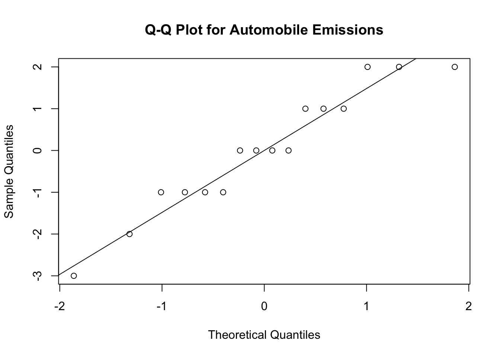
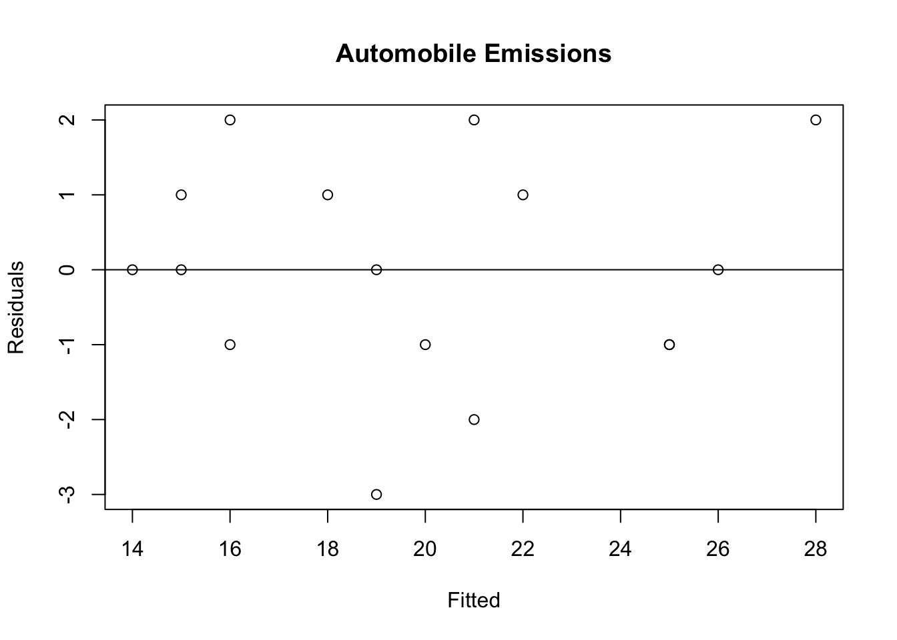

# Randomized Block Designs

Randomizing subjects to, say, two treatments in the design of a clinical trial should produce two treatment groups where all the covariates are balanced.  But it doesn’t guarantee that equal numbers of patients will be assigned to each treatment group for important covariates.  

Suppose the covariate is income level (low/medium/high). If income level is related to the outcome of interest then it's important that the two treatment groups have a balanced number of subjects in each income level. So this shouldn't be left to chance! To avoid an imbalance between income levels in the two treatment groups the design can be *blocked* by income group.  This means that the we randomize subjects in low, medium, and high income groups separately.   

We have already encountered block designs in randomized paired designs.  In these designs the block size is two.  In general block designs the size of a block can be larger.


Where do block designs fit into what we have learned so far?

Comparison of two treatments

- Unblocked arrangements: unpaired comparison of two treatment groups
- Blocked arrangements: paired comparison of two treatments

Comparison of more than two treatments

- Unblocked arrangements: randomized one-way design 
- Blocked arrangements: randomized block design

In blocked designs two kinds of effects are contemplated:
1. treatments (this is what the experimenter is interested in).
2. blocks (this is what the experimenter wants to eliminate the contribution to the treatment effect).

Blocks might be: different litters of animals; blends of chemical material; strips of land; or contiguous periods of time.

## ANOVA Table for Randomized Block Designs

The table below shows data from a randomized block experiment in which a process of the manufacture of penicillin was investigated (Box, Hunter, and Hunter, 2005).  Yield was the response of primary interest and the experimenters wanted to compare four variants of the manufacturing process called treatments A, B, C, and D. 

The properties of an important raw material (com steep liquor) varied considerably, and it was believed that this alone might cause considerable differences in yield. It was found, however, that for experimental purposes a blend of the material could be obtained to make four runs. This supplied the opportunity of running the $k = 4$ treatments within each of $n = 5$ blends (blocks) of the liquor. 

Within each blend the order in which the treatments were run were randomized.  In a fully randomized one-way treatment classification blend differences might not be balanced between the treatments A, B, C, D. This might increase the experimental noise. But, by randomly assigning the order in which the four treatments were run within each blend (block), blend differences between the groups were largely eliminated.

A Key feature of randomized block designs is that randomization is applied to treatments within each block.  In other words, the blocks represent a restriction on randomization.

<table>
 <thead>
  <tr>
   <th style="text-align:right;"> run </th>
   <th style="text-align:right;"> blend </th>
   <th style="text-align:left;"> treatment </th>
   <th style="text-align:right;"> y </th>
  </tr>
 </thead>
<tbody>
  <tr>
   <td style="text-align:right;"> 1 </td>
   <td style="text-align:right;"> 1 </td>
   <td style="text-align:left;"> A </td>
   <td style="text-align:right;"> 89 </td>
  </tr>
  <tr>
   <td style="text-align:right;"> 4 </td>
   <td style="text-align:right;"> 2 </td>
   <td style="text-align:left;"> A </td>
   <td style="text-align:right;"> 84 </td>
  </tr>
  <tr>
   <td style="text-align:right;"> 2 </td>
   <td style="text-align:right;"> 3 </td>
   <td style="text-align:left;"> A </td>
   <td style="text-align:right;"> 81 </td>
  </tr>
  <tr>
   <td style="text-align:right;"> 1 </td>
   <td style="text-align:right;"> 4 </td>
   <td style="text-align:left;"> A </td>
   <td style="text-align:right;"> 87 </td>
  </tr>
  <tr>
   <td style="text-align:right;"> 3 </td>
   <td style="text-align:right;"> 5 </td>
   <td style="text-align:left;"> A </td>
   <td style="text-align:right;"> 79 </td>
  </tr>
  <tr>
   <td style="text-align:right;"> 3 </td>
   <td style="text-align:right;"> 1 </td>
   <td style="text-align:left;"> B </td>
   <td style="text-align:right;"> 88 </td>
  </tr>
  <tr>
   <td style="text-align:right;"> 2 </td>
   <td style="text-align:right;"> 2 </td>
   <td style="text-align:left;"> B </td>
   <td style="text-align:right;"> 77 </td>
  </tr>
  <tr>
   <td style="text-align:right;"> 1 </td>
   <td style="text-align:right;"> 3 </td>
   <td style="text-align:left;"> B </td>
   <td style="text-align:right;"> 87 </td>
  </tr>
  <tr>
   <td style="text-align:right;"> 3 </td>
   <td style="text-align:right;"> 4 </td>
   <td style="text-align:left;"> B </td>
   <td style="text-align:right;"> 92 </td>
  </tr>
  <tr>
   <td style="text-align:right;"> 4 </td>
   <td style="text-align:right;"> 5 </td>
   <td style="text-align:left;"> B </td>
   <td style="text-align:right;"> 81 </td>
  </tr>
  <tr>
   <td style="text-align:right;"> 2 </td>
   <td style="text-align:right;"> 1 </td>
   <td style="text-align:left;"> C </td>
   <td style="text-align:right;"> 97 </td>
  </tr>
  <tr>
   <td style="text-align:right;"> 3 </td>
   <td style="text-align:right;"> 2 </td>
   <td style="text-align:left;"> C </td>
   <td style="text-align:right;"> 92 </td>
  </tr>
  <tr>
   <td style="text-align:right;"> 4 </td>
   <td style="text-align:right;"> 3 </td>
   <td style="text-align:left;"> C </td>
   <td style="text-align:right;"> 87 </td>
  </tr>
  <tr>
   <td style="text-align:right;"> 2 </td>
   <td style="text-align:right;"> 4 </td>
   <td style="text-align:left;"> C </td>
   <td style="text-align:right;"> 89 </td>
  </tr>
  <tr>
   <td style="text-align:right;"> 1 </td>
   <td style="text-align:right;"> 5 </td>
   <td style="text-align:left;"> C </td>
   <td style="text-align:right;"> 80 </td>
  </tr>
  <tr>
   <td style="text-align:right;"> 4 </td>
   <td style="text-align:right;"> 1 </td>
   <td style="text-align:left;"> D </td>
   <td style="text-align:right;"> 94 </td>
  </tr>
  <tr>
   <td style="text-align:right;"> 1 </td>
   <td style="text-align:right;"> 2 </td>
   <td style="text-align:left;"> D </td>
   <td style="text-align:right;"> 79 </td>
  </tr>
  <tr>
   <td style="text-align:right;"> 3 </td>
   <td style="text-align:right;"> 3 </td>
   <td style="text-align:left;"> D </td>
   <td style="text-align:right;"> 85 </td>
  </tr>
  <tr>
   <td style="text-align:right;"> 4 </td>
   <td style="text-align:right;"> 4 </td>
   <td style="text-align:left;"> D </td>
   <td style="text-align:right;"> 84 </td>
  </tr>
  <tr>
   <td style="text-align:right;"> 2 </td>
   <td style="text-align:right;"> 5 </td>
   <td style="text-align:left;"> D </td>
   <td style="text-align:right;"> 88 </td>
  </tr>
</tbody>
</table>


## The ANOVA identity for Randomized Block Designs

Let

- $a$ is the number of treatments and $b$ the number of blocks.
-  $y_{i\cdot}$ be the total of all observations taken under treatment $i$.
-  $y_{\cdot j}$ be the total of all observations taken under block $j$.
-  $y_{\cdot\cdot}$ be the grand total of all observations.
- $N = ab$ be the total of all observations

Mathematically these quantities can be expressed as:

$$\begin{aligned}
y_{i\cdot} &= \sum_{j = 1}^b y_{ij}, \thinspace \thinspace i = 1,...,a\\
y_{\cdot j} &= \sum_{i = 1}^a y_{ij}, \thinspace \thinspace j = 1,...,b \\
y_{\cdot \cdot} &= \sum_{j = 1}^b\sum_{i = 1}^a y_{ij} 
\end{aligned}$$

The treatment, block, and grand averages can be expressed as:

$$\begin{aligned}
\bar{y_{i\cdot}} &=y_{i\cdot}/b \\
\bar{y_{\cdot j}} &=y_{\cdot j}/a \\
\bar{y_{\cdot \cdot}} &=y_{\cdot \cdot}/N 
\end{aligned}$$

The total sum of squares can be re-expressed by adding and subtracting the treatment and block averages as:

$$\sum_{i = 1}^a\sum_{j = 1}^b \left(y_{ij}-\bar{y_{\cdot \cdot}}\right)^2 = \sum_{i = 1}^a\sum_{j = 1}^b \left[(\bar{y_{i\cdot}}-\bar{y_{\cdot \cdot}})+(\bar{y_{\cdot j}}-\bar{y_{\cdot \cdot}}) + (y_{ij}-\bar{y_{i\cdot}}-\bar{y_{\cdot j}}+\bar{y_{\cdot \cdot}})) \right]^2.$$

After expanding and simplifying the equation above it can be shown that:

$$\begin{aligned}
\underbrace{\sum_{i = 1}^a\sum_{j = 1}^b \left(y_{ij}-\bar{y_{\cdot \cdot}}\right)^2}_{\text{Total sum of squares}} &= \underbrace{b\sum_{i = 1}^a \left(\bar{y_{i\cdot}}-\bar{y_{\cdot \cdot}}\right)^2}_{\text{Sum of squares due to treatments}} + \underbrace{a\sum_{j = 1}^b \left(\bar{y_{\cdot j}}-\bar{y_{\cdot \cdot}}\right)^2}_{\text{Sum of squares due to blocks}} + \underbrace{\sum_{i = 1}^a\sum_{j = 1}^b \left(y_{ij}-\bar{y_{i\cdot}}-\bar{y_{\cdot j}}+\bar{y_{\cdot \cdot}} \right)^2}_{\text{Sum of squares due to error}} \\
SS_{T}&=SS_{Treat}+SS_{Blocks}+SS_E
\end{aligned}$$

### Degrees of freedom

- There are $N$ observations so $SS_T$ has $N-1$ degrees of freedom.
- There are $a$ treatments and $b$ blocks so $SS_{Treat}$ and $SS_{Blocks}$ have $a-1$ and $b-1$ degrees of freedom, respectively.
- The sum of squares on the left hand side the equation should add to the sum of squares on the right hand side of the equation.  Therefore, the error sum of squares has $(N-1)-(a-1)-(b-1)=(ab-1)-(a-1)-(b-1)=(a-1)(b-1)$ degrees of freedom.

### Penicillin Manufacturing Example

The block averages are:


```r
block.ave <- sapply(split(tab0404$y,tab0404$blend),mean)
block.ave
```

```
 1  2  3  4  5 
92 83 85 88 82 
```

The treatment averages are:


```r
trt.ave <- sapply(split(tab0404$y,tab0404$treatment),mean)
trt.ave
```

```
 A  B  C  D 
84 85 89 86 
```

The grand average is:


```r
grand.ave <- mean(tab0404$y)
grand.ave
```

```
[1] 86
```

The block deviations from the grand average and the sum of squares of block deviations are:


```r
block.devs <- block.ave-grand.ave
block.devs
```

```
 1  2  3  4  5 
 6 -3 -1  2 -4 
```

```r
sum(block.devs^2)*4
```

```
[1] 264
```


The treatment deviations from the grand average and the sum of squares of treatment deviations are:


```r
treatment.devs <- trt.ave-grand.ave
treatment.devs
```

```
 A  B  C  D 
-2 -1  3  0 
```

```r
sum(treatment.devs^2)*5
```

```
[1] 70
```

The sum of squares of deviations from the grand average are:


```r
all.devs <- tab0404$y-grand.ave
sum(all.devs^2)
```

```
[1] 560
```

So, the error sum of squares is:


```r
sum(all.devs^2)-sum(treatment.devs^2)*5-sum(block.devs^2)*4
```

```
[1] 226
```

Would $SS_E$ increase or decrease if blocking was not incorporated into the design?  $SS_E$ would increase since the extra variation would not be incorporated into $SS_{Treat}$ so it must be incorporated into $SS_E$. 


## The Linear Model for Randomized Block Design

The linear model for the randomized block design is

$$y_{ij}=\mu+\tau_i+\beta_j+\epsilon_{ij},$$

where $E(\epsilon_{ij})=0.$  

The model is completely additive.  It assumes that there is no interaction between blocks and treatments.  An interaction could occur if an impurity in blend 3 poisoned treatment B and made it ineffective, even though it did not affect the other treatments.

Another way in which an interaction can occur is when the response relationship is multiplicative

$$E(y_{ij})=\mu\tau_i\beta_j.$$

Taking logs and denoting transformed terms by primes, the model then becomes

$$y_{ij}^{\prime}=\mu^{\prime}+\tau_i^{\prime}+\beta_j^{\prime}+\epsilon_{ij}^{\prime}$$

and assuming that $\epsilon_{ij}^{\prime}$ were approximately independent and identically distributed the response $y_{ij}^{\prime}=log(y_{ij})$ could be analyzed using a linear model in which the interaction would disappear.

Interactions often belong to two categories: (a) transformable interactions, which are eliminated by transformation of the original data, and (b) nontransfromable such as a treatment -blend interaction that cannot be eliminated via a transformation.

The ANOVA table for a randomized block design can be obtained by fitting a linear model and extracting the ANOVA table. Using R the penicillin example has ANOVA table


```r
pen.model <- lm(y~as.factor(treatment)+as.factor(blend),data = tab0404)
anova(pen.model)
```

```
Analysis of Variance Table

Response: y
                     Df Sum Sq Mean Sq F value  Pr(>F)  
as.factor(treatment)  3     70  23.333  1.2389 0.33866  
as.factor(blend)      4    264  66.000  3.5044 0.04075 *
Residuals            12    226  18.833                  
---
Signif. codes:  0 '***' 0.001 '**' 0.01 '*' 0.05 '.' 0.1 ' ' 1
```

If we further assume that $\epsilon_{ij} \sim N(0,\sigma^2)$ then $MS_{Treat}/MS_{E} \sim F_{a-1,(a-1)(b-1)}, MS_{Blocks} \sim F_{b-1,(a-1)(b-1)}.$ 

Suppose that the blends (blocks) were not included in the model.


```r
anova(lm(y~as.factor(treatment),data = tab0404))
```

```
Analysis of Variance Table

Response: y
                     Df Sum Sq Mean Sq F value Pr(>F)
as.factor(treatment)  3     70  23.333  0.7619 0.5318
Residuals            16    490  30.625               
```

$SS_E$ increases from 226 to 226+264 = 490.  $SS_T$ not associated with treatments or the mean, almost half is accounted for by block-to-block variation.  If the experiment had been arranged on a completely randomized basis with no blocks, the error variance would have been much larger.  The randomized block design increased the sensitivity of this experiment.


There is no evidence that the four treatments produce different yields. How could this information be used in optimizing yield in the manufacturing process? Is one of the treatments less expensive to run?  If one of the treatments is less expensive to run then an analysis on cost rather than yield might reveal important information. 

The differences between the blocks might be informative.  In particular the investigators might speculate about why blend 1 has such a different influence on yield. Perhaps now the experimenters should study the characteristics of the different blends of corn steep liquor. (Box, Hunter, Hunter, 2005)

### Checking statistical assumptions

The normality of the residuals can be checked by using a normal quantile plot.


```r
pen.model <- lm(y~as.factor(treatment)+as.factor(blend),data = tab0404)
qqnorm(pen.model$residuals,main = "Q-Q Plot for Penicillin Study");qqline(pen.model$residuals)
```


The constant variance assumption can be investigated by plotting the predicted values versus the residuals.  The predicted (fitted) values are 

$$\hat {y_{ij}}=\bar{y_{i\cdot}}+\bar{y_{\cdot j}}-\bar{y_{\cdot \cdot}}$$ 

and the residuals are 

$$ y_{ij}-\hat {y_{ij}}.$$

Using R this plot can be obtained.


```r
plot(pen.model$fitted.values,pen.model$residuals,ylab = "Residuals",xlab = "Fitted",main = "Penicillin study")
abline(h = 0)
```


## Application of Blocking to Achieve Balanced Randomization: Permuted Block Randomization

One application of blocking is to use it as a tool to achieve a balanced randomization.  

Randomizing subjects to, say, two treatments in the design of a clinical trial should produce two treatment groups where all the covariates are balanced.  But it doesn’t guarantee that equal numbers of patients will be assigned to each treatment group.

Simple randomization assigns subjects to 2 treatments with probability 1/2.  This may cause imbalance among different groups (e.g., male/female).

A permuted block randomization is a way to use blocking to assign patients to treatments in the blocks.  Suppose we want to compare two treatments: A, B in a randomized trial.  In a permuted block randomization we could use blocks of size 4.  The possible sequences are: 

{AABB, ABAB, ABBA, BBAA, BABA, BAAB}.

When a subject is to be randomized a block is randomly chosen.  For example, if ABAB is chosen then first patient receives A, second patient receives B, etc.  This ensures an equal number of patients in each treatment group.


## Latin square designs

There are several other types of designs that utilize the blocking principle such as The Latin Square design. If there is more than one nuisance source that can be eliminated then a Latin Square design might be appropriate.

An experiment to test the feasibility of reducing air pollution by modifying a gasoline mixture with very small amounts of certain chemicals A, B, C, and D was conducted. The four treatments were tested with four different drivers and four different cars. There were thus two block factors-cars and drivers. (Box, Hunter, and Hunter 2005) 


<table class="table table-striped" style="width: auto !important; ">
 <thead>
  <tr>
   <th style="text-align:right;"> driver </th>
   <th style="text-align:right;"> cars </th>
   <th style="text-align:left;"> additive </th>
   <th style="text-align:right;"> y </th>
  </tr>
 </thead>
<tbody>
  <tr>
   <td style="text-align:right;"> 1 </td>
   <td style="text-align:right;"> 1 </td>
   <td style="text-align:left;"> A </td>
   <td style="text-align:right;"> 19 </td>
  </tr>
  <tr>
   <td style="text-align:right;"> 2 </td>
   <td style="text-align:right;"> 1 </td>
   <td style="text-align:left;"> D </td>
   <td style="text-align:right;"> 23 </td>
  </tr>
  <tr>
   <td style="text-align:right;"> 3 </td>
   <td style="text-align:right;"> 1 </td>
   <td style="text-align:left;"> B </td>
   <td style="text-align:right;"> 15 </td>
  </tr>
  <tr>
   <td style="text-align:right;"> 4 </td>
   <td style="text-align:right;"> 1 </td>
   <td style="text-align:left;"> C </td>
   <td style="text-align:right;"> 19 </td>
  </tr>
  <tr>
   <td style="text-align:right;"> 1 </td>
   <td style="text-align:right;"> 2 </td>
   <td style="text-align:left;"> B </td>
   <td style="text-align:right;"> 24 </td>
  </tr>
  <tr>
   <td style="text-align:right;"> 2 </td>
   <td style="text-align:right;"> 2 </td>
   <td style="text-align:left;"> C </td>
   <td style="text-align:right;"> 24 </td>
  </tr>
  <tr>
   <td style="text-align:right;"> 3 </td>
   <td style="text-align:right;"> 2 </td>
   <td style="text-align:left;"> D </td>
   <td style="text-align:right;"> 14 </td>
  </tr>
  <tr>
   <td style="text-align:right;"> 4 </td>
   <td style="text-align:right;"> 2 </td>
   <td style="text-align:left;"> A </td>
   <td style="text-align:right;"> 18 </td>
  </tr>
  <tr>
   <td style="text-align:right;"> 1 </td>
   <td style="text-align:right;"> 3 </td>
   <td style="text-align:left;"> D </td>
   <td style="text-align:right;"> 23 </td>
  </tr>
  <tr>
   <td style="text-align:right;"> 2 </td>
   <td style="text-align:right;"> 3 </td>
   <td style="text-align:left;"> A </td>
   <td style="text-align:right;"> 19 </td>
  </tr>
  <tr>
   <td style="text-align:right;"> 3 </td>
   <td style="text-align:right;"> 3 </td>
   <td style="text-align:left;"> C </td>
   <td style="text-align:right;"> 15 </td>
  </tr>
  <tr>
   <td style="text-align:right;"> 4 </td>
   <td style="text-align:right;"> 3 </td>
   <td style="text-align:left;"> B </td>
   <td style="text-align:right;"> 19 </td>
  </tr>
  <tr>
   <td style="text-align:right;"> 1 </td>
   <td style="text-align:right;"> 4 </td>
   <td style="text-align:left;"> C </td>
   <td style="text-align:right;"> 26 </td>
  </tr>
  <tr>
   <td style="text-align:right;"> 2 </td>
   <td style="text-align:right;"> 4 </td>
   <td style="text-align:left;"> B </td>
   <td style="text-align:right;"> 30 </td>
  </tr>
  <tr>
   <td style="text-align:right;"> 3 </td>
   <td style="text-align:right;"> 4 </td>
   <td style="text-align:left;"> A </td>
   <td style="text-align:right;"> 16 </td>
  </tr>
  <tr>
   <td style="text-align:right;"> 4 </td>
   <td style="text-align:right;"> 4 </td>
   <td style="text-align:left;"> D </td>
   <td style="text-align:right;"> 16 </td>
  </tr>
</tbody>
</table>


- Each treatment appears once in every row (driver) and every column (car).
- Randomization can be achieved by randomly allocating the treatments to the symbols A, B, C, and D; the drivers to the symbols I, II, III, and IV; and cars to the symbols 1, 2, 3, 4.  
- The treatments are denoted by Latin letters A, B, C, D; hence the name Latin square design.
- The design allows for blocking with two variables.
- The two blocking variables must have the same number of levels as the treatment variable.

Suppose that the design used a single car and driver with 16 experimental runs for the four treatments.  This design could also be valid, but the Latin square has the advantage that the results do not just apply to one car and one driver.
          
The data is available in the R data frame `tab0408`.
            
<table class="table table-striped" style="width: auto !important; ">
 <thead>
  <tr>
   <th style="text-align:right;"> driver </th>
   <th style="text-align:right;"> cars </th>
   <th style="text-align:left;"> additive </th>
   <th style="text-align:right;"> y </th>
  </tr>
 </thead>
<tbody>
  <tr>
   <td style="text-align:right;"> 1 </td>
   <td style="text-align:right;"> 1 </td>
   <td style="text-align:left;"> A </td>
   <td style="text-align:right;"> 19 </td>
  </tr>
  <tr>
   <td style="text-align:right;"> 2 </td>
   <td style="text-align:right;"> 1 </td>
   <td style="text-align:left;"> D </td>
   <td style="text-align:right;"> 23 </td>
  </tr>
  <tr>
   <td style="text-align:right;"> 3 </td>
   <td style="text-align:right;"> 1 </td>
   <td style="text-align:left;"> B </td>
   <td style="text-align:right;"> 15 </td>
  </tr>
  <tr>
   <td style="text-align:right;"> 4 </td>
   <td style="text-align:right;"> 1 </td>
   <td style="text-align:left;"> C </td>
   <td style="text-align:right;"> 19 </td>
  </tr>
  <tr>
   <td style="text-align:right;"> 1 </td>
   <td style="text-align:right;"> 2 </td>
   <td style="text-align:left;"> B </td>
   <td style="text-align:right;"> 24 </td>
  </tr>
  <tr>
   <td style="text-align:right;"> 2 </td>
   <td style="text-align:right;"> 2 </td>
   <td style="text-align:left;"> C </td>
   <td style="text-align:right;"> 24 </td>
  </tr>
  <tr>
   <td style="text-align:right;"> 3 </td>
   <td style="text-align:right;"> 2 </td>
   <td style="text-align:left;"> D </td>
   <td style="text-align:right;"> 14 </td>
  </tr>
  <tr>
   <td style="text-align:right;"> 4 </td>
   <td style="text-align:right;"> 2 </td>
   <td style="text-align:left;"> A </td>
   <td style="text-align:right;"> 18 </td>
  </tr>
  <tr>
   <td style="text-align:right;"> 1 </td>
   <td style="text-align:right;"> 3 </td>
   <td style="text-align:left;"> D </td>
   <td style="text-align:right;"> 23 </td>
  </tr>
  <tr>
   <td style="text-align:right;"> 2 </td>
   <td style="text-align:right;"> 3 </td>
   <td style="text-align:left;"> A </td>
   <td style="text-align:right;"> 19 </td>
  </tr>
  <tr>
   <td style="text-align:right;"> 3 </td>
   <td style="text-align:right;"> 3 </td>
   <td style="text-align:left;"> C </td>
   <td style="text-align:right;"> 15 </td>
  </tr>
  <tr>
   <td style="text-align:right;"> 4 </td>
   <td style="text-align:right;"> 3 </td>
   <td style="text-align:left;"> B </td>
   <td style="text-align:right;"> 19 </td>
  </tr>
  <tr>
   <td style="text-align:right;"> 1 </td>
   <td style="text-align:right;"> 4 </td>
   <td style="text-align:left;"> C </td>
   <td style="text-align:right;"> 26 </td>
  </tr>
  <tr>
   <td style="text-align:right;"> 2 </td>
   <td style="text-align:right;"> 4 </td>
   <td style="text-align:left;"> B </td>
   <td style="text-align:right;"> 30 </td>
  </tr>
  <tr>
   <td style="text-align:right;"> 3 </td>
   <td style="text-align:right;"> 4 </td>
   <td style="text-align:left;"> A </td>
   <td style="text-align:right;"> 16 </td>
  </tr>
  <tr>
   <td style="text-align:right;"> 4 </td>
   <td style="text-align:right;"> 4 </td>
   <td style="text-align:left;"> D </td>
   <td style="text-align:right;"> 16 </td>
  </tr>
</tbody>
</table>


The model and analysis are similar to the randomized block design except that there is an additional blocking factor.  

In R the ANOVA table and treatment effects are obtained.


```r
latinsq.auto <- lm(y~additive+as.factor(cars)+as.factor(driver),data = tab0408)
anova(latinsq.auto)
```

```
Analysis of Variance Table

Response: y
                  Df Sum Sq Mean Sq F value   Pr(>F)   
additive           3     40  13.333     2.5 0.156490   
as.factor(cars)    3     24   8.000     1.5 0.307174   
as.factor(driver)  3    216  72.000    13.5 0.004466 **
Residuals          6     32   5.333                    
---
Signif. codes:  0 '***' 0.001 '**' 0.01 '*' 0.05 '.' 0.1 ' ' 1
```

```r
summary(latinsq.auto)
```

```

Call:
lm(formula = y ~ additive + as.factor(cars) + as.factor(driver), 
    data = tab0408)

Residuals:
   Min     1Q Median     3Q    Max 
    -3     -1      0      1      2 

Coefficients:
                     Estimate Std. Error t value Pr(>|t|)    
(Intercept)         2.000e+01  1.826e+00  10.954 3.44e-05 ***
additiveB           4.000e+00  1.633e+00   2.449  0.04983 *  
additiveC           3.000e+00  1.633e+00   1.837  0.11584    
additiveD           1.000e+00  1.633e+00   0.612  0.56276    
as.factor(cars)2    1.000e+00  1.633e+00   0.612  0.56276    
as.factor(cars)3   -2.448e-15  1.633e+00   0.000  1.00000    
as.factor(cars)4    3.000e+00  1.633e+00   1.837  0.11584    
as.factor(driver)2  1.000e+00  1.633e+00   0.612  0.56276    
as.factor(driver)3 -8.000e+00  1.633e+00  -4.899  0.00271 ** 
as.factor(driver)4 -5.000e+00  1.633e+00  -3.062  0.02217 *  
---
Signif. codes:  0 '***' 0.001 '**' 0.01 '*' 0.05 '.' 0.1 ' ' 1

Residual standard error: 2.309 on 6 degrees of freedom
Multiple R-squared:  0.8974,	Adjusted R-squared:  0.7436 
F-statistic: 5.833 on 9 and 6 DF,  p-value: 0.0219
```

- The Latin square has been effective in removing a large component of variation due to drivers.  
- It assumed that the effects of treatments, cars, and drivers are all additive so that there is no interaction effects.
- It is inappropriate to use Latin square designs to study factors that can interact.  Effects of one factor can then be mixed up with interactions of other factors. Outliers can occur as a result of these interactions. When interactions between factors are likely possible need to use a factorial design.

The ANOVA identity for a Latin Square design is:

$$SS_T = SS_{Treat}+SS_{Cars}+SS_{Driver}+SS_E.$$

By similar reasoning to randomized blocks the associated degrees of freedom are also additive.  

The statistical model for a $4x4$ Latin square is:

$$y_{ijk}=\mu+\alpha_i+\tau_j+\beta_k+\epsilon_{ijk},$$

where $i,j,k = 1,...,4$, $y_{ijk}$ is the observation in the $ith$ row and $kth$ column for the $jth$ treatment, $\mu$ is the overall mean, $\alpha_i$ is the row effect, $\tau_j$ is the $jth$ treatment effect, $\beta_k$ is the $kth$ column effect, and $\epsilon_{ijk}$ is the random error.  We will assume that  $\epsilon_{ijk} \sim N(0,\sigma^2).$

Under the assumption that the residuals are independent and $N(0,\sigma^2)$ then under the null hypothesis that there are no differences between between treatments

$$MS_{Treat}/MS_E \sim F_{3,6}.$$

The statistical assumptions can be checked by plotting: (1) a normal quantile plot of the residuals; and (2) the predicted values versus residuals versus. 


```r
qqnorm(latinsq.auto$residuals,main = "Q-Q Plot for Automobile Emissions");qqline(latinsq.auto$residuals)
```



```r
plot(latinsq.auto$fitted.values,latinsq.auto$residuals,ylab = "Residuals",xlab = "Fitted",main = "Automobile Emissions")
abline(h = 0)
```




## General Latin Square Designs

A Latin square for p factors of a $p \times p$ Latin square, is a square containing $p$ rows and $p$ columns.  Each of the $p^2$ cells contains one of the $p$ letters that correspond to a treatment.  Each letter occurs once and only once in each row and column.

There are many possible $p \times p$ Latin squares.  If $p = 3$ then two Latin squares are below, 


Example 1:


<table class="tg">
  <tr>
    <th class="tg-lboi"></th>
    <th class="tg-0pky">Col 1</th>
    <th class="tg-0pky">Col 2</th>
    <th class="tg-0pky">Col 3</th>
  </tr>
  <tr>
    <td class="tg-0pky">Row 1</td>
    <td class="tg-0pky">B</td>
    <td class="tg-0pky">A</td>
    <td class="tg-0pky">C</td>
  </tr>
  <tr>
    <td class="tg-lboi">Row 2</td>
    <td class="tg-0pky">A</td>
    <td class="tg-0pky">C</td>
    <td class="tg-0pky">B</td>
  </tr>
  <tr>
    <td class="tg-lboi">Row 3</td>
    <td class="tg-0pky">C</td>
    <td class="tg-0pky">B</td>
    <td class="tg-0pky">A</td>
  </tr>
</table>

Example 2:

<style type="text/css">
.tg  {border-collapse:collapse;border-spacing:0;}
.tg td{font-family:Arial, sans-serif;font-size:14px;padding:10px 5px;border-style:solid;border-width:1px;overflow:hidden;word-break:normal;border-color:black;}
.tg th{font-family:Arial, sans-serif;font-size:14px;font-weight:normal;padding:10px 5px;border-style:solid;border-width:1px;overflow:hidden;word-break:normal;border-color:black;}
.tg .tg-lboi{border-color:inherit;text-align:left;vertical-align:middle}
.tg .tg-0pky{border-color:inherit;text-align:left;vertical-align:top}
</style>
<table class="tg">
  <tr>
    <th class="tg-lboi"></th>
    <th class="tg-0pky">Col 1</th>
    <th class="tg-0pky">Col 2</th>
    <th class="tg-0pky">Col 3</th>
  </tr>
  <tr>
    <td class="tg-0pky">Row 1</td>
    <td class="tg-0pky">A</td>
    <td class="tg-0pky">B</td>
    <td class="tg-0pky">C</td>
  </tr>
  <tr>
    <td class="tg-lboi">Row 2</td>
    <td class="tg-0pky">C</td>
    <td class="tg-0pky">A</td>
    <td class="tg-0pky">B</td>
  </tr>
  <tr>
    <td class="tg-lboi">Row 3</td>
    <td class="tg-0pky">B</td>
    <td class="tg-0pky">C</td>
    <td class="tg-0pky">A</td>
  </tr>
</table>

Note that Col1, Col2, Col3 are three levels of a blocking variable and Row 1, Row 2, Row 3 are three levels of another blocking variable.   

If $p = 4$ then two examples of Latin squares are below,

Example 1:

<style type="text/css">
.tg  {border-collapse:collapse;border-spacing:0;}
.tg td{font-family:Arial, sans-serif;font-size:14px;padding:10px 5px;border-style:solid;border-width:1px;overflow:hidden;word-break:normal;border-color:black;}
.tg th{font-family:Arial, sans-serif;font-size:14px;font-weight:normal;padding:10px 5px;border-style:solid;border-width:1px;overflow:hidden;word-break:normal;border-color:black;}
.tg .tg-lboi{border-color:inherit;text-align:left;vertical-align:middle}
.tg .tg-0pky{border-color:inherit;text-align:left;vertical-align:top}
.tg .tg-0lax{text-align:left;vertical-align:top}
</style>
<table class="tg">
  <tr>
    <th class="tg-lboi"></th>
    <th class="tg-0pky">Col 1</th>
    <th class="tg-0pky">Col 2</th>
    <th class="tg-0pky">Col 3</th>
    <th class="tg-0lax">Col 4</th>
  </tr>
  <tr>
    <td class="tg-0pky">Row 1</td>
    <td class="tg-0pky">B</td>
    <td class="tg-0pky">A</td>
    <td class="tg-0pky">D</td>
    <td class="tg-0lax">C</td>
  </tr>
  <tr>
    <td class="tg-lboi">Row 2</td>
    <td class="tg-0pky">C</td>
    <td class="tg-0pky">D</td>
    <td class="tg-0pky">A</td>
    <td class="tg-0lax">B</td>
  </tr>
  <tr>
    <td class="tg-lboi">Row 3</td>
    <td class="tg-0pky">D</td>
    <td class="tg-0pky">B</td>
    <td class="tg-0pky">C</td>
    <td class="tg-0lax">A</td>
  </tr>
  <tr>
    <td class="tg-0lax">Row 4</td>
    <td class="tg-0lax">A</td>
    <td class="tg-0lax">C</td>
    <td class="tg-0lax">B</td>
    <td class="tg-0lax">D</td>
  </tr>
</table>

Example 2:

<style type="text/css">
.tg  {border-collapse:collapse;border-spacing:0;}
.tg td{font-family:Arial, sans-serif;font-size:14px;padding:10px 5px;border-style:solid;border-width:1px;overflow:hidden;word-break:normal;border-color:black;}
.tg th{font-family:Arial, sans-serif;font-size:14px;font-weight:normal;padding:10px 5px;border-style:solid;border-width:1px;overflow:hidden;word-break:normal;border-color:black;}
.tg .tg-0pky{border-color:inherit;text-align:left;vertical-align:top}
</style>
<table class="tg">
  <tr>
    <th class="tg-0pky"></th>
    <th class="tg-0pky">Col 1</th>
    <th class="tg-0pky">Col 2</th>
    <th class="tg-0pky">Col 3</th>
    <th class="tg-0pky">Col 4</th>
  </tr>
  <tr>
    <td class="tg-0pky">Row 1</td>
    <td class="tg-0pky">D</td>
    <td class="tg-0pky">A</td>
    <td class="tg-0pky">C</td>
    <td class="tg-0pky">B</td>
  </tr>
  <tr>
    <td class="tg-0pky">Row 2</td>
    <td class="tg-0pky">A</td>
    <td class="tg-0pky">D</td>
    <td class="tg-0pky">B</td>
    <td class="tg-0pky">C</td>
  </tr>
  <tr>
    <td class="tg-0pky">Row 3</td>
    <td class="tg-0pky">B</td>
    <td class="tg-0pky">C</td>
    <td class="tg-0pky">A</td>
    <td class="tg-0pky">D</td>
  </tr>
  <tr>
    <td class="tg-0pky">Row 4</td>
    <td class="tg-0pky">C</td>
    <td class="tg-0pky">B</td>
    <td class="tg-0pky">D</td>
    <td class="tg-0pky">A</td>
  </tr>
</table>


## Graeco-Latin Square Designs

A Graeco-Latin square is a $k \times k$ pattern that permits study of $k$ treatments simultaneously with three different blocking variables each at $k$ levels.  This is a Latin square in which each Greek letter appears once and only once with each Latin letter.  It can be used to control three sources of extraneous variability (i.e. block in three different directions).

Suppose that we wanted to also block out the effects of day in the air pollution study. If the experiment is to be run on four different days, with four drivers, and four cars then a Graeco-Latin square design is  in the table below.

                  Car 1       Car 2       Car 3       Car 4   
---------- ------------ ----------- ----------- -----------           
Driver I   A $\alpha$   B $\beta$    C $\gamma$  D $\delta$
Driver II  B $\delta$   A $\gamma$   D $\beta$   C $\alpha$
Driver III  C $\beta$   D $\alpha$   A $\delta$  B $\gamma$
Driver IV  D $\gamma$   C $\delta$   B $\alpha$  A $\beta$

To generate a $3 \times 3$ Graeco-Latin square design, superimpose two designs using the Greek letters for the second $3 \times 3$ Latin square.


<style type="text/css">
.tg  {border-collapse:collapse;border-spacing:0;}
.tg td{font-family:Arial, sans-serif;font-size:14px;padding:10px 5px;border-style:solid;border-width:1px;overflow:hidden;word-break:normal;border-color:black;}
.tg th{font-family:Arial, sans-serif;font-size:14px;font-weight:normal;padding:10px 5px;border-style:solid;border-width:1px;overflow:hidden;word-break:normal;border-color:black;}
.tg .tg-0pky{border-color:inherit;text-align:left;vertical-align:top}
</style>
<table class="tg">
  <tr>
    <th class="tg-0pky"></th>
    <th class="tg-0pky">Col 1</th>
    <th class="tg-0pky">Col 2</th>
    <th class="tg-0pky">Col 3</th>
  </tr>
  <tr>
    <td class="tg-0pky">Row 1</td>
    <td class="tg-0pky">B</td>
    <td class="tg-0pky">A</td>
    <td class="tg-0pky">C</td>
  </tr>
  <tr>
    <td class="tg-0pky">Row 2</td>
    <td class="tg-0pky">A</td>
    <td class="tg-0pky">C</td>
    <td class="tg-0pky">B</td>
  </tr>
  <tr>
    <td class="tg-0pky">Row 3</td>
    <td class="tg-0pky">C</td>
    <td class="tg-0pky">B</td>
    <td class="tg-0pky">A</td>
  </tr>
</table>


 
<style type="text/css">
.tg  {border-collapse:collapse;border-spacing:0;}
.tg td{font-family:Arial, sans-serif;font-size:14px;padding:10px 5px;border-style:solid;border-width:1px;overflow:hidden;word-break:normal;border-color:black;}
.tg th{font-family:Arial, sans-serif;font-size:14px;font-weight:normal;padding:10px 5px;border-style:solid;border-width:1px;overflow:hidden;word-break:normal;border-color:black;}
.tg .tg-0pky{border-color:inherit;text-align:left;vertical-align:top}
</style>
<table class="tg">
  <tr>
    <th class="tg-0pky"></th>
    <th class="tg-0pky">Col 1</th>
    <th class="tg-0pky">Col 2</th>
    <th class="tg-0pky">Col 3</th>
  </tr>
  <tr>
    <td class="tg-0pky">Row 1</td>
    <td class="tg-0pky">A</td>
    <td class="tg-0pky">B</td>
    <td class="tg-0pky">C</td>
  </tr>
  <tr>
    <td class="tg-0pky">Row 2</td>
    <td class="tg-0pky">C</td>
    <td class="tg-0pky">A</td>
    <td class="tg-0pky">B</td>
  </tr>
  <tr>
    <td class="tg-0pky">Row 3</td>
    <td class="tg-0pky">B</td>
    <td class="tg-0pky">C</td>
    <td class="tg-0pky">A</td>
  </tr>
</table>   


Using Greek letters $\alpha,\beta, \gamma$ in place of A, B, C in the second square we obtain the Graeco-Latin square design:


              Col1        Col2        Col3
------ ----------- ----------- ----------- 
Row 1  B $\alpha$   A $\beta$  C $\gamma$
Row 2  A $\gamma$   C $\alpha$  B $\beta$
Row 3  C $\beta$   B $\gamma$   A $\alpha$


## Hyper-Graeco-Latin Square Designs

Blocking for multiple factors may be extended further using hyper-Graeco-Latin squares.

Consider three $4 \times 4$ Latin squares

<style type="text/css">
.tg  {border-collapse:collapse;border-spacing:0;}
.tg td{font-family:Arial, sans-serif;font-size:14px;padding:10px 5px;border-style:solid;border-width:1px;overflow:hidden;word-break:normal;border-color:black;}
.tg th{font-family:Arial, sans-serif;font-size:14px;font-weight:normal;padding:10px 5px;border-style:solid;border-width:1px;overflow:hidden;word-break:normal;border-color:black;}
.tg .tg-0pky{border-color:inherit;text-align:left;vertical-align:top}
.tg .tg-0lax{text-align:left;vertical-align:top}
</style>
<table class="tg">
  <tr>
    <th class="tg-0pky"></th>
    <th class="tg-0pky">Col 1</th>
    <th class="tg-0pky">Col 2</th>
    <th class="tg-0pky">Col 3</th>
    <th class="tg-0pky">Col 4</th>
    <th class="tg-0lax"></th>
  </tr>
  <tr>
    <td class="tg-0pky">Row 1</td>
    <td class="tg-0pky">B</td>
    <td class="tg-0pky">A</td>
    <td class="tg-0pky">D</td>
    <td class="tg-0lax">C</td>
  </tr>
  <tr>
    <td class="tg-0pky">Row 2</td>
    <td class="tg-0pky">C</td>
    <td class="tg-0pky">D</td>
    <td class="tg-0pky">A</td>
    <td class="tg-0lax">B</td>
  </tr>
  <tr>
    <td class="tg-0pky">Row 3</td>
    <td class="tg-0pky">D</td>
    <td class="tg-0pky">B</td>
    <td class="tg-0pky">C</td>
    <td class="tg-0lax">A</td>
  </tr>
  <tr>
    <td class="tg-0lax">Row 4</td>
    <td class="tg-0lax">A</td>
    <td class="tg-0lax">C</td>
    <td class="tg-0lax">B</td>
    <td class="tg-0lax">D</td>
  </tr>
</table>  
  

<style type="text/css">
.tg  {border-collapse:collapse;border-spacing:0;}
.tg td{font-family:Arial, sans-serif;font-size:14px;padding:10px 5px;border-style:solid;border-width:1px;overflow:hidden;word-break:normal;border-color:black;}
.tg th{font-family:Arial, sans-serif;font-size:14px;font-weight:normal;padding:10px 5px;border-style:solid;border-width:1px;overflow:hidden;word-break:normal;border-color:black;}
.tg .tg-0pky{border-color:inherit;text-align:left;vertical-align:top}
.tg .tg-0lax{text-align:left;vertical-align:top}
</style>
<table class="tg">
  <tr>
    <th class="tg-0pky"></th>
    <th class="tg-0pky">Col 1</th>
    <th class="tg-0pky">Col 2</th>
    <th class="tg-0pky">Col 3</th>
    <th class="tg-0pky">Col 4</th>
    <th class="tg-0lax"></th>
  </tr>
  <tr>
    <td class="tg-0pky">Row 1</td>
    <td class="tg-0pky">D</td>
    <td class="tg-0pky">A</td>
    <td class="tg-0pky">C</td>
    <td class="tg-0lax">B</td>
  </tr>
  <tr>
    <td class="tg-0pky">Row 2</td>
    <td class="tg-0pky">A</td>
    <td class="tg-0pky">D</td>
    <td class="tg-0pky">B</td>
    <td class="tg-0lax">C</td>
  </tr>
  <tr>
    <td class="tg-0pky">Row 3</td>
    <td class="tg-0pky">B</td>
    <td class="tg-0pky">C</td>
    <td class="tg-0pky">A</td>
    <td class="tg-0lax">D</td>
  </tr>
  <tr>
    <td class="tg-0lax">Row 4</td>
    <td class="tg-0lax">C</td>
    <td class="tg-0lax">B</td>
    <td class="tg-0lax">D</td>
    <td class="tg-0lax">A</td>
  </tr>
</table>
  

<style type="text/css">
.tg  {border-collapse:collapse;border-spacing:0;}
.tg td{font-family:Arial, sans-serif;font-size:14px;padding:10px 5px;border-style:solid;border-width:1px;overflow:hidden;word-break:normal;border-color:black;}
.tg th{font-family:Arial, sans-serif;font-size:14px;font-weight:normal;padding:10px 5px;border-style:solid;border-width:1px;overflow:hidden;word-break:normal;border-color:black;}
.tg .tg-0pky{border-color:inherit;text-align:left;vertical-align:top}
.tg .tg-0lax{text-align:left;vertical-align:top}
</style>
<table class="tg">
  <tr>
    <th class="tg-0pky"></th>
    <th class="tg-0pky">Col 1</th>
    <th class="tg-0pky">Col 2</th>
    <th class="tg-0pky">Col 3</th>
    <th class="tg-0pky">Col 4</th>
    <th class="tg-0lax"></th>
  </tr>
  <tr>
    <td class="tg-0pky">Row 1</td>
    <td class="tg-0pky">A</td>
    <td class="tg-0pky">D</td>
    <td class="tg-0pky">B</td>
    <td class="tg-0lax">C</td>
  </tr>
  <tr>
    <td class="tg-0pky">Row 2</td>
    <td class="tg-0pky">C</td>
    <td class="tg-0pky">A</td>
    <td class="tg-0pky">D</td>
    <td class="tg-0lax">B</td>
  </tr>
  <tr>
    <td class="tg-0pky">Row 3</td>
    <td class="tg-0pky">B</td>
    <td class="tg-0pky">C</td>
    <td class="tg-0pky">A</td>
    <td class="tg-0lax">D</td>
  </tr>
  <tr>
    <td class="tg-0lax">Row 4</td>
    <td class="tg-0lax">D</td>
    <td class="tg-0lax">B</td>
    <td class="tg-0lax">C</td>
    <td class="tg-0lax">A</td>
  </tr>
</table>


To form a hyper-Graeco-Latin square we use Greek letters $\alpha,\beta,\gamma, \delta$ for A, B, C, D in the second square and numbers 1,2,3,4 for A, B,C, D in the third square then superimpose all the squares.  Thus, the design is:

               Col1           Col2          Col3           Col4
----- -------------  ------------- -------------  ------------- 
Row 1  B $\delta$ 1  A $\alpha$ 4   D $\gamma$ 2  C $\beta$ 3
Row 2  C $\alpha$ 3  D $\delta$ 1   A $\beta$ 4   B $\gamma$ 2
Row 3  D $\beta$ 2   B $\gamma$ 3   C $\alpha$ 1  A $\delta$ 4
Row 4  A $\gamma$ 4  C $\beta$ 2    B $\delta$ 3  D $\alpha$ 1

The  primary goal is to compare treatments A, B, C, D while blocking for four factors.  The levels of each the factors are the 4 rows, 4 columns, 4 Greek letters, and 4 numbers.

The following example from @bhh2005 illustrates this design.

A machine used to test the wearing quality of cloth is to be used to compare the wearing quality of four pieces of cloth on one machine.  The response is weight loss in tenths of a milligram when it is rubbed against emery paper for 1000 revolutions of the machine.  

- Samples of four different types of cloth (treatments) A, B, C, D are to be compared.
The investigators would like to block for the effects of: 

i) type of specimen holders 1, 2, 3, 4
ii) position on the machine $P_1,P_2,P_3,P_4$.
iii) emory paper sheet $\alpha,\beta,\gamma,\delta$.
iv) machine cycle $C_1,C_2,C_3,C_4$.

The design was replicated.  The first replicate is shown in the table below.

             $P_1$          $P_2$         $P_3$           $P_4$
----- -------------  ------------- -------------  ------------- 
$C_1$  A $\alpha$ 1  B $\beta$ 2   C $\gamma$ 3   D $\delta$ 4
         320           297            299           313
$C_2$  C $\beta$ 4   D $\alpha$ 3  A $\delta$ 2   B $\gamma$ 1
         266           227            260           240
$C_3$  D $\gamma$ 2  C $\delta$ 1  B $\alpha$ 4   A $\beta$ 3
         221           240            267           252
$C_4$  B $\delta$ 3  A $\gamma$ 4  D $\beta$ 1    C $\alpha$ 2
         301           238            243           290

In order to estimate the experimental error a second replicate of the experiment was run.  The results are shown in the table below.

              $P_1$         $P_2$         $P_3$           $P_4$
----- -------------  ------------- -------------  ------------- 
$C_5$  A $\alpha$ 1  B $\beta$ 2   C $\gamma$ 3   D $\delta$ 4
         285           280           331            311
$C_6$  C $\beta$ 4   D $\alpha$ 3  A $\delta$ 2   B $\gamma$ 1
         268           233          291             280
$C_7$  D $\gamma$ 2  C $\delta$ 1  B $\alpha$ 4   A $\beta$ 3
         265           273          234             243
$C_8$  B $\delta$ 3  A $\gamma$ 4  D $\beta$ 1    C $\alpha$ 2
        306            271          270             272

The R data frame looks like

<table>
 <thead>
  <tr>
   <th style="text-align:right;"> cycle </th>
   <th style="text-align:right;"> position </th>
   <th style="text-align:left;"> treatment </th>
   <th style="text-align:right;"> holder </th>
   <th style="text-align:left;"> paper </th>
   <th style="text-align:right;"> y </th>
   <th style="text-align:right;"> rep </th>
  </tr>
 </thead>
<tbody>
  <tr>
   <td style="text-align:right;"> 1 </td>
   <td style="text-align:right;"> 1 </td>
   <td style="text-align:left;"> A </td>
   <td style="text-align:right;"> 1 </td>
   <td style="text-align:left;"> a </td>
   <td style="text-align:right;"> 320 </td>
   <td style="text-align:right;"> 1 </td>
  </tr>
  <tr>
   <td style="text-align:right;"> 2 </td>
   <td style="text-align:right;"> 1 </td>
   <td style="text-align:left;"> C </td>
   <td style="text-align:right;"> 4 </td>
   <td style="text-align:left;"> b </td>
   <td style="text-align:right;"> 266 </td>
   <td style="text-align:right;"> 1 </td>
  </tr>
  <tr>
   <td style="text-align:right;"> 3 </td>
   <td style="text-align:right;"> 1 </td>
   <td style="text-align:left;"> D </td>
   <td style="text-align:right;"> 2 </td>
   <td style="text-align:left;"> e </td>
   <td style="text-align:right;"> 221 </td>
   <td style="text-align:right;"> 1 </td>
  </tr>
  <tr>
   <td style="text-align:right;"> 4 </td>
   <td style="text-align:right;"> 1 </td>
   <td style="text-align:left;"> B </td>
   <td style="text-align:right;"> 3 </td>
   <td style="text-align:left;"> c </td>
   <td style="text-align:right;"> 301 </td>
   <td style="text-align:right;"> 1 </td>
  </tr>
  <tr>
   <td style="text-align:right;"> 5 </td>
   <td style="text-align:right;"> 1 </td>
   <td style="text-align:left;"> A </td>
   <td style="text-align:right;"> 1 </td>
   <td style="text-align:left;"> d </td>
   <td style="text-align:right;"> 285 </td>
   <td style="text-align:right;"> 2 </td>
  </tr>
  <tr>
   <td style="text-align:right;"> 6 </td>
   <td style="text-align:right;"> 1 </td>
   <td style="text-align:left;"> C </td>
   <td style="text-align:right;"> 4 </td>
   <td style="text-align:left;"> h </td>
   <td style="text-align:right;"> 268 </td>
   <td style="text-align:right;"> 2 </td>
  </tr>
  <tr>
   <td style="text-align:right;"> 7 </td>
   <td style="text-align:right;"> 1 </td>
   <td style="text-align:left;"> D </td>
   <td style="text-align:right;"> 2 </td>
   <td style="text-align:left;"> g </td>
   <td style="text-align:right;"> 265 </td>
   <td style="text-align:right;"> 2 </td>
  </tr>
  <tr>
   <td style="text-align:right;"> 8 </td>
   <td style="text-align:right;"> 1 </td>
   <td style="text-align:left;"> B </td>
   <td style="text-align:right;"> 3 </td>
   <td style="text-align:left;"> f </td>
   <td style="text-align:right;"> 306 </td>
   <td style="text-align:right;"> 2 </td>
  </tr>
  <tr>
   <td style="text-align:right;"> 1 </td>
   <td style="text-align:right;"> 2 </td>
   <td style="text-align:left;"> B </td>
   <td style="text-align:right;"> 2 </td>
   <td style="text-align:left;"> b </td>
   <td style="text-align:right;"> 297 </td>
   <td style="text-align:right;"> 1 </td>
  </tr>
  <tr>
   <td style="text-align:right;"> 2 </td>
   <td style="text-align:right;"> 2 </td>
   <td style="text-align:left;"> D </td>
   <td style="text-align:right;"> 3 </td>
   <td style="text-align:left;"> a </td>
   <td style="text-align:right;"> 227 </td>
   <td style="text-align:right;"> 1 </td>
  </tr>
  <tr>
   <td style="text-align:right;"> 3 </td>
   <td style="text-align:right;"> 2 </td>
   <td style="text-align:left;"> C </td>
   <td style="text-align:right;"> 1 </td>
   <td style="text-align:left;"> c </td>
   <td style="text-align:right;"> 240 </td>
   <td style="text-align:right;"> 1 </td>
  </tr>
  <tr>
   <td style="text-align:right;"> 4 </td>
   <td style="text-align:right;"> 2 </td>
   <td style="text-align:left;"> A </td>
   <td style="text-align:right;"> 4 </td>
   <td style="text-align:left;"> e </td>
   <td style="text-align:right;"> 238 </td>
   <td style="text-align:right;"> 1 </td>
  </tr>
  <tr>
   <td style="text-align:right;"> 5 </td>
   <td style="text-align:right;"> 2 </td>
   <td style="text-align:left;"> B </td>
   <td style="text-align:right;"> 2 </td>
   <td style="text-align:left;"> h </td>
   <td style="text-align:right;"> 280 </td>
   <td style="text-align:right;"> 2 </td>
  </tr>
  <tr>
   <td style="text-align:right;"> 6 </td>
   <td style="text-align:right;"> 2 </td>
   <td style="text-align:left;"> D </td>
   <td style="text-align:right;"> 3 </td>
   <td style="text-align:left;"> d </td>
   <td style="text-align:right;"> 233 </td>
   <td style="text-align:right;"> 2 </td>
  </tr>
  <tr>
   <td style="text-align:right;"> 7 </td>
   <td style="text-align:right;"> 2 </td>
   <td style="text-align:left;"> C </td>
   <td style="text-align:right;"> 1 </td>
   <td style="text-align:left;"> f </td>
   <td style="text-align:right;"> 273 </td>
   <td style="text-align:right;"> 2 </td>
  </tr>
  <tr>
   <td style="text-align:right;"> 8 </td>
   <td style="text-align:right;"> 2 </td>
   <td style="text-align:left;"> A </td>
   <td style="text-align:right;"> 4 </td>
   <td style="text-align:left;"> g </td>
   <td style="text-align:right;"> 271 </td>
   <td style="text-align:right;"> 2 </td>
  </tr>
  <tr>
   <td style="text-align:right;"> 1 </td>
   <td style="text-align:right;"> 3 </td>
   <td style="text-align:left;"> C </td>
   <td style="text-align:right;"> 3 </td>
   <td style="text-align:left;"> e </td>
   <td style="text-align:right;"> 299 </td>
   <td style="text-align:right;"> 1 </td>
  </tr>
  <tr>
   <td style="text-align:right;"> 2 </td>
   <td style="text-align:right;"> 3 </td>
   <td style="text-align:left;"> A </td>
   <td style="text-align:right;"> 2 </td>
   <td style="text-align:left;"> c </td>
   <td style="text-align:right;"> 260 </td>
   <td style="text-align:right;"> 1 </td>
  </tr>
  <tr>
   <td style="text-align:right;"> 3 </td>
   <td style="text-align:right;"> 3 </td>
   <td style="text-align:left;"> B </td>
   <td style="text-align:right;"> 4 </td>
   <td style="text-align:left;"> a </td>
   <td style="text-align:right;"> 267 </td>
   <td style="text-align:right;"> 1 </td>
  </tr>
  <tr>
   <td style="text-align:right;"> 4 </td>
   <td style="text-align:right;"> 3 </td>
   <td style="text-align:left;"> D </td>
   <td style="text-align:right;"> 1 </td>
   <td style="text-align:left;"> b </td>
   <td style="text-align:right;"> 243 </td>
   <td style="text-align:right;"> 1 </td>
  </tr>
  <tr>
   <td style="text-align:right;"> 5 </td>
   <td style="text-align:right;"> 3 </td>
   <td style="text-align:left;"> C </td>
   <td style="text-align:right;"> 3 </td>
   <td style="text-align:left;"> g </td>
   <td style="text-align:right;"> 331 </td>
   <td style="text-align:right;"> 2 </td>
  </tr>
  <tr>
   <td style="text-align:right;"> 6 </td>
   <td style="text-align:right;"> 3 </td>
   <td style="text-align:left;"> A </td>
   <td style="text-align:right;"> 2 </td>
   <td style="text-align:left;"> f </td>
   <td style="text-align:right;"> 291 </td>
   <td style="text-align:right;"> 2 </td>
  </tr>
  <tr>
   <td style="text-align:right;"> 7 </td>
   <td style="text-align:right;"> 3 </td>
   <td style="text-align:left;"> B </td>
   <td style="text-align:right;"> 4 </td>
   <td style="text-align:left;"> d </td>
   <td style="text-align:right;"> 234 </td>
   <td style="text-align:right;"> 2 </td>
  </tr>
  <tr>
   <td style="text-align:right;"> 8 </td>
   <td style="text-align:right;"> 3 </td>
   <td style="text-align:left;"> D </td>
   <td style="text-align:right;"> 1 </td>
   <td style="text-align:left;"> h </td>
   <td style="text-align:right;"> 270 </td>
   <td style="text-align:right;"> 2 </td>
  </tr>
  <tr>
   <td style="text-align:right;"> 1 </td>
   <td style="text-align:right;"> 4 </td>
   <td style="text-align:left;"> D </td>
   <td style="text-align:right;"> 4 </td>
   <td style="text-align:left;"> c </td>
   <td style="text-align:right;"> 313 </td>
   <td style="text-align:right;"> 1 </td>
  </tr>
  <tr>
   <td style="text-align:right;"> 2 </td>
   <td style="text-align:right;"> 4 </td>
   <td style="text-align:left;"> B </td>
   <td style="text-align:right;"> 1 </td>
   <td style="text-align:left;"> e </td>
   <td style="text-align:right;"> 240 </td>
   <td style="text-align:right;"> 1 </td>
  </tr>
  <tr>
   <td style="text-align:right;"> 3 </td>
   <td style="text-align:right;"> 4 </td>
   <td style="text-align:left;"> A </td>
   <td style="text-align:right;"> 3 </td>
   <td style="text-align:left;"> b </td>
   <td style="text-align:right;"> 252 </td>
   <td style="text-align:right;"> 1 </td>
  </tr>
  <tr>
   <td style="text-align:right;"> 4 </td>
   <td style="text-align:right;"> 4 </td>
   <td style="text-align:left;"> C </td>
   <td style="text-align:right;"> 2 </td>
   <td style="text-align:left;"> a </td>
   <td style="text-align:right;"> 290 </td>
   <td style="text-align:right;"> 1 </td>
  </tr>
  <tr>
   <td style="text-align:right;"> 5 </td>
   <td style="text-align:right;"> 4 </td>
   <td style="text-align:left;"> D </td>
   <td style="text-align:right;"> 4 </td>
   <td style="text-align:left;"> f </td>
   <td style="text-align:right;"> 311 </td>
   <td style="text-align:right;"> 2 </td>
  </tr>
  <tr>
   <td style="text-align:right;"> 6 </td>
   <td style="text-align:right;"> 4 </td>
   <td style="text-align:left;"> B </td>
   <td style="text-align:right;"> 1 </td>
   <td style="text-align:left;"> g </td>
   <td style="text-align:right;"> 280 </td>
   <td style="text-align:right;"> 2 </td>
  </tr>
  <tr>
   <td style="text-align:right;"> 7 </td>
   <td style="text-align:right;"> 4 </td>
   <td style="text-align:left;"> A </td>
   <td style="text-align:right;"> 3 </td>
   <td style="text-align:left;"> h </td>
   <td style="text-align:right;"> 243 </td>
   <td style="text-align:right;"> 2 </td>
  </tr>
  <tr>
   <td style="text-align:right;"> 8 </td>
   <td style="text-align:right;"> 4 </td>
   <td style="text-align:left;"> C </td>
   <td style="text-align:right;"> 2 </td>
   <td style="text-align:left;"> d </td>
   <td style="text-align:right;"> 272 </td>
   <td style="text-align:right;"> 2 </td>
  </tr>
</tbody>
</table>


The average weight loss for treatments, holders, positions, emery papers, cycles, and replicates are:


```r
sapply(split(tab0412$y,tab0412$treatment),mean) # treatment means
```

```
      A       B       C       D 
270.000 275.625 279.875 260.375 
```

```r
sapply(split(tab0412$y,tab0412$holder),mean) # holder means
```

```
      1       2       3       4 
268.875 272.000 274.000 271.000 
```

```r
sapply(split(tab0412$y,tab0412$position),mean) # position means
```

```
      1       2       3       4 
279.000 257.375 274.375 275.125 
```

```r
sapply(split(tab0412$y,tab0412$paper),mean) # paper means
```

```
     a      b      c      d      e      f      g      h 
276.00 264.50 278.50 256.00 249.50 295.25 286.75 265.25 
```

```r
sapply(split(tab0412$y,tab0412$cycle),mean) # cycle means
```

```
     1      2      3      4      5      6      7      8 
307.25 248.25 245.00 268.00 301.75 268.00 253.75 279.75 
```

```r
sapply(split(tab0412$y,tab0412$rep),mean) # replicate means
```

```
       1        2 
267.1250 275.8125 
```

A linear model can be fit so that the ANOVA table and parameter treatment effects can be calculated.


```r
wear.hypsq <- lm(y~treatment+as.factor(rep)+as.factor(position)+as.factor(cycle)+as.factor(holder)+as.factor(paper),data = tab0412)
anova(wear.hypsq)
```

```
Analysis of Variance Table

Response: y
                    Df  Sum Sq Mean Sq F value    Pr(>F)    
treatment            3  1705.3  568.45  5.3908  0.021245 *  
as.factor(rep)       1   603.8  603.78  5.7259  0.040366 *  
as.factor(position)  3  2217.3  739.11  7.0093  0.009925 ** 
as.factor(cycle)     6 14770.4 2461.74 23.3455 5.273e-05 ***
as.factor(holder)    3   109.1   36.36  0.3449  0.793790    
as.factor(paper)     6  6108.9 1018.16  9.6555  0.001698 ** 
Residuals            9   949.0  105.45                      
---
Signif. codes:  0 '***' 0.001 '**' 0.01 '*' 0.05 '.' 0.1 ' ' 1
```


## Balanced incomplete block designs

Suppose that instead of four samples to be included on each 1000 revolution cycle only three could be included, but the experimenter still wanted to compare four treatments.  The size of the block is now 3 - too small to accommodate all treatments simultaneously.  A balanced incomplete block design has the property that every pair of treatments occurs together in a block the same number of times.  

A balanced incomplete block design of $t = 4$ treatments in $b = 4$ blocks of size $k = 3$.

A balanced incomplete block design of four samples on each 1000 revolution cycle could be:

 Cycle block |  |  |
 -----------|--|--|--
           1|A |B |C
           2|A |B |D
           3|A |C |D
           4|B |C |D

This is the same table but show which treatments are missing from the blocks.

 Cycle block |A |B |C | D
------------|--|--|--|--
1           |x |x |x | 
2           |x |x |  |x
3           |x |  |x |x
4           |  |x |x |x

## Questions

1. When is it appropriate to use a randomized block design?

2. The following data are the weights (in kg) of six people measured on two different scales.  The investigator was interested to see if the two scales are different.

<table class="table table-striped" style="width: auto !important; ">
 <thead>
  <tr>
   <th style="text-align:left;">   </th>
   <th style="text-align:right;"> 1 </th>
   <th style="text-align:right;"> 2 </th>
   <th style="text-align:right;"> 3 </th>
   <th style="text-align:right;"> 4 </th>
   <th style="text-align:right;"> 5 </th>
   <th style="text-align:right;"> 6 </th>
  </tr>
 </thead>
<tbody>
  <tr>
   <td style="text-align:left;"> Scale I </td>
   <td style="text-align:right;"> 46 </td>
   <td style="text-align:right;"> 64 </td>
   <td style="text-align:right;"> 80 </td>
   <td style="text-align:right;"> 71 </td>
   <td style="text-align:right;"> 99 </td>
   <td style="text-align:right;"> 70 </td>
  </tr>
  <tr>
   <td style="text-align:left;"> Scale II </td>
   <td style="text-align:right;"> 78 </td>
   <td style="text-align:right;"> 66 </td>
   <td style="text-align:right;"> 70 </td>
   <td style="text-align:right;"> 64 </td>
   <td style="text-align:right;"> 46 </td>
   <td style="text-align:right;"> 70 </td>
  </tr>
</tbody>
</table>

(a)  What is the name of this design? Explain.
(b)  What is blocking factor used in this design?
(c)  Is there any evidence at the 5% level that the two scales are different?
