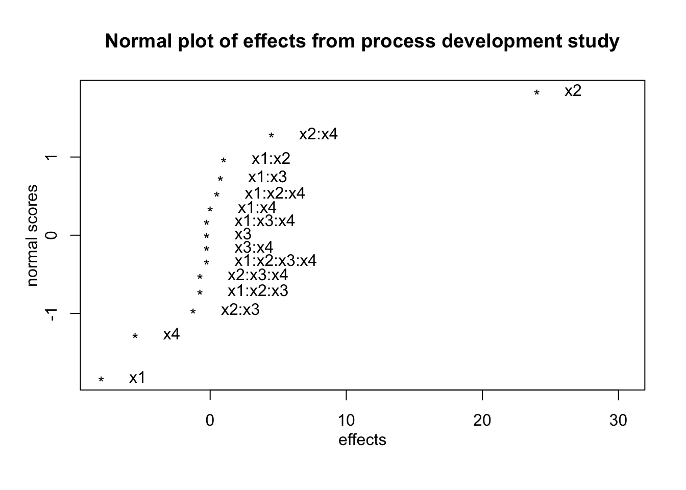

# Factorial Designs at Two Levels - $2^k$ Designs

Suppose that an investigator is interested in examining three components of a weight loss intervention.
The three components are:

1. Keeping a food diary (yes/no)
2. Increasing activity (yes/no)
3. Home visit (yes/no)

The investigator plans to investigate all $2x2x2 = 2^3= 8$ combinations of experimental conditions.
The experimental conditions will be.

---------------------------------------------------------------------------------
Experimental      Keep a food diary   Increasing          Home visit  Weight loss
Condition                             physical activity
number
-------------    ------------------- ------------------- ---------- ------------
1                No                  No                  No          $y_1$

2                No                  No                  Yes         $y_2$

3                No                  Yes                 No          $y_3$

4                No                  Yes                 Yes         $y_4$

5                Yes                 No                  No          $y_5$

6                Yes                 No                  Yes         $y_6$

7                Yes                 Yes                 No          $y_7$

8                Yes                 Yes                 Yes         $y_8$
---------------------------------------------------------------------------------
- To perform a factorial design, you select a fixed number of levels of each of a number of factors (variables) and then run experiments in all possible combinations. 

- The factors can be quantitative or qualitative. 
- Two levels of a quantitative variable could be two different temperatures or two different concentrations. 
- Qualitative factors might be two types of catalysts or the presence and absence of some entity.  

The notation $2^3$ identifies: 
- the number of factors (3)
- the number of levels of each factor (2)
- how many experimental conditions are in the design ($2^3 = 8$)

Factorial experiments can involve factors with different numbers of levels.  

**Exercise**

Consider a $4^2x3^2x2$ design.

(a) How many factors?
(b) How many levels of each factor?
(c) How many experimental conditions (runs)? 

Answer:  (a) There are 2+2+1 = 5 factors.  (b) Two factors have 4 levels, 2 factors have 3 levels, and 1 factor has 2 levels. (c) There are 288 experimental conditions or runs.

## Difference between ANOVA and Factorial Designs

In ANOVA the objective is to compare the individual experimental conditions with each other.
In a factorial experiment the objective is generally to compare combinations of experimental conditions.

Let's consider the food diary study above.  What is the effect of keeping a food diary?  

We can estimate the effect of food diary by comparing the mean of all conditions where food diary is set to NO (conditions 1-4) and mean of all conditions where food diary set to YES (conditions 5-8).  This is also called the **main effect** of food diary, the adjective *main* being a reminder that this average is taken over the levels of the other factors.   

The main effect of food diary is:

$$\frac{y_1+y_2+y_3+y_4}{4}-\frac{y_5+y_6+y_7+y_8}{4}.$$

The main effect of physical activity is:

$$\frac{y_1+y_2+y_5+y_6}{4}-\frac{y_3+y_4+y_7+y_8}{4}.$$

The main effect of home visit is:

$$\frac{y_1+y_3+y_5+y_7}{4}-\frac{y_2+y_4+y_6+y_8}{4}.$$

All experimental subjects are used, but are rearranged to make each comparison. Subjects are recycled to measure different effects.  This is one reason why factorial experiments are more efficient.


## Performing a $2^k$ Factorial Design

To perform a factorial design:

1. Select a fixed number of levels of each factor.
2. Run experiments in all possible combinations.

We will discuss designs where there are just two levels for each factor. Factors can be quantitative or qualitative. Two levels of quantitative variable could be two different temperatures or concentrations. Two levels of a quantitative variable could be two different types of catalysts or presence/absence of some entity.

The following example if from @bhh2005.  

An experiment employed a $2^3$ factorial design with two quantitative factors - temperature (T) and concentration (C) - and a single qualitative factor  - type of catalyst K.  

Temperature T ($\rm {C}^{\circ}$) has two levels: $160 \rm {C}^{\circ}$, and $180 \rm {C}^{\circ}$.  These are coded as -1 and +1 respectively. 

Concentration C (%) has two levels: 20 and 40.  These are coded as -1 and +1 respectively. 

Catalyst K has two levels: A and B. These are coded as -1 and +1 respectively. 

Each data value recorded is for the response yield $y$ averaged over two duplicate runs.


 run    T    C    K    y
----  ---  ---  ---  ---
   1   -1   -1   -1   60
   2    1   -1   -1   72
   3   -1    1   -1   54
   4    1    1   -1   68
   5   -1   -1    1   52
   6    1   -1    1   83
   7   -1    1    1   45
   8    1    1    1   80


## Cube plots

The figure below shows the value of $y$  for the various combinations of factors T, C, and K at the corners of a cube.  For example, $y = 54$ was obtained from the run 3 when T=-1, C = 1, and K=-1.

- The cube shows how this design produces 12 comparisons along the 12 edges of the cube: four measures of the effect of temperature change; four measures of the effect of concentration change; four measures of the effect of catalyst change.

- On each edge of the cube only one factor is changed with the other two held constant.  


```r
library("FrF2")
bhh54 <- lm(y~T*C*K,data = tab0502)
cubePlot(bhh54,"T","K","C",main = "Cube plot for pilot plant investigation")
```


## Factorial effects

### Main effects

The effects of runs 1 and 2 differ only because of temperature since concentration is 20% and type of catalyst is A.  The difference 72-60 = 12 supplies one measure of the temperature effect with the remaining factors held fixed.  There are four such measures of the temperature effect one for each of the four combinations of concentration and catalyst.

C | K | Effect of changing T from 160 to 180
--|---|-------------------------------------
20| A | $y_2-y_1 = 72-60 = 12$
40| A | $y_4-y_3 = 68-54 = 14$
20| B | $y_6-y_5 = 83-52 = 31$
40| B | $y_8-y_7 = 80-45 = 35$

The main (average) effect of T is

$$T=\frac{12+14+31+35}{4}=23$$

There are a similar set of measures for the concentration C.  In each of these the levels T and K are kept constant.  The main effect for concentration C is:

T | K | Effect of changing C from 20 to 40
--|---|-------------------------------------
160| A | $y_3-y_1 = 54-60=-6$
180| A | $y_4-y_2 = 68-72=-4$
160| B | $y_7-y_5 = 45-52=-7$
180| B | $y_8-y_6 = 80-83=-3$

The main (average) effect of C is

$$C=\frac{(-6)+(-4)+(-7)+(-3)}{4}=-5$$

The main effect for K is

T | C | Effect of changing K from A to B
--|---|-------------------------------------
160| 20 | $y_5-y_1 = 52-60=-8$
180| 20 | $y_6-y_2 = 83-72 = 11$
160| 40 | $y_7-y_3 = 45-54=-9$
180| 40 | $y_8-y_4 = 80-68 = 12$

The main (average) effect of K is

$$K=\frac{(-8)+(11)+(-9)+(12)}{4}=1.5$$


All 8 runs are used to estimate each of the main effects.  This is the reason that factorial designs are more efficient compared to examining one factor at a time.

In general the main effects are the differences between two averages:

$$\text {Main Effect}={\bar y}_{+}-{\bar y}_{-}.$$

Where ${\bar y}_{+}$ is the average response corresponding to the +1 level of the factor and ${\bar y}_{-}$ is the average response corresponding to the -1 level of the factor. 

$$\begin{aligned}
T &= \frac{72+68+83+80}{4} -\frac{60+54+52+45}{4}=23 \\
C &= \frac{54+68+45+80}{4} -\frac{60+72+52+83}{4}=-5 \\
K &= \frac{52+83+45+80}{4} -\frac{60+72+54+68}{4}=1.5
\end{aligned}$$

### Interaction effects

#### Two factor interactions

When the catalyst K is A the temperature effect is:

$$\frac{68+72}{2}-\frac{60+54}{2}=70-57 = 13.$$

When the catalyst K is B the temperature effect is:

$$\frac{83+80}{2}-\frac{52+45}{2}=81.5-48.5 = 33.$$

The average difference between these two average differences is called the **interaction** between temperature and catalyst denoted by TK.  This is the interaction between the two factors temperature and catalyst - the two factor interaction between temperature and catalyst.

$$TK=\frac{33-13}{2}=10$$


This can also be seen on the cube plot:  the average temperature effect is greater on the back face of the cube (33) compared to the front face of the cube (13).

#### Three factor interactions

The temperature by concentration interaction when the catalyst is B (at it's +1 level) is:

$$ \text {Interaction TC} = \frac{(y_8-y_7)-(y_6-y_5)}{2} =\frac{(80-45)-(83-52)}{2}=2.$$

The temperature by concentration interaction when the catalyst is A (at it's -1 level) is:

$$ \text {Interaction TC} = \frac{(y_4-y_3)-(y_2-y_1)}{2} =\frac{(68-54)-(72-60)}{2}=1.$$

The difference between these two interactions measures how consistent the temperature-by-concentration interaction for the two catalysts.  Half this difference is defined as the three factor interaction of temperature, concentration, and catalyst denoted by TCK.

$$\text{TCK}=\frac{2-1}{2}=\frac{1}{2}.$$

## Replication in factorial designs

The outcome $y$ of the pilot plant experiment was the average of two replicated runs.  The two separate runs are shown in the table below.  The run order was randomized.  For example, runs 6 and 13 are two replicates under the same settings for T, C, and K (T=-1, C=-1, K=-1).  


 run    T    C    K    y
----  ---  ---  ---  ---
   6   -1   -1   -1   59
   2    1   -1   -1   74
   1   -1    1   -1   50
   5    1    1   -1   69
   8   -1   -1    1   50
   9    1   -1    1   81
   3   -1    1    1   46
   7    1    1    1   79
  13   -1   -1   -1   61
   4    1   -1   -1   70
  16   -1    1   -1   58
  10    1    1   -1   67
  12   -1   -1    1   54
  14    1   -1    1   85
  11   -1    1    1   44
  15    1    1    1   81

Replicating a run is not always feasible. The pilot plant experiment run involved cleaning the reactor, inserting the appropriate catalyst charge, and running the apparatus at a given temperature at a given feed concentration for 3 hours to a1low the process to settle down at the chosen experimental conditions, and (4) sampling the output every 15 minutes
during the final hours of running. (Box, Hunter, Hunter, 2005)


 run1   run2    T    C    K   y1   y2   diff
-----  -----  ---  ---  ---  ---  ---  -----
    6     13   -1   -1   -1   59   61     -2
    2      4    1   -1   -1   74   70      4
    1     16   -1    1   -1   50   58     -8
    5     10    1    1   -1   69   67      2
    8     12   -1   -1    1   50   54     -4
    9     14    1   -1    1   81   85     -4
    3     11   -1    1    1   46   44      2
    7     15    1    1    1   79   81     -2

Suppose that the variance of each measurement is $\sigma^2$. The estimated variance at each set of conditions is:

$$ s_i^2 = \frac{\left(y_{i1}-y_{i2}\right)^2}{2}=\frac{{\text {diff}}^2}{2},$$

where $y_{i1}$ is the first outcome from $ith$ run.  In the table above $\text{diff}_i= \left(y_{i1}-y_{i2}\right)$.  A pooled estimate of $\sigma^2$ is 

$$s^2=\frac{\sum_{i = 1}^8 s_{i}^2} {8}=\frac{64}{8}=8.$$

The estimate of the variance with one degree of freedom for a duplicated run is $s_i^2=\left(y_{i1}-y_{i2}\right).$   The average of these yields single degree-of-freedom estimates yields a pooled estimate $s^2 = 8$ with 8 degrees of freedom. 


## Estimate of the error variance and standard error of effects from replicated runs

Each estimated effect such as T, C, K, TC, etc. is a difference between two averages of 8 observations.  The variance of a factorial effect for duplicated runs is

$$Var\left(\text{effect}\right)=\left(\frac{1}{8}+\frac{1}{8}\right)s^2=\frac{8}{4}=2$$

So, the standard error of any factorial effect is:

$$se\left(\text{effect}\right)=\sqrt{2}=1.4.$$

## Interpretation of results

Which effects are real and which can be explained by chance?  A rough rule of thumb is any effect that is 2-3 times their standard error are not easily explained by chance alone.

If we assume that the observations are independent and normally distributed then $$\text{effect}/se\left(\text{effect}\right) \sim t_8.$$

So a 95% confidence interval can be calculated as:

$$\text{effect} \pm t_{8,.05/2}sese\left(\text{effect}\right).$$

where $t_{8,.05/2}$ is the 97.5th percentile of the $t_8$.  This is obtained in R via the `qt()` function.


```r
qt(p = 1-.025,df = 8)
```

```
## [1] 2.306004
```

So, a 95% confidence interval for a factorial effect is

$$\text{effect} \pm 2.3 \times 1.4 =\text{effect} \pm 3.2.$$

A 95% confidence interval for T is


```r
23-3.2 #lower limit 
```

```
## [1] 19.8
```

```r
23+3.2 #upper limit
```

```
## [1] 26.2
```

A 95% confidence interval for K is 


```r
1.5-3.2 #lower limit 
```

```
## [1] -1.7
```

```r
1.5+3.2 #upper limit
```

```
## [1] 4.7
```

The effect due to temperature is probably not due to chance, but chance cannot be rules for the effect due to catalyst. 

The main effect of a factor should be individually interpreted only if there is no evidence that the factor interacts with other factors.

## Interaction plots

The plots below show the mean yield for each pair of factors TC, TK, CK (i.e., each factor-level combination of these factors).  These plots are often called interaction plots.  If the two lines are parallel then this indicates no interaction, and if the lines cross or are close to crossing then this indicates that an interaction might be present.

The plots below indicate a two-way interaction between catalyst and temperature.


```r
interaction.plot(tab0502$T,tab0502$C,tab0502$y, type = "l",
                 xlab = "Temperature",trace.label = "Concentration",
                 ylab = "Mean yield")
```


```r
interaction.plot(tab0502$T,tab0502$K,tab0502$y, type = "l",
                 xlab = "Temperature",trace.label = "Catalyst",
                 ylab = "Mean yield")
```


```r
interaction.plot(tab0502$K,tab0502$C,tab0502$y, type = "l",
                 xlab = "Catalyst",trace.label = "Concentration",
                 ylab = "Mean yield")
```


## Linear Model for a $2^k$ Factorial Design

Let $y_{i}$ be the yield from the $i^{th}$ run,

$$x_{i1} =
\left\{
  \begin{array}{ll}
		+1  & \mbox{if } T = 180 \\
		-1 & \mbox{if } T = 160
	\end{array}
\right.$$ 

$$x_{i2} =
\left\{
  \begin{array}{ll}
    +1  & \mbox{if } C = 40 \\
		-1 & \mbox{if } C = 20
	\end{array}
\right.$$

$$x_{i3} =
\left\{
  \begin{array}{ll}
  	+1  & \mbox{if } K = B \\
		-1 & \mbox{if } K = A
	\end{array}
\right.$$

A linear model for a $2^3$ factorial design is:

$$y_i=\beta_0+\beta_1 x_{i1}+\beta_2 x_{i2}+\beta_3 x_{i3}+\beta_4 x_{i1}x_{i2} +\beta_5 x_{i1}x_{i3}+\beta_6 x_{i2}x_{i3} +\beta_7 x_{i1} x_{i2} x_{i3} + \epsilon_i.$$

The variables $x_{i1}x_{i2}$ is the interaction between temperature and concentration, $x_{i1}x_{i3}$ is the interaction between temperature and catalyst, etc.

The parameter estimates are obtained via the `lm()` function in R.


```r
fact.mod <-lm(y~T*K*C,data = tab0503)
round(summary(fact.mod)$coefficients,2)
```

```
            Estimate Std. Error t value Pr(>|t|)
(Intercept)    64.25       0.71   90.86     0.00
T              11.50       0.71   16.26     0.00
K               0.75       0.71    1.06     0.32
C              -2.50       0.71   -3.54     0.01
T:K             5.00       0.71    7.07     0.00
T:C             0.75       0.71    1.06     0.32
K:C             0.00       0.71    0.00     1.00
T:K:C           0.25       0.71    0.35     0.73
```

The table of contrasts for a $2^3$ design is the design matrix $X$ from the linear model above.

<table>
 <thead>
  <tr>
   <th style="text-align:right;"> Mean </th>
   <th style="text-align:right;"> T </th>
   <th style="text-align:right;"> K </th>
   <th style="text-align:right;"> C </th>
   <th style="text-align:right;"> T:K </th>
   <th style="text-align:right;"> T:C </th>
   <th style="text-align:right;"> K:C </th>
   <th style="text-align:right;"> T:K:C </th>
   <th style="text-align:right;"> yield average </th>
  </tr>
 </thead>
<tbody>
  <tr>
   <td style="text-align:right;"> 1 </td>
   <td style="text-align:right;"> -1 </td>
   <td style="text-align:right;"> -1 </td>
   <td style="text-align:right;"> -1 </td>
   <td style="text-align:right;"> 1 </td>
   <td style="text-align:right;"> 1 </td>
   <td style="text-align:right;"> 1 </td>
   <td style="text-align:right;"> -1 </td>
   <td style="text-align:right;"> 60 </td>
  </tr>
  <tr>
   <td style="text-align:right;"> 1 </td>
   <td style="text-align:right;"> 1 </td>
   <td style="text-align:right;"> -1 </td>
   <td style="text-align:right;"> -1 </td>
   <td style="text-align:right;"> -1 </td>
   <td style="text-align:right;"> -1 </td>
   <td style="text-align:right;"> 1 </td>
   <td style="text-align:right;"> 1 </td>
   <td style="text-align:right;"> 72 </td>
  </tr>
  <tr>
   <td style="text-align:right;"> 1 </td>
   <td style="text-align:right;"> -1 </td>
   <td style="text-align:right;"> -1 </td>
   <td style="text-align:right;"> 1 </td>
   <td style="text-align:right;"> 1 </td>
   <td style="text-align:right;"> -1 </td>
   <td style="text-align:right;"> -1 </td>
   <td style="text-align:right;"> 1 </td>
   <td style="text-align:right;"> 54 </td>
  </tr>
  <tr>
   <td style="text-align:right;"> 1 </td>
   <td style="text-align:right;"> 1 </td>
   <td style="text-align:right;"> -1 </td>
   <td style="text-align:right;"> 1 </td>
   <td style="text-align:right;"> -1 </td>
   <td style="text-align:right;"> 1 </td>
   <td style="text-align:right;"> -1 </td>
   <td style="text-align:right;"> -1 </td>
   <td style="text-align:right;"> 68 </td>
  </tr>
  <tr>
   <td style="text-align:right;"> 1 </td>
   <td style="text-align:right;"> -1 </td>
   <td style="text-align:right;"> 1 </td>
   <td style="text-align:right;"> -1 </td>
   <td style="text-align:right;"> -1 </td>
   <td style="text-align:right;"> 1 </td>
   <td style="text-align:right;"> -1 </td>
   <td style="text-align:right;"> 1 </td>
   <td style="text-align:right;"> 52 </td>
  </tr>
  <tr>
   <td style="text-align:right;"> 1 </td>
   <td style="text-align:right;"> 1 </td>
   <td style="text-align:right;"> 1 </td>
   <td style="text-align:right;"> -1 </td>
   <td style="text-align:right;"> 1 </td>
   <td style="text-align:right;"> -1 </td>
   <td style="text-align:right;"> -1 </td>
   <td style="text-align:right;"> -1 </td>
   <td style="text-align:right;"> 83 </td>
  </tr>
  <tr>
   <td style="text-align:right;"> 1 </td>
   <td style="text-align:right;"> -1 </td>
   <td style="text-align:right;"> 1 </td>
   <td style="text-align:right;"> 1 </td>
   <td style="text-align:right;"> -1 </td>
   <td style="text-align:right;"> -1 </td>
   <td style="text-align:right;"> 1 </td>
   <td style="text-align:right;"> -1 </td>
   <td style="text-align:right;"> 45 </td>
  </tr>
  <tr>
   <td style="text-align:right;"> 1 </td>
   <td style="text-align:right;"> 1 </td>
   <td style="text-align:right;"> 1 </td>
   <td style="text-align:right;"> 1 </td>
   <td style="text-align:right;"> 1 </td>
   <td style="text-align:right;"> 1 </td>
   <td style="text-align:right;"> 1 </td>
   <td style="text-align:right;"> 1 </td>
   <td style="text-align:right;"> 80 </td>
  </tr>
</tbody>
</table>

If the column of T is multiplied by the yield average and divided by 4 then the main effect of T is obtained.

- $T=\frac{-60+72-54+68-52+83-45+80}{4}=23.$  The divisor of 4 transforms the contrast into a difference between two averages.
- Signs for interaction contrasts obtained by multiplying signs of their respective factors.
- Each column perfectly balanced (equal numbers of positives and negatives) with respect to other columns.
- Balanced (orthogonal) design ensures each estimated effect is unaffected by magnitude and signs of other effects.

The estimated least squares coefficients are one-half the factorial estimates, and the intercept $\beta_0$ is the sample mean. Therefore, the factorial estimates are twice the least squares coefficients.  For example, 

$$\begin{aligned}
{\hat \beta_1}=11.63 &\Rightarrow T = 2 \times 11.63 = 23.26\\
{\hat \beta_2}=0.88 &\Rightarrow K = 2 \times 0.88 = 1.75 \\
{\hat \beta_4}=5.12 &\Rightarrow TK = 2 \times 5.12 = 10.25
\end{aligned}$$

The least squares estimates can be multiplied by 2 in R.  


```r
fact.mod <-lm(y~T*K*C,data = tab0503)
round(2*fact.mod$coefficients,2)
```

```
(Intercept)           T           K           C         T:K         T:C 
      128.5        23.0         1.5        -5.0        10.0         1.5 
        K:C       T:K:C 
        0.0         0.5 
```

When there are replicated runs we also obtain p-values and confidence intervals for the factorial effects from the regression model. For example, the p-value for $\beta_1$ corresponds to the factorial effect for temperature

$$H_0: \beta_1 = 0 {\hspace{0.2cm}} \text{vs.} {\hspace{0.2cm}} H_1:\beta_1 \ne 0.$$

If the null hypothesis is true then $\beta_1 = 0 \Rightarrow T = 0 \Rightarrow \mu_{T+}-\mu_{T-}=0 \Rightarrow \mu_{T+}=\mu_{T-},$

where $\mu_{T+}$ is the mean yield when the temperature is set at $180^{\circ}$ and $\mu_{T-}$ is the mean yield when the temperature is set to $160^{\circ}.$  The p-value for temperature is small (Pr(>|t|)=0).  This means that there is evidence that the mean yield is different at  $180^{\circ}$ compared to $160^{\circ}$.   

To obtain 95% confidence intervals for the factorial effects we multiply the 95% confidence intervals for the regression parameters by 2.  This is easily done in R using the function `confint.lm()`.


```r
2*confint.lm(fact.mod)
```

```
                 2.5 %     97.5 %
(Intercept) 125.238818 131.761182
T            19.738818  26.261182
K            -1.761182   4.761182
C            -8.261182  -1.738818
T:K           6.738818  13.261182
T:C          -1.761182   4.761182
K:C          -3.261182   3.261182
T:K:C        -2.761182   3.761182
```

The 95% confidence interval for the main effect of concentration is (-8.0,-1.5), and the two-way interaction between temperature and concentration has 95% confidence interval (-1.46,4.96).

## Advantages of factorial designs over one-factor-at-a-time designs

Suppose that one factor at a time was investigated.  For example, temperature is investigated while holding concentration at 20% (-1) and catalyst at B (+1).  

In order for the effect to have more general relevance it would be necessary for the effect to be the same at all the other levels of concentration and catalyst.  In other words there is no interaction between factors (e.g., temperature and catalyst).  If the effect is the same then a factorial design is more efficient since the estimates of the effects require fewer observations to achieve the same precision.  

If the effect is different at other levels of concentration and catalyst then the factorial can detect and estimate interactions. 

## Normal Plots in Unreplicated Factorial Designs

### Review of Normal Quantile Plots

The normality of a set of data can be assessed by the following method.
Let $r_{(1)}<...<r_{(N)}$ denote the ordered values of $r_1,...,r_N$.  For example, $r_{(1)}$ is the minimum of ${r_1,...,r_N}$, and $r_{(N)}$ is the maximum of ${r_1,...,r_N}$. So, if the data is: -1, 2, -10, 20 then $r_{(1)}=-20,r_{(2)}=-1, r_{(3)}=2, r_{(4)}=20$.


The cumulative distribution function (CDF) of the $N(0,1)$ has an S-shape.


```r
x <- seq(-4,4,by = 0.1)
plot(x,pnorm(x),type = "l")
```


So, a test of normality for a set of data is to plot the ordered values $r_{(i)}$ of the data versus $p_i=(i-0.5)/N$.  If the plot has the same S-shape as the normal CDF then this is evidence that the data come from a normal distribution.

Below is a plot of $r_{(i)}$ vs. $p_i=(i-0.5)/N, i = 1,...,N$ for a random sample of 1000 simulated from the plot


```r
N <- 1000
x <- rnorm(N)
p <- ((1:N)-0.5)/N
plot(sort(x),p)
```


We can also construct a normal quantile-quantile plot.  It can be shown that $\Phi(r_{(i)})$ has a uniform distribution on $[0,1]$.  This implies that $E(\Phi(r_{(i)}))=i/(N+1)$ (this is the expected value of the $ith$ order statistic from a uniform distribution over $[0,1]$.  

This implies that the $N$ points $(p_i,\Phi(r_{(i)}))$ should fall on a straight line.  Now apply the $\Phi^{-1}$ transformation to the horizontal and vertical scales. The $N$ points

$$\left(\Phi^{-1}(p_i), r_{(i)} \right)$$ 

form the normal probability plot of $r_1,...,r_N$.  If $r_1,...,r_N$ are generated from a normal distribution then a plot of the points $\left(\Phi^{-1}(p_i), r_{(i)} \right), i = 1,...,N$ should be a straight line.

In R `qnorm()` is $\Phi^{-1}$.  


```r
set.seed(2503)
N <- 1000
x <- rnorm(N)
p <- (1:N)/(N+1)
plot(qnorm(p),sort(x))
```


We usually use the built in function `qqnorm()` (and `qqline()` to add a straight line for comparison) to generate normal Q-Q plots.  Note that R uses a slightly more general version of quantile ($p_i=(1-a)/(N+(1-a)-a)$, where $a = 3/8$, if $N \le 10$, $a = 1/2$, if $N > 10$.


```r
qqnorm(x);qqline(x)
```


A marked (systematic) deviation of the plot from the straight line would indicate that:

1. The normality assumption does not hold. 
2. The variance is not constant.


A major application is in factorial designs where the $r(i)$ are replaced by ordered factorial effects.
Let $\hat {\theta_{(1)}} < \hat {\theta_{(2)}} < \cdots < \hat {\theta_{(N)}}$ be $N$ ordered factorial estimates. If we plot 

$$\hat {\theta_{i}} \thinspace {\text vs. } \thinspace \Phi^{-1}(p_i). \thinspace i = 1,...,N.$$

then factorial effects $\hat {\theta_{i}}$ that are close to 0 will fall along a straight line. Therefore, points that fall off the straight line will be declared significant.

The rationale is as follows:
1. Assume that the estimated effects $\hat {\theta_{i}}$ are $N(\theta, \sigma)$ (estimated effects involve averaging of N observations and CLT ensures averages are nearly normal for N as small as 8).
2. If $H_0: \theta_i = 0, \thinspace i = 1,...,N$ is true then all the estimated effects will be zero.
3. The resulting normal probability plot of the estimated effects will be a straight line.
4. Therefore, the normal probability plot is testing whether all of the estimated effects have the same distribution (i.e. same means).

-  When some of the effects are nonzero the corresponding estimated effects will tend to be larger and fall off the straight line.
-  For positive effects the estimated effects fall above the line and negative effects fall below the line.

### Example - $2^4$ design for studying a chemical reaction

A process development experiment studied four factors in a $2^4$ factorial design: amount of catalyst charge **1**, temperature **2**, pressure **3**, and concentration of one of the reactants **4**.  The response $y$ is the percent conversion at each of the 16 run conditions. The design is shown below. 

<table>
 <thead>
  <tr>
   <th style="text-align:right;"> x1 </th>
   <th style="text-align:right;"> x2 </th>
   <th style="text-align:right;"> x3 </th>
   <th style="text-align:right;"> x4 </th>
   <th style="text-align:right;"> conversion </th>
  </tr>
 </thead>
<tbody>
  <tr>
   <td style="text-align:right;"> -1 </td>
   <td style="text-align:right;"> -1 </td>
   <td style="text-align:right;"> -1 </td>
   <td style="text-align:right;"> -1 </td>
   <td style="text-align:right;"> 70 </td>
  </tr>
  <tr>
   <td style="text-align:right;"> 1 </td>
   <td style="text-align:right;"> -1 </td>
   <td style="text-align:right;"> -1 </td>
   <td style="text-align:right;"> -1 </td>
   <td style="text-align:right;"> 60 </td>
  </tr>
  <tr>
   <td style="text-align:right;"> -1 </td>
   <td style="text-align:right;"> 1 </td>
   <td style="text-align:right;"> -1 </td>
   <td style="text-align:right;"> -1 </td>
   <td style="text-align:right;"> 89 </td>
  </tr>
  <tr>
   <td style="text-align:right;"> 1 </td>
   <td style="text-align:right;"> 1 </td>
   <td style="text-align:right;"> -1 </td>
   <td style="text-align:right;"> -1 </td>
   <td style="text-align:right;"> 81 </td>
  </tr>
  <tr>
   <td style="text-align:right;"> -1 </td>
   <td style="text-align:right;"> -1 </td>
   <td style="text-align:right;"> 1 </td>
   <td style="text-align:right;"> -1 </td>
   <td style="text-align:right;"> 69 </td>
  </tr>
  <tr>
   <td style="text-align:right;"> 1 </td>
   <td style="text-align:right;"> -1 </td>
   <td style="text-align:right;"> 1 </td>
   <td style="text-align:right;"> -1 </td>
   <td style="text-align:right;"> 62 </td>
  </tr>
  <tr>
   <td style="text-align:right;"> -1 </td>
   <td style="text-align:right;"> 1 </td>
   <td style="text-align:right;"> 1 </td>
   <td style="text-align:right;"> -1 </td>
   <td style="text-align:right;"> 88 </td>
  </tr>
  <tr>
   <td style="text-align:right;"> 1 </td>
   <td style="text-align:right;"> 1 </td>
   <td style="text-align:right;"> 1 </td>
   <td style="text-align:right;"> -1 </td>
   <td style="text-align:right;"> 81 </td>
  </tr>
  <tr>
   <td style="text-align:right;"> -1 </td>
   <td style="text-align:right;"> -1 </td>
   <td style="text-align:right;"> -1 </td>
   <td style="text-align:right;"> 1 </td>
   <td style="text-align:right;"> 60 </td>
  </tr>
  <tr>
   <td style="text-align:right;"> 1 </td>
   <td style="text-align:right;"> -1 </td>
   <td style="text-align:right;"> -1 </td>
   <td style="text-align:right;"> 1 </td>
   <td style="text-align:right;"> 49 </td>
  </tr>
  <tr>
   <td style="text-align:right;"> -1 </td>
   <td style="text-align:right;"> 1 </td>
   <td style="text-align:right;"> -1 </td>
   <td style="text-align:right;"> 1 </td>
   <td style="text-align:right;"> 88 </td>
  </tr>
  <tr>
   <td style="text-align:right;"> 1 </td>
   <td style="text-align:right;"> 1 </td>
   <td style="text-align:right;"> -1 </td>
   <td style="text-align:right;"> 1 </td>
   <td style="text-align:right;"> 82 </td>
  </tr>
  <tr>
   <td style="text-align:right;"> -1 </td>
   <td style="text-align:right;"> -1 </td>
   <td style="text-align:right;"> 1 </td>
   <td style="text-align:right;"> 1 </td>
   <td style="text-align:right;"> 60 </td>
  </tr>
  <tr>
   <td style="text-align:right;"> 1 </td>
   <td style="text-align:right;"> -1 </td>
   <td style="text-align:right;"> 1 </td>
   <td style="text-align:right;"> 1 </td>
   <td style="text-align:right;"> 52 </td>
  </tr>
  <tr>
   <td style="text-align:right;"> -1 </td>
   <td style="text-align:right;"> 1 </td>
   <td style="text-align:right;"> 1 </td>
   <td style="text-align:right;"> 1 </td>
   <td style="text-align:right;"> 86 </td>
  </tr>
  <tr>
   <td style="text-align:right;"> 1 </td>
   <td style="text-align:right;"> 1 </td>
   <td style="text-align:right;"> 1 </td>
   <td style="text-align:right;"> 1 </td>
   <td style="text-align:right;"> 79 </td>
  </tr>
</tbody>
</table>

The design is not replicated so it's not possible to estimate the standard errors of the factorial effects.  


```r
fact1 <- lm(conversion~x1*x2*x3*x4,data = tab0510a)
round(2*fact1$coefficients,2)
```

```
(Intercept)          x1          x2          x3          x4       x1:x2 
     144.50       -8.00       24.00       -0.25       -5.50        1.00 
      x1:x3       x2:x3       x1:x4       x2:x4       x3:x4    x1:x2:x3 
       0.75       -1.25        0.00        4.50       -0.25       -0.75 
   x1:x2:x4    x1:x3:x4    x2:x3:x4 x1:x2:x3:x4 
       0.50       -0.25       -0.75       -0.25 
```

A normal plot of the factorial effects is obtained by using the function `DanielPlot()` in the `FrF2` library.


```r
library(FrF2)
DanielPlot(fact1,half = FALSE,autolab = F, main = "Normal plot of effects from process development study")
```

```
## Warning in plot.window(...): "autolab" is not a graphical parameter
```

```
## Warning in plot.xy(xy, type, ...): "autolab" is not a graphical parameter
```

```
## Warning in axis(side = side, at = at, labels = labels, ...): "autolab" is not a
## graphical parameter

## Warning in axis(side = side, at = at, labels = labels, ...): "autolab" is not a
## graphical parameter
```

```
## Warning in box(...): "autolab" is not a graphical parameter
```

```
## Warning in title(...): "autolab" is not a graphical parameter
```



The effects corresponding to `x1, x4, x2:x4, x2` do not fall along the straight line.

## Half-Normal Plots

Related graphical method is called the half-normal probability plot. Let  

$$\left|\hat{\theta}\right|_{(1)} < \left|\hat{\theta}\right|_{(2)} < \cdots < \left|\hat{\theta}\right|_{(N)}.$$

denote the ordered values of the unsigned factorial effect estimates.

Plot them against the coordinates based on the half-normal distribution - the absolute value of a normal random variable has a half-normal distribution.

The half-normal probability plot consists of the points

$$\left|\hat{\theta}\right|_{(i)} \thinspace {\text vs. } \thinspace \Phi^{-1}(0.5+0.5[i-0.5]/N). \thinspace i = 1,...,N.$$

An advantage of this plot is that all the large estimated effects appear in the upper right hand corner and fall above the line.

The half-normal plot for the effects in the process development example is can be obtained with `DanielPlot()` with the option `half = TRUE`.


```r
library(FrF2)
DanielPlot(fact1,half = TRUE,autolab = F, main = "Normal plot of effects from process development study")
```

```
## Warning in plot.window(...): "autolab" is not a graphical parameter
```

```
## Warning in plot.xy(xy, type, ...): "autolab" is not a graphical parameter
```

```
## Warning in axis(side = side, at = at, labels = labels, ...): "autolab" is not a
## graphical parameter

## Warning in axis(side = side, at = at, labels = labels, ...): "autolab" is not a
## graphical parameter
```

```
## Warning in box(...): "autolab" is not a graphical parameter
```

```
## Warning in title(...): "autolab" is not a graphical parameter
```


## Lenth’s method: testing significance for experiments without variance estimates

Half-normal and normal plots are informal graphical methods involving visual judgement.  It’s desirable to judge a deviation from a straight line quantitatively based on a formal test of significance.  @lenth1989quick proposed a method that is simple to compute and performs well. (pg. 205, @bhh2005)

Let 

$$\hat{\theta}_{(1)},...,\hat{\theta}_{(N)} $$

be estimated factorial effects of $\theta_1,\theta_2,...,\theta_N$  In a $2^k$ design $N = 2^k-1$.  Assume that all the factorial effects have the same standard deviation. 

The pseudo standard error (PSE) is defined as

$$PSE = 1.5 \cdot \text{median}_{\left|\hat{\theta}_{i}\right|<2.5s_0}\left|\hat{\theta}_{i}\right|,$$

where the median is computed among the $\left|\hat{\theta}_{i}\right|$ with $\left|\hat{\theta}_{i}\right| < 2.5 s_0$ and 

$$s_0 = 1.5 \cdot \text{median}\left|\hat{\theta}_{i}\right|.$$

$1.5 \cdot s_0$ is a consistent estimator of the standard deviation of $\hat \theta$ when $\theta_i = 0$ and the underlying distribution is normal.  The $P\left(|Z|>2.57\right)=0.01, Z\sim N(0,1)$.  So, $\left|\hat{\theta}_{i}\right|<2.5s_0$ trims approximately 1% of the $\hat \theta_i$ if $\theta_i = 0$. The trimming attempts to remove the $\hat \theta_i$ associated with non-zero (active) effects.  By using the median in combination with the trimming means that $PSE$ is not sensitive to the $\hat \theta_i$ associated with active effects.  

By dividing  $\hat \theta_i$ by $PSE$, $t$-like statistics are obtained:

$$t_{PSE,i}=\frac{\hat \theta_i}{PSE}.$$
(see @wu2011experiments, pg. 180)

Lenth's method declares an effect $\hat \theta_i$ significant if the value of $\left|t_{PSE,i} \right|$ value exceeds the critical value of the distribution.  The critical values have been calculated by @wu2011experiments.

To obtain a margin of error Lenth suggested multiplying the PSE by the $100*(1-\alpha)$ quantile of the $t_d$ distribution, $t_{d,\alpha/2}$. The degrees of freedom is $d = N/3$. For example, the margin of error for a 95% confidence interval for $\theta_i$ is

$$ME= t_{d,.025}\times PSE.$$ 

All estimates greater than the $ME$ may be viewed as "significant", but with so many estimates being considered simultaneously, some will be falsely identified.

A simultaneous margin of error that accounts for multiple testing can also be calculated,

$$SME = t_{d,\gamma} \times PSE,$$

where $\gamma=\left(1+0.95^{1/N}\right)/2$.

Let's calculate Lenth's method for the process development example.  The estimated factorial effects are:


```r
eff <- 2*fact1$coefficients
round(eff,2)
```

```
(Intercept)          x1          x2          x3          x4       x1:x2 
     144.50       -8.00       24.00       -0.25       -5.50        1.00 
      x1:x3       x2:x3       x1:x4       x2:x4       x3:x4    x1:x2:x3 
       0.75       -1.25        0.00        4.50       -0.25       -0.75 
   x1:x2:x4    x1:x3:x4    x2:x3:x4 x1:x2:x3:x4 
       0.50       -0.25       -0.75       -0.25 
```

The estimate of $s_0 = 1.5 \cdot \text{median}\left|\hat{\theta}_{i}\right|$ is


```r
s0 <- 1.5*median(abs(eff))
s0
```

```
[1] 1.125
```

The trimming constant $2.5s_0$ is


```r
2.5*s0
```

```
[1] 2.8125
```

The effects $\hat{\theta}_{i}$ such that ${\left|\hat{\theta}_{i}\right| \ge 2.5s_0}$ will be trimmed.  Below it's the effects labelled `TRUE` (`x1,x2,x4,x2:x4`)


```r
abs(eff)<2.5*s0
```

```
(Intercept)          x1          x2          x3          x4       x1:x2 
      FALSE       FALSE       FALSE        TRUE       FALSE        TRUE 
      x1:x3       x2:x3       x1:x4       x2:x4       x3:x4    x1:x2:x3 
       TRUE        TRUE        TRUE       FALSE        TRUE        TRUE 
   x1:x2:x4    x1:x3:x4    x2:x3:x4 x1:x2:x3:x4 
       TRUE        TRUE        TRUE        TRUE 
```

The $PSE$ is then calculated as 1.5 times the median of these values.


```r
PSE <- 1.5*median(abs(eff[abs(eff)<2.5*s0]))
PSE
```

```
[1] 0.75
```

The $ME$ and SME are


```r
ME <- PSE*qt(p = .975,df = (16-1)/3)
ME
```

```
[1] 1.927936
```

```r
SME <- PSE*qt(p =(1+.95^{1/15})/2,df=(16-1)/3)
SME
```

```
[1] 3.913988
```

So, 95% confidence intervals for the effects are:


```r
lower <- round(eff-ME,2)
upper <- round(eff+ME,2)
knitr::kable(cbind(eff,lower,upper))
```

<table>
 <thead>
  <tr>
   <th style="text-align:left;">   </th>
   <th style="text-align:right;"> eff </th>
   <th style="text-align:right;"> lower </th>
   <th style="text-align:right;"> upper </th>
  </tr>
 </thead>
<tbody>
  <tr>
   <td style="text-align:left;"> (Intercept) </td>
   <td style="text-align:right;"> 144.50 </td>
   <td style="text-align:right;"> 142.57 </td>
   <td style="text-align:right;"> 146.43 </td>
  </tr>
  <tr>
   <td style="text-align:left;"> x1 </td>
   <td style="text-align:right;"> -8.00 </td>
   <td style="text-align:right;"> -9.93 </td>
   <td style="text-align:right;"> -6.07 </td>
  </tr>
  <tr>
   <td style="text-align:left;"> x2 </td>
   <td style="text-align:right;"> 24.00 </td>
   <td style="text-align:right;"> 22.07 </td>
   <td style="text-align:right;"> 25.93 </td>
  </tr>
  <tr>
   <td style="text-align:left;"> x3 </td>
   <td style="text-align:right;"> -0.25 </td>
   <td style="text-align:right;"> -2.18 </td>
   <td style="text-align:right;"> 1.68 </td>
  </tr>
  <tr>
   <td style="text-align:left;"> x4 </td>
   <td style="text-align:right;"> -5.50 </td>
   <td style="text-align:right;"> -7.43 </td>
   <td style="text-align:right;"> -3.57 </td>
  </tr>
  <tr>
   <td style="text-align:left;"> x1:x2 </td>
   <td style="text-align:right;"> 1.00 </td>
   <td style="text-align:right;"> -0.93 </td>
   <td style="text-align:right;"> 2.93 </td>
  </tr>
  <tr>
   <td style="text-align:left;"> x1:x3 </td>
   <td style="text-align:right;"> 0.75 </td>
   <td style="text-align:right;"> -1.18 </td>
   <td style="text-align:right;"> 2.68 </td>
  </tr>
  <tr>
   <td style="text-align:left;"> x2:x3 </td>
   <td style="text-align:right;"> -1.25 </td>
   <td style="text-align:right;"> -3.18 </td>
   <td style="text-align:right;"> 0.68 </td>
  </tr>
  <tr>
   <td style="text-align:left;"> x1:x4 </td>
   <td style="text-align:right;"> 0.00 </td>
   <td style="text-align:right;"> -1.93 </td>
   <td style="text-align:right;"> 1.93 </td>
  </tr>
  <tr>
   <td style="text-align:left;"> x2:x4 </td>
   <td style="text-align:right;"> 4.50 </td>
   <td style="text-align:right;"> 2.57 </td>
   <td style="text-align:right;"> 6.43 </td>
  </tr>
  <tr>
   <td style="text-align:left;"> x3:x4 </td>
   <td style="text-align:right;"> -0.25 </td>
   <td style="text-align:right;"> -2.18 </td>
   <td style="text-align:right;"> 1.68 </td>
  </tr>
  <tr>
   <td style="text-align:left;"> x1:x2:x3 </td>
   <td style="text-align:right;"> -0.75 </td>
   <td style="text-align:right;"> -2.68 </td>
   <td style="text-align:right;"> 1.18 </td>
  </tr>
  <tr>
   <td style="text-align:left;"> x1:x2:x4 </td>
   <td style="text-align:right;"> 0.50 </td>
   <td style="text-align:right;"> -1.43 </td>
   <td style="text-align:right;"> 2.43 </td>
  </tr>
  <tr>
   <td style="text-align:left;"> x1:x3:x4 </td>
   <td style="text-align:right;"> -0.25 </td>
   <td style="text-align:right;"> -2.18 </td>
   <td style="text-align:right;"> 1.68 </td>
  </tr>
  <tr>
   <td style="text-align:left;"> x2:x3:x4 </td>
   <td style="text-align:right;"> -0.75 </td>
   <td style="text-align:right;"> -2.68 </td>
   <td style="text-align:right;"> 1.18 </td>
  </tr>
  <tr>
   <td style="text-align:left;"> x1:x2:x3:x4 </td>
   <td style="text-align:right;"> -0.25 </td>
   <td style="text-align:right;"> -2.18 </td>
   <td style="text-align:right;"> 1.68 </td>
  </tr>
</tbody>
</table>

A plot of the effects with a $ME$ and $SME$ is usually called a Lenth plot.  In R it can be implemented via the function `Lenthplot()` in the `BsMD` library.  The values of $PSE, ME, SME$ are part of the output.  The spikes in the plot below are used to display factor effects.


```r
library(BsMD)
LenthPlot(fact1,cex.fac = 0.5)
```


```
   alpha      PSE       ME      SME 
0.050000 0.750000 1.927936 3.913988 
```

The option `cex.fac = 0.5` adjusts the size of the characters used for factor labels.

## Questions

1. (Adapted from BHH question 8, pg. 227) A chemist performed an experiment with temperature at 130 and 150 degrees Celsius and two catalysts.  The chemist performed three runs randomizing the order of runs within each week.

Run number | Temperature | Catalyst
-----------|-------------|----------
1          |   130       | 1 
2          |   130       | 2
3          |   150       | 1

Is this a factorial experiment?  If it is not a factorial experiment then is it possible to turn this design into a factorial design? Explain?


2. What is the table of contrasts for a $2^3$ factorial design.

3. A $2^2$ factorial design involved two factors A and B.  The main effects for A and B are 10 and 12 respectively.  The lab technician that ran the experiment discovered that he made an error in recording the experimental results: whenever factor A was set to the + level the measurement should be increased by 5 (i.e., if $y_i$ is the measurement when A is set to the + level then the measurement should have been recorded as $y_i+5$)  What are the correct main effects for A and B?   

4. Suppose that you were studying two factors A and B each at two levels in a $2^2$ factorial design.  

(a) Write a linear model with parameters that correspond to the main effects.

(b) Use least squares to estimate the parameters in part (a).  

5. (Box, Hunter, and Hunter problem 5.6)  A study was conducted to determine the effects of individual bathers on the fecal and total coliform bacterial populations in water. The variables of interest were the time since the subject's last bath, the vigor of the subject's activity in the water, and the subject's sex. The experiments were performed1ed in a 100-gallon polyethylene tub using dechlorinated tap water at 38°C. The bacterial contribution of each bather was determined by subtracting the bacterial concentration measured al 15 and 30 minutes from that measured initially.

A replicated $2^3$ factorial design was used for this experiment. 

Code | Name | Low Level | High Level
-----|------|-----------|-----------
$x_1$| Time since last bath |1 hour | 24 hour
$x_2$| Vigor of bathing activity |Lethargic |Vigorous
$x_3$| Sex of bather |Female | Male

Code  | Name
------|------------------------------
$y_1$ | Fecal coliform contribution after 15 minutes (organisms/100 mL)
$y_2$ | Fecal coliform contribution after 30 minutes (organisms/100 mL)
$y_3$ |  Total coliform contribution after 15 minutes (organisms/100 mL)
$y_4$ | Total coliform contribution after 30 minutes (organisms/1OO mL)

The data are shown in the table below and can be downloaded [here](./docs/prb0506.dat).

<table>
 <thead>
  <tr>
   <th style="text-align:right;"> run </th>
   <th style="text-align:right;"> x1 </th>
   <th style="text-align:right;"> x2 </th>
   <th style="text-align:right;"> x3 </th>
   <th style="text-align:right;"> y1 </th>
   <th style="text-align:right;"> y2 </th>
   <th style="text-align:right;"> y3 </th>
   <th style="text-align:right;"> y4 </th>
  </tr>
 </thead>
<tbody>
  <tr>
   <td style="text-align:right;"> 1 </td>
   <td style="text-align:right;"> -1 </td>
   <td style="text-align:right;"> -1 </td>
   <td style="text-align:right;"> -1 </td>
   <td style="text-align:right;"> 1 </td>
   <td style="text-align:right;"> 1 </td>
   <td style="text-align:right;"> 3 </td>
   <td style="text-align:right;"> 7 </td>
  </tr>
  <tr>
   <td style="text-align:right;"> 2 </td>
   <td style="text-align:right;"> 1 </td>
   <td style="text-align:right;"> -1 </td>
   <td style="text-align:right;"> -1 </td>
   <td style="text-align:right;"> 12 </td>
   <td style="text-align:right;"> 15 </td>
   <td style="text-align:right;"> 57 </td>
   <td style="text-align:right;"> 80 </td>
  </tr>
  <tr>
   <td style="text-align:right;"> 3 </td>
   <td style="text-align:right;"> -1 </td>
   <td style="text-align:right;"> 1 </td>
   <td style="text-align:right;"> -1 </td>
   <td style="text-align:right;"> 16 </td>
   <td style="text-align:right;"> 10 </td>
   <td style="text-align:right;"> 323 </td>
   <td style="text-align:right;"> 360 </td>
  </tr>
  <tr>
   <td style="text-align:right;"> 4 </td>
   <td style="text-align:right;"> 1 </td>
   <td style="text-align:right;"> 1 </td>
   <td style="text-align:right;"> -1 </td>
   <td style="text-align:right;"> 4 </td>
   <td style="text-align:right;"> 6 </td>
   <td style="text-align:right;"> 183 </td>
   <td style="text-align:right;"> 193 </td>
  </tr>
  <tr>
   <td style="text-align:right;"> 5 </td>
   <td style="text-align:right;"> -1 </td>
   <td style="text-align:right;"> -1 </td>
   <td style="text-align:right;"> 1 </td>
   <td style="text-align:right;"> 153 </td>
   <td style="text-align:right;"> 170 </td>
   <td style="text-align:right;"> 426 </td>
   <td style="text-align:right;"> 590 </td>
  </tr>
  <tr>
   <td style="text-align:right;"> 6 </td>
   <td style="text-align:right;"> 1 </td>
   <td style="text-align:right;"> -1 </td>
   <td style="text-align:right;"> 1 </td>
   <td style="text-align:right;"> 129 </td>
   <td style="text-align:right;"> 148 </td>
   <td style="text-align:right;"> 250 </td>
   <td style="text-align:right;"> 243 </td>
  </tr>
  <tr>
   <td style="text-align:right;"> 7 </td>
   <td style="text-align:right;"> -1 </td>
   <td style="text-align:right;"> 1 </td>
   <td style="text-align:right;"> 1 </td>
   <td style="text-align:right;"> 143 </td>
   <td style="text-align:right;"> 170 </td>
   <td style="text-align:right;"> 580 </td>
   <td style="text-align:right;"> 450 </td>
  </tr>
  <tr>
   <td style="text-align:right;"> 8 </td>
   <td style="text-align:right;"> 1 </td>
   <td style="text-align:right;"> 1 </td>
   <td style="text-align:right;"> 1 </td>
   <td style="text-align:right;"> 113 </td>
   <td style="text-align:right;"> 217 </td>
   <td style="text-align:right;"> 650 </td>
   <td style="text-align:right;"> 735 </td>
  </tr>
  <tr>
   <td style="text-align:right;"> 9 </td>
   <td style="text-align:right;"> -1 </td>
   <td style="text-align:right;"> -1 </td>
   <td style="text-align:right;"> -1 </td>
   <td style="text-align:right;"> 2 </td>
   <td style="text-align:right;"> 4 </td>
   <td style="text-align:right;"> 10 </td>
   <td style="text-align:right;"> 27 </td>
  </tr>
  <tr>
   <td style="text-align:right;"> 10 </td>
   <td style="text-align:right;"> 1 </td>
   <td style="text-align:right;"> -1 </td>
   <td style="text-align:right;"> -1 </td>
   <td style="text-align:right;"> 37 </td>
   <td style="text-align:right;"> 39 </td>
   <td style="text-align:right;"> 280 </td>
   <td style="text-align:right;"> 250 </td>
  </tr>
  <tr>
   <td style="text-align:right;"> 11 </td>
   <td style="text-align:right;"> -1 </td>
   <td style="text-align:right;"> 1 </td>
   <td style="text-align:right;"> -1 </td>
   <td style="text-align:right;"> 21 </td>
   <td style="text-align:right;"> 21 </td>
   <td style="text-align:right;"> 33 </td>
   <td style="text-align:right;"> 53 </td>
  </tr>
  <tr>
   <td style="text-align:right;"> 12 </td>
   <td style="text-align:right;"> 1 </td>
   <td style="text-align:right;"> 1 </td>
   <td style="text-align:right;"> -1 </td>
   <td style="text-align:right;"> 2 </td>
   <td style="text-align:right;"> 5 </td>
   <td style="text-align:right;"> 10 </td>
   <td style="text-align:right;"> 87 </td>
  </tr>
  <tr>
   <td style="text-align:right;"> 13 </td>
   <td style="text-align:right;"> -1 </td>
   <td style="text-align:right;"> -1 </td>
   <td style="text-align:right;"> 1 </td>
   <td style="text-align:right;"> 96 </td>
   <td style="text-align:right;"> 67 </td>
   <td style="text-align:right;"> 147 </td>
   <td style="text-align:right;"> 193 </td>
  </tr>
  <tr>
   <td style="text-align:right;"> 14 </td>
   <td style="text-align:right;"> 1 </td>
   <td style="text-align:right;"> -1 </td>
   <td style="text-align:right;"> 1 </td>
   <td style="text-align:right;"> 390 </td>
   <td style="text-align:right;"> 360 </td>
   <td style="text-align:right;"> 1470 </td>
   <td style="text-align:right;"> 1560 </td>
  </tr>
  <tr>
   <td style="text-align:right;"> 15 </td>
   <td style="text-align:right;"> -1 </td>
   <td style="text-align:right;"> 1 </td>
   <td style="text-align:right;"> 1 </td>
   <td style="text-align:right;"> 300 </td>
   <td style="text-align:right;"> 377 </td>
   <td style="text-align:right;"> 665 </td>
   <td style="text-align:right;"> 810 </td>
  </tr>
  <tr>
   <td style="text-align:right;"> 16 </td>
   <td style="text-align:right;"> 1 </td>
   <td style="text-align:right;"> 1 </td>
   <td style="text-align:right;"> 1 </td>
   <td style="text-align:right;"> 280 </td>
   <td style="text-align:right;"> 250 </td>
   <td style="text-align:right;"> 675 </td>
   <td style="text-align:right;"> 795 </td>
  </tr>
</tbody>
</table>

(a) Calculate main and interaction effects on fecal and total coliform populations after 15 and 30 minutes.

(a) Use R to calculate the main and interaction effects for $y_3$.  

(b) Interpret the main effects and interaction effects in (a).  Do you think that the effects are real or noise? Explain.


## Answers to Questions

1. No this is not a factorial experiment since not all factor-level combinations were run.  If the chemist added a fourth run setting temperature at 150 and catalyst at 2 then the design would be a $2^2$ factorial design.  

2. Multiply columns AB, AC, BC, and ABC to obtain interactions.

<table class="table" style="font-size: 12px; width: auto !important; margin-left: auto; margin-right: auto;">
 <thead>
  <tr>
   <th style="text-align:right;"> A </th>
   <th style="text-align:right;"> B </th>
   <th style="text-align:right;"> C </th>
   <th style="text-align:right;"> AB </th>
   <th style="text-align:right;"> AC </th>
   <th style="text-align:right;"> BC </th>
   <th style="text-align:right;"> ABC </th>
  </tr>
 </thead>
<tbody>
  <tr>
   <td style="text-align:right;"> -1 </td>
   <td style="text-align:right;"> -1 </td>
   <td style="text-align:right;"> -1 </td>
   <td style="text-align:right;"> 1 </td>
   <td style="text-align:right;"> 1 </td>
   <td style="text-align:right;"> 1 </td>
   <td style="text-align:right;"> -1 </td>
  </tr>
  <tr>
   <td style="text-align:right;"> 1 </td>
   <td style="text-align:right;"> -1 </td>
   <td style="text-align:right;"> -1 </td>
   <td style="text-align:right;"> -1 </td>
   <td style="text-align:right;"> -1 </td>
   <td style="text-align:right;"> 1 </td>
   <td style="text-align:right;"> 1 </td>
  </tr>
  <tr>
   <td style="text-align:right;"> -1 </td>
   <td style="text-align:right;"> 1 </td>
   <td style="text-align:right;"> -1 </td>
   <td style="text-align:right;"> -1 </td>
   <td style="text-align:right;"> 1 </td>
   <td style="text-align:right;"> -1 </td>
   <td style="text-align:right;"> 1 </td>
  </tr>
  <tr>
   <td style="text-align:right;"> 1 </td>
   <td style="text-align:right;"> 1 </td>
   <td style="text-align:right;"> -1 </td>
   <td style="text-align:right;"> 1 </td>
   <td style="text-align:right;"> -1 </td>
   <td style="text-align:right;"> -1 </td>
   <td style="text-align:right;"> -1 </td>
  </tr>
  <tr>
   <td style="text-align:right;"> -1 </td>
   <td style="text-align:right;"> -1 </td>
   <td style="text-align:right;"> 1 </td>
   <td style="text-align:right;"> 1 </td>
   <td style="text-align:right;"> -1 </td>
   <td style="text-align:right;"> -1 </td>
   <td style="text-align:right;"> 1 </td>
  </tr>
  <tr>
   <td style="text-align:right;"> 1 </td>
   <td style="text-align:right;"> -1 </td>
   <td style="text-align:right;"> 1 </td>
   <td style="text-align:right;"> -1 </td>
   <td style="text-align:right;"> 1 </td>
   <td style="text-align:right;"> -1 </td>
   <td style="text-align:right;"> -1 </td>
  </tr>
  <tr>
   <td style="text-align:right;"> -1 </td>
   <td style="text-align:right;"> 1 </td>
   <td style="text-align:right;"> 1 </td>
   <td style="text-align:right;"> -1 </td>
   <td style="text-align:right;"> -1 </td>
   <td style="text-align:right;"> 1 </td>
   <td style="text-align:right;"> -1 </td>
  </tr>
  <tr>
   <td style="text-align:right;"> 1 </td>
   <td style="text-align:right;"> 1 </td>
   <td style="text-align:right;"> 1 </td>
   <td style="text-align:right;"> 1 </td>
   <td style="text-align:right;"> 1 </td>
   <td style="text-align:right;"> 1 </td>
   <td style="text-align:right;"> 1 </td>
  </tr>
</tbody>
</table>

3. Using the standard design matrix.  The main effect for A is $\frac{y_2+y_4-y_1-y_3}{2}=10.$ and the main effect for B is $\frac{y_3+y_4-y_1-y_2}{2}=12.$  But the main effect for A should be 

$$\frac{(y_2+5) + (y_4+5)-y_1-y_3}{2}=\frac{y_2 + y_4-y_1-y_3}{2}+\frac{10}{2}=10+\frac{10}{2}=15.$$

The main effect for B should be:

$$\frac{-(y_2+5) + (y_4+5)-y_1+y_3}{2}=\frac{-y_2 + y_4-y_1+y_3}{2}=12.$$

So the main effect of A changes, but the main effect of B remains unchanged.

4. (a) Let A and B be the two factors with two levels denoted + and -.

$$y_i=\beta_0+\beta_1 x_{i1}+\beta_2 x_{i2} +\epsilon_i,$$

where, $i=1,2,3,4$,

$$x_{i1} =
\left\{
  \begin{array}{ll}
  	+1  & \mbox{if } A=+ \\
		-1 & \mbox{if } A=-
	\end{array}
\right.$$ 

$$x_{i2} =
\left\{
  \begin{array}{ll}
    +1  & \mbox{if } B=+ \\
		-1 & \mbox{if } B=-
	\end{array}
\right.$$

(b) The parameter estimates can be obtained by minimizing 

$$L(\beta_0,\beta_1,\beta_2)=\sum_{i=1}^4 \epsilon_i^2=\sum_{i=1}^4 \left(y_i-\beta_0+\beta_1 x_{i1}+\beta_2 x_{i2} \right)^2.$$  

This can be done directly, by directly solving $\frac{\partial L}{\partial \beta_i}=0$.  It's also acceptable to use the fact the $\hat {\beta}=(X'X)^{-1}X'y$, where 

$$X = \begin{bmatrix} 1 & -1 & -1 \\
                      1 & +1 & -1 \\
                      1 & -1 & +1 \\
                      1 & +1 & +1 
      \end{bmatrix}.$$

Use R to calculate $(X'X)^{-1}X'$

```r
X <- matrix(c(1,1,1,1,-1,1,-1,1,-1,-1,1,1),nrow=4,ncol=3)
solve(t(X)%*%X)%*%t(X) 
```

```
##       [,1]  [,2]  [,3] [,4]
## [1,]  0.25  0.25  0.25 0.25
## [2,] -0.25  0.25 -0.25 0.25
## [3,] -0.25 -0.25  0.25 0.25
```

$$\begin{bmatrix} \hat{\beta_0} \\ \hat{\beta_1} \\ \hat{\beta_2} \end{bmatrix} = 
\begin{bmatrix} 
                      .25 & .25 & .25 & .25 \\
                      -.25 & .25 & -.25 & .25 \\
                      -.25 & -.25 & .25 & .25
      \end{bmatrix} \begin{bmatrix} y_1 \\ y_2 \\ y_3 \\ y_4 \end{bmatrix} = 
      \begin{bmatrix} \frac{\sum_{i=1}^4y_i}{4} \\ \frac{y_2+y_4-y_1-y_3}{4} \\ 
      \frac{y_3+y_4-y_1-y_2}{4} \end{bmatrix}$$

Notice that $\hat{\beta_0}={\bar y}$, $\hat{\beta_1}=\frac{1}{2}{\hat A}$, and $\hat{\beta_2}=\frac{1}{2}{\hat B}$, where ${\hat A}$ and ${\hat B}$ are the estiamted factorial effects of A and B.

5. (a) 

<table>
 <thead>
  <tr>
   <th style="text-align:left;">   </th>
   <th style="text-align:right;"> Estimate </th>
   <th style="text-align:right;"> Std. Error </th>
   <th style="text-align:right;"> t value </th>
   <th style="text-align:right;"> Pr(&gt;|t|) </th>
  </tr>
 </thead>
<tbody>
  <tr>
   <td style="text-align:left;"> (Intercept) </td>
   <td style="text-align:right;"> 360.125 </td>
   <td style="text-align:right;"> 82.39335 </td>
   <td style="text-align:right;"> 4.3708018 </td>
   <td style="text-align:right;"> 0.0023779 </td>
  </tr>
  <tr>
   <td style="text-align:left;"> x1 </td>
   <td style="text-align:right;"> 86.750 </td>
   <td style="text-align:right;"> 82.39335 </td>
   <td style="text-align:right;"> 1.0528762 </td>
   <td style="text-align:right;"> 0.3231570 </td>
  </tr>
  <tr>
   <td style="text-align:left;"> x2 </td>
   <td style="text-align:right;"> 29.750 </td>
   <td style="text-align:right;"> 82.39335 </td>
   <td style="text-align:right;"> 0.3610728 </td>
   <td style="text-align:right;"> 0.7273943 </td>
  </tr>
  <tr>
   <td style="text-align:left;"> x3 </td>
   <td style="text-align:right;"> 247.750 </td>
   <td style="text-align:right;"> 82.39335 </td>
   <td style="text-align:right;"> 3.0069174 </td>
   <td style="text-align:right;"> 0.0168927 </td>
  </tr>
  <tr>
   <td style="text-align:left;"> x1:x2 </td>
   <td style="text-align:right;"> -97.125 </td>
   <td style="text-align:right;"> 82.39335 </td>
   <td style="text-align:right;"> -1.1787966 </td>
   <td style="text-align:right;"> 0.2723484 </td>
  </tr>
  <tr>
   <td style="text-align:left;"> x1:x3 </td>
   <td style="text-align:right;"> 66.625 </td>
   <td style="text-align:right;"> 82.39335 </td>
   <td style="text-align:right;"> 0.8086211 </td>
   <td style="text-align:right;"> 0.4421145 </td>
  </tr>
  <tr>
   <td style="text-align:left;"> x2:x3 </td>
   <td style="text-align:right;"> 4.875 </td>
   <td style="text-align:right;"> 82.39335 </td>
   <td style="text-align:right;"> 0.0591674 </td>
   <td style="text-align:right;"> 0.9542701 </td>
  </tr>
  <tr>
   <td style="text-align:left;"> x1:x2:x3 </td>
   <td style="text-align:right;"> -36.250 </td>
   <td style="text-align:right;"> 82.39335 </td>
   <td style="text-align:right;"> -0.4399627 </td>
   <td style="text-align:right;"> 0.6716081 </td>
  </tr>
</tbody>
</table>


The main effects and interactions are obtained by multiplying the regression coeffcicents by 2 

<table>
 <thead>
  <tr>
   <th style="text-align:left;">   </th>
   <th style="text-align:right;"> x </th>
  </tr>
 </thead>
<tbody>
  <tr>
   <td style="text-align:left;"> (Intercept) </td>
   <td style="text-align:right;"> 720.25 </td>
  </tr>
  <tr>
   <td style="text-align:left;"> x1 </td>
   <td style="text-align:right;"> 173.50 </td>
  </tr>
  <tr>
   <td style="text-align:left;"> x2 </td>
   <td style="text-align:right;"> 59.50 </td>
  </tr>
  <tr>
   <td style="text-align:left;"> x3 </td>
   <td style="text-align:right;"> 495.50 </td>
  </tr>
  <tr>
   <td style="text-align:left;"> x1:x2 </td>
   <td style="text-align:right;"> -194.25 </td>
  </tr>
  <tr>
   <td style="text-align:left;"> x1:x3 </td>
   <td style="text-align:right;"> 133.25 </td>
  </tr>
  <tr>
   <td style="text-align:left;"> x2:x3 </td>
   <td style="text-align:right;"> 9.75 </td>
  </tr>
  <tr>
   <td style="text-align:left;"> x1:x2:x3 </td>
   <td style="text-align:right;"> -72.50 </td>
  </tr>
</tbody>
</table>

(b) The main effect for $x_1$ is interpreted as the change in total coliform contribution after 15 minutes when time since last bath $x_1$ increases from 1 hour to 24 hours. 

The interaction between $x_1$ and $x_2$ is interpreted as the difference in the change in total coliform contribution after 15 minutes when time since last bath $x_1$ increases from 1 hour to 24 hours for the two different types of bathing activity. 

The interaction plot for $x_1$ and $x_2$ indicates that there is an interaction, but the hypothesis test doesn't support this conclusion (P-value=0.27).  The other interaction plots are consistient with the hypothesis tests.

The main effect for $x_3$ is the only effect that seems real (P-value=0.02).  The cube plot also supports the large effect that $x_3$ has on $y_3$.  The other effects might be due to noise.


# Blocking Factorial Designs

In a trial conducted using a $2^3$ design it might be desirable to use the same batch of raw material to make all 8 runs. Suppose that batches of raw material were only large enough to make 4 runs.  Then the concept of blocking could be used.

The following R code generates the design matrix for a $2^3$ design.


```r
x1 <- rep(c(-1,1),4)
x2 <- rep(c(-1,-1,1,1),2)
x3 <- rep(c(rep(-1,4),rep(1,4)))
x12 <- x1*x2
x13 <- x1*x3
x23 <- x2*x3
x123 <- x1*x2*x3
run <- 1:8
factnames <- c("Run","1","2","3","12","13","23","123")
knitr::kable(cbind(run,x1,x2,x3,x12,x13,x23,x123),col.names = factnames)
```

<table>
 <thead>
  <tr>
   <th style="text-align:right;"> Run </th>
   <th style="text-align:right;"> 1 </th>
   <th style="text-align:right;"> 2 </th>
   <th style="text-align:right;"> 3 </th>
   <th style="text-align:right;"> 12 </th>
   <th style="text-align:right;"> 13 </th>
   <th style="text-align:right;"> 23 </th>
   <th style="text-align:right;"> 123 </th>
  </tr>
 </thead>
<tbody>
  <tr>
   <td style="text-align:right;"> 1 </td>
   <td style="text-align:right;"> -1 </td>
   <td style="text-align:right;"> -1 </td>
   <td style="text-align:right;"> -1 </td>
   <td style="text-align:right;"> 1 </td>
   <td style="text-align:right;"> 1 </td>
   <td style="text-align:right;"> 1 </td>
   <td style="text-align:right;"> -1 </td>
  </tr>
  <tr>
   <td style="text-align:right;"> 2 </td>
   <td style="text-align:right;"> 1 </td>
   <td style="text-align:right;"> -1 </td>
   <td style="text-align:right;"> -1 </td>
   <td style="text-align:right;"> -1 </td>
   <td style="text-align:right;"> -1 </td>
   <td style="text-align:right;"> 1 </td>
   <td style="text-align:right;"> 1 </td>
  </tr>
  <tr>
   <td style="text-align:right;"> 3 </td>
   <td style="text-align:right;"> -1 </td>
   <td style="text-align:right;"> 1 </td>
   <td style="text-align:right;"> -1 </td>
   <td style="text-align:right;"> -1 </td>
   <td style="text-align:right;"> 1 </td>
   <td style="text-align:right;"> -1 </td>
   <td style="text-align:right;"> 1 </td>
  </tr>
  <tr>
   <td style="text-align:right;"> 4 </td>
   <td style="text-align:right;"> 1 </td>
   <td style="text-align:right;"> 1 </td>
   <td style="text-align:right;"> -1 </td>
   <td style="text-align:right;"> 1 </td>
   <td style="text-align:right;"> -1 </td>
   <td style="text-align:right;"> -1 </td>
   <td style="text-align:right;"> -1 </td>
  </tr>
  <tr>
   <td style="text-align:right;"> 5 </td>
   <td style="text-align:right;"> -1 </td>
   <td style="text-align:right;"> -1 </td>
   <td style="text-align:right;"> 1 </td>
   <td style="text-align:right;"> 1 </td>
   <td style="text-align:right;"> -1 </td>
   <td style="text-align:right;"> -1 </td>
   <td style="text-align:right;"> 1 </td>
  </tr>
  <tr>
   <td style="text-align:right;"> 6 </td>
   <td style="text-align:right;"> 1 </td>
   <td style="text-align:right;"> -1 </td>
   <td style="text-align:right;"> 1 </td>
   <td style="text-align:right;"> -1 </td>
   <td style="text-align:right;"> 1 </td>
   <td style="text-align:right;"> -1 </td>
   <td style="text-align:right;"> -1 </td>
  </tr>
  <tr>
   <td style="text-align:right;"> 7 </td>
   <td style="text-align:right;"> -1 </td>
   <td style="text-align:right;"> 1 </td>
   <td style="text-align:right;"> 1 </td>
   <td style="text-align:right;"> -1 </td>
   <td style="text-align:right;"> -1 </td>
   <td style="text-align:right;"> 1 </td>
   <td style="text-align:right;"> -1 </td>
  </tr>
  <tr>
   <td style="text-align:right;"> 8 </td>
   <td style="text-align:right;"> 1 </td>
   <td style="text-align:right;"> 1 </td>
   <td style="text-align:right;"> 1 </td>
   <td style="text-align:right;"> 1 </td>
   <td style="text-align:right;"> 1 </td>
   <td style="text-align:right;"> 1 </td>
   <td style="text-align:right;"> 1 </td>
  </tr>
</tbody>
</table>

Suppose that we assign runs 1, 4, 6, 7 to block I which use the first batch of raw material and runs 2, 3, 5, 8 to block II which use the second batch of raw material.  The design is blocked this way by placing all runs in which the 123 is minus in one block and all the other runs in which 123 is plus in the other block.

Any systematic differences between the two blocks of four runs will be eliminated from all the main effects and two factor interactions. What you gain is the elimination of systematic differences between blocks. But now the three factor interaction is confounded with any batch (block) difference. The ability to estimate the three factor interaction separately from the block effect is lost. 

### Effect hierarchy principle

1.  Lower-order effects are more likely to be important than higher-order effects.

2.  Effects of the same order are equally likely to be important.


This principle suggests that when resources are scare, priority should be given to the estimation of lower order effects.  This is useful in screening experiments that have a large number of factors and relatively small number of runs.

One reason that many accept this principle is that higher order interactions are more difficult to interpret or justify physically.  As a result investigators are less interested in estimating the magnitudes of these effects even when they are statistically significant.

Assigning a fraction of the $2^k$ treatment combinations to each block results in an incomplete blocking scheme as in the case of the balanced incomplete block design. The difference is that the factorial structure of a $2^k$ design allows a neater assignment of treatment combinations to blocks.  The neater assignment is done by dividing the total combinations into various fractions and finding optimal assignments by exploiting combinatorial relationships.

### Generation of Orthogonal Blocks

In the $2^3$ example suppose that the block variable is given the identifying number 4.

<table>
 <thead>
  <tr>
   <th style="text-align:right;"> Run </th>
   <th style="text-align:right;"> 1 </th>
   <th style="text-align:right;"> 2 </th>
   <th style="text-align:right;"> 3 </th>
   <th style="text-align:right;"> 4 = 123 </th>
  </tr>
 </thead>
<tbody>
  <tr>
   <td style="text-align:right;"> 1 </td>
   <td style="text-align:right;"> -1 </td>
   <td style="text-align:right;"> -1 </td>
   <td style="text-align:right;"> -1 </td>
   <td style="text-align:right;"> -1 </td>
  </tr>
  <tr>
   <td style="text-align:right;"> 2 </td>
   <td style="text-align:right;"> 1 </td>
   <td style="text-align:right;"> -1 </td>
   <td style="text-align:right;"> -1 </td>
   <td style="text-align:right;"> 1 </td>
  </tr>
  <tr>
   <td style="text-align:right;"> 3 </td>
   <td style="text-align:right;"> -1 </td>
   <td style="text-align:right;"> 1 </td>
   <td style="text-align:right;"> -1 </td>
   <td style="text-align:right;"> 1 </td>
  </tr>
  <tr>
   <td style="text-align:right;"> 4 </td>
   <td style="text-align:right;"> 1 </td>
   <td style="text-align:right;"> 1 </td>
   <td style="text-align:right;"> -1 </td>
   <td style="text-align:right;"> -1 </td>
  </tr>
  <tr>
   <td style="text-align:right;"> 5 </td>
   <td style="text-align:right;"> -1 </td>
   <td style="text-align:right;"> -1 </td>
   <td style="text-align:right;"> 1 </td>
   <td style="text-align:right;"> 1 </td>
  </tr>
  <tr>
   <td style="text-align:right;"> 6 </td>
   <td style="text-align:right;"> 1 </td>
   <td style="text-align:right;"> -1 </td>
   <td style="text-align:right;"> 1 </td>
   <td style="text-align:right;"> -1 </td>
  </tr>
  <tr>
   <td style="text-align:right;"> 7 </td>
   <td style="text-align:right;"> -1 </td>
   <td style="text-align:right;"> 1 </td>
   <td style="text-align:right;"> 1 </td>
   <td style="text-align:right;"> -1 </td>
  </tr>
  <tr>
   <td style="text-align:right;"> 8 </td>
   <td style="text-align:right;"> 1 </td>
   <td style="text-align:right;"> 1 </td>
   <td style="text-align:right;"> 1 </td>
   <td style="text-align:right;"> 1 </td>
  </tr>
</tbody>
</table>


Then you could think of your experiment as containing four factors.
The fourth factor will have the special property that it does not interact with other factors.  If this new factor is introduced by having its levels coincide exactly with the plus and minus signs attributed to 123 then the blocking is said to be generated by the relationship 4 = 123.
This idea can be used to derive more sophisticated blocking arrangements. 

### An example of how not to block

This example is from @bhh2005. Suppose we would like to arrange the $2^3$ design into four blocks.

<table>
 <thead>
  <tr>
   <th style="text-align:right;"> Run </th>
   <th style="text-align:right;"> 1 </th>
   <th style="text-align:right;"> 2 </th>
   <th style="text-align:right;"> 3 </th>
   <th style="text-align:right;"> 4 = 123 </th>
   <th style="text-align:right;"> 5 = 23 </th>
   <th style="text-align:right;"> 45 = 1 </th>
  </tr>
 </thead>
<tbody>
  <tr>
   <td style="text-align:right;"> 1 </td>
   <td style="text-align:right;"> -1 </td>
   <td style="text-align:right;"> -1 </td>
   <td style="text-align:right;"> -1 </td>
   <td style="text-align:right;"> -1 </td>
   <td style="text-align:right;"> 1 </td>
   <td style="text-align:right;"> -1 </td>
  </tr>
  <tr>
   <td style="text-align:right;"> 2 </td>
   <td style="text-align:right;"> 1 </td>
   <td style="text-align:right;"> -1 </td>
   <td style="text-align:right;"> -1 </td>
   <td style="text-align:right;"> 1 </td>
   <td style="text-align:right;"> 1 </td>
   <td style="text-align:right;"> 1 </td>
  </tr>
  <tr>
   <td style="text-align:right;"> 3 </td>
   <td style="text-align:right;"> -1 </td>
   <td style="text-align:right;"> 1 </td>
   <td style="text-align:right;"> -1 </td>
   <td style="text-align:right;"> 1 </td>
   <td style="text-align:right;"> -1 </td>
   <td style="text-align:right;"> -1 </td>
  </tr>
  <tr>
   <td style="text-align:right;"> 4 </td>
   <td style="text-align:right;"> 1 </td>
   <td style="text-align:right;"> 1 </td>
   <td style="text-align:right;"> -1 </td>
   <td style="text-align:right;"> -1 </td>
   <td style="text-align:right;"> -1 </td>
   <td style="text-align:right;"> 1 </td>
  </tr>
  <tr>
   <td style="text-align:right;"> 5 </td>
   <td style="text-align:right;"> -1 </td>
   <td style="text-align:right;"> -1 </td>
   <td style="text-align:right;"> 1 </td>
   <td style="text-align:right;"> 1 </td>
   <td style="text-align:right;"> -1 </td>
   <td style="text-align:right;"> -1 </td>
  </tr>
  <tr>
   <td style="text-align:right;"> 6 </td>
   <td style="text-align:right;"> 1 </td>
   <td style="text-align:right;"> -1 </td>
   <td style="text-align:right;"> 1 </td>
   <td style="text-align:right;"> -1 </td>
   <td style="text-align:right;"> -1 </td>
   <td style="text-align:right;"> 1 </td>
  </tr>
  <tr>
   <td style="text-align:right;"> 7 </td>
   <td style="text-align:right;"> -1 </td>
   <td style="text-align:right;"> 1 </td>
   <td style="text-align:right;"> 1 </td>
   <td style="text-align:right;"> -1 </td>
   <td style="text-align:right;"> 1 </td>
   <td style="text-align:right;"> -1 </td>
  </tr>
  <tr>
   <td style="text-align:right;"> 8 </td>
   <td style="text-align:right;"> 1 </td>
   <td style="text-align:right;"> 1 </td>
   <td style="text-align:right;"> 1 </td>
   <td style="text-align:right;"> 1 </td>
   <td style="text-align:right;"> 1 </td>
   <td style="text-align:right;"> 1 </td>
  </tr>
</tbody>
</table>

Consider two block factors called 4 and 5.  4 is associated with the three factor interaction and, say, 5 is associated with a the two factor interaction 23 which was deemed unimportant by the investigator. Runs are placed in different blocks depending on the signs of the block variables in columns 4 and 5.  Runs for which the signs of 4 and 5 are -- would go in one block,  -+ in a second block, the +- in a third block, and the ++ runs in the fourth.

Block   Run
------  -----
I        4,6
II       3,5
III      1,7
IV       2,8

Block variables 4 and 5 are confounded with interactions 123 and 23.  But there are three degrees of freedom associated with four blocks.  The third degree of freedom accommodates the 45 interaction.  But, the 45 interaction has the same signs as the main effect 1.  Therefore 45 = 1.  Therefore, if we use 4 and 5 as blocking variables it will be confounded with block differences.  

Main effects should not be confounded with block effects. Any blocking scheme that confounds main effects with blocks should not be used. This is based on the assumption: The block-by-treatment interactions are negligible.

This assumption states that treatment effects do not vary from block to block.
Without this assumption estimability of the factorial effects will be very complicated.

For example, if $B_1 = 12$ then this implies two other relations: 

$$ 1B_1 = 1\times B_1 = 112 = 2 \thinspace {\text {and}} \thinspace  B_12 = B_1 \times 2 = 122 = 1.$$

If there is a significant interaction between the block effect $B_1$ and the main effect 1 then the main effect 2 is confounded with $B_11$. Similarly, if there is a significant interaction between the block effect $B_1$ and the main effect 2 then the main effect 1 is confounded with $B_12$.

It can be checked by plotting the residuals for all the treatments within each block.  If the pattern varies from block to block then the assumption may be violated.  A block-by-treatment interaction often suggests interesting information about the treatment and blocking variables.

## Generators and Defining Relations

A simple calculus is available to show the consequences of any proposed blocking arrangement.  If any column in a $2^k$ design are multiplied by themselves a column of plus signs is obtained.  This is denoted by the symbol $I$.  Thus you can write

$$I = 11 = 22 = 33 = 44 = 55,$$

where, for example, 22 means the product of the elements of column 2 with itself.

Any column multiplied by $I$ leaves the elements unchanged.  So, $I3 = 3$.

A general approach for arranging a $2^k$ design in $2^q$ blocks of size $2^{k-q}$ is as follows.

Let $B_1, B_2, ...,B_q$ be the block variables and the factorial effect $v_i$ is confounded with $B_i$,

$$B_1 = v_1,B_2 = v_2,...,B_q = v_q.$$

The block effects are obtained by multiplying the $B_i$'s:

$$B_1B_2 = v_1v_2, B_1B_3 = v_1v_3,...,B_1B_2 \cdots B_q = v_1v_2 \cdots v_q$$

There are $2^{q}-1$ possible products of the $B_i$'s and the $I$ (whose components are +).  

Example:  A $2^5$ design can be arranged in 8 blocks of size $2^{5-3}=4$.  

Consider two blocking schemes.

1. Define the blocks as 

$$B_1 = 135, B_2 = 235, B_3 = 1234.$$  The remaining blocks are confounded with the following interactions:

$$B_1B_2 = 12, B_1B_3 = 245,B_2B_3 = 145,B_1B_2B_3 = 34$$

In this blocking scheme the seven block effects are confounded with the seven interactions

$$12,34,135,145,235,245,1234.$$

2. Define the blocks as:

$$B_1 = 12, B_2 = 13, B_3 = 45.$$

This blocking scheme confounds the following interactions.

$$12, 13, 23,45, 1245,1345,2345.$$

Which is a better blocking scheme?

The second scheme confounds four two-factor interactions, while the first confounds only two two-factor interactions.  Since two-factor interactions are more likely to be important than three- or four-factor interactions, the first scheme is superior.  

# Fractional factorial designs

A $2^k$ full factorial requires $2^k$ runs.  Full factorials are seldom used in practice for large k (k>=7).  For economic reasons fractional factorial designs, which consist of a fraction of full factorial designs are used.  There are criteria to choose “optimal” fractions.


## Example - Effect of five factors on six properties of film in eight runs

The following example is taken from @bhh2005.  

Five factors were studied in 8 runs.  The factors were:

-  Catalyst concentration (A)
-  Amount of additive (B)
-  Amounts of three emulsifiers (C, D, E)

Polymer solutions were prepared and spread as a film on a microscope slide.  Six different responses were recorded.


<table>
 <thead>
  <tr>
   <th style="text-align:right;"> run </th>
   <th style="text-align:right;"> A </th>
   <th style="text-align:right;"> B </th>
   <th style="text-align:right;"> C </th>
   <th style="text-align:right;"> D </th>
   <th style="text-align:right;"> E </th>
   <th style="text-align:left;"> y1 </th>
   <th style="text-align:left;"> y2 </th>
   <th style="text-align:left;"> y3 </th>
   <th style="text-align:left;"> y4 </th>
   <th style="text-align:left;"> y5 </th>
   <th style="text-align:left;"> y6 </th>
  </tr>
 </thead>
<tbody>
  <tr>
   <td style="text-align:right;"> 1 </td>
   <td style="text-align:right;"> -1 </td>
   <td style="text-align:right;"> -1 </td>
   <td style="text-align:right;"> -1 </td>
   <td style="text-align:right;"> 1 </td>
   <td style="text-align:right;"> -1 </td>
   <td style="text-align:left;"> no </td>
   <td style="text-align:left;"> no </td>
   <td style="text-align:left;"> yes </td>
   <td style="text-align:left;"> no </td>
   <td style="text-align:left;"> slightly </td>
   <td style="text-align:left;"> yes </td>
  </tr>
  <tr>
   <td style="text-align:right;"> 2 </td>
   <td style="text-align:right;"> 1 </td>
   <td style="text-align:right;"> -1 </td>
   <td style="text-align:right;"> -1 </td>
   <td style="text-align:right;"> 1 </td>
   <td style="text-align:right;"> 1 </td>
   <td style="text-align:left;"> no </td>
   <td style="text-align:left;"> yes </td>
   <td style="text-align:left;"> yes </td>
   <td style="text-align:left;"> yes </td>
   <td style="text-align:left;"> slightly </td>
   <td style="text-align:left;"> yes </td>
  </tr>
  <tr>
   <td style="text-align:right;"> 3 </td>
   <td style="text-align:right;"> -1 </td>
   <td style="text-align:right;"> 1 </td>
   <td style="text-align:right;"> -1 </td>
   <td style="text-align:right;"> -1 </td>
   <td style="text-align:right;"> 1 </td>
   <td style="text-align:left;"> no </td>
   <td style="text-align:left;"> no </td>
   <td style="text-align:left;"> no </td>
   <td style="text-align:left;"> yes </td>
   <td style="text-align:left;"> no </td>
   <td style="text-align:left;"> no </td>
  </tr>
  <tr>
   <td style="text-align:right;"> 4 </td>
   <td style="text-align:right;"> 1 </td>
   <td style="text-align:right;"> 1 </td>
   <td style="text-align:right;"> -1 </td>
   <td style="text-align:right;"> -1 </td>
   <td style="text-align:right;"> -1 </td>
   <td style="text-align:left;"> no </td>
   <td style="text-align:left;"> yes </td>
   <td style="text-align:left;"> no </td>
   <td style="text-align:left;"> no </td>
   <td style="text-align:left;"> no </td>
   <td style="text-align:left;"> no </td>
  </tr>
  <tr>
   <td style="text-align:right;"> 5 </td>
   <td style="text-align:right;"> -1 </td>
   <td style="text-align:right;"> -1 </td>
   <td style="text-align:right;"> 1 </td>
   <td style="text-align:right;"> -1 </td>
   <td style="text-align:right;"> 1 </td>
   <td style="text-align:left;"> yes </td>
   <td style="text-align:left;"> no </td>
   <td style="text-align:left;"> no </td>
   <td style="text-align:left;"> yes </td>
   <td style="text-align:left;"> no </td>
   <td style="text-align:left;"> slightly </td>
  </tr>
  <tr>
   <td style="text-align:right;"> 6 </td>
   <td style="text-align:right;"> 1 </td>
   <td style="text-align:right;"> -1 </td>
   <td style="text-align:right;"> 1 </td>
   <td style="text-align:right;"> -1 </td>
   <td style="text-align:right;"> -1 </td>
   <td style="text-align:left;"> yes </td>
   <td style="text-align:left;"> yes </td>
   <td style="text-align:left;"> no </td>
   <td style="text-align:left;"> no </td>
   <td style="text-align:left;"> no </td>
   <td style="text-align:left;"> no </td>
  </tr>
  <tr>
   <td style="text-align:right;"> 7 </td>
   <td style="text-align:right;"> -1 </td>
   <td style="text-align:right;"> 1 </td>
   <td style="text-align:right;"> 1 </td>
   <td style="text-align:right;"> 1 </td>
   <td style="text-align:right;"> -1 </td>
   <td style="text-align:left;"> yes </td>
   <td style="text-align:left;"> no </td>
   <td style="text-align:left;"> yes </td>
   <td style="text-align:left;"> no </td>
   <td style="text-align:left;"> slightly </td>
   <td style="text-align:left;"> yes </td>
  </tr>
  <tr>
   <td style="text-align:right;"> 8 </td>
   <td style="text-align:right;"> 1 </td>
   <td style="text-align:right;"> 1 </td>
   <td style="text-align:right;"> 1 </td>
   <td style="text-align:right;"> 1 </td>
   <td style="text-align:right;"> 1 </td>
   <td style="text-align:left;"> yes </td>
   <td style="text-align:left;"> yes </td>
   <td style="text-align:left;"> yes </td>
   <td style="text-align:left;"> yes </td>
   <td style="text-align:left;"> slightly </td>
   <td style="text-align:left;"> yes </td>
  </tr>
</tbody>
</table>

-  The eight run design was constructed beginning with a standard table of signs for a $2^3$ design in the factors A, B, C.

-  The column of signs associated with the BC interaction was used to accommodate factor D, the ABC interaction column was used for factor E.

-  A full factorial for the five factors A, B, C, D, E would have needed $2^5 = 32$ runs.

- Only 1/4 were run. This design is called a quarter fraction of the full $2^5$ or a $2^{5-2}$ design (a two to the five minus two design).  In general a $2^{k-p}$ design is a $\frac{1}{2^p}$ fraction of a $2^k$ design using $2^{k-p}$ runs.

## Effect Aliasing and Design Resolution

A chemist in an industrial development lab was trying to formulate a household liquid product using a new process. The liquid had good properties but was unstable.  The chemist wanted to synthesize the product in hope of hitting conditions that would give stability, but without success.  The chemist identified four important influences: A (acid concentration), B (catalyst concentration), C (temperature), D (monomer concentration).  His 8 run fractional factorial design is shown below.


<table>
 <thead>
  <tr>
   <th style="text-align:right;"> test </th>
   <th style="text-align:right;"> A </th>
   <th style="text-align:right;"> B </th>
   <th style="text-align:right;"> C </th>
   <th style="text-align:right;"> D </th>
   <th style="text-align:right;"> y </th>
  </tr>
 </thead>
<tbody>
  <tr>
   <td style="text-align:right;"> 1 </td>
   <td style="text-align:right;"> -1 </td>
   <td style="text-align:right;"> -1 </td>
   <td style="text-align:right;"> -1 </td>
   <td style="text-align:right;"> -1 </td>
   <td style="text-align:right;"> 20 </td>
  </tr>
  <tr>
   <td style="text-align:right;"> 2 </td>
   <td style="text-align:right;"> 1 </td>
   <td style="text-align:right;"> -1 </td>
   <td style="text-align:right;"> -1 </td>
   <td style="text-align:right;"> 1 </td>
   <td style="text-align:right;"> 14 </td>
  </tr>
  <tr>
   <td style="text-align:right;"> 3 </td>
   <td style="text-align:right;"> -1 </td>
   <td style="text-align:right;"> 1 </td>
   <td style="text-align:right;"> -1 </td>
   <td style="text-align:right;"> 1 </td>
   <td style="text-align:right;"> 17 </td>
  </tr>
  <tr>
   <td style="text-align:right;"> 4 </td>
   <td style="text-align:right;"> 1 </td>
   <td style="text-align:right;"> 1 </td>
   <td style="text-align:right;"> -1 </td>
   <td style="text-align:right;"> -1 </td>
   <td style="text-align:right;"> 10 </td>
  </tr>
  <tr>
   <td style="text-align:right;"> 5 </td>
   <td style="text-align:right;"> -1 </td>
   <td style="text-align:right;"> -1 </td>
   <td style="text-align:right;"> 1 </td>
   <td style="text-align:right;"> 1 </td>
   <td style="text-align:right;"> 19 </td>
  </tr>
  <tr>
   <td style="text-align:right;"> 6 </td>
   <td style="text-align:right;"> 1 </td>
   <td style="text-align:right;"> -1 </td>
   <td style="text-align:right;"> 1 </td>
   <td style="text-align:right;"> -1 </td>
   <td style="text-align:right;"> 13 </td>
  </tr>
  <tr>
   <td style="text-align:right;"> 7 </td>
   <td style="text-align:right;"> -1 </td>
   <td style="text-align:right;"> 1 </td>
   <td style="text-align:right;"> 1 </td>
   <td style="text-align:right;"> -1 </td>
   <td style="text-align:right;"> 14 </td>
  </tr>
  <tr>
   <td style="text-align:right;"> 8 </td>
   <td style="text-align:right;"> 1 </td>
   <td style="text-align:right;"> 1 </td>
   <td style="text-align:right;"> 1 </td>
   <td style="text-align:right;"> 1 </td>
   <td style="text-align:right;"> 10 </td>
  </tr>
</tbody>
</table>

The signs of the ABC interaction is used to accommodate factor D.  The tests were run in random order.  He wanted to achieve a stability value of at least 25.  

The factorial effects and Normal, half-Normal, and Lenth plots are below.


```r
library(FrF2)
fact.prod <- lm(y~A*B*C*D,data = tab0602)
fact.prod1 <- aov(y~A*B*C*D,data = tab0602)
round(2*fact.prod$coefficients,2)
```

```
(Intercept)           A           B           C           D         A:B 
      29.25       -5.75       -3.75       -1.25        0.75        0.25 
        A:C         B:C         A:D         B:D         C:D       A:B:C 
       0.75       -0.25          NA          NA          NA          NA 
      A:B:D       A:C:D       B:C:D     A:B:C:D 
         NA          NA          NA          NA 
```

```r
DanielPlot(fact.prod,half = F)
```


```r
DanielPlot(fact.prod,half = T)
```


```r
LenthPlot(fact.prod1)
```


```
    alpha       PSE        ME       SME 
 0.050000  1.125000  4.234638 10.134346 
```

Even though the stability never reached the desired level of 25, two important factors, A and B, were identified.  This Normal and half-Normal plots indicate the importance of these factors, although factor B is not significant according to the Lenth plot.

What information could have been obtained if a full $2^5$ design had been used?

Factors  Number of effects
------- -------------------
Main        5
2-factor    10
3-factor    10
4-factor    5
5-factor    1

There are 31 degrees of freedom in a 32 run design. But, are 16 used for estimating three factor interactions or higher.  Is it practical to commit half the degrees of freedom to estimate such effects?  According to effect hierarchy principle three-factor and higher not usually important.  Thus, using full factorial wasteful.  It's more economical to use a fraction of full factorial design that allows lower order effects to be estimated.

Consider a design that studies five factors in 16 run.  A half fraction of a $2^5$ or $2^{5-1}$.

<table>
 <thead>
  <tr>
   <th style="text-align:right;"> Run </th>
   <th style="text-align:right;"> B </th>
   <th style="text-align:right;"> C </th>
   <th style="text-align:right;"> D </th>
   <th style="text-align:right;"> E </th>
   <th style="text-align:right;"> Q </th>
  </tr>
 </thead>
<tbody>
  <tr>
   <td style="text-align:right;"> 1 </td>
   <td style="text-align:right;"> -1 </td>
   <td style="text-align:right;"> 1 </td>
   <td style="text-align:right;"> 1 </td>
   <td style="text-align:right;"> -1 </td>
   <td style="text-align:right;"> -1 </td>
  </tr>
  <tr>
   <td style="text-align:right;"> 2 </td>
   <td style="text-align:right;"> 1 </td>
   <td style="text-align:right;"> 1 </td>
   <td style="text-align:right;"> 1 </td>
   <td style="text-align:right;"> 1 </td>
   <td style="text-align:right;"> -1 </td>
  </tr>
  <tr>
   <td style="text-align:right;"> 3 </td>
   <td style="text-align:right;"> -1 </td>
   <td style="text-align:right;"> -1 </td>
   <td style="text-align:right;"> 1 </td>
   <td style="text-align:right;"> 1 </td>
   <td style="text-align:right;"> -1 </td>
  </tr>
  <tr>
   <td style="text-align:right;"> 4 </td>
   <td style="text-align:right;"> 1 </td>
   <td style="text-align:right;"> -1 </td>
   <td style="text-align:right;"> 1 </td>
   <td style="text-align:right;"> -1 </td>
   <td style="text-align:right;"> -1 </td>
  </tr>
  <tr>
   <td style="text-align:right;"> 5 </td>
   <td style="text-align:right;"> -1 </td>
   <td style="text-align:right;"> 1 </td>
   <td style="text-align:right;"> -1 </td>
   <td style="text-align:right;"> 1 </td>
   <td style="text-align:right;"> -1 </td>
  </tr>
  <tr>
   <td style="text-align:right;"> 6 </td>
   <td style="text-align:right;"> 1 </td>
   <td style="text-align:right;"> 1 </td>
   <td style="text-align:right;"> -1 </td>
   <td style="text-align:right;"> -1 </td>
   <td style="text-align:right;"> -1 </td>
  </tr>
  <tr>
   <td style="text-align:right;"> 7 </td>
   <td style="text-align:right;"> -1 </td>
   <td style="text-align:right;"> -1 </td>
   <td style="text-align:right;"> -1 </td>
   <td style="text-align:right;"> -1 </td>
   <td style="text-align:right;"> -1 </td>
  </tr>
  <tr>
   <td style="text-align:right;"> 8 </td>
   <td style="text-align:right;"> 1 </td>
   <td style="text-align:right;"> -1 </td>
   <td style="text-align:right;"> -1 </td>
   <td style="text-align:right;"> 1 </td>
   <td style="text-align:right;"> -1 </td>
  </tr>
  <tr>
   <td style="text-align:right;"> 9 </td>
   <td style="text-align:right;"> -1 </td>
   <td style="text-align:right;"> 1 </td>
   <td style="text-align:right;"> 1 </td>
   <td style="text-align:right;"> -1 </td>
   <td style="text-align:right;"> 1 </td>
  </tr>
  <tr>
   <td style="text-align:right;"> 10 </td>
   <td style="text-align:right;"> 1 </td>
   <td style="text-align:right;"> 1 </td>
   <td style="text-align:right;"> 1 </td>
   <td style="text-align:right;"> 1 </td>
   <td style="text-align:right;"> 1 </td>
  </tr>
  <tr>
   <td style="text-align:right;"> 11 </td>
   <td style="text-align:right;"> -1 </td>
   <td style="text-align:right;"> -1 </td>
   <td style="text-align:right;"> 1 </td>
   <td style="text-align:right;"> 1 </td>
   <td style="text-align:right;"> 1 </td>
  </tr>
  <tr>
   <td style="text-align:right;"> 12 </td>
   <td style="text-align:right;"> 1 </td>
   <td style="text-align:right;"> -1 </td>
   <td style="text-align:right;"> 1 </td>
   <td style="text-align:right;"> -1 </td>
   <td style="text-align:right;"> 1 </td>
  </tr>
  <tr>
   <td style="text-align:right;"> 13 </td>
   <td style="text-align:right;"> -1 </td>
   <td style="text-align:right;"> 1 </td>
   <td style="text-align:right;"> -1 </td>
   <td style="text-align:right;"> 1 </td>
   <td style="text-align:right;"> 1 </td>
  </tr>
  <tr>
   <td style="text-align:right;"> 14 </td>
   <td style="text-align:right;"> 1 </td>
   <td style="text-align:right;"> 1 </td>
   <td style="text-align:right;"> -1 </td>
   <td style="text-align:right;"> -1 </td>
   <td style="text-align:right;"> 1 </td>
  </tr>
  <tr>
   <td style="text-align:right;"> 15 </td>
   <td style="text-align:right;"> -1 </td>
   <td style="text-align:right;"> -1 </td>
   <td style="text-align:right;"> -1 </td>
   <td style="text-align:right;"> -1 </td>
   <td style="text-align:right;"> 1 </td>
  </tr>
  <tr>
   <td style="text-align:right;"> 16 </td>
   <td style="text-align:right;"> 1 </td>
   <td style="text-align:right;"> -1 </td>
   <td style="text-align:right;"> -1 </td>
   <td style="text-align:right;"> 1 </td>
   <td style="text-align:right;"> 1 </td>
  </tr>
</tbody>
</table>

The factor E is assigned to the column BCD.  But, the column for E is used to estimate the main effect of E and also for BCD.  So, this design cannot distinguish between E and BCD.  The main factor E is said to be **aliased** with the BCD interaction.

This aliasing relation is denoted by
$$E = BCD \thinspace or \thinspace I = BCDE,$$
where $I$ denotes the column of all +’s.

This uses same mathematical definition as the confounding of a block effect with a factorial effect.  Aliasing of the effects is a price one must pay for choosing a smaller design. 

The $2^{5-1}$ design has only 15 degrees of freedom for estimating factorial effects, it cannot estimate all 31 factorial effects among the factors B, C, D, E, Q.

The equation $I = BCDE$ is called the **defining relation** of the $2^{5-1}$ design.
The design is said to have resolution IV because the defining relation consists of the “word” BCDE, which has “length” 4.

Multiplying both sides of $I = BCDE$ by column B
$$B = B \times I = B \times BCDE = CDE$$,
the relation $B = CDE$ is obtained.  B is aliased with the CDE interaction.  Following the same method all 15 aliasing relations can be obtained.

$$B = CDE, 	C = BDE, 	D = BCE, 	E = BCD, \\
BC = DE,	BD = CE,	BE = CD, \\	
Q = BCDEQ,	BQ = CDEQ,	CQ = BDEQ,	DQ = BCEQ, \\
EQ = BCDQ,	BCQ = DEQ,	BDQ = CEQ,	BEQ = CDQ$$

Each of the four main effects $B, C, D, E$ is respectively aliased with $CDE, BDE, 	BCE,BCD$.  Therefore, the main effects of $B,C,D,E$ are estimable only if the aforementioned three-factor interactions are negligible.  The other factorial effects have analogous aliasing properties.

## Example - Leaf Spring Experiment

The following example is from Wu and Hamada (2009).  An experiment to improve a heat treatment process on truck leaf springs.  The heat treatment that forms the camber in leaf springs consists of heating in a high temperature furnace, processing by forming a machine , and quenching in an oil bath.  The free height of an unloaded spring has a target value around 8in.  The goal of the experiment is to make the variation about the target as small as possible.

Five factors were studied in this $2^{5-1}$ design.

Factor                          Level
-------------------------    -------------------------
B. Temperature                1840 (-), 1880 (+)
C. Heating time               23 (-), 25 (+)
D. Transfer time              10 (-), 12 (+)
E. Hold down time             2 (-), 3 (+)
Q. Quench oil temperature     130-150 (-), 150-170 (+)

<table>
 <thead>
  <tr>
   <th style="text-align:right;"> B </th>
   <th style="text-align:right;"> C </th>
   <th style="text-align:right;"> D </th>
   <th style="text-align:right;"> E </th>
   <th style="text-align:right;"> Q </th>
   <th style="text-align:right;"> y </th>
  </tr>
 </thead>
<tbody>
  <tr>
   <td style="text-align:right;"> -1 </td>
   <td style="text-align:right;"> 1 </td>
   <td style="text-align:right;"> 1 </td>
   <td style="text-align:right;"> -1 </td>
   <td style="text-align:right;"> -1 </td>
   <td style="text-align:right;"> 7.7900 </td>
  </tr>
  <tr>
   <td style="text-align:right;"> 1 </td>
   <td style="text-align:right;"> 1 </td>
   <td style="text-align:right;"> 1 </td>
   <td style="text-align:right;"> 1 </td>
   <td style="text-align:right;"> -1 </td>
   <td style="text-align:right;"> 8.0700 </td>
  </tr>
  <tr>
   <td style="text-align:right;"> -1 </td>
   <td style="text-align:right;"> -1 </td>
   <td style="text-align:right;"> 1 </td>
   <td style="text-align:right;"> 1 </td>
   <td style="text-align:right;"> -1 </td>
   <td style="text-align:right;"> 7.5200 </td>
  </tr>
  <tr>
   <td style="text-align:right;"> 1 </td>
   <td style="text-align:right;"> -1 </td>
   <td style="text-align:right;"> 1 </td>
   <td style="text-align:right;"> -1 </td>
   <td style="text-align:right;"> -1 </td>
   <td style="text-align:right;"> 7.6333 </td>
  </tr>
  <tr>
   <td style="text-align:right;"> -1 </td>
   <td style="text-align:right;"> 1 </td>
   <td style="text-align:right;"> -1 </td>
   <td style="text-align:right;"> 1 </td>
   <td style="text-align:right;"> -1 </td>
   <td style="text-align:right;"> 7.9400 </td>
  </tr>
  <tr>
   <td style="text-align:right;"> 1 </td>
   <td style="text-align:right;"> 1 </td>
   <td style="text-align:right;"> -1 </td>
   <td style="text-align:right;"> -1 </td>
   <td style="text-align:right;"> -1 </td>
   <td style="text-align:right;"> 7.9467 </td>
  </tr>
  <tr>
   <td style="text-align:right;"> -1 </td>
   <td style="text-align:right;"> -1 </td>
   <td style="text-align:right;"> -1 </td>
   <td style="text-align:right;"> -1 </td>
   <td style="text-align:right;"> -1 </td>
   <td style="text-align:right;"> 7.5400 </td>
  </tr>
  <tr>
   <td style="text-align:right;"> 1 </td>
   <td style="text-align:right;"> -1 </td>
   <td style="text-align:right;"> -1 </td>
   <td style="text-align:right;"> 1 </td>
   <td style="text-align:right;"> -1 </td>
   <td style="text-align:right;"> 7.6867 </td>
  </tr>
  <tr>
   <td style="text-align:right;"> -1 </td>
   <td style="text-align:right;"> 1 </td>
   <td style="text-align:right;"> 1 </td>
   <td style="text-align:right;"> -1 </td>
   <td style="text-align:right;"> 1 </td>
   <td style="text-align:right;"> 7.2900 </td>
  </tr>
  <tr>
   <td style="text-align:right;"> 1 </td>
   <td style="text-align:right;"> 1 </td>
   <td style="text-align:right;"> 1 </td>
   <td style="text-align:right;"> 1 </td>
   <td style="text-align:right;"> 1 </td>
   <td style="text-align:right;"> 7.7333 </td>
  </tr>
  <tr>
   <td style="text-align:right;"> -1 </td>
   <td style="text-align:right;"> -1 </td>
   <td style="text-align:right;"> 1 </td>
   <td style="text-align:right;"> 1 </td>
   <td style="text-align:right;"> 1 </td>
   <td style="text-align:right;"> 7.5200 </td>
  </tr>
  <tr>
   <td style="text-align:right;"> 1 </td>
   <td style="text-align:right;"> -1 </td>
   <td style="text-align:right;"> 1 </td>
   <td style="text-align:right;"> -1 </td>
   <td style="text-align:right;"> 1 </td>
   <td style="text-align:right;"> 7.6467 </td>
  </tr>
  <tr>
   <td style="text-align:right;"> -1 </td>
   <td style="text-align:right;"> 1 </td>
   <td style="text-align:right;"> -1 </td>
   <td style="text-align:right;"> 1 </td>
   <td style="text-align:right;"> 1 </td>
   <td style="text-align:right;"> 7.4000 </td>
  </tr>
  <tr>
   <td style="text-align:right;"> 1 </td>
   <td style="text-align:right;"> 1 </td>
   <td style="text-align:right;"> -1 </td>
   <td style="text-align:right;"> -1 </td>
   <td style="text-align:right;"> 1 </td>
   <td style="text-align:right;"> 7.6233 </td>
  </tr>
  <tr>
   <td style="text-align:right;"> -1 </td>
   <td style="text-align:right;"> -1 </td>
   <td style="text-align:right;"> -1 </td>
   <td style="text-align:right;"> -1 </td>
   <td style="text-align:right;"> 1 </td>
   <td style="text-align:right;"> 7.2033 </td>
  </tr>
  <tr>
   <td style="text-align:right;"> 1 </td>
   <td style="text-align:right;"> -1 </td>
   <td style="text-align:right;"> -1 </td>
   <td style="text-align:right;"> 1 </td>
   <td style="text-align:right;"> 1 </td>
   <td style="text-align:right;"> 7.6333 </td>
  </tr>
</tbody>
</table>

The factorial effects are estimated as before.


```r
library(FrF2)
fact.leaf <- lm(y~B*C*D*E*Q,data = leafspring)
fact.leaf2 <- aov(y~B*C*D*E*Q,data = leafspring)
round(2*fact.leaf$coefficients,2)
```

```
(Intercept)           B           C           D           E           Q 
      15.27        0.22        0.18        0.03        0.10       -0.26 
        B:C         B:D         C:D         B:E         C:E         D:E 
       0.02        0.02       -0.04          NA          NA          NA 
        B:Q         C:Q         D:Q         E:Q       B:C:D       B:C:E 
       0.08       -0.17        0.05        0.03          NA          NA 
      B:D:E       C:D:E       B:C:Q       B:D:Q       C:D:Q       B:E:Q 
         NA          NA        0.01       -0.04       -0.05          NA 
      C:E:Q       D:E:Q     B:C:D:E     B:C:D:Q     B:C:E:Q     B:D:E:Q 
         NA          NA          NA          NA          NA          NA 
    C:D:E:Q   B:C:D:E:Q 
         NA          NA 
```

Notice that the factorial effects are missing for effects that are aliased.  The Normal, half-Normal, and Lenth plots are below.


```r
DanielPlot(fact.leaf,half = F)
```


```r
DanielPlot(fact.leaf,half = T)
```


```r
LenthPlot(fact.leaf2,cex.fac = 0.5)
```


```
    alpha       PSE        ME       SME 
0.0500000 0.0606000 0.1557773 0.3162503 
```


## Example - Baking Cookies

Consider a factorial design to study the effects of the amounts of three factors on the taste of chocolate chip cookies. 

Factor          Amount
-------------   -----------------------------
Butter          10g (-1), 15g (+1)
Sugar           1/2 cup (-1), 3/4 cup (+1)
Baking powder   1/2 teaspoon (-), 1 teaspoon (+)

Taste will be measured on a scale of 1 (poor) to 10 (excellent).  A full factorial will require $2^3 = 8$ runs.

The 8 runs of the full factorial design tell the experimenter how to set the levels of the different ingredients (factors).

<table>
 <thead>
  <tr>
   <th style="text-align:right;"> Run </th>
   <th style="text-align:right;"> butter </th>
   <th style="text-align:right;"> sugar </th>
   <th style="text-align:right;"> powder </th>
  </tr>
 </thead>
<tbody>
  <tr>
   <td style="text-align:right;"> 1 </td>
   <td style="text-align:right;"> -1 </td>
   <td style="text-align:right;"> -1 </td>
   <td style="text-align:right;"> -1 </td>
  </tr>
  <tr>
   <td style="text-align:right;"> 2 </td>
   <td style="text-align:right;"> 1 </td>
   <td style="text-align:right;"> -1 </td>
   <td style="text-align:right;"> -1 </td>
  </tr>
  <tr>
   <td style="text-align:right;"> 3 </td>
   <td style="text-align:right;"> -1 </td>
   <td style="text-align:right;"> 1 </td>
   <td style="text-align:right;"> -1 </td>
  </tr>
  <tr>
   <td style="text-align:right;"> 4 </td>
   <td style="text-align:right;"> 1 </td>
   <td style="text-align:right;"> 1 </td>
   <td style="text-align:right;"> -1 </td>
  </tr>
  <tr>
   <td style="text-align:right;"> 5 </td>
   <td style="text-align:right;"> -1 </td>
   <td style="text-align:right;"> -1 </td>
   <td style="text-align:right;"> 1 </td>
  </tr>
  <tr>
   <td style="text-align:right;"> 6 </td>
   <td style="text-align:right;"> 1 </td>
   <td style="text-align:right;"> -1 </td>
   <td style="text-align:right;"> 1 </td>
  </tr>
  <tr>
   <td style="text-align:right;"> 7 </td>
   <td style="text-align:right;"> -1 </td>
   <td style="text-align:right;"> 1 </td>
   <td style="text-align:right;"> 1 </td>
  </tr>
  <tr>
   <td style="text-align:right;"> 8 </td>
   <td style="text-align:right;"> 1 </td>
   <td style="text-align:right;"> 1 </td>
   <td style="text-align:right;"> 1 </td>
  </tr>
</tbody>
</table>

In the first run the experimenter will bake chocolate chip cookies with 10g butter, 1/2 cup sugar, and 1/2 teaspoon of baking powder; the second run will use 15g butter, 1/2 cup sugar, and 1/2 teaspoon of baking powder; etc.

But, the experimenter decides to also study baking time on taste, but can't afford to do more than 8 runs since each run requires a different batch of cookie dough. He wants to test if a baking time of 12 minutes versus 16 minutes has an impact on taste  

So, he decides to use the three factor interaction between butter, sugar, and powder to **assign if baking time will be 12 minutes (-1) or 16 minutes (+1) in each of the 8 runs**. 

<table>
 <thead>
  <tr>
   <th style="text-align:right;"> Run </th>
   <th style="text-align:right;"> butter </th>
   <th style="text-align:right;"> sugar </th>
   <th style="text-align:right;"> powder </th>
   <th style="text-align:right;"> baking time </th>
  </tr>
 </thead>
<tbody>
  <tr>
   <td style="text-align:right;"> 1 </td>
   <td style="text-align:right;"> -1 </td>
   <td style="text-align:right;"> -1 </td>
   <td style="text-align:right;"> -1 </td>
   <td style="text-align:right;"> -1 </td>
  </tr>
  <tr>
   <td style="text-align:right;"> 2 </td>
   <td style="text-align:right;"> 1 </td>
   <td style="text-align:right;"> -1 </td>
   <td style="text-align:right;"> -1 </td>
   <td style="text-align:right;"> 1 </td>
  </tr>
  <tr>
   <td style="text-align:right;"> 3 </td>
   <td style="text-align:right;"> -1 </td>
   <td style="text-align:right;"> 1 </td>
   <td style="text-align:right;"> -1 </td>
   <td style="text-align:right;"> 1 </td>
  </tr>
  <tr>
   <td style="text-align:right;"> 4 </td>
   <td style="text-align:right;"> 1 </td>
   <td style="text-align:right;"> 1 </td>
   <td style="text-align:right;"> -1 </td>
   <td style="text-align:right;"> -1 </td>
  </tr>
  <tr>
   <td style="text-align:right;"> 5 </td>
   <td style="text-align:right;"> -1 </td>
   <td style="text-align:right;"> -1 </td>
   <td style="text-align:right;"> 1 </td>
   <td style="text-align:right;"> 1 </td>
  </tr>
  <tr>
   <td style="text-align:right;"> 6 </td>
   <td style="text-align:right;"> 1 </td>
   <td style="text-align:right;"> -1 </td>
   <td style="text-align:right;"> 1 </td>
   <td style="text-align:right;"> -1 </td>
  </tr>
  <tr>
   <td style="text-align:right;"> 7 </td>
   <td style="text-align:right;"> -1 </td>
   <td style="text-align:right;"> 1 </td>
   <td style="text-align:right;"> 1 </td>
   <td style="text-align:right;"> -1 </td>
  </tr>
  <tr>
   <td style="text-align:right;"> 8 </td>
   <td style="text-align:right;"> 1 </td>
   <td style="text-align:right;"> 1 </td>
   <td style="text-align:right;"> 1 </td>
   <td style="text-align:right;"> 1 </td>
  </tr>
</tbody>
</table>

In this factorial design with four factors in 8 runs the experimenter will bake the cookies with 10g butter, 1/2 cup sugar, 1/2 teaspoon of baking powder, and baking time 12 minutes in the first run; in the second run use 15g butter, 1/2 cup sugar, and 1/2 teaspoon of baking powder, and 16 minutes baking time; etc.

Let $A$=butter, $B$=sugar, $C$=powder, $D$=baking time.  But, $$D = ABC$$ since he used the three factor interaction to assign baking times to each run. In other words $D$ is **aliased** with $ABC$.  

This type of design is called a $2^{4-1}$ fractional factorial design.  Instead of using a full factorial or $2^4 = 16$ runs to study 4 factors we are using $\frac{1}{2}2^4 = 8$ runs.

The aliasing relation $$D = ABC \Rightarrow I = ABCD,$$ where $I$ is the column of $+1$s.  

The aliasing relation also means that other factors in the design have aliases.  We can find these aliases by multiplying $I = ABCD$ by all the possible main and interaction effects.

$$A = BCD, B = ACD, C = ABD, D = ABC, AB = CD, AC = BD, BC = AD$$

All the main effects are aliased with three factor interactions, and two factor interactions with two factor interactions.

Suppose that the experimental runs were conducted and the following results were obtained.

<table>
 <thead>
  <tr>
   <th style="text-align:right;"> Run </th>
   <th style="text-align:right;"> butter </th>
   <th style="text-align:right;"> sugar </th>
   <th style="text-align:right;"> powder </th>
   <th style="text-align:right;"> baking time </th>
   <th style="text-align:right;"> taste (y) </th>
  </tr>
 </thead>
<tbody>
  <tr>
   <td style="text-align:right;"> 1 </td>
   <td style="text-align:right;"> -1 </td>
   <td style="text-align:right;"> -1 </td>
   <td style="text-align:right;"> -1 </td>
   <td style="text-align:right;"> -1 </td>
   <td style="text-align:right;"> 9 </td>
  </tr>
  <tr>
   <td style="text-align:right;"> 2 </td>
   <td style="text-align:right;"> 1 </td>
   <td style="text-align:right;"> -1 </td>
   <td style="text-align:right;"> -1 </td>
   <td style="text-align:right;"> 1 </td>
   <td style="text-align:right;"> 4 </td>
  </tr>
  <tr>
   <td style="text-align:right;"> 3 </td>
   <td style="text-align:right;"> -1 </td>
   <td style="text-align:right;"> 1 </td>
   <td style="text-align:right;"> -1 </td>
   <td style="text-align:right;"> 1 </td>
   <td style="text-align:right;"> 7 </td>
  </tr>
  <tr>
   <td style="text-align:right;"> 4 </td>
   <td style="text-align:right;"> 1 </td>
   <td style="text-align:right;"> 1 </td>
   <td style="text-align:right;"> -1 </td>
   <td style="text-align:right;"> -1 </td>
   <td style="text-align:right;"> 1 </td>
  </tr>
  <tr>
   <td style="text-align:right;"> 5 </td>
   <td style="text-align:right;"> -1 </td>
   <td style="text-align:right;"> -1 </td>
   <td style="text-align:right;"> 1 </td>
   <td style="text-align:right;"> 1 </td>
   <td style="text-align:right;"> 2 </td>
  </tr>
  <tr>
   <td style="text-align:right;"> 6 </td>
   <td style="text-align:right;"> 1 </td>
   <td style="text-align:right;"> -1 </td>
   <td style="text-align:right;"> 1 </td>
   <td style="text-align:right;"> -1 </td>
   <td style="text-align:right;"> 5 </td>
  </tr>
  <tr>
   <td style="text-align:right;"> 7 </td>
   <td style="text-align:right;"> -1 </td>
   <td style="text-align:right;"> 1 </td>
   <td style="text-align:right;"> 1 </td>
   <td style="text-align:right;"> -1 </td>
   <td style="text-align:right;"> 3 </td>
  </tr>
  <tr>
   <td style="text-align:right;"> 8 </td>
   <td style="text-align:right;"> 1 </td>
   <td style="text-align:right;"> 1 </td>
   <td style="text-align:right;"> 1 </td>
   <td style="text-align:right;"> 1 </td>
   <td style="text-align:right;"> 10 </td>
  </tr>
</tbody>
</table>


The factorial effect of baking time ($D$) is really the effect of $D+ABC$.  In other words the effects of $D$ and $ABC$ are confounded.  They cannot be separately estimated which is why $ABC$ is called an alias of $D$. 

This means that effect of $D$  

$$\frac{1}{4}\left(-y_1+y_2+y_3-y_4+y_5-y_6-y_7+y_8\right)=-2.5$$

is really the effect of $D+ABC$ or baking time plus the interaction of butter, sugar, and baking powder.  In order for this to be equal to the effect of baking time ($D$) we must assume the three-way interaction ($ABC$) is small enough to be ignored (i.e., the factorial estimate of $ABC$ is close to 0).  

If the experimenter were to use a full factorial then he would require $2^4 = 16$ different batches of cookies. In a full $2^4$ design he would be estimating 4 main effects, 6 two-way interactions, 4 three-way interactions, and 1 four-way interaction.  If we assume that we can ignore three-factor and higher order interactions then a 16 run design is being used to estimate then a 16 run design is being used to estimate 10 effects. Fractional factorials use these redundancies by arranging that lower order effects are confounded with higher order interactions that are assumed negligible.  
